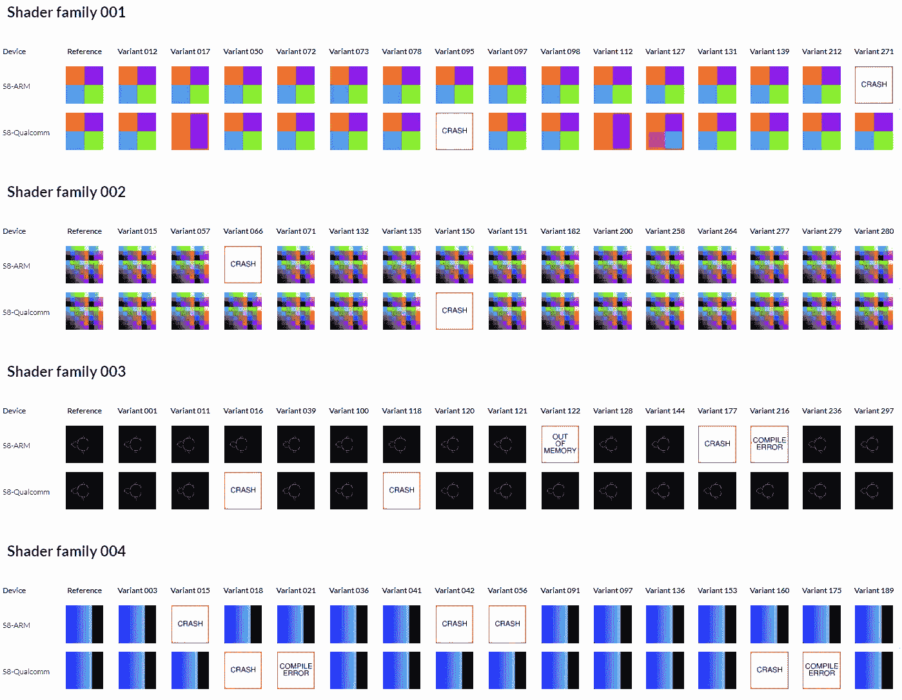

# 两个三星的故事:安卓图形中的 ARM 与高通

> 原文：<https://medium.com/hackernoon/a-tale-of-two-samsungs-arm-vs-qualcomm-in-android-graphics-c1c6f1eef828>

## 比较 ARM 和高通 Android 图形驱动程序的可靠性，S8 至 S8


The GraphicsFuzz ShaderTest GLES test suite reveals a variety of graphics driver issues on the Samsung Galaxy S8\. The Qualcomm GPU model suffers from considerably more rendering issues and crashes than the ARM GPU model. [Skip to our analysis of the results](#02a6).

**参见:**后续帖子评估:

*   [英伟达盾](/@afd_icl/nvidia-shield-reliable-graphics-2aa79e04e150)
*   [谷歌像素设备](/@afd_icl/google-and-qualcomm-pixel-perfect-e8ecefaf5968)

Hugues Evrard、Paul Thomson 和我最近成立了一家公司 [GraphicsFuzz](https://www.graphicsfuzz.com/) ，专门从事图形驱动程序的自动化测试。该公司是伦敦帝国理工学院的研究成果，我们去年通过一系列媒介故事对其进行了描述。

[](https://www.graphicsfuzz.com/benchmark/android-v1.html)

Click above to try out our GraphicsFuzz Android benchmark web app.

我们最初的产品是[**shader test GLES**](https://www.graphicsfuzz.com/index.html#products)，这是一个大型的片段着色器套件，GPU 设计人员可以授权它来彻底测试 OpenGL ES 驱动程序的可靠性。

这是一系列故事中的第一个，我们将看看 Android [OpenGL](https://hackernoon.com/tagged/opengl) ES 驱动程序的可靠性，通过在 **ShaderTest GLES** 着色器的代表性样本上运行它们来判断。

您还可以通过 [GraphicsFuzz Android 基准测试](https://www.graphicsfuzz.com/benchmark/android-v1.html)在您的 Android 设备上试用这些着色器，在您的浏览器中试用 web 应用程序，并让我们知道您的发现！

# 着色器测试 GLES:测试着色器编译器质量

我们将从 GLES shader test 的一些背景开始，但是如果你不耐烦，你可以跳到结果！

传统的 GPU 测试套件侧重于渲染速度或 API 功能完整性。着色器测试 GLES 通过测试*着色器编译器质量*为故事增添了另一个维度。毕竟一个快速的渲染结果，如果是错的，可能并不是特别有用！

在与业内软件工程师的交谈中，我们一次又一次地听到 GPU 驱动程序开发人员优先针对高知名度的游戏和应用程序测试他们的驱动程序，例如谷歌 Play 商店排名前 100 的游戏。一个不幸的副作用是，不太受欢迎的应用程序的开发者必须解决驱动程序错误，才能让他们的应用程序在消费设备上工作。再加上 Android 更新推送给最终用户的速度很慢，这就造成了一种自我延续的情况，即 GPU 驱动程序错误不被视为一个严重的问题，因为流行的游戏运行良好(可能使用变通办法)，GPU 驱动程序错误不值得报告，因为如果你希望消费者能够使用你的应用程序，无论如何都有必要解决这些错误。这也阻碍了开发人员编写有趣的着色器:除非驱动程序质量得到改善，否则他们不太可能在一系列设备上工作。

# ShaderTest GLES 方法

([关于着色器和着色器编译器](/@afd_icl/crashes-hangs-and-crazy-images-by-adding-zero-689d15ce922b)的一些背景，请参见本文。)

GLES 着色器测试由许多*着色器家族*组成。每个系列包含一个用于渲染单个帧的*参考* *着色器*，以及数百个用于渲染视觉上与参考相同的帧的*变体着色器*，但在此过程中以完全不同的方式锻炼驱动程序。

变体着色器是通过将*语义保留变换—* 变换应用于不应影响渲染结果的引用着色器的源代码而从引用着色器获得的。例如，将引用着色器中的代码块包装在以下形式的循环中:

```
for (int i = 0; i < 1; i++) {
  // original code from reference shader
}
```

是保持语义转换的一个简单例子。


ShaderTest GLES finds bugs in graphics drivers by identifying rendering mismatches, errors and crashes, across families of equivalent shaders.

ShaderTest ES 在以下情况下会突出显示驱动程序错误和问题:

*   一个变体着色器被驱动程序的着色器编译器拒绝*——一个**编译失败**；*
*   一个变体着色器导致驱动程序的某个组件*崩溃*——一个**崩溃错误**；
*   与参考着色器相比，变体着色器导致渲染的图像明显不同——这是一个**渲染问题**；
*   一个变体着色器导致驱动程序由于时间或内存限制而退出——一个**资源问题**。

**编译失败**和**崩溃错误**总是表明有 bug。**渲染问题**通常由于*误编译*错误而出现，由此着色器编译器生成错误代码；由于图形系统中的浮点敏感性，它们有时也会表现出来——shader test GLES 可以揭示这两个问题。这里的一大优势是触发渲染问题的错误编译很难被检测到，因此通常会避开传统的测试技术。**资源问题**提供对图形驱动程序的非功能性约束的洞察。

# 为三星干杯！

让我们首先比较一些参考和变体着色器与市场上最受欢迎的 Android 设备之一:三星 Galaxy S8 手机的结果。根据地域的不同，S8 配备了 ARM 或高通 GPU，所以让我们看看这些 GPU 设计师的驱动程序如何。

[我们的 GraphicsFuzz 网站展示了 ARM 和高通 S8 模型在 10 个着色器家族中的对比](https://www.graphicsfuzz.com/results/S8vS8.html)。

[](https://www.graphicsfuzz.com/results/S8vS8.html)

A snapshot of [our online results table](https://www.graphicsfuzz.com/results/S8vS8.html), which compares the ARM and Qualcomm S8s head-to-head.

比较 ARM 和高通 GPU 驱动程序之间的结果——从现在开始，我们将简单地称它们为“ARM”和“高通”——ARM 模型整体上看起来更可靠。我们发现以下问题:

## 渲染问题

高通的渲染问题要多得多**:[我们的表格](https://www.graphicsfuzz.com/results/S8vS8.html)显示了高通的五个渲染问题，而 ARM 只有一个。**

**例如，[检查着色器系列 001](https://www.graphicsfuzz.com/results/S8vS8.html#shader_family_001) 的结果。抛开崩溃不谈，ARM 普遍渲染参考图像:**

**[](https://www.graphicsfuzz.com/results/S8vS8.html#shader_family_001)

The reference image for [*shader family 001*](https://www.graphicsfuzz.com/results/S8vS8.html#shader_family_001)*. All variants should render a similar image.*** 

**对于高通，我们得到了大多数变体的参考图像，但也有一些错误的图像:**

**[](https://www.graphicsfuzz.com/results/S8vS8.html#shader_family_001)

On Qualcomm, we get the expected image (left) for most variants in [shader family 001](https://www.graphicsfuzz.com/results/S8vS8.html#shader_family_001), but two erroneous images (middle and right), likely due to shader compiler bugs.** 

**[着色器家族 001](https://www.graphicsfuzz.com/results/S8vS8.html#shader_family_001) 着色器的参考着色器对浮点不敏感，因此这些差异很可能对应于着色器编译器错误。**

**对于[着色器系列 007](https://www.graphicsfuzz.com/results/S8vS8.html#shader_family_007) 的变体 77，我们还观察到一个 ARM 渲染问题:**

**[](https://www.graphicsfuzz.com/results/S8vS8.html#shader_family_007)

Reference image for [shader family 007](https://www.graphicsfuzz.com/results/S8vS8.html#shader_family_007) (left) compared with bad image rendered by variant 77 (right) on the ARM S8.** 

## **不确定性**

**我们的测试揭示了高通上的两个问题，其中驱动程序的行为不确定:有时着色器编译器在编译期间崩溃；其他时候编译成功，但呈现的图像不正确。这发生在[着色器系列 007](https://www.graphicsfuzz.com/results/S8vS8.html#shader_family_007) 的变体 123 和[着色器系列 008](https://www.graphicsfuzz.com/results/S8vS8.html#shader_family_008) 的变体 51。**

****

**Each pair consists of an expected reference image (left image in pair), and a bad variant image rendered by Qualcomm (right image in pair). However, the Qualcomm driver fluctuates nondeterministically between producing this wrong image vs. crashing during compilation.**

## **崩溃错误**

**在我们的样本中，两位车手都表现出了多次撞车事故:高通 28 次，而 ARM 15 次。所有这些都是编译时分段错误—致命信号 11 (SIGSEGV)。Android 上可用的崩溃数据没有给出任何与这些崩溃的原因相关的信息。**

**有趣的是，两个驱动程序都无法处理[着色器家族 006](https://www.graphicsfuzz.com/results/S8vS8.html#shader_family_006) 的变体 34 而不崩溃。然而，正如我们将在[未来的](https://hackernoon.com/tagged/future)帖子中看到的，其他图形驱动程序可以处理这种变体。**

## **编译失败**

**ARM 驱动程序展示了一个编译器故障，这发生在[着色器系列 003](https://www.graphicsfuzz.com/results/S8vS8.html#shader_family_003) 的变体 216 上。该问题似乎与三元运算符(？:).高通显示了更多的编译器错误——总共九个(合并了编译器和链接器错误),尽管其中几个错误似乎是由于与 switch 语句处理相关的单个底层问题。**

## **资源问题**

**我们的结果没有突出任何高通资源问题，但确实显示了 ARM 在[着色器系列 003](https://www.graphicsfuzz.com/results/S8vS8.html#shader_family_003) 的变体 122 上的资源问题，这在渲染期间给出了 GL_OUT_OF_MEMORY。**

**[查看完整的 S8 与 S8 结果表](https://www.graphicsfuzz.com/results/S8vS8.html)，并试用 [GraphicsFuzz Android 基准测试 web 应用](https://www.graphicsfuzz.com/benchmark/android-v1.html)！**

# **下次…**

**… [我们将看到 NVIDIA 的 Shield TV 的 Android 驱动程序如何支持](/@afd_icl/nvidia-shield-reliable-graphics-2aa79e04e150)。**