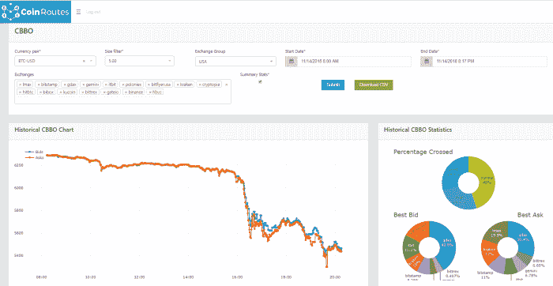
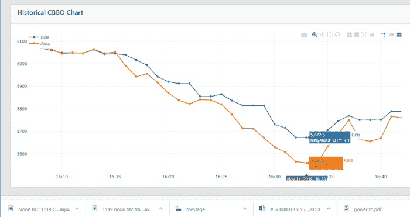
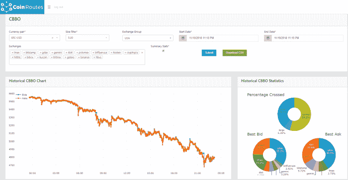
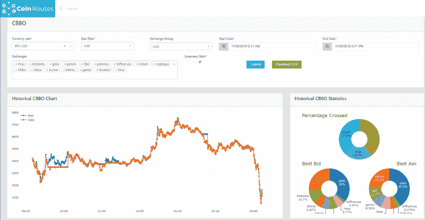
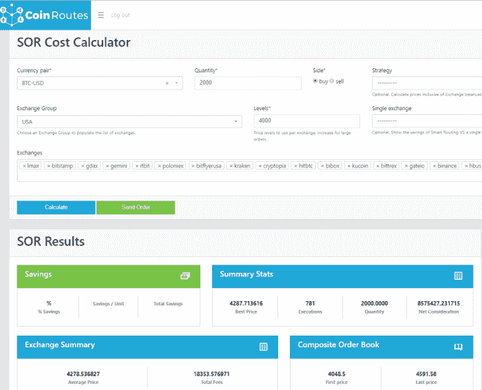
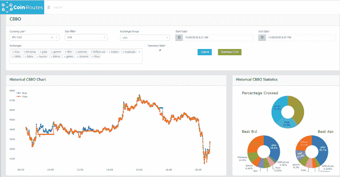

# 两次抛售的故事

> 原文：<https://medium.com/hackernoon/a-tale-of-two-selloffs-5ef306ff746a>

# 两次抛售的故事…

“这是最好的时代，这是最坏的时代，这是智慧的时代，这是愚蠢的时代…这是黑暗的季节，这是希望的春天，这是绝望的冬天…”

–查尔斯·狄更斯，《双城记》

在过去的一周里，我们经历了不止一次，而是两次残酷的加密资产抛售，导致加密社区的沮丧和许多批评者的幸灾乐祸。然而，这些波动彼此之间有很大的不同，尽管它们的幅度相似，交易量也有所增加。

使用 CoinRoutes 数据和软件工具，我们能够分析这两次下跌，并表明发生在 11 月 14 日的第一次下跌可能是由少数大型卖家引发的，可能来自场外市场，而发生在 19 日的第二次下跌范围更广，更有序，可能来自交易所市场。

**抛售# 1:11 月 14 日**

为了开始分析，让我们看看 14 日关键的 12 小时时段的图表:(该图显示了接受美国客户并直接以美元进行交易的所有交易所的比特币-美元综合最佳买价和卖价。它还采用了 CoinRoutes 大小过滤器，只包括至少 5 个比特币的出价和报价，以排除最小报价。

这一走势的特点是价格突然大幅下跌，持续时间刚刚超过 30 分钟，随后是几个小时的大幅波动。最终，市场在持续了几天的 5400 比特币美元附近触底。特别值得注意的是，在上图的整个 12 小时内，最佳报价比最佳报价高出 25 个基点。这在顶部饼图中显示为“大”交叉情况，它代表了套利者从交易所之间的差异中获利的机会。另一个值得注意的统计数据是，尽管 LMAX 的整体市场份额相对较低，但它在该时期的最佳报价中所占比例接近 20%。由于 LMAX 的策略是聚集做市商流动性，这一统计数据使得场外交易相对有可能让做市商做多比特币，并需要在秋季出售。为了更深入地挖掘这一点，我们将图表放大到跌幅最大的时间段:

这张图表显示，在从 6100 点暴跌至 5600 点以下的过程中，存在大量的套利机会。在最大偏离点，最好的出价和最好的出价之间有超过 100 美元的溢价。当时，在 30 分钟的大部分时间里，导致市场下跌的发行价是 LMAX。虽然这不是场外交易引发下跌的确凿证据，但下跌的剧烈程度表明，许多专业交易者同时对市场变化做出了反应，因此情况相对来说可能是这样的。

**抛售# 2 11 月 19 日**

然而，11 月 19 日抛售的图表与之前的图表截然不同。它并不像早期抛售中那样以大幅下跌为特征，而是以更大幅度的稳定下滑为特征，如下所示:

首先注意抛售是一个无情的下滑，没有任何特别陡峭的部分，除了接近尾声的时候。其次，请注意上方的饼图显示，套利机会存在的时间比例要小得多，为 6.25%。第三，注意以 LMAX 为代表的做市商，在此期间偏向于最优买价而非最优报价。所有这些事情加在一起，表明基础更广泛的抛售，而不是由场外市场的大宗交易推动的。

或许更重要的是，在昨日的抛售中，市场也没有出现“投降式”底部的迹象，尽管在我撰写这篇评论时，这种情况可能正在发生。今天的价格走势具有显著的波动性，可能会导致真正底部形成的“洗出”价格走势。这是过去 12 个多小时的交易图表:

请注意，就在我写关于我们昨天没有看到投降式底部的那一段时，市场突然下跌了。在不到 30 分钟的时间里，它下跌了 400 多美元(大约 10%)，这个时期还有大量的套利机会(22.7%)。然而，也许最重要的是，当我快速使用 CoinRoutes 软件查看综合订单簿时，发生了什么。

我使用 CoinRoutes 成本计算器来查看在接近底部时我可以在哪里出售 2000 比特币，同时我询问系统我可以在哪里购买 2000 比特币。结果非常令人惊讶:购买硬币的成本是出售硬币成本的三倍以上，这是一个强烈的迹象，表明底部，至少在短期内。果不其然，市场在这之后的短时间内暴涨了 150 多美元。

这是底部假设的 2000 个比特币的“卖出”订单的结果，它显示 2000 个比特币可能以包括费用在内的 4002.92 的价格售出，而最佳出价为 4064.8:

这是底部 2000 个比特币的假设“购买”订单的结果，当最佳报价为 4048.5 时，这些比特币的价格为 4287.71 英镑(含费用):

然而，对交易员来说，或许更重要的是，随后的反弹似乎是由交易所市场的流动性主导的。当我运行前面的场景时，我也在看 Bitmex，在看到不平衡的订单簿后，价格持续下跌了几分钟。这可能会让许多“专业”交易员感到惊讶，他们认为期货市场总是领先于现货比特币市场。然而，很明显，交易所的流动性在比特币生态系统中非常重要，这表明需要一个完整的深度、整合的账面数据馈送，如可从 CoinRoutes for traders 获得的那样…

(对于那些好奇的人，这里有和上面一样的图表，另外增加了 20 分钟的交易时间。我不会宣布我们已经看到了底部，但它肯定是一个底部，一个我们的客户能够看到的底部……)

