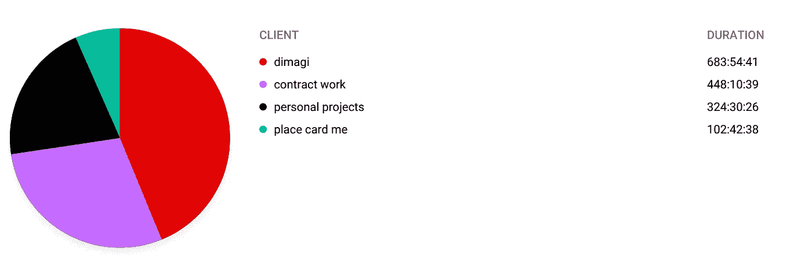
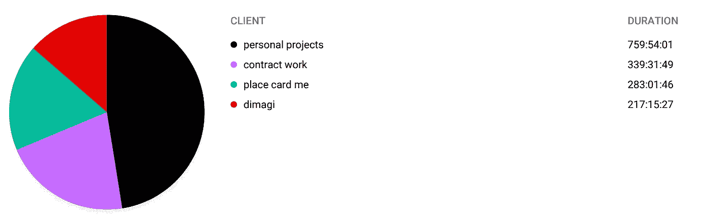
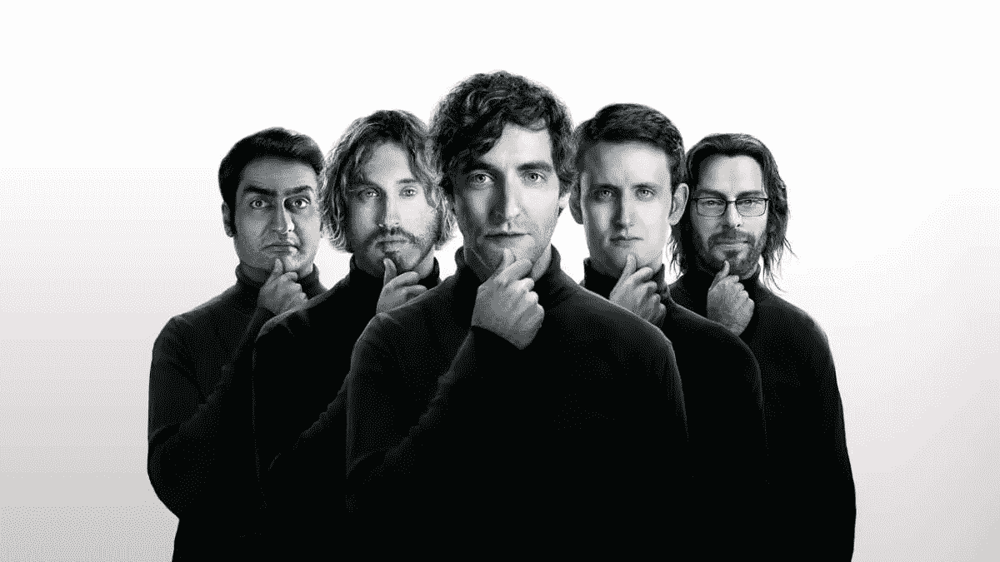
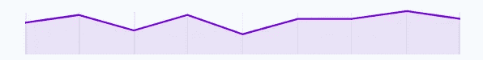
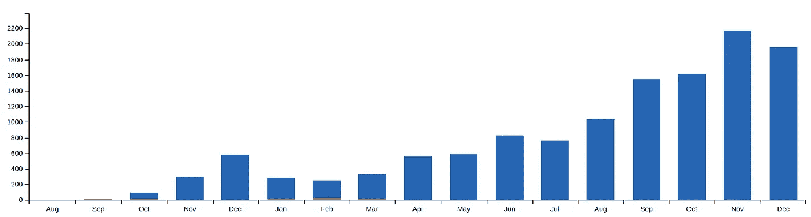
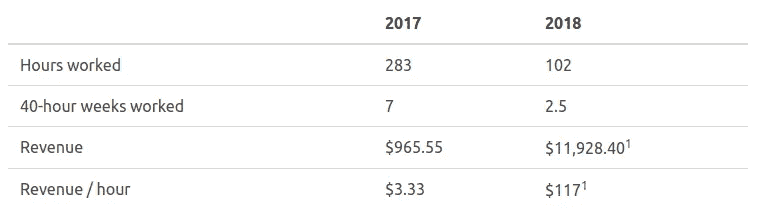
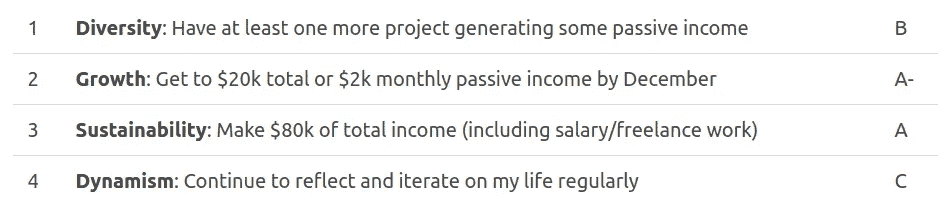
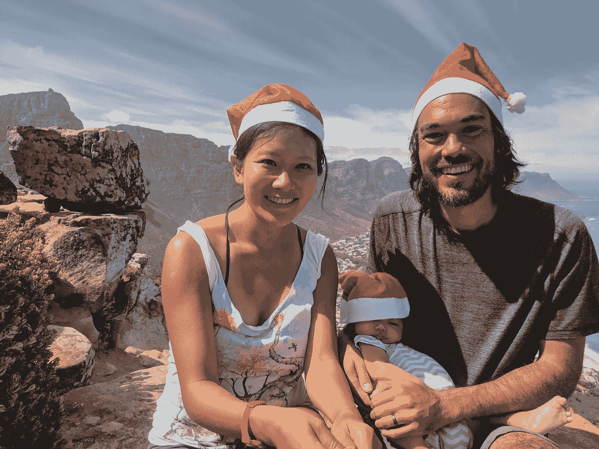

# 两年的故事:自由职业者和企业家之间的斗争

> 原文：<https://medium.com/hackernoon/a-tale-of-two-years-the-struggle-between-freelancing-and-entrepreneurship-4aa3fddcf40c>

## 我的 2018 年回顾

这是最好的时代，也是最坏的时代。

那是个人成长的一年，也是个人停滞的一年。

对于个人项目来说，这是很棒的一年。Place Card Me——我在 SaaS 制作[在线 Place Card](https://www.placecard.me/)的产品——稳步增长，并为我的年收入做出了有意义的贡献*和*为我赢得了稳定的时薪。对于个人项目来说，这是糟糕的一年。我没有创造任何新东西，学到的东西很少，我的一个大的新产品想法几乎没有实现。

这是一个丰收年。我的工作机会多得不知如何是好。我在网上找到了工作。我大大超过了我的年收入目标。 ***又是一年稀缺性。我几乎没有时间、空间或精力在任何大的、开放式的目标上取得重大进展。一整年时间都很宝贵。***

这是两个 2018 的故事。伟大的一年和令人失望的一年。揉成一团，卷成一个球，不可能彼此分开。

让我们开始吧。

# 我如何度过我的时间

> 生命中真正的货币是时间，而不是金钱，而我们都拥有有限的时间
> —罗伯特·哈里斯

人们喜欢认为自己有原则；优先事项；定义我们的事物是我们内在的本质。我们有。但是这些原则的唯一真正体现是我们选择如何度过我们的时间。其他的都只是说说而已。

所以对我来说，理解去年我的时间去了哪里是理解这一年本身的第一步，也是最好的一步。这是它的样子:

My professional time breakdown in 2018

这里值得注意的第一件事是，在我今年做的大约 1600 小时的“工作”中，超过 70%的时间——大约 1130 小时——是在为迪马吉工作(我的“日常工作”)或做自由职业者。

剩下的 30%我花在了个人项目上，大约四分之一花在了 Place Card Me 上，剩下的四分之三花在了其他事情上——包括写作和我所有的其他兼职项目。

相比之下，我们来看一下前一年的相同数据:

My professional time breakdown in 2017\. Unfortunately the colors aren’t the same as the 2018 graph.

几乎完全翻转了！

2017 年，我 65%的时间去了 Place Card Me 和个人项目，只有 35%的时间去了 Dimagi 和自由职业。

因此，今年的第一个主题出现了:**2018 年，我更重视为他人工作，而不是为自己工作。**

# 为什么我优先考虑为别人工作？

所以，去年我花了 70%的时间为别人工作。那肯定是一个深思熟虑的决定，对吗？*对吗？！？*

嗯，这并不是我年初坐下来寻找的东西，但肯定的是，每个单独的时刻都是我脑海中某种心算的结果。那么为什么*我为别人工作这么多？*

## 原因 1:钱，钱，钱

It turns out that a person literally handing you $100 bills in exchange for an hour of your time is pretty hard to resist.

老实说，2017 年*压力很大。*

有几个原因，但最大的一个原因是感觉每个月的*都挣不到钱*。尽管——很大程度上要感谢支持我们的妻子——我从未接近现金耗尽，但看到我的银行账户余额月复一月地减少，看不到尽头，我仍然感到压力很大。

进入 2018 年，我的一个重要目标是确保我不会让我们再次陷入那种境地。我挣的钱会比花的多。

还有挣钱？

事实证明，当你做自由职业者时，你的每一分钟都有非常真实、非常有形的金钱价值。所以当我坐在那里看着我的下午，想着“好吧，我可以花两个小时写那篇博文，或者我可以做这种自由职业的事情，这将立即在我的口袋里放入 200 美元”，这是相当令人信服的拿了钱就跑。

## 原因 2:接触新事物

为他人工作的另一个好处是:他们已经做了大量的工作。

这意味着，你不必从头开始一个新项目，也不必亲自学习每一个细节，而是跳到中间，从他们已经投入的一切中获益。你站在巨人的肩膀上进来。

举一个去年的例子:自从我开始接触创业以来，我一直有兴趣更多地了解硅谷风投资助的初创企业。

现在，如果我想靠自己获得曝光率，我可能会辞掉工作，找一个联合创始人，向风投游说，筹集资金，开发产品，做销售，等等。等等。可能要花好几年！

After spending a couple weeks working for a startup in in San Francisco I can say that watching the TV show is also a surprisingly good proxy for understanding Silicon Valley life.

另一方面，如果我在旧金山一个朋友的初创公司做为期两周的自由职业者，而这个朋友已经完成了所有这些步骤，那么我几乎不需要额外付出任何努力就可以在硅谷大展拳脚。另外，我帮助一个朋友，学习一些新技术。所以我就是这么做的。

想了解南非的创业场景？为南非的创业公司工作！想了解数据仓库吗？找一份数据仓库的工作！所有这些事情都发生在 2018 年的我身上，我不可能独自获得这些经历。

事实上，因果关系是相反的。也就是说，*机会*首先出现在我面前，*曝光*成为抓住它的理由。但是，自由职业仍然是一种很好的方式，可以看到不同的组织，增长我的技术水平，同时帮助其他人完成伟大的项目并获得报酬。大家都赢了！

## 原因 3:它让我无法面对我的企业家恐惧

2017 年是[我人生中最关键的一年](https://hackernoon.com/the-year-everything-changed-3e13008fbef9)。

也就是说，在日复一日的基础上，我花了一年的大部分时间在各种纯粹的恐惧和自我怀疑的状态中运作。

害怕辞掉工作，失去自我。害怕公开写作会给自己带来麻烦。害怕推出一个愚蠢的产品，完全无法实现我在互联网上至少赚 1 美元的可怜目标。这一路上的每一步都 a)令人恐惧，b)让我深深地自我怀疑和焦虑——尽管我尽力掩饰。

回顾过去， ***我一直感到恐惧的事实是 2017 年成为关键一年的核心*** 。我在做真正新的东西。以前所未有的方式展现自我。用我自己的方式和议程真正挑战自己。

> *“不要随心所欲。做你不想做的事。做你被训练成不想做的事。做最让你害怕的事情。”
> —恰克·帕拉尼克*

2018 年？老实说，今年我没有做什么让我害怕的事情，这在很大程度上要归功于自由职业。

当然，我做了大量艰苦的自由职业工作，但是个人利益和自我价值感并不像我自己的项目那样与工作联系在一起。我知道*我*不会因为*我的*部分而失败，如果整个项目失败了呢？那是其他人的问题。

总之是*安全*。选择安全而不是恐惧是很容易的。

**为他人工作成了容易的选择。**

# 那么，优先为他人工作，我失去了什么？

因此，我们现在看到了为他人工作的诱惑是如何导致它成为 2018 年的优先事项——无论是有意识的还是无意识的。费用是多少？

简而言之，我的个人项目停滞不前。大时代。

我花了那么多时间为别人工作？这段时间不能再用于推动新的个人项目、写作等。不仅仅是时间，还有顶部空间——做有意义的工作所必需的难以捉摸的能量。因此，尽管继续为 Place Card Me 和其他现有项目添加小功能非常容易，但要找到时间和空间来撰写一篇有思想的博客文章或推出一个全新的东西却要困难得多。

是的，Place Card Me 经历了 ***伟大的*** 一年，我稍后会更多地谈到这一点，但我所做的其他事情都是一场真正的斗争。下面是一个简单的例子:

**聊天统计**:我在 2017 年末推出的一个 [GroupMe 聊天分析网站](https://chatstats.co/)实际上成了我的第二个货币化产品。我在 4 月份做了一个小小的努力来增加一个付费层级，然后在这一年的剩余时间里没有做任何改进或推广。这导致了每月 80 美元的收入完全持平，毫无生气。

Chat Stats monthly revenue from April-December was basically a flat line around $80.

[**与 Django 一起构建**](https://buildwithdjango.com/) :预计这将是我 2018 年的重大努力之一，我打算在互联网上创建一个很棒的 Django 资源，然后想办法从中赚钱。这几乎是一个彻底的失败，包括一篇围绕我创建的开源库的博客文章，以及——直到最近几周——几乎没有其他内容。

**照片新标签**:我在我的 [Google Photos Chrome 扩展](https://chrome.google.com/webstore/detail/photos-new-tab/fpljkobkodmnmldgodfefnmjgjlljbjn)中添加了一个悲伤的“给我买杯咖啡”链接，希望能得到一些捐赠(顺便说一句，没人用过)。最近我增加了一些小的产品改进，但是总体来说，尽管有一个适度的、不断增长的、快乐的用户群，我基本上没有做任何推广或者做更多的扩展。

coryzue.com[**:在我的个人博客上，与去年的 24 篇相比，今年我写了 4 篇博文(如果算上这篇的话是 5 篇)。我并不为他们中的任何一个感到骄傲，除了我去年建立的观众群，他们中的任何一个都没有真正获得更广泛的关注。更糟糕的是，我觉得我已经完全忘记了如何写好文章，并对我现在制作的一切感到尴尬和不安全。可能是有原因的？**](http://www.coryzue.com/)

除此之外，最令人沮丧的是， ***整整一年*** 我没有创造一个值得注意的新产品。用 Django 构建是最接近一个新项目的东西，它是一个有两个帖子的美化了的博客。相比之下，去年我可以说推出了六个不同的东西(如果你把这个网站算在内的话是七个)，这是一个巨大的失望。

但是不要担心——这并不完全是悲观失望！现在我们来到了一年中最有趣的部分。

# 建筑产品的神奇之处

还记得这篇文章开头的那些时间轮吗？如果你仔细看，你可能会注意到，我在 2017 年花在 Place Card Me 上的时间(283)几乎是 2018 年(102)的三倍。

然而，因为这是一个*产品*，这些时间与收入完全没有直接关联(与为他人工作相比，显然几乎是 1:1)。

这种努力与金钱的脱钩——也被称为神秘的被动收入流——随着时间的推移会产生一些相当神奇的行为。事实上，尽管减少了时间投入，但 2018 年，Place Card Me 的收入将是去年的 10 倍以上。这是该网站整个历史的月收入。

Revenue from [Place Card Me](https://www.placecard.me/) from its launch through 2018\. Data as of December 26, 2018\. From the [open startup dashboard](https://www.placecard.me/dashboard/).

以下是一些关于 Place Card Me 的有趣数字，以供比较:

[1] As of December 26, 2018

总而言之，在 2018 年，我能够持续改进产品并增加收入，同时工作时间完全可控，并获得与我的自由职业者工资相当的稳定工资！

不仅仅是收入本身在增长。

虽然今天的产品与 12 个月前基本相同，但我在这一年中做了大量的小改进:将位置卡模板的数量增加了两倍，增加了对不同卡片布局和纸张格式的支持，提高了卡片制作的 UX，并修复了一大堆错误。我还不断试验和测试我的定价，最终找到了一个似乎运行良好的定价模型。

所有这一切的奇妙之处在于，变化的效果是*附加的*和*永久的*。网站总是在变得更好，而且一旦变得更好，它将永远变得更好。

# 不由自主地取得创业成功

当我回顾 2018 年时，我想我会把它当成我试图兼顾自由职业和创业但失败的一年。然而不管怎样，我还是成功地创业了。

从自由职业者的角度来看，2018 年以任何标准衡量都是成功的。我帮助了更多的人，工作了更多的时间，挣了更多的钱，学到了比我想象中更多的东西。

从创业的角度来看，2018 年更加复杂。

从表面上看，一切都很棒。我从不止一个而是两个网上产品中赚了将近 13，000 美元，尽管我并没有在这些产品上花太多力气。听起来很神奇，对吧？！

事实上，我认为尽管我付出了努力，但我还是取得了成功，而不是因为努力。今年，我在很大程度上依靠了我在 2017 年所做工作的提携，这种势头将我带入了一个好的地方。但我不指望它能保持下去。

Place Card Me 的模仿者们——显然是受到了每月 1500 美元这一诱人收入的启发——已经如雨后春笋般涌现出来。与此同时，我已经用尽了所有我想到的增加收入的简单方法。因此，展望 2019 年，除非我想出一些新的事情来做，否则如果我开始将销售输给竞争对手，收入将持平甚至可能下降。

而现在——不像 2018 年——我没有一个新的项目准备好开始注入汽油来填补缺口。本质上，我已经耗尽了我所有的 2017 年资本储备，并且未能做出任何新的储备。

那是什么意思？我认为这可能意味着 2018 年是一个侥幸。如果我想在被动收入/创业这件事上取得成功，我将不得不期待在前进的道路上更加努力地工作。

# 那么明年会发生什么呢？

我希望明年的主题是**再投资个人项目**。

我今年的主要目标/计划是，在为他人工作和为自己工作之间各占一半时间。我想，如果时间是唯一真正的货币，那么我所要做的就是合理地花掉我的时间，然后我就能想出如何解决其余的问题。

实际上，这应该会导致一些重大后果。更少的自由职业时间。产生的收入少得多——除非我能在产品方面超额完成任务。更多的不确定性。更多的恐惧。

对自己更多的投资。

失去的风险更大。

应该是很好玩的一年！

# 附录:我的 2018 年目标成绩单和 2019 年目标

在我的[年初帖子](https://hackernoon.com/my-plans-and-goals-for-2018-d26641963d0c)中，我为 2018 年设定了四个高水平目标。现在一年过去了，我想看看我的表现会很有趣。这是我的自我评分报告卡:

对分数的解释如下。

## 多样性:至少有一个以上的项目产生一些被动收入

**等级:B.**

我确实成功地从第二个项目中获得了被动收入。正如我提到的，[Chat Stats](https://chatstats.co/)——我为自恋的千禧一代提供的 GroupMe 聊天分析平台——自从我在 4 月份增加了一个付费层以来，每月已经赚了 770 美元，约合 80 美元。

尽管达到了目标，我还是给了自己一个“B”而不是“A ”,因为我有点觉得我作弊了。

到去年年底，我已经完成了该网站 80%的功能，我基本上只是添加了一个新功能和一个付费层——瞧！—几美元开始慢慢地流入。

目标的意图是多样性将来自于一个新的产品，我曾希望它将是我被动收入的一个很大的 T2 比例，但这两者都不是。

## 增长:在 12 月前达到 2 万美元或每月 2 万美元的被动收入

**等级:A-**

我又一次达到了目标——特别是“或每月 2000 美元”的部分，今年 11 月和 12 月，Place Card Me 超过了 2000 美元。

我给自己一个 A-而不是 A，因为它是季节性产品，我不认为我会持续达到每月 2000 美元，一年中只有一两次。显然，我仍然对这一收入感到兴奋——我希望明年能够超过 2 万美元——但如果我不在这一点上给自己一点鼓励，我会觉得不对。

## 可持续性:总收入达到 8 万美元(包括薪水/自由职业)

**等级:A**

我设定的目标是年收入 8 万美元，由于前面提到的自由职业者收入的增加，我大大超过了这个目标！最终，我预计我 2018 年的收入将在 10 万美元左右，其中约 40%来自迪马吉，50%来自自由职业者，10%来自我自己的产品。从可持续发展的角度来看，我可以无限期地依靠这种收入水平生活！万岁。

## 活力:继续定期反思和重复我的生活

**等级:C**

这个措词不当且无法衡量的目标是“继续定期反思和重复我的生活”。虽然我确实做了一些反思——包括我担心事情太容易的一瞬间——我真的没有像去年那样做很多事情来彻底改变我的生活。

我年初的生活是迪马吉、自由职业、副业的混合体，到了年底基本也是如此(包括*同样的*副业)。

那么，这是因为我不需要改变，还是因为我没有足够的思想开放和反思来接受改变呢？我不确定，所以我给自己打了个 c。

无论如何，我希望今年年底的反思会产生一个全新的课程，我觉得它至少部分地满足了这个目标背后的意图。

# 我的 2019 年目标

最后，这是我 2019 年的目标:

1.  **承诺**:为自己工作和为他人工作的时间比例达到 50/50
2.  **财务增长**:从个人项目中获得 3 万美元的收入
3.  **多样性**:至少卖出一个我的新项目:一个[姜戈 SaaS 模板](https://buildwithdjango.com/projects/saas-starter-kit/)
4.  **个人成长**:多做让我害怕的事情

这些有望从上面自然地落下，不需要太多的解释。

我也在问自己很多关于 2019 年的问题，包括如何最好地在增长 Place Card Me 和继续创造新事物之间优先考虑我的时间，我应该写多少(以及我从中获得什么价值)，以及我应该从我的生活中切掉什么。

我还不知道答案，但让这些问题在我的大脑中回荡是件好事。

就是这样！如果你走到了这一步，祝福你，感谢你的坚持。

2019 快乐！

Our first Christmas as a family. December 24, 2018\. Lion’s Head, Cape Town.

——科里(还有冰雪睿和洛克伍德)

*最初发表于*[T5【www.coryzue.com】](http://www.coryzue.com/writing/a-tale-of-two-years/)*。*