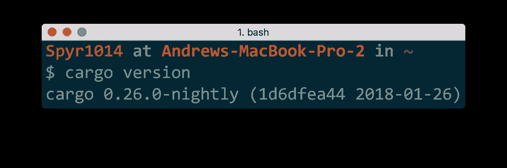
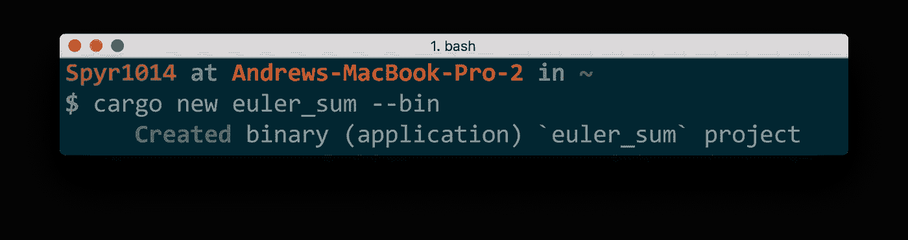
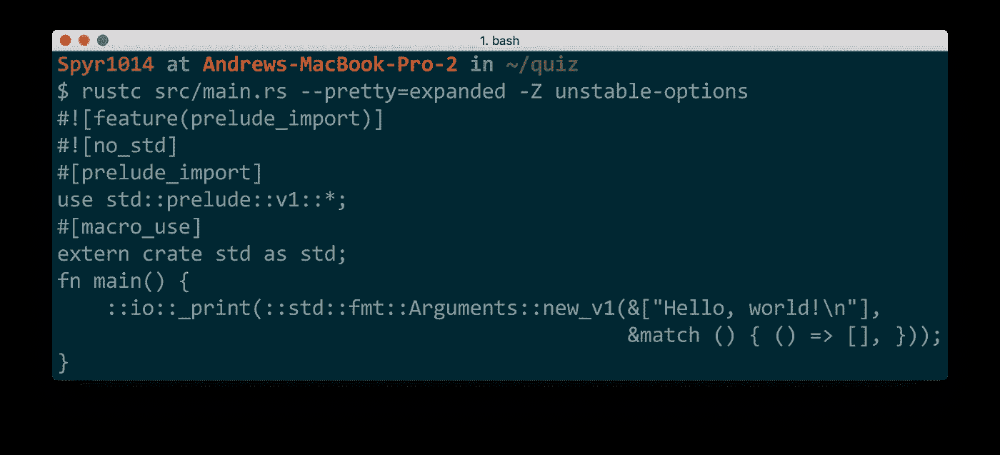

# 初学者咬:铁锈的味道，一个安全，并发和实用的语言！

> 原文：<https://medium.com/hackernoon/a-taste-of-rust-6d8fc60e050>


今天我们将体验铁锈的味道。我将提供链接，让你设置，然后你将解决 Rust 中的第一个项目欧拉问题。您将看到一些语法，并了解什么是宏。我希望向您展示这种语言是健壮的，易于使用的，并且速度快得令人眼花缭乱！它还拥有 [**无畏并发**](https://blog.rust-lang.org/2015/04/10/Fearless-Concurrency.html) ，我们将在另一篇文章中讨论，但这是一个巨大的卖点。

你可能会问为什么生锈？这真的取决于你是谁！大学用 JavaScript 和 Python 武装了我，让我从事基于网络的项目。最近，我需要更接近金属来实现更快的代码执行。Rust 与上面提到的语言非常不同，因为它没有垃圾收集器，并且是静态类型的。如果您遇到问题，编译器错误消息通常足够大，可以表现得像一个专家对程序员，否则社区是欢迎的和有帮助的。

查看这些在生产中使用铁锈的公司。

我假设您熟悉在终端或命令提示符下执行命令，并且知道一些编程术语(比如什么是函数)。

先说第一个[项目欧拉问题](https://projecteuler.net/problem=1)。问题要我们求所有 1000 以下的 3 或 5 的倍数之和。在我们解决这个问题之前，我们将设置并安装 Rust。我们将创建一个项目，并讨论宏和函数之间的区别。您将看到如何编写单元测试以及生成漂亮的文档。最后，我们将使用一个循环来解决这个问题，然后在函数上使用一个迭代器。这将是一个爆炸🚀。

I also made this video which you may like!

# 安装和设置 Rust

许多人非常努力地让安装过程变得很棒，所以我将指出那些资源。如果你已经安装了 Rust 并且喜欢你的设置，请随意跳过这一部分。不然咱们就锈了！

[**Rustup**](https://www.rustup.rs/) 是一个“用于系统编程 Rust 的工具链安装程序”。基本上，它为您处理一切，并会让您快速启动和运行。前往[https://www.rustup.rs/](https://www.rustup.rs/)并遵循您平台的说明。

Rustup 有一些漂亮的特性。您可以通过运行以下命令`rustup component add rust-docs`来添加离线文档。要访问您的离线 rust 文档，请在您的终端或命令行中键入:`rustup doc`。将打开一个浏览器，显示:

*   生锈的书架
*   API 文档
*   扩展错误文档(用于调查编译器错误)

Rust 书架棒极了，是所有 Rust 用户的好去处。这些资源的在线链接[这里](https://www.rust-lang.org/en-US/documentation.html)！当你在荒野中，在没有 wifi 的情况下写作 Rust 时，这些资源可以拯救你的生命🏕️.

[**我们(我)德了吗？**](https://areweideyet.com/) 列出了代码编辑器对 Rust 的支持。截至发稿， [VSCode](https://code.visualstudio.com/) 和 [IntelliJ IDEA](https://intellij-rust.github.io/) 支持度最好。VSCode 是一个非常棒的免费选项，也是我所使用的。

同样，也有其他职位，涵盖完整的设置。我推荐 [ShaderCat 的岗位](http://www.shadercat.com/setting-up-a-rust-development-environment-on-windows-10/)或者 [Asquera 的岗位](http://asquera.de/blog/2017-03-03/setting-up-a-rust-devenv/)。社区正在努力改善开发者体验，这些帖子可能会很快过时。搜索 Rust Language Server (RLS)可能会提供更多关于设置 IDE 的最新说明。

当然，你可以在记事本中编码…编译器是有帮助的，我尊重你的决定。

## 货物

> "货物是锈包经理."~ [货书](https://doc.rust-lang.org/cargo/)

Cargo 之于 Rust，就像 NPM 之于 JavaScript，或者 pip 之于 Python，或者 RubyGems 之于 Ruby……差不多吧？

Cargo 建立项目、安装依赖项、构建项目、运行测试、生成文档并将你的库上传到 [crates.io](https://crates.io/) 。这是开始研究我们的项目欧拉问题的最佳时机。要检查安装的所有东西是否在您的终端上正确运行`cargo version`:



Your version number does not need to match.

用命令`cargo new euler_sum --bin`为自己构建一个新项目。



Use `cargo help` to learn more

该命令告诉货物在一个新的文件夹中设置一个名为“euler_sum”的新应用程序。默认情况下，货物创建一个库，所以我们使用`--bin`告诉 Rust 创建一个应用程序(“bin”是二进制的缩写)。使用`cd euler_sum`将您的目录更改为应用程序文件夹。这是您应该找到的:

```
.
├── Cargo.toml
└── src
    └── main.rs1 directory, 2 files
```

货物. toml 文件是您的项目*清单*或元数据。如果你熟悉 JavaScript，它类似于`package.json`文件。您可以在这里列出您的依赖关系。更多信息请参见《货物手册》[中的](https://doc.rust-lang.org/cargo/reference/manifest.html)，您也可以通过`cargo help`了解货物选项。

`main.rs`包含一个微小的铁锈程序:

```
fn main() {
    println!("Hello, world!");
}
```

用`cargo run`运行代码(在带有货物. toml 文件的文件夹中)。


**STOP** AND **CELEBRATE**! You’ve run your first Rust program!!!!🎉🎉🎉

`fn`是声明函数的方式。所有的应用项目都需要一个`main`函数作为你程序的入口。这个函数没有参数，也不会返回任何东西。

函数的主体包含这个词:`println!`。这被称为宏。它看起来像一个函数，但它以`!`结尾。Rust 使用宏来做非常强大的事情，库经常使用它们来变得非常聪明。让我们快速了解它们与函数有何不同。

## 宏迂回

宏允许您根据模式生成代码！如果您需要复制粘贴代码并做一些小的修改，您可以编写一个宏来为您编写代码。当您编译项目时，宏首先被展开(编写)，然后代码被编译，就像您编写了宏生成的内容一样。基本上，宏为您编写代码。让我们看看`println!`宏是如何扩展的。运行以下命令:

`$ rustc src/main.rs --pretty=expanded -Z unstable-options`

以下是我的输出:



> “宏为您编写代码”

注意`println!`已经聪明地生成了代码来打印“你好，世界！”去候机楼。因为宏能够模式匹配，不同的代码是基于不同的输入生成的！因此您也可以使用`println!`来格式化字符串:

```
println!("Hello, {}!", "lovely humanoid");
// prints -> Hello, lovely humanoid!println!("Hello, {name}! Want {thing}?", name="Rust", thing="hugs");
// -> Hello, Rust! Want hugs?println!("{num:>0width$}", num=42, width=4);
// -> 0042
```

模式匹配的另一个好处是，如果你弄乱了宏的参数，编译器会出错。如果你写`println!("{}");`，编译器会很有帮助的说出`error: 1 positional argument in format string, but no arguments were given`以及一个很酷的图。你一定要试试。

## 练习绕道🤔

*   上面的`println!`宏扩展到什么？答案可能会让你大吃一惊。代码比预期的多还是少？
*   研究更多的字符串格式选项[这里](https://rustbyexample.com/hello/print.html) (Rust by Example)和[这里](https://doc.rust-lang.org/std/fmt/) (docs)。
*   猜一猜，然后找出下面的代码输出:

`println!("{0} {1}'s {0} {1}, no matter how small!", "a", "person");`

## 编写测试

因为我们都希望我们的代码是测试驱动的和类型驱动的，所以你显然渴望知道如何编写测试！这里我们需要的只是一个简单的单元测试。如果您正在编写一个库，您也可以编写 doctests。

一个测试仅仅是一个用属性注释的函数。

```
#[test]
fn simple_test() {
  assert_eq!(solution(10), 23);
}
```

`#[test]`属性告诉 Rust 这是一个测试函数。因此，该功能在`cargo test`运行时运行。如果两个参数不相等，就会出现恐慌，从而导致测试失败。您也可以使用只接受一个参数的`assert!`，检查参数的值是否为`true`。

使用`cargo test`运行测试。(它应该出错，因为我们还没有定义`solution`函数。)如果你想看到测试通过，用`assert!(true);`替换`assert_eq!(solution(10), 23);`。

## 生成文档

是时候开始编码工程欧拉问题了。我们将在一个名为`solution`的函数中编写解决方案。

让我们从`solution`功能的 ***类型*** 开始:

```
pub fn solution(max: u64) -> u64 {
  unimplemented!
}
```

这是一个`pub` lic 函数，它接受类型为`u64`的参数`max`并返回一个`u64`。`u64`是一种数值类型，称为无符号整数。这些整数适合 64 位，并且只能是正数。这立刻告诉我们，我们不能把负数传入这个函数，函数永远不会返回负数。

只是为了好玩，让我们生成一些文档。

Rust 注释可以是行首的双斜线`//`，也可以是`/* multiline comment */`。这些不会生成文档。声明前的三斜线`///`确实会生成文档:

```
/// `solution` function solves the first Project Euler problem
pub fn solution(max: u64) -> u64 {
  // A boring comment
  unimplemented!()
}
```

如果您添加这个代码并运行 cargo 命令`cargo doc --open`，您的浏览器将打开新生成的文档！文档支持 markdown，这意味着您可以添加标题和链接。[在这里阅读更多关于文档生成的信息](https://doc.rust-lang.org/beta/rustdoc/what-is-rustdoc.html)！

## 问题的粗略解决方法

下面的代码对你来说应该有点熟悉。在继续读下去之前，试着理解正在发生的事情。我们将使它变得更简单，但这是一个很好的起点。

```
pub fn solution(max: u64) -> u64 {
  let mut result = 0;
  let mut i = 0;
  loop {
    if i >= max {
      break;
    }
    if i % 3 == 0 || i % 5 == 0 {
      result += i;
    }
    i += 1;
  }
  return result;
}
```

除了`mut`之外，大部分内容应该是不言自明的。`mut`是告诉 Rust 什么时候变量应该是可变的一种方式。这里我们说`result`和`i`需要可变。如果没有`mut`，当试图执行`result += i`或`i += 1`时，我们会得到一个错误。删除`mut`并亲自查看错误。在 Rust 中，变量默认是不可变的，除非是显式可变的。Rust 函数还必须显式声明它们是否会变异传入的参数。函数行为在类型签名中是显式的。

这里有很多东西我们可以清理。首先，命令式代码非常冗长。不使用`loop`和`break`，我们可以在[范围](https://doc.rust-lang.org/std/ops/struct.Range.html)内使用`for`循环，如下所示:

```
pub fn solution(max: u64) -> u64 {
  let mut result = 0;
  for i in 0..max {
    if i % 3 == 0 || i % 5 == 0 {
      result += i;
    }
  }
  return result;
}
```

注意，我们不再需要管理变量`i`。`0..max`是范围，`for`循环在范围内迭代。一个`for`循环可以迭代任何实现`Iterator`特征的类型。我们不会在这里讨论特征，但是现在把它看作一个接口(尽管它有更多的含义)。因为范围实现了迭代器，所以您可以使用类似于`map`、`filter`和`fold`的迭代器方法。

Filter 允许您基于谓词或返回布尔值的函数来过滤元素。因此，我们可以将`if`条件移到一个过滤器中，以便只获得我们想要的`i`值:

```
pub fn solution(max: u64) -> u64 {
  let mut result = 0;
  for i in (0..max).filter(|n| n % 3 == 0 || n % 5 == 0) {
    result += i;
  }
  return result;
}
```

这个搞笑的语法是什么？

`|n| n % 3 == 0 || n % 5 == 0`

这是一个终结。这是一个匿名函数，可以传递给另一个函数。`|n|`为自变量/s，其余为函数体。同样精确的闭包也可以这样写(用一个显式函数体和`return`语句):

```
|n| {
  return n % 3 == 0 || n % 5 == 0;
}
```

在 Rust 中，如果你的`return`语句在一个函数的最后一行，你可以省略`return`和分号来隐式返回。使用这个技巧，我们可以从函数中删除`return`:

```
pub fn solution(max: u64) -> u64 {
  let mut result = 0;
  for i in (0..max).filter(|n| n % 3 == 0 || n % 5 == 0) {
    result += i;
  }
  // Implicit return below:
  result
}
```

还有一件烦人的事。我们有一个可变的`result`变量。在一个更大的程序中，这个变量可能会在其他地方意外变异，需要单独管理。对迭代器中的值求和不需要另一个变量，可以使用迭代器方法来完成！您可以使用`fold`或`sum`方法。

```
pub fn solution(max: u64) -> u64 {
  (0..max).filter(|n| n % 3 == 0 || n % 5 == 0).sum()
}
```

在这里阅读更多关于迭代器的内容！有许多迭代器方法，它们有时可以单独用来解决问题。我们也可以很容易地用一个库，如 [Rayon](https://github.com/rayon-rs/rayon) 引入 fork-join 并行。

从`main`函数调用您的新`solution`函数，并打印出您的答案。用`cargo run`运行程序。

🎈祝贺您完成 Rust 中的第一个项目欧拉问题🎈。我希望你喜欢这次旋风之旅！在未来，我希望更深入地研究特征(尤其是迭代器特征)、宏、并发和函数式编程。也许我已经说服你继续探索这种思维扩展语言。为什么不继续用 Rust 中的[简单排序算法对 Rust 进行采样？](/@spyr1014/sorting-in-rust-selection-insertion-and-counting-sort-2c4d3575e364)

如果你喜欢这个帖子，请用👏！我喜欢反馈，请在 Twitter 上给我留言或留言。我也喜欢想法，所以如果你希望 Rust 上有一篇博文，我很乐意为你写。

在推特上关注我: [@spyr1014](https://twitter.com/spyr1014)

感谢您的阅读！❤

# 参考

*   无畏并发-[https://blog . rust-lang . org/2015/04/10/Fearless-Concurrency . html](https://blog.rust-lang.org/2015/04/10/Fearless-Concurrency.html)
*   https://www.rustup.rs/
*   vs code-【https://code.visualstudio.com/ 
*   我们结束了吗？-[https://areweideyet.com/](https://areweideyet.com/)
*   IntelliJ IDEA-[https://intellij-rust.github.io/](https://intellij-rust.github.io/)
*   Rust 文档链接-[https://www.rust-lang.org/en-US/documentation.html](https://www.rust-lang.org/en-US/documentation.html)
*   rustdoc—[https://doc.rust-lang.org/beta/rustdoc/what-is-rustdoc.html](https://doc.rust-lang.org/beta/rustdoc/what-is-rustdoc.html)
*   货物手册(Cargo . toml)-[https://doc.rust-lang.org/cargo/reference/manifest.html](https://doc.rust-lang.org/cargo/reference/manifest.html)
*   迭代器:[https://doc.rust-lang.org/std/iter/index.html](https://doc.rust-lang.org/std/iter/index.html)