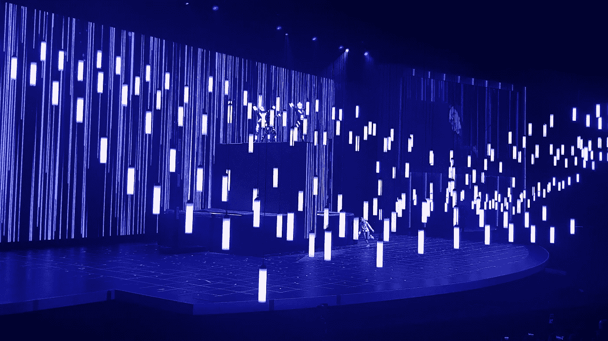
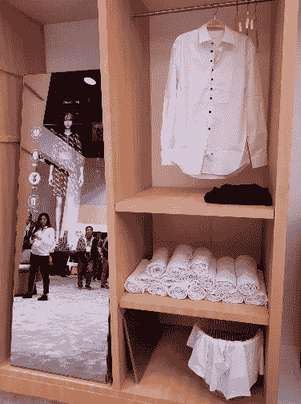
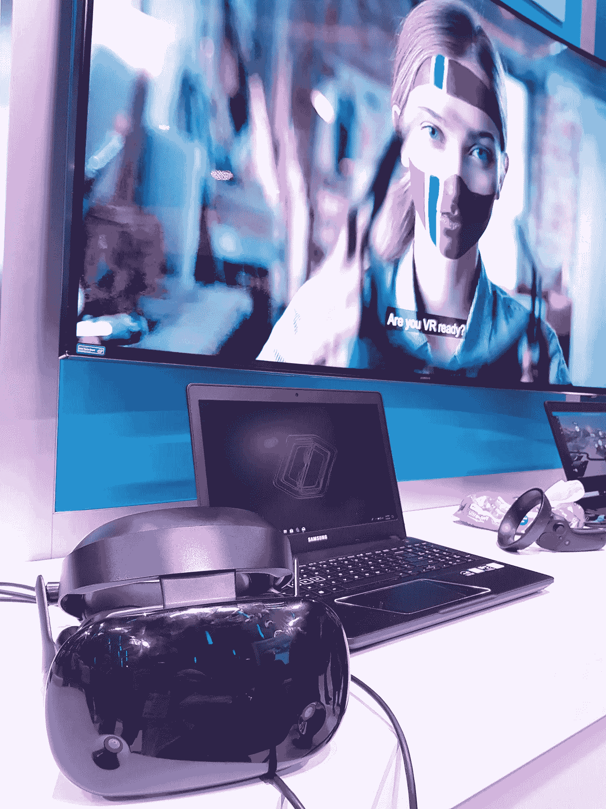
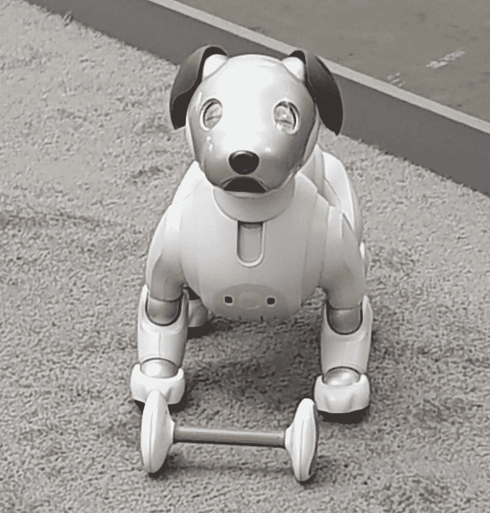

# 科技爱好者对#CES2018:第一天的看法

> 原文：<https://medium.com/hackernoon/a-tech-lovers-take-on-ces2018-day-1-b2782ad652ba>

Intel’s stunning opening lightshow

尽管天气阴沉，世界上最大的科技展今天正式拉开帷幕，成千上万的业内人士涌向拉斯维加斯。

CES 以向世界展示最新的消费电子产品而闻名——从小配件和小发明，到最新的软件和汽车。

仅去年一年，在为期 4 天的会议上，就有超过 184，000 人对来自 4，000 家参展商和 1200 多名演讲人的新创新“啧啧称赞”。

那么 CES2018 的菜单上有什么呢？我今天去了 LVCC 中央大厅的主楼层，想尝尝鲜。

乍一看，有几个主题非常明确，它们都是以提高和简化消费者的生活为基础的。

**联网家庭:**

Haier’s smart wardrobe will help you pick your outfits

在中央展厅漫步，感觉更像是在未来版的宜家，而不是在科技展上。

从索尼到三星，科技巨头们正在加紧设计游戏。现代、简单的装饰被完美融入环境的新设备所补充。人们越来越重视技术如何更无缝地融入我们的日常生活。

想想伪装成相框的电视(注意:实际上不是新技术！)、分类和折叠衣物的衣柜、根据衣物内容显示食谱的冰箱和帮助您规划一天的浴室镜子。*(我会在下一篇文章中介绍一些我最喜欢的)*

数字控制家庭环境的能力已经存在了一段时间，但它显然仍在科技公司的议程上，他们继续连接构成生活空间的东西。

也许像杰森一家那样生活比我们想象的更近。

**人工智能、物联网和智能一切**
很明显，人工智能、物联网和数据是蓝筹公司和小公司的核心战略。

感觉每个人都在用数据让愚蠢的技术变得更聪明。特别是对于英特尔和三星来说，人工智能支撑了他们几乎所有的产品路线图和战略。

有几点需要注意:

*   三星的智能事物中心:到 2020 年，从冰箱到电视，他们所有的技术都将是“智能的”。总裁兼首席执行官 BK Yoon 强调了人工智能和物联网对公司未来的重要性。
*   英特尔的最新芯片:“Loihi”，一种像大脑一样学习的神经形态芯片
*   现代智能个人代理(Hyundai Intelligent Personal Agent):*一个可以让你用声音控制汽车功能和设备的助手。*
*   英伟达进军自动驾驶汽车

*(我还汇总了一份重要公告的摘要列表，您可以点击这里***)**

***VR***

**

*Intel will create the world’s largest VR experience during the 2018 Winter Olympics*

*如果你在 CES 上没有 VR 产品，你显然不是酷小孩之一。几乎每个主要供应商都有某种形式的 VR 头戴设备展出。冬奥会在即，每个人都想分一杯羹。从三星的滑雪和单板滑雪景点到英特尔在奥运会上提供世界上最大的虚拟现实体验的协议，“沉浸式体验”风靡一时。这意味着在家里得到最好的座位，参加来自世界各地的活动，把娱乐带到一个新的(有点令人毛骨悚然的)水平。*

***机器人、无人机和自动驾驶汽车***

**

*Sony’s Aibo AI pup is great if you need a low maintenance canine friend*

*没有会飞、会驾驶、会说话的机器人，就不可能有科技展，对吧？到目前为止，我们已经看到了机器狗、钢管舞性爱机器人、吸尘器和私人管家等等。我认为其中大多数都是炒作(索尼的艾博小狗是一个巨大的哈欠，#sorrynotsorry)，因为很多都是完全没有意义的，或者只是简单的古怪。同样，英特尔正在通过迷你无人机队(漂亮，但毫无意义)、自动驾驶汽车和迄今为止少数几个让我惊叹的东西之一——volo copter-a(令人敬畏的)无人机/直升机混合动力车——将成为个人交通的未来，这一点将在下文中详细介绍。除此之外，各大汽车公司(仍然像预期的那样)都在进行一场军备竞赛，以让他们的自动驾驶汽车首先上市，福特似乎是迄今为止对他们的进展最直言不讳的。*

*老实说，我还没有完全被吹走，但是让我们看看明天第二天为我们准备了什么。*

*对于那些想和我一起直播的人，我也分享了来自拉斯维加斯和 [Twitter](https://twitter.com/felicia_coco) 、 [Instagram](https://www.instagram.com/feliciacoco/) 和 Snapchat (feliciacoco)的内容。*