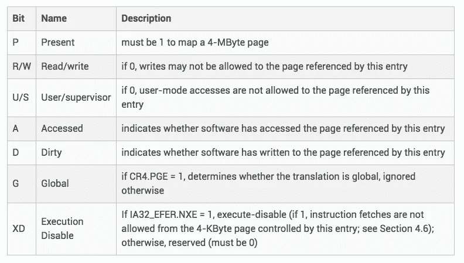

# 关于熔毁的技术深度探讨，它有用吗？

> 原文：<https://medium.com/hackernoon/a-technical-deep-dive-on-meltdown-and-does-it-work-5c395579b2a1>

Meltdown 无疑席卷了互联网。攻击看起来非常简单和优雅，然而[白皮书](https://meltdownattack.com/meltdown.pdf)遗漏了特定漏洞的关键细节。它主要依赖于缓存计时旁路和访问全局映射内核页面的推测性执行的组合。

这种深入探讨假设您对 CPU 架构和操作系统内核行为有所了解。首先阅读[背景章节](https://www.moesif.com/blog/technical/cpu-arch/What-Is-The-Actual-Vulnerability-Behind-Meltdown/#background-on-memory-paging)了解分页和内存保护的入门知识。

# 攻击的简化版本:

1.  推测性内存读取内核映射(管理程序)页面，然后对值执行计算。
2.  基于计算结果，有条件地从存储器向某个其他非缓存位置发出加载。
3.  虽然当出错异常退出时，第二次加载将从流水线中被核爆，但是它已经向 L2 发出了加载请求，并且除了确保未完成的存储器请求仍然像预取一样将线带入高速缓存层次结构之外。
4.  最后，一个单独的进程可以向这些相同的内存位置发出加载，并测量这些加载的时间。高速缓存命中将比高速缓存未命中快得多，高速缓存未命中可用于表示二进制 1(即命中)和二进制 0(即未命中)。

第 1 和第 2 部分。与指令的推测性执行有关，而第 3 部分和第 4 部分使微体系结构状态(即在高速缓存中或不在高速缓存中)能够提交给体系结构状态。

# 攻击可信吗？

Meltdown 白皮书中没有规定的是，什么样的特定 x86 指令序列或 CPU 状态可以支持推测性地执行内存访问，并允许向量或整数单元消耗该值。或 L2 元。在现代英特尔 CPU 中，当发生错误(如页面错误)时，管道不会被挤压/核化，直到违规指令退役。然而，在加载甚至在 L1D 中查找或转到内存之前，在所谓的地址生成(AGU)阶段和 TLB 查找阶段完成了对页面保护、分段限制和规范检查的内存权限检查。以下是更多相关信息。

# 执行内存权限检查

英特尔 CPU 执行*物理标记的* L1D$和 L1I$需要将线性(虚拟)地址转换为物理地址，然后 L1D$才能通过*标记匹配*来确定它在缓存中是命中还是未命中。这意味着 CPU 将尝试在(翻译后备缓冲区)TLB 缓存中查找翻译。TLB 将这些转换与页表或页目录许可一起缓存(访问页所需的特权也与物理地址转换一起存储在页表中)。

TLB 条目可能包含以下内容:

*   有效的
*   物理地址减去页面偏移量。
*   读/写
*   用户/主管
*   进入
*   肮脏的
*   Memtype

因此，即使推测加载已经知道访问该页所需的权限，也要与当前特权级别(CPL)和所需的 op 特权进行比较，因此可以阻止任何算术单元消耗推测加载。

此类权限检查包括:

*   分段限制检查
*   写入故障
*   用户/主管故障
*   页面不存在故障

这就是许多 x86 CPUs 实际上被*设计*去做的事情。当 op 失效时，负载将被拒绝，直到软件/uCode 处理完故障。负载将在去往整数/向量单元的途中被清零。换句话说，用户/管理员保护故障类似于页面不存在故障或其他页面转换问题，这意味着从 L1D$中读出的行应该立即丢弃，并且 uOp 简单地进入*等待*状态。

防止整数/浮点单元消耗故障负载不仅有利于防止这种泄漏，而且实际上可以提高性能。即，如果 L2$未命中 L1D$，则故障加载不会用坏数据训练预取器、分配缓冲区来跟踪内存排序或分配填充缓冲区来从其获取数据。这些是现代 CPU 中有限的资源，不应该被那些不太好的负载消耗掉。

事实上，如果加载错过了 TLB，必须执行页面遍历，如果在遍历期间发生故障，一些英特尔 CPU 甚至会终止 PMH 中的页面遍历(页面错过处理程序)。页遍历执行了大量的指针追踪，并且必须消耗宝贵的加载周期，所以如果它以后被丢弃的话，取消它是有意义的。此外，PMH 有限状态机通常只能同时处理几个页面遍历。

换句话说，从性能角度来看，中止 L1D Load uOp 实际上是一件好事。媒体文章称英特尔下滑是因为他们试图以较低的安全性为代价获取尽可能多的性能，这是不真实的，除非他们想声称推测和缓存的基本概念被认为是折衷。

# 修复

虽然这并不意味着熔毁漏洞不存在。这个故事不仅仅是白皮书和大多数新闻帖子所讨论的。大多数帖子声称，只有投机性内存访问和高速缓存计时攻击的*行为*才能造成攻击，现在英特尔必须彻底重新设计其 CPU 或消除投机性执行。

事实上，错误修复可能是一些门的改变，在 L1D$管道中添加正确的拒绝逻辑，以掩盖加载命中。英特尔 CPU 肯定已经获得了这些信息，因为在确定 L1D$缓存命中之前，必须完成地址生成和 TLB 查找阶段。

导致漏洞的所有场景都是未知的。是某些 CPU 设计错过了对这种架构行为的验证吗？是绕过这些检查的特殊 x86 指令序列，还是设置 CPU 状态以确保实际执行加载的一些附加步骤？Project Zero 认为，只有在 L1D$中出现故障负载时，攻击才会发生。也许英特尔在未命中路径上有逻辑，但在命中路径上有逻辑错误？如果某些英特尔 OoO 设计对崩溃免疫，我不会感到惊讶，因为这是一个特定的 CPU 设计和验证问题，而不是一般的 CPU 架构问题。

不幸的是，x86 在内存执行单元中有许多不同的流程。例如，某些指令(如 MOVNTDQA)在 L1D$中的内存顺序和流程与标准的可缓存加载不同。Haswell 事务同步扩展和锁增加了验证正确性的复杂性。指令提取通过与 D 端加载不同的路径进行。验证状态空间非常大。算上所有的旁路网络，你就能看到有多少不同的地方需要验证故障检查。

有一点是肯定的，缓存和投机不会很快消失。如果是逻辑上的 bug，对于未来的英特尔 CPU 来说可能是一个简单的修复。

# 为什么今天这种攻击更容易了？

假设有一条指令即使在有错误的情况下也能使加载命中并消耗，或者我在上面的 catch 中是错误的，为什么它现在才发生而不是几十年前才被发现。

1.  今天的 CPU 有更深的管道*咳*普雷斯科特*咳*这在推测性内存访问和那些出错访问的实际核/挤压之间提供了更宽的窗口。出错指令不被处理，直到该指令退出/提交给处理器架构状态。只有在退役时，管道才会被拆除。长流水线允许在出错指令的执行和它的退出之间有一个大的窗口，允许其他推测性指令跑在前面。
2.  与高速缓存命中/整数运算等仅针对 CPU 的快速运算相比，高速缓存层次结构更大，内存结构速度更慢，这在高速缓存命中和高速缓存未命中/内存之间提供了更大的周期时间差，从而支持更强大的高速缓存计时攻击。今天的大型多核服务器 CPU 使用精心制作的网状结构来连接数十或数百个内核，这一点被夸大了。
3.  x86 CLFLUSH 和 PREFETx 等细粒度缓存控制的性能增强特性为缓存计时攻击提供了更多控制。
4.  更广泛的处理器，可同时支持并行整数、浮点和内存操作。人们可以将长浮点操作(如 divide 或 sqrt)放在出错指令之前，以保持内核忙碌，但仍然保持整数和内存管道不受攻击。由于出错的指令在退役之前不会核化流水线，所以它必须等到指令序列中任何更早的指令被提交，包括长时间运行的浮点运算。
5.  虚拟化和 PaaS。许多网络规模的公司现在都在运行工作负载云提供商，如 AWS 和 Azure。在云计算出现之前，财富 500 强公司会在自己的硬件上运行自己的可信应用。因此，不同公司的应用程序在物理上是分离的，这与今天不同。虽然 Meltdown 是否允许来宾操作系统侵入虚拟机管理程序或主机操作系统尚不清楚，但已知的是许多虚拟化技术比成熟的 VT-x 更轻量级。例如，Heroku、AWS Beanstalk 或 Azure Web 应用程序中的多个应用程序以及 Docker 容器都在同一个虚拟机中运行。公司不再为每个应用程序配置单独的虚拟机。这可能允许恶意应用程序读取特定虚拟机的内核内存。在 90 年代，随着 Pentium Pro/Pentium III 的出现，OoO 执行成为主流，共享资源不再是一个问题。
6.  在 x86 分页条目中使用全局位和用户/管理员位，这使得内核内存空间能够映射到每个用户进程(但受到保护，不会执行 Ring3 代码),从而降低 TLB 的压力，并减缓上下文切换到独立内核进程的速度。这种性能优化从 20 世纪 90 年代就开始了

# 这是 x86 特有的吗？

首先，缓存计时攻击和推测性执行并不是英特尔或 x86 CPUs 所特有的。大多数现代 CPU 在你的手表或微波炉的几个嵌入式微处理器之外实现多级缓存和大量的推测。

这不是英特尔或 x86 的特定问题，而是一般 CPU 架构的基本问题。现在有人声称，特定的 OoO ARM CPUs，如 iPhones 和智能手机中的 CPU，也存在这一缺陷。乱序执行自从被 Tomasulo 算法引入以来已经完成。与此同时，缓存计时攻击几十年来一直为人所知，因为众所周知，数据可能会在不应该的时候被加载到缓存中。然而，缓存计时攻击传统上被用来寻找内核内存的位置，而不是实际读取它的能力。这更像是一种竞争条件和窗口，具体取决于微体系结构。一些 CPU 的管道比其他 CPU 浅，导致核爆发生得更快。像 x86 这样的现代桌面/服务器 CPU 具有从 CLFLUSH 到 PREFETCHTx 的更精细的功能，这些功能可以作为附加工具来使连接更加健壮。

# 内存分页的背景

自从在 386 和 Windows 3.0 中引入分页以来，操作系统就一直使用这一功能来将一个进程的内存空间与另一个进程的内存空间隔离开来。一个进程将被映射到它自己独立的虚拟地址空间，该空间独立于另一个正在运行的进程的地址空间。这些虚拟地址空间由物理内存支持(页面可以换出到磁盘，但这超出了本文的范围)。

例如，假设*进程 1* 需要 4KB 内存，因此操作系统分配了 4KB 的虚拟内存空间，其字节可寻址范围从 0x0 到 0xFFF。该范围由从位置 0x1000 开始的物理内存支持。这意味着进程 1 的`[0x0-0xFFF]`被“安装”在物理位置`[0x1000-0x1FFF]`。如果有另一个进程正在运行，它也需要 4KB，因此操作系统将为这个*进程 2* 映射第二个虚拟地址空间，范围为 0x0 到 0xFFF。这个虚拟内存空间也需要物理内存的支持。由于进程 1 已经在使用 0x1000-0x1FFF，操作系统将决定为进程 2 分配下一块物理内存[0x2000-0x2FFF]。

在这种设置下，如果进程 1 从内存向线性地址 0x0 发出加载请求，操作系统会将其转换为物理位置 0x1000。而如果进程 2 从内存向线性地址 0x0 发出加载，操作系统会将其转换为物理位置 0x2000。注意这里需要一个翻译。这是页表的工作。

一系列映射内存被称为一个*页面*。CPU 架构有一个定义的页面大小，如 4KB。分页允许内存在物理内存空间中分段。在上面的例子中，我们假设页面大小为 4KB，因此每个进程只映射一个页面。现在，让我们假设*进程 1* 执行一个 malloc()并强制内核映射第二个 4KB 的区域。由于物理内存的下一页[0x 2000–0x 2 fff]已经被*进程 2* 使用，操作系统需要分配一个空闲的物理内存块[0x 3000–0x 3 fff]给*进程 1* (注意:现代操作系统使用延迟/惰性内存分配，这意味着虚拟内存可以在被任何物理内存支持之前创建，直到页面被实际访问，但这超出了本文的范围。请参阅 x86 页面访问/脏位了解详情)。

地址空间*看起来*与进程相邻，但实际上是跨物理内存空间的碎片:

# 流程 1

# 流程 2

在此之前还有一个额外的转换步骤，使用 x86 分段将逻辑地址转换为线性地址。然而，今天大多数操作系统不使用传统意义上的分段，所以我们现在忽略它。

# 内存保护

除了创建虚拟地址空间，分页也是一种保护形式。上述翻译存储在一个名为*页表*的结构中。每个 4KB 页面可以有特定的属性和访问权限，与翻译数据本身一起存储。例如，可以将页面定义为只读。如果对内存的只读页面执行内存存储，则 CPU 会触发一个故障。

直接来自 x86 参考手册，下面的*非穷举*属性位列表(其行为类似于布尔真/假)与每个页表条目一起存储:

# 最小化上下文切换成本

我们展示了每个进程如何拥有自己的虚拟地址映射。内核进程和其他进程一样，也有一个虚拟内存映射。

当 CPU 将上下文从一个进程切换到另一个进程时，切换成本很高，因为许多体系结构状态需要保存到内存中，以便挂起的旧进程在再次开始执行时可以使用保存的状态继续执行。

然而，许多系统调用需要由内核来执行，如 I/O、中断等。这意味着 CPU 会不断地在用户进程和内核进程之间切换，以处理这些系统调用。

为了最小化这个成本，内核工程师和计算机架构师将内核页面映射到用户虚拟内存空间中，以避免上下文切换。这是通过*用户/管理员*访问权限位完成的。操作系统映射内核空间，但只将其指定为*管理员*(也称为 Ring0)访问，因此任何用户代码都不能访问这些页面。因此，这些页面对于任何在用户权限级别运行的代码来说都是不可见的

在*用户模式*下运行时，如果 CPU 发现指令访问需要管理员权限的页面，则触发页面错误。在 x86 中，页面访问权限是能够触发 [#PF(页面错误)](https://en.wikipedia.org/wiki/Page_fault)的分页相关原因之一。

# 全球位

我们展示了每个进程如何拥有自己的虚拟地址映射。内核进程和其他进程一样，也有一个虚拟内存映射。大多数翻译都是进程私有的。这确保了*进程 1* 不能访问*进程 2* 的数据，因为从*进程 1* 到【0x 2000–0x 2 fff】物理内存没有任何映射。然而，许多系统调用由许多进程共享，以处理发出 I/O 调用、中断等的进程。

通常，这意味着每个进程将复制内核映射，这给缓存这些翻译带来了压力，并增加了进程间上下文切换的成本。全局位使这些特定的转换(即内核内存空间)在所有进程中可见。

# 结束语

探究安全问题总是很有趣的。与 20 世纪 90 年代不同，现在的系统被认为是安全的，并且随着加密、生物识别验证、移动支付和数字医疗的发展，系统变得更加重要。对于今天的消费者和企业来说，大臀位比 90 年代更可怕。同时，我们也需要继续讨论新的报告。

引发熔毁漏洞的步骤已被各方证明。然而，导致崩溃的可能不仅仅是*投机和缓存计时攻击的行为*,也不是 CPU 架构的根本故障，而是一个逃过验证的逻辑错误。这意味着，猜测和缓存不会很快消失，英特尔也不会需要一个全新的架构来修复崩溃。相反，未来 x86 CPUs 中唯一需要的变化是对组合逻辑进行一些小的门更改，这些更改会影响确定 L1D$(或任何临时缓冲区)中的命中是否是好的。