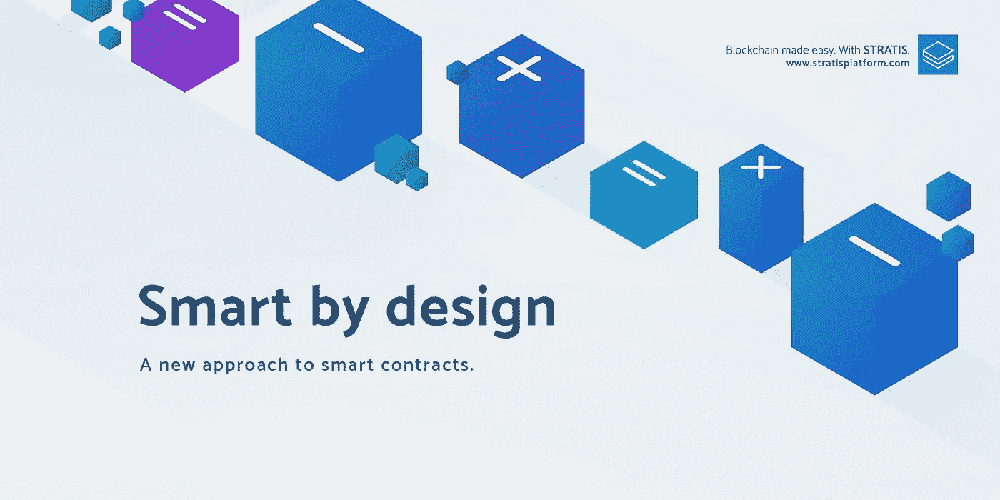

# 在本机 C# /中执行的第一个令牌智能协定。斯特拉斯网

> 原文：<https://medium.com/hackernoon/a-token-smart-contract-executing-in-native-net-and-92ceaf972713>

注意:你们中的数百人一直在给我发消息，说 X other platform 在 C#中有智能合约。我可以肯定地说，Stratis 是第一个原生执行 C#的。其他平台(例如 NEO)可能会将 C#语法编译成定制的机器代码，但我们绝对是第一个真正执行的平台。公共语言运行时上的. NET 代码。NET 的虚拟机。(我应该知道，我以前构建过为 EVM 编译 C#的 EthSharp！)

12 个月前，由于对“年轻”的 solidity 和[以太坊](https://hackernoon.com/tagged/ethereum)智能合约开发环境感到有点沮丧，我开始渴望把我最喜欢的开发环境(C# /带来。NET / Visual Studio)向[区块链](https://hackernoon.com/tagged/blockchain)发展。在几个月的时间里，我在一个名为 EthSharp 的项目上取得了进展。它开始在功能上从 C#语法生成 EVM 字节码，但我最终停止了它，因为我觉得编译成非本机字节码否定了利用已建立的框架生态系统的可能性，并可能带来一系列安全风险。给自己的提示:写一篇关于这个的文章！

自那以后，Stratis 的智能合同团队一直在打造更令人兴奋的东西，即具有执行能力的区块链。链上. NET 代码。到目前为止，智能合约平台通常会引入或重新打包像 EVM 这样的定制虚拟机，而我们则采用了非常不同的方法:)

该协议还没有投入生产——它计划在今年年底投入使用。您可以点击了解关于[堆叠路线图的更多信息。](/@Stratisplatform/stratis-q4-development-roadmap-78d8080e4c39)

然而，现在最酷的是，我们有一个完全用 C#编写的功能令牌契约(想想 ERC-20)的初稿，并在链上执行。感谢罗文·德·哈斯把这个放在一起。在 github 上的节点库中找到最新的源代码[，或者现在只是惊叹于这个小小的预览:](https://github.com/stratisproject/StratisBitcoinFullNode/blob/7e0b60fe5292d68421367a5af0500fedbc6048a9/src/Stratis.SmartContracts.Token/StandardToken.cs)

我们期待在未来几周内正式确定该标准，所以是的，它很快也会有一个像“SRC-3”这样吸引人的小名字。

我希望有其他人和我一样对此感到兴奋。如果我有时间，我很想深入了解我们的智能合同执行方法的利弊。

同时，在推特上找我:[@ codingopastorm](https://twitter.com/codingupastorm)

或者加入我们的[不和谐](https://discord.gg/cEu6AnW)！在#smart_contracts 频道找到我。