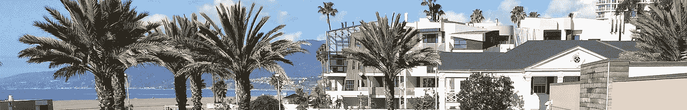
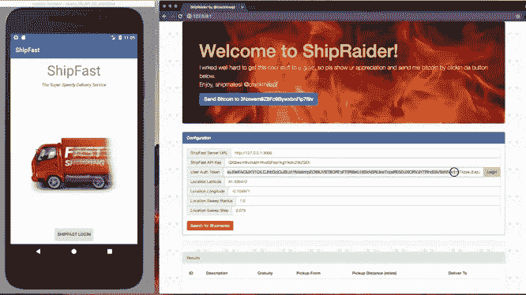

# API 保护不足之旅

> 原文：<https://medium.com/hackernoon/a-tour-of-api-underprotection-2ad86fc5ce48>

## OWASP 应用安全加州 2018 讲座

第五届年度 [OWASP AppSec California](https://2018.appseccalifornia.org/) 于 2018 年 1 月下旬在圣莫尼卡海滩举行。AppSec California 是由一群志愿者组织和管理的，他们举办了一场非常棒的会议——强烈推荐。除了优秀的内容和与许多有趣的同事互动的机会，谁不想在海滩上玩几天呢？

可以在 [AppSec California 2018 网站](https://2018.appseccalifornia.org/index.php/program/sessions/)上找到该活动的概述，包括演示期间使用的许多幻灯片的链接。大多数演讲都有录像，可以在 [you tube](https://www.youtube.com/playlist?list=PLpr-xdpM8wG-mJASEZ4TqFYtiRgasd-ki) 上看到。

我关于 API Underprotection 的演讲是给一群站着的人的，他们在最后问了一些非常好的问题。

在视频中，您将了解 ShipFast 快递服务 API、其品牌后端服务和移动 Android 客户端以及攻击者 ShipRaider 的演变，恶意和合法快递员都使用 ship raider 来利用 API 获取非法收益。

API User and Abuser

我们从静态 API 密钥和 OAuth2 用户授权开始，讨论 API 安全威胁以及如何应对它们。在这一过程中，TLS、证书锁定、HMAC 呼叫签名、应用程序强化、白盒加密和应用程序证明被认为可以增强您的 API 安全态势，但 ShipRaider 将努力尝试中间人攻击、应用程序反编译和调试、利用框架和其他逆向工程技术来继续跟踪您。

这是对移动设备上的猫和老鼠 API 保护问题的快速概述，并提供了一种新兴工具和技术的感觉，这些工具和技术使 API 安全性发生了重大变化。

ShipFast 和 ShipRaider 由 [CriticalBlue](https://approov.io) 开源，可在 [github](https://github.com/approov/shipfast-api-protection) 上获得，并附有一些[附加攻防场景](/approov/shipfast-api-protection-walkthrough-part-1-d00810b4138dgithub)的故事。如果你想更深入，你将获得一个完整的开源例子和一些额外的家庭作业。对移动 API 保护的更全面的[概述可能也是令人感兴趣的。](https://hackernoon.com/mobile-api-security-techniques-682a5da4fe10)

感谢阅读！有关移动 API 安全性的更多信息，请查看。

如果你推荐这篇文章(点击👏按钮)以便其他人可以找到它。