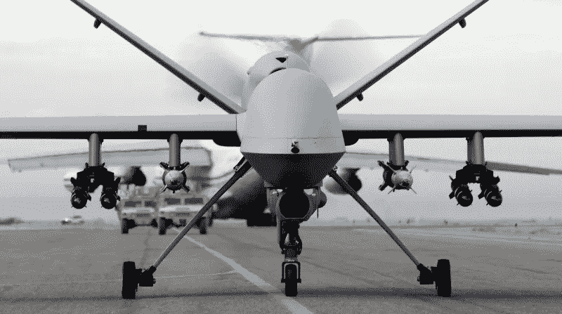

# 悲剧的不可避免性:无人机和人工智能在不久的将来的战争中的融合

> 原文：<https://medium.com/hackernoon/a-tragic-inevitability-the-fusion-of-drones-ai-in-the-wars-of-the-not-so-distant-future-f1115739e76b>

**Image From** [**TechSpot**](https://www.techspot.com/news/61539-musk-hawking-wozniak-urge-ai-weapons-ban.html)

我写这篇文章之前，美国、英国和法国决定对叙利亚总统巴沙尔·阿萨德(Bashar al-Assad)和忠于他的部队发动据称是一次性的导弹和空袭，以回应他可能对 Dhouma 镇平民实施的化学袭击。

这次袭击给我留下深刻印象的是有多少人卷入其中。我的意思是，从某种意义上来说，即使是一次性的东西也需要这么多的人力，这么多的“血肉之躯”来完成。也许是因为小时候，我是《T2》星球大战系列的超级粉丝，在我尴尬的青少年时期，我可能和朋友们一起玩了太多小时的*光环*和*使命召唤*，但我现在经常想象未来的战斗将由机器人、克隆人或小股超人士兵进行，他们可以通过偶然碰到他们来杀死一个普通的凡人。

抛开幼稚的天真不谈，科技世界的快速进步并不仅仅局限于我们的 iPhones、Kindles 和 Xboxes。事实上，正如 *Wired Magazine* 的[纪录片中指出的那样，我们今天欢呼的让我们生活变得更容易的许多技术，不管是好是坏，都是从某种军事项目开始的。例如，那些我真正感到兴奋的自动驾驶汽车——为它们提供动力的无人驾驶技术最初是作为无人机轰炸项目的一部分，以使人工智能能够更好地识别潜在目标。](https://www.youtube.com/watch?v=I5h8GfxIWVY&t=1675s)

这让我想到:军方还在研究什么，尤其是关于无人机的？这将如何塑造不太遥远的未来的冲突，这些新技术会带来什么样的法律(和伦理)影响？

# **勤快的无人机？:无人机技术的不断发展**

在过去五年左右的时间里，使用无人驾驶飞机瞄准潜在的恐怖分子藏身地和敌人的建筑已经成为战争中一个非常常见的特征，自从它们首次“亮相”以来，关于使用无人驾驶飞机的争议逐年增加。

这场争论很可能会继续下去，并成为技术、军事、政治和学术界更加激烈的辩论话题。最近，五角大楼宣布将加紧研究人工智能武器的可能性，特别是在无人机方面。在由 [*新美洲*智库](https://www.newamerica.org/)主办的一次会议上，航空航天工程师兼国防部研究副部长迈克·格里芬指出，虽然在进攻方面无人机已被证明是有用的，但在防御方面仍有许多工作要做，特别是当涉及到应对[日益增加的“*无人机群*](https://www.theverge.com/2018/4/12/17229150/pentagon-project-maven-ai-google-war-military)攻击成为战争中一个更加常见的特征的可能性时:

> “当然，人类定向武器系统可以对付一架或两架或几架无人机，如果它们看到它们过来的话，但它们能对付 103 架吗？”格里芬问道。“如果他们能对付 103，我怀疑，他们能对付 1000 吗？”

这种担心——如果技术落入敌军手中，将无法保护美国和盟军免受无人机袭击——并不是没有根据的；例如，格里芬回忆说，今年 2 月，叙利亚的一个俄罗斯空军基地遭到了一小群无人驾驶飞机的袭击，许多人怀疑这是一次基地没有准备好的袭击。

这次会议和格里芬关于美国和西方普遍需要参加某种“人工智能军备竞赛”的言论，是在谷歌员工抗议公司参与五角大楼的 *Project Maven* 任务组之后“紧接着”发生的。 *Maven* 代表了当前无人机技术与增强的、不断发展的人工智能能力的融合，根据科技网站 *The Verge* 获得的[这份 DSD 备忘录](http://dodcio.defense.gov/Portals/0/Documents/Project%20Maven%20DSD%20Memo%2020170425.pdf),*Maven*项目将“*为物体检测*【和】*分类提供计算机视觉算法”，*意味着无人机将能够在下次出现在实地时从这些收集的数据中识别潜在目标。

**Image From** [**Wikipedia**](https://en.wikipedia.org/wiki/General_Atomics_MQ-9_Reaper#/media/File:MQ-9_Reaper_UAV_(cropped).jpg)

# 条约与论文:人工智能无人机融合的法律和道德含义

然而，这回避了一个问题:无人机袭击已经被证明是有争议的，因为五角大楼在许多场合下向据称是恐怖分子的细胞开火，但后来证明是一个人在筛选废金属。更先进的人工智能无人机一定能够提高恐怖分子的探测能力吗？如果它把金属碎片和卡拉什尼科夫冲锋枪混淆了呢？虽然这些问题最初可能看起来很可笑，但正如阻止黑仔机器人 集团的 [*运动所指出的那样(这个名字不会帮助你们的案子被认真对待，小伙子们，不要说谎)，仍然需要*](https://www.stopkillerrobots.org/)*[保持人类对机器人和计算机武器技术的控制](https://www.stopkillerrobots.org/2018/04/convergence/)，以避免潜在的失误，导致更多无辜平民死亡，最终增强而不是击败恐怖组织及其言论。*

这种统治人工智能的欲望及其与军火工业可悲的不可避免的融合并不新鲜——事实上，试图阻止科学发现和研究武器化的想法是该学科长期以来的“历史比喻”；例如，爱因斯坦对他的原子理论成果被用来制造第一颗原子弹感到震惊。20 世纪 40 年代如此，21 世纪 10 年代似乎也是如此。科技企业家和人工智能开发者，如[埃隆·马斯克(Elon Musk)已经带头呼吁彻底禁止](https://www.theguardian.com/technology/2017/aug/20/elon-musk-killer-robots-experts-outright-ban-lethal-autonomous-weapons-war)自主机器人武器，而 [*未来生命研究所*已经写了一封来自各种机器人科学家的公开信](https://futureoflife.org/open-letter-autonomous-weapons/)——我相信你仍然可以签名——敦促人工智能军备竞赛完全彻底降级，至少在武器研究方面，这可能会导致不需要任何人类控制的技术出现。

研究院的信读起来很有趣，它提出了许多关于人工智能在战斗中的应用的有效观点，以及它的潜在应用对未来战争哲学和伦理的意义。他们正确地指出，虽然人工智能和机器人在战争中的使用几乎肯定会减少冲突中的人类伤亡人数，但它也将“*降低进入战斗的门槛*”。对最近空袭叙利亚阿萨德的合法性存有疑问。当谈到人工智能在战争中的使用时，这些怀疑增加了大约 1000 倍。

# **科学家需要继续保持警惕:总结思路**

AI 开发者在去年[给联合国](https://www.theguardian.com/technology/2017/aug/20/elon-musk-killer-robots-experts-outright-ban-lethal-autonomous-weapons-war)的一封信中的话就说明了一切:“*这个潘多拉的盒子一旦打开，就很难关上*”。他们是对的。最近，人工智能研究人员和其他科学家一起领导了对韩国高级科学技术研究院的抵制，因为该大学计划与韩华系统公司合作开设一个自主武器实验室。虽然天网和终结者式场景的可能性仍然相当遥远，但无论是在美国、英国还是其他地方，军火公司和国防部利用人工智能在武器生产方面的潜力的可能性正在迅速成为现实，这种可能性越来越像无人机最初被“重新用于”军事手段时那样在道德上受到质疑。

我不是科学家。尽管我在学校喜欢物理这样的学科，但我从未真正擅长或对这门学科感兴趣到足以考虑在科学领域从事职业生涯的程度。这就是为什么科学家们**需要**表明立场，反对人工智能不断被用来杀人而不是帮助的悲剧必然性；像我这样的文科毕业生，虽然我们可以大声疾呼潜在的哲学和伦理含义，但我们没有专业知识和庄严的态度来真正发展科学的论点和政策，以塑造未来的战争和无辜平民的痛苦。

我将留给你机器人公司*的联合创始人 [Scott Phoenix](https://www.cnbc.com/2018/03/15/autonomous-weapons-are-among-the-worlds-dumbest-ideas-a-i-ceo.html) 的(相当可怕的)想法:Vicarious:**“如果你有一支自主无人机军队，如果我在你的代码中某处发现一个错误，你的军队就变成我的军队”。*人工智能的好处是巨大的，但无数的风险是显而易见的；机器人和人工智能科学家需要继续公开反对他们的研究武器化。