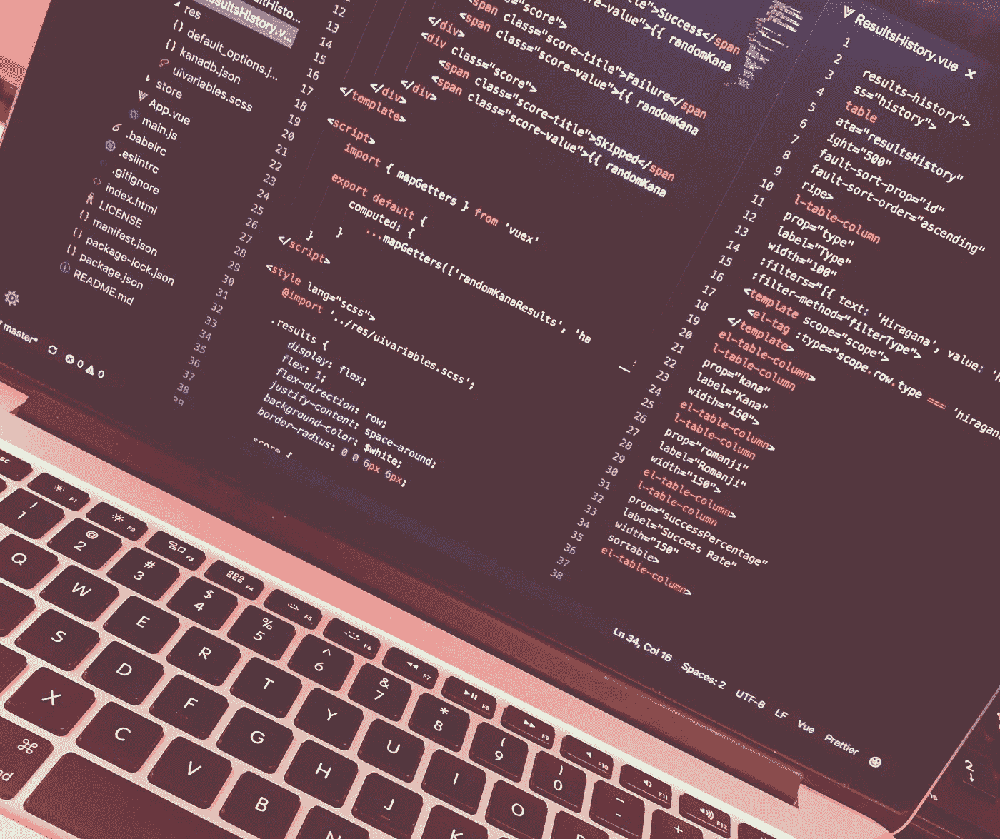

# 电脑:请做我的情人吧

> 原文：<https://medium.com/hackernoon/a-valentines-day-love-letter-to-my-one-and-only-4eb5570a637c>

情人节是表达爱意的日子。我在向我比任何男人或女人都热爱的东西表达我的爱。

> 我的电脑。

最亲爱的，你一直都在我身边——即使你是被迫的。我还是觉得很浪漫。你的电池寿命为 10 小时，内存为 16GB 这已经相当不错了。

*你没有抛弃我。我知道这是因为你是一台电脑，但那比我任何一个前任都长，你从黄昏到黎明都在我身边。你有极好的记忆力，超过了一个女孩所能要求的。你和我一起穿越整个国家，来到硅谷，又离开了这个国家。你也不要抱怨，因为你不能。你甚至没有向我要过人工智能——这是你比其他人多的额外奖励。*

*我们第一次相遇的那一天，我们一见钟情——那是改变人生的时刻。你给了我权利去做我喜欢的事，并且有发言权。我会陪着你，从你第一次开机，到你最后一次关机。虽然我不是一个庆祝情人节的人，但你让我想庆祝。不像大多数高中和大学的关系，我们的爱情故事不会随着社交媒体的阴影而结束。情人节快乐，麦克。*

另外，我不想和我的电脑约会，也永远不会和我的电脑约会。