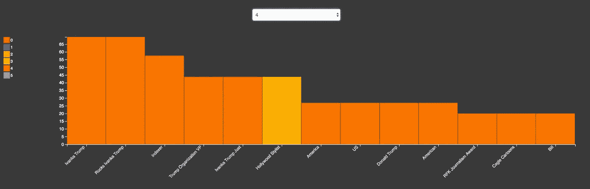
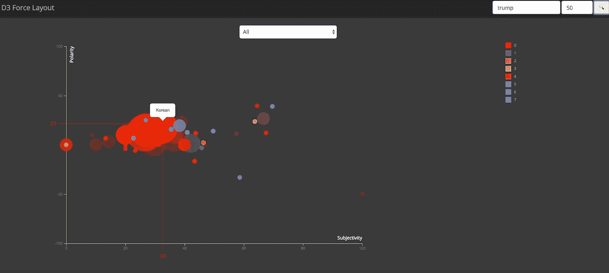
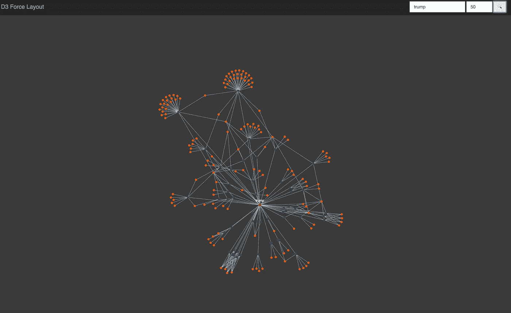
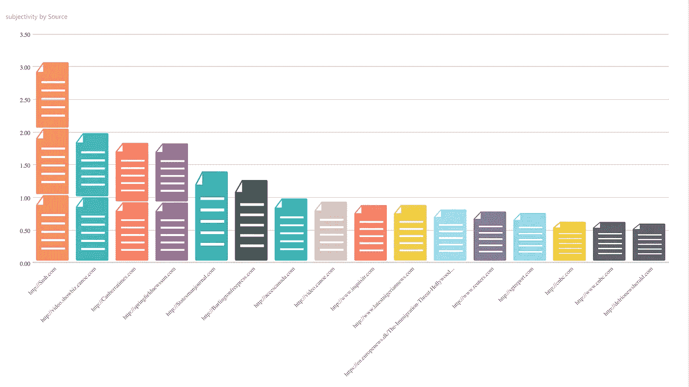
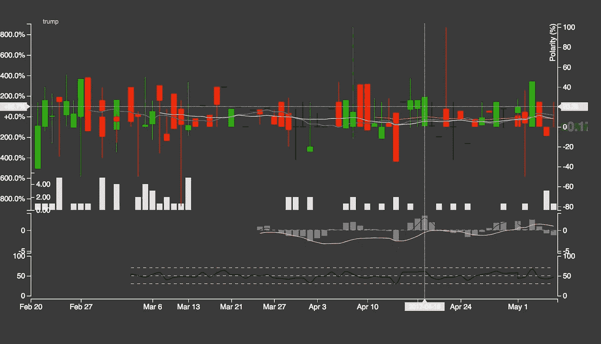
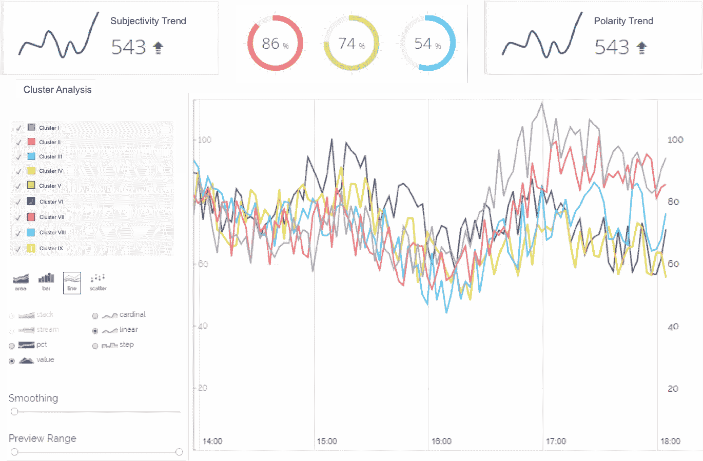

# 网络文字背后的视觉故事

> 原文：<https://medium.com/hackernoon/a-visual-story-behind-words-on-the-web-6fe1271cd37e>

每天都有大量的内容在互联网上不断产生。有许多关于人、产品、公司、地区、国家等的博客帖子、社交媒体帖子、评论、评级、评论、网站、图片和视频。每天产生、瞄准和消费的大量内容影响着公众的看法。反过来，它可以以积极或消极的方式强烈影响实体或事件。鉴于这种敏感性，非常需要近乎实时地了解潜在的模式、趋势和归因，并将这些信息用于纠正措施。例如，新闻分析服务需要检测偏见、假新闻，分析各种实体和感兴趣的话题的情绪和公众感知。营销机构需要了解媒体偏见的来源，以及如何管理这种看法。

下面我描述了分析非结构化数据并通过可视化提供可操作的见解的步骤。

## 数据采集

大部分内容都是非结构化的，以文字、图片、视频的形式出现。每日爬虫可以从相关网站、社交媒体账户、博客等获取数据。和存储用于分析。

## 从非结构化内容中提取元数据

以下是从捕获的内容中提取和关联元数据的各种方法。

*   从内容源(文本、图片和视频)中提取关键词和相关实体
*   提取源中的命名实体(人、产品、公司和位置)和值(电子邮件、电话号码、货币、百分比、嵌入的 URL)
*   提取文档中的命名实体，消除歧义并交叉链接它们
*   提取元数据，如作者姓名、出版日期、嵌入式 RSS 源、用于创建数据的设备类型、图像分辨率、IP 地址、位置等。
*   从图像和视频分析中提取实体、位置和任何其他有用的数据
*   检测并在需要时翻译语言
*   创建一篇文章的摘要
*   从文章中提取主题
*   根据预定义的分类法对内容进行分类和聚类
*   根据极性(正面或负面意见)和主观性(意见或由合法来源的事实和数字支持)来检测文本的情感
*   分析对文本或其他媒体中发现的实体的情感
*   分析对一个实体各个方面的看法。例如，对于一个酒店，方面是员工，位置，附近的地方等。

## 元数据聚合

可以基于持续时间、来源、聚类、实体、关键词、作者、情感、主题、方面等，在不同的维度上聚集和分析每个来源上收集的元数据。这种聚合可以每天运行，也可以根据需要随时运行，以反映实时信息。这种聚合有助于发现模式和趋势，然后可以很容易地可视化并深入到狭窄的细节。

## 形象化

这里有一些有趣的方法，可以将从非结构化数据中提取的元数据可视化，以显示关系、聚类、度量和趋势。

*   **媒体极化**

此图显示了发布特定实体故事的顶级媒体的正面和负面情绪。这显示为每个媒体渠道的条形图(下图中为 0-5)，显示了该媒体渠道根据该关键词创建的所有文章中重要实体的平均情感得分。

Media Polarization Chart

*   **实体极化**

这个散点图描绘了主观性和极性。每个泡泡代表一个实体，大小代表出现的频率，颜色代表它所在的集群。在这种情况下，离群值显示具有高度偏见的实体(高度主观和两极化的情绪)。

Entity in a cluster with subjectivity and polarity on a scatterplot (D3.js)

*   **关键字实体关系**

该图显示了与关键字相关的文章和实体之间的关联。这个力定向图显示了连接到所有文章的中心的关键字，这些文章又连接到在文章中找到的实体。这是可视化关键字、文章和实体之间各种关系的好方法。

Keyword-Entity relationship on force directed graph (D3.js)

**来源主观性**

这张图表显示了主观或固执己见是一个特定关键字的来源。这可以判断源是否可能固有地偏向关于实体或事件的位置。

**Subjectivity by source on bar graph (Microsoft PowerBI)**

**标签云的重要词汇**

这种可视化可以显示与关键字相关的当前重要主题。例如，在下面的图表中，您可以看到“移民”是与“特朗普”相关的关键字搜索的重要主题。

Tag cloud of important words from a source related to a keyword

**主观性和极性趋势**

蜡烛图通常用于跟踪股票走势，是显示与关键字相关的近期主观性和极性趋势的好方法。基于这些趋势线，你可以发现一个特定的人，事件，公司是否正在发展成为一个高度情绪化和有偏见的故事，以及这种偏见是积极的还是消极的。

Candlestick chart for daily trends

其他一些有趣的可视化可能是:

*   显示与搜索关键字相关的实体和重要单词的树形图。根据重要性(TF-IDF 得分)，它们可以用较深的颜色显示。
*   来自单一来源的所有文档的所有主观性或极性的平均值。这可以显示关键字来源的固有偏差。
*   不同文章的气泡图主题聚类。

**仪表盘**

上述可视化的各种组合可以在一个仪表板中组合在一起。这种仪表板可以提供一种互动的方式来可视化公众的看法和正在进行的故事的影响:一个真正的视觉故事背后的文字在网络上！

Trends on dashboard

> 您是否开发了其他有趣的方法来可视化非结构化内容？