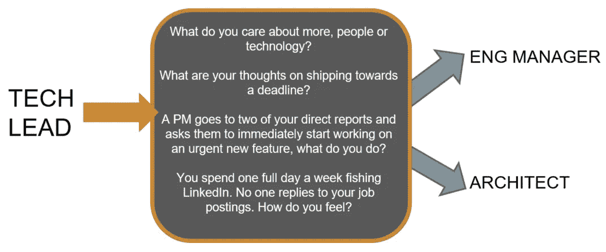

# 识别工程经理的沃伊特-坎普夫检验

> 原文：<https://medium.com/hackernoon/a-voight-kampff-test-for-identifying-engineering-managers-bb8512c70857>

“You’re working towards a holiday ship date, suddenly your best developer suggests an Erlang rewrite. How do you react?”

当我在 2016 年末加入 Reddit 时，我面临着一个独特的挑战:一年内将[工程](https://hackernoon.com/tagged/engineering)组织的规模扩大两倍。当时，团队中有大约 35 名工程师和少量“技术领导”，但在工程领域几乎没有正式的[管理](https://hackernoon.com/tagged/management)结构。

事实上，在与我的新团队的第一次会议上，第一个问题就是“经理到底在做什么？”在接下来的几周里，我会听到很多不同的说法，我很自豪地说，随着时间和耐心，这个问题慢慢改变了。到了第四周，问题不再是“经理是做什么的？”更像是，“工程副总裁是做什么的？”进步！

玩笑归玩笑，我们需要扩大规模，这意味着对我们的领导结构和责任更加认真。最终，我与团队达成了重要的共识，他们也愿意开始寻找管理者。但这意味着我必须为所有的“技术领先”做点什么

在更进一步之前，你可能会问自己“什么是技术领先？”这是一个奇妙的问题，因为如果你问 5 个合理的人，你会得到 14.5 个合理的答案。也就是说，“技术领导”可以有很多不同的含义，这个角色很大程度上取决于你在哪里工作。

我记得很久以前，在我职业生涯的初期，我的管理技能才刚刚开始崭露头角。我的导师凯文注意到了这一点，他说:“也许我们应该考虑让你做技术负责人。”

“那是什么？”我问。

他的回答是，“嗯……没有一个明确的定义，但主要意思是，把‘领导’这个词放在你的职位上，你会自然而然地成为一名更好的经理。”

尽管他是开玩笑说的，但这么多年来，我从未遇到过比这更准确的描述。这就是为什么我在我建立的组织中尽量避免技术领导的头衔。他们管理人、管理 scrums、管理技术、管理架构的一部分吗？所有这些问题的答案都是“是，不是，也许，或者视情况而定。”

没有清晰的职责，很难扩展一个组织，我需要快速找到经理。为了这篇博文的目的，让我们从“技术领导”的定义开始，他们要么是**原型经理**要么是**原型架构师**。他们准备承担更广泛的责任，但不确定他们是想监督人还是技术。我们怎么打电话？

## 技术领先。经理或建筑师出局。

我从一部经典电影中获得了灵感。如果你看过电影《银翼杀手》,你可能还记得[沃伊-坎普夫](http://bladerunner.wikia.com/wiki/Voight-Kampff_machine)测试。冒着过分简化邪教经典的风险，《银翼杀手》讲述了一个未来赏金猎人追捕隐藏在普通人群中的复制人(机器人)的故事。沃伊特-坎普夫测试背后的想法是，你找一个看起来像人类的人，问他们一些奇怪的问题，测量他们的反应，并确定他们是真正的人类还是技术奇迹。

巧合的是，这正是我们的技术领导需要完成的*。最好的工程经理首先对人感兴趣。最着迷于技术的最好的建筑师。人类还是机器人？*

*但与电影不同的是，我的方法不是在办公室安装测谎仪，在实验室环境中研究技术线索。相反，在几周的时间里，我将一些探索性的问题融入了正常的一对一对话中。*

**

*A Voight-Kampff test for tech leads*

## *你更关心人还是技术？*

*让我们从简单的开始。工程经理必须主要关注人员、流程和执行，而架构师是技术路线图的管理者。也就是说，这个问题有点模糊，因为两个群体都在一定程度上关心人、过程和技术。*

*出于这个原因，这个问题最擅长识别异常值。你偶尔会发现一些员工真诚地认为好的代码可以解决所有问题。这些人不会成为优秀的人事经理(在极端情况下，可能会建议在周末将您的整个 Python 代码库移植到 Erlang)。*

*相反，你偶尔会发现一些员工相信过程和团队合作可以解决所有问题。这些人不会是你的技术路线图的最佳管家(在极端情况下，可能会把“敏捷宣言”钉在你办公室的前门上)。*

## ***一名高管要求在设定的截止日期前发布一部电影，你有什么想法？***

*经理们将试图找出如何平衡范围、资源、过程和时间，以确定产品何时可以交付。根据组织的需要，他们也可能理解其中一些变量是不可移动的。例如，高管是否因为假日发货日期而要求截止日期？*

*根据我的经验，架构师更倾向于“该完成的时候就完成了”的阵营——不是因为他们无视最后期限，而是因为他们可以预见到由日期驱动的心态可能带来的长期痛苦(技术债务和重构)。我看到的另一个模式是通过组建 v-teams 来解决紧急问题的建议，如果部署得当，这是一个伟大的架构师超级力量。*

## *一个项目经理去找你的两个工程师，要求他们立即开始开发一项新功能，你会怎么做？*

*当你应该负责的事情就在职位名称里的时候，那是很棒的。画家画画。作家写作。工程经理管理工程师。管理意味着设定人们工作的期望，他们如何工作，以及工作质量是否可以接受。*

*在较大的组织中，EM 将与他们的 PM 合作来理解产品需求，但不会将工程责任委托给他们(也就是说，在较小的组织中，您可能有计划/项目经理来承担其中的一些任务。)*

*当面对这个问题时，EM 会考虑什么是积压的，什么是正在进行的，日程影响等等。，才同意工作。我合作过的伟大的建筑师喜欢被拉去咨询新的系统。因为他们经常在人力和资源完全投入之前就开始考虑问题，所以他们不会将这项工作视为“中断”,而是一个确保最终选择正确技术道路的机会。*

## ***你每周花一天时间在 LinkedIn 上宣传你的职位空缺，但没有人回复。你感觉如何？***

*这可能是一个令人惊讶的问题，但却是最有价值的问题之一。因为我在迅速扩大组织规模，我知道我会要求我的经理花很多时间在 LinkedIn 上宣传他们的工作，并面试候选人。*

*除其他事项外，经理还负责吸引、留住和发展人才。一个好的 EM 将理解建立团队是工作的一部分，团队成员必须来自某个地方。*

*我想，对于这个问题，我从一位我非常尊敬的建筑师那里得到的最好的回答是，“我可以每周花一天时间招聘，但你难道不想让我直接与已经在这里的人一起工作，让他们成为更强的工程师吗？”*

## ***最后的想法***

*至于针对工程经理的沃伊特-坎普夫测试，我倾向于认为这种方法效果不错。在我所认识的经理中，大约 90%的人仍在担任那个角色。所有的建筑师都还在船上。与旧的“技术领先”体系相比，期望和责任立即变得更加清晰。最终，通过与人力资源团队的合作，许多测试问题被整合到一个更具可扩展性的招聘流程中。*

*此外，正式引入架构师角色允许我们创建一个职业阶梯，让个人通过技术贡献上升到组织的最高级别。这很重要，因为无论人们选择成为人还是技术经理，他们都完全有可能扩大自己的范围。*

*最后，观察力敏锐的读者可能会问，“嘿，在我的公司，技术领导的角色听起来很像你对架构师的期望。您真的需要取消技术主管的头衔吗？”也许不是，但请记住，我需要快速移动组织。当方向非常明确时，你行动最快。去掉旧的技术领导头衔给了我们一个机会，来准确定义未来领导者的期望。*

*希望你喜欢阅读！如果有，请与朋友分享*

***岩石上的
——尼克***

* [## 处于领导地位的边缘

### 这一天，我知道了管理者和领导者的区别

startupsventurecapital.com](https://startupsventurecapital.com/on-the-edge-of-leadership-bbb15eed198a)  [## 从“你好世界”到英语副总裁

### 我的职业生涯，第一部分

blog.devcolor.org](https://blog.devcolor.org/career-journey-part-1-3bdddf1f87a)*