# 观看比赛——沙袋游戏

> 原文：<https://medium.com/hackernoon/a-vue-to-a-view-a-punchbag-game-849bb239629>

你们好，希望每个人都好。

这个星期我一直在看 Vue.js，到目前为止我很喜欢它！到目前为止，我已经做了一点反应，所以对我来说并不陌生。我一直在使用这个有史以来最好的名字[网络忍者](https://www.youtube.com/watch?v=5LYrN_cAJoA&list=PL4cUxeGkcC9gQcYgjhBoeQH7wiAyZNrYa)的神奇教程。

Vue.js 是一个为 web 构建前端界面的框架。它只关注视图层，但是可以灵活地与其他库一起工作。它使用一种向 DOM(网页上的对象)呈现数据的方法，这使它在更新页面方面具有超快的优势。

这方面的一个例子是进行谷歌搜索，在你完成输入之前，它会给出建议。这使得它具有超强的反应能力，也就是说，当页面上的任何内容发生变化时，它会在每次按键时运行新的搜索。

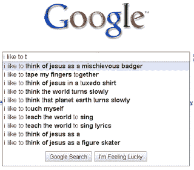

# **Vue the Everyman**

在业界有三种主要的前端 [Javascript](https://hackernoon.com/tagged/javascript) 框架。这些是 Angular，React 和 Vue。有趣的是，Angular 是由谷歌开发的，React 是由脸书开发的，而 Vue 没有任何大型科技公司的支持。

这意味着它缺乏生存的“安全感”,无法保证它会被使用。这是它更令人印象深刻的地方，正因为如此，它必须达到比其他竞争对手更高的标准。

Vue 是尤雨溪在谷歌工作后用 Angular 创建的。据说他已经抓住了 Angular 和 React 的最佳部分，并将它们组合成 Vue。

在过去的几年里，Vue 越来越受欢迎，大公司也越来越多地使用它，比如 Adobe、阿里巴巴、Expedia、任天堂和 Gitlab 等等。开发人员对它的评价很高，它以其简单性(与其他软件相比)、优秀的文档和友好的社区而闻名。

# **一个最小的 Vue.js 设置**

请注意，我确实遵循了这里的教程，所以这不完全是我的工作。然而，我添加了声音和 60 年代的蝙蝠侠拟声词(omg 感谢上帝的拼写检查)随机选择的单词，以及一些造型。

这是我到目前为止得到的，这是一个超级简单的版本，因为我知道有标准化的 Vue 初始化，可以预生成你所有的文件。无论如何，我的事情就是保持事情简单！

让我们开始吧！一旦我们创建了一个项目文件夹，并整理了所有的 github 插件，我们想要“npm init”按 enter 键或回答 npm 的问题，然后“NPM install-save http-server”。这将下载用于创建服务器来运行我们的 web 应用程序的节点模块。

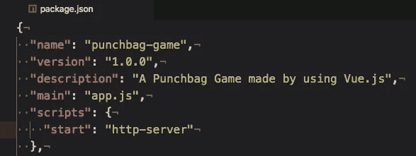

进入 json 包文件，将这个脚本部分添加到该文件中。这将是一个很好的快捷方式，你只需要在终端输入“npm start”就可以为你启动一个服务器。

这是我的文件结构。

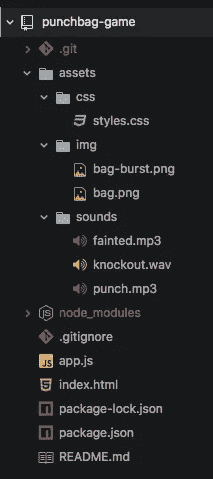

因此，我们要关注的两个主要文件是 Index.html 文件，这是我们的前端接口，以及保存一些后端逻辑的 app.js。

Assets 是我保存网页 CSS 样式的地方，img 和 sounds 文件夹是我后来添加的一些媒体内容。

好，让我们转到 [HTML](https://hackernoon.com/tagged/html) 文件…

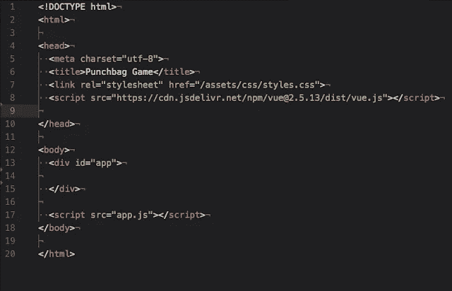

*专业建议*(顺便说一句，我是在讽刺，因为我不是专业人士！)，在 Atom 中只需写“html”并点击 tab，一个基本的 html 结构就会为你建立起来。这将包括上面的结构，但是没有 head 标签和 body 标签中的代码。

所以在脑袋里面，<link rel="" bit="" is="" where="" we="" telling="" the="" page="" to="" look="" for="" css="" file="" styling.="" underneath="" that="" in="" script="" tag="" grabbing="" vue.js="" and="" adding="" it="" our="" page.="" this="" using="" cdn="" which="" an="" online="" link="" but="" you="" can="" download="" refer="" your="" own="" like="" with="" css.="">

At the bottom, that script tag is gonna load in our app.js file to the page. More on that later…

So inside the body tag, we’re giving this tag an id “app”. This is where we want Vue.js to render our page. All the elements will go inside this div!

Right, lets go to App.js…

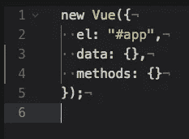

So inside this file we wanna put this. Its a new instance of Vue, and it will be structure in a hash table. So remember, when we add lines we need commas, apart from the last line of every hash!

Inside this Vue instance, each hash represents something. The “el” represents the element we are rendering to, in this case that div tag with the id “App”, this is the bridge that links App.js to Index.html.

Data represents variables that we can refer to and/or change, and methods are well, exactly that, functions that “do stuff”

# **大楼的出气筒**

好了，我要向前看，试着挑战自己来解释这一点！

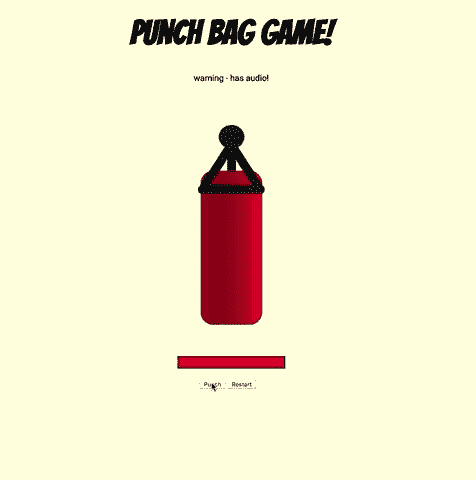

这个结构在顶部有一个标题，然后是一些文本，接着是一张图片，一个工具条，然后是我们的按钮“打卡”和“重启”在底部。这里是我们最终的 app . js；

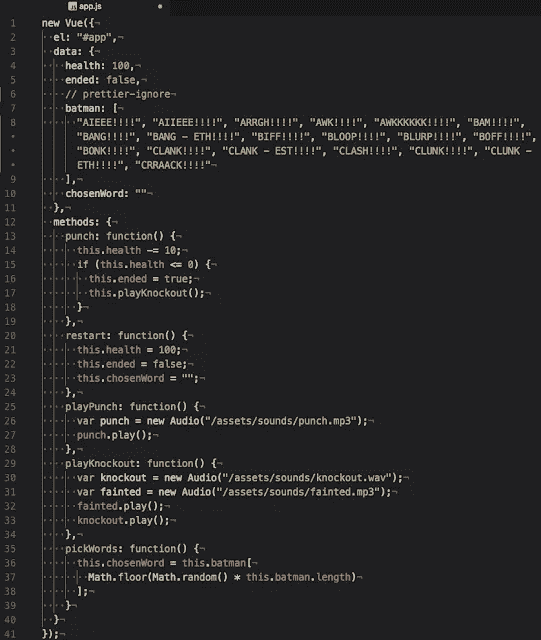

好的，这看起来有很多东西要消化。

数据散列包含我们的一些变量；

**“生命值**”——最初从 100 开始。

**“ended**”—这是一个布尔值，即真或假。

**“蝙蝠侠**”——我从这个[牛逼网站](https://www.fastcompany.com/3055253/every-batman-fight-scene-onomatopoeia-in-one-alphabetical-gif)上获得的 60 年代蝙蝠侠系列中的一系列搞笑词汇，上面列出了所有这些词汇。这份名单可长了！

**“选择单词**”开始是空白的，这就是被选择的单词。

包含我们的函数的方法部分；

**“play punch，play knockout”**—这些家伙加载我们的声音文件并播放它们。

**“出拳**”——从我们的生命值变量中扣除 10，查看下面的生命值是否为 1。如果是，则将 ended 设置为 true。然后运行播放击倒功能，播放晕倒和击倒的声音。

**“重启**”——这将健康变量设置回 100，并使结束变量再次为假。然后，它将 chosenWord 变量重置为空。

**"pickWords"** —在 0 和数组长度之间选择一个随机数，获取该元素单词，然后将其应用于 chosenWord 变量。

唷！还和我在一起吗？让我们继续…

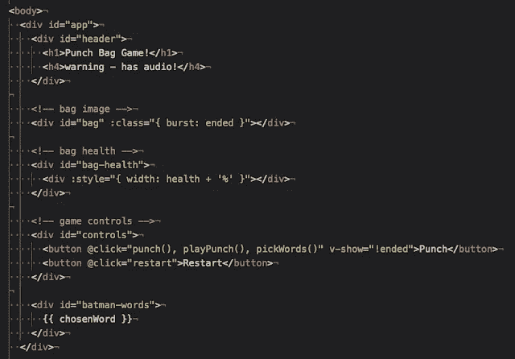

好了，html 页面如上所述被分割了。有一些非常酷的 Vue 变量和事件语法的东西要检查！

*   我们的数据散列中的变量可以通过使用{[变量密钥对名称]}来引用。Vue 会在散列中查找并找到那个名字。
*   您可以使用{ {[密钥对名称]}}输出变量的内容。例如，这里我们可以输出类似于

    {{ health }}

    的健康值，它将输出 100。EZ！
*   “:”是“v-bind”的缩写，它将网站属性绑定到变量输出。
*   DOM 事件被简化为@符号，所以注意设置@click 事件是多么容易。

**Bag Image** —这一行表示如果 ended = true，则将突发类添加到该标签中。

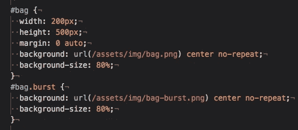

在我们的 CSS 文件中，我们有一个属性，其中#bag.burst 将显示与#bag 不同的图片。所以当 ended 变量变成 true，画面就变了。

**包健康**——这里我们用另一点 CSS 魔法来创建一个动态的生活吧；

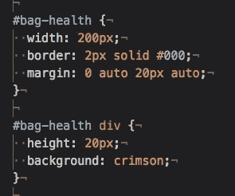

这里#bag-health 是我们的黑边，#bag-heath div 是我们的红色生活吧。这个生命条与生命值变量相关联，它的宽度属性随着生命值的多少而变化。

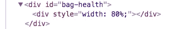

游戏控制——这是一个事件处理程序有多简单的例子。@click，即按钮被单击时，运行方法散列中命名的那些函数。

按钮打孔-运行打孔、播放打孔和选择单词的方法。

按钮重启—运行方法重启。

有趣的是，你通常不需要()括号来调用函数，因为 Vue 只会寻找名字。但是我遇到的一个难题是在一次点击事件中运行多个功能，因此我认为它可能需要这些功能。但我不能百分百确定。

**蝙蝠侠单词** —这是随机选择的蝙蝠侠单词的输出。注意它的语法有多简单；{{ chosenWord }}输出该变量！

这就是你要的，一个简单的应用程序让你(或我)开始行动。有趣的是，现在 html 页面上有了更多的逻辑，这似乎是技术发展的方向…

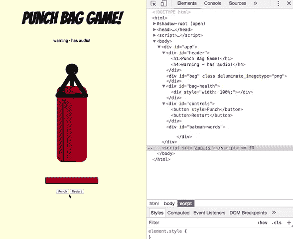

You can see how dynamically the code changes elements on the page

我的全回购是[在这里](https://github.com/puyanwei/punchbag-game)，看看享受吧！这周我会做更多 Vue-y 风格的事情，看起来很有潜力！祝一周愉快！

* *更新！我设法把它上传到 heroku [这里](https://punching-bag.herokuapp.com/)。