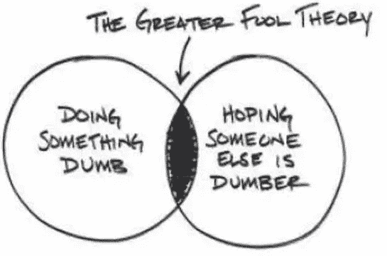
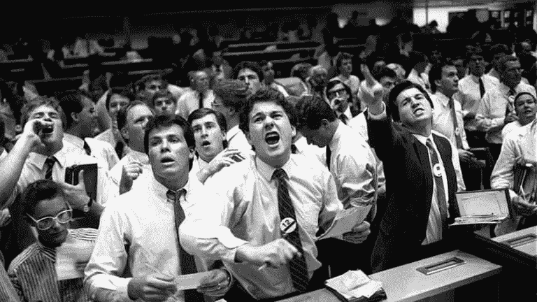

# 一个充满盲目过剩的世界

> 原文：<https://medium.com/hackernoon/a-world-full-of-blind-excess-b7fb42357d43>

## 全球经济和社会基础设施的 50 个迹象💩💩💩

Me…too often..

我开始写这篇文章时，那个自命不凡的猴子(凯莉·詹娜)正被誉为最年轻的女性“白手起家”的亿万富翁。当我看到一篇关于特朗普与女王会面“迟到”的新闻报道时，我又补充了一些🤦🏽‍♂️🤦🏽‍♂️

我现在要把它写完，因为…嗯…因为这种东西就是需要说出来…就像我的一个朋友说的；我显然是一个专业的“喊云者”…

严肃地说，这是一篇值得每个人阅读的重要文章。世界上有很多疯狂的事情在发生，其中大多数都远远超出了正常水平。

在缺乏真正问题的情况下，我们作为一个社会已经开始集体构建本质上更抽象的问题，并开始将愚蠢推向新的水平。

这种过度行为发生在信贷周期的顶峰，也就是“真实”和“虚假”之间的差异达到顶峰的时候，这并不奇怪。

注意:当短期和长期周期都达到峰值时，这种情况会更加明显，这就是现在正在发生的情况。想了解更多信息，请阅读/观看一些雷伊·达里奥的作品。

# 警告…它们很有用

这篇文章将是一个两部分的警告，因为这种盲目的过度只会导致一件事:*回归均值。*

和所有的反转一样，偏向一边的幅度越大，在回归均值的过程中就越大。

第一部分列出了盲目过度的早期迹象，其中肯定还有无数个。

我已经尽可能多地引用了它们，其余的要么是不言而喻的，要么来自我个人的观察。

我的意图不是让人们沮丧，也不是说世界即将结束或者一切都没有希望了。

换句话说，我在这里的意图是帮助普通读者从催眠状态中醒来，看到他们最近已经习惯的东西之外的东西；*给你们中的一些人一些理智，而那些少数人可能反过来能够给更多的人一些理智——*希望我们能够集体地从这个高度开始下来，开始工作&担心那些实际上**有意义的狗屎**。

# 50 个标志

我会尽可能将这些内容归类，例如:

*   社会/结构因素
*   市场/经济信号
*   无意义的职业
*   政治疯狂/妄想

***前帧/免责声明:***

我要烤一大堆东西🔥🔥🍗🍗。尽量不要太生气。这些都是粗略的概括&我很清楚这不是“每个人”的事实。我指的是他们慢慢变成的规范。开始了…(我真的是在听白蛇:我在写的时候又开始了…哈哈)

# **社会扭曲**

嗯…如果我们要从任何地方开始，让我们从这里开始。

1.  每个人都是“影响者”。

成为“影响者”现在实际上是一种职业。虽然从“权威”的角度来看这是有道理的，但我质疑任何一个拥有相机的人&十分之一的大脑可以以某种方式“影响”一群人的想法。这通常表明受影响者的认知能力只有他们所追随的黑猩猩的一小部分..

**2。宠物的崛起**

宠物已经成为一种身份的象征...而不是宠物。我喜欢动物，但是宠物旅馆、时尚品牌、instagram 页面已经把它变成了毫无意义的过度的象征。

**3。“奢侈”宠物食品**

很明显，这是上述情况的延伸——但这无疑是我们处于周期晚期的一个迹象。

有些企业为狗制作羊奶拿铁🤦🏽‍♂️

*我们这一代的 Pets.com…*

 [## 宠物食品的人工化即将完成

### 牛肉干、饼干、奶酪配料——动物的食物从罐子里出来，进入了恐怖谷。简洁地捕捉…

www.theatlantic.com](https://www.theatlantic.com/family/archive/2018/10/pet-food-organic-gmo/574060/) 

**4。凯莉·詹娜被贴上“白手起家”的亿万富翁的标签。**

让我们暂时把“自制”的部分放在一边…凯莉·詹娜几乎值十亿美元？

我没看错吧？

我的意思是——我不想在这里听起来像一些社会主义/共产主义的仇恨者，但当世界上杰出的企业家、教师、工程师、艺术家和无数其他人一生挣的钱比她每周挣的还少时，这个世界和我们相应地分配资本的能力肯定有问题。

我可以理解埃隆·马斯克或贝佐斯身家数十亿；这些人是人类进步和更美好世界的催化剂。

凯莉做了……嗯……

**5。有一个筹款 1 亿美元的 Gofund me 活动，这样她就能达到 10 亿美元？！？！？！**

雪上加霜的是，有人真的给这场运动捐款..

wtaf。

不确定我们能得到比这更荒谬的，但是让我们看看…

**6。新闻业吗？**

真正客观的新闻报道怎么了？博客作者是记者&记者是博客作者。说真的。你再也看不出区别了。

写博客很好(我就是这么做的)，但是媒体已经被固执己见的农民淹没了，他们几乎不能把一句话串在一起，他们一生中除了一堆毫无意义的 wordpress 博客之外，从来没有制作过任何东西。

**7。新闻？没有。**

每次我在 iPhone 上看新闻时，“热门故事”都是垃圾名人/真人秀类型的出版物，告诉你关于“单身汉”的事情，或者对特朗普的另一次咆哮。都是废话。它不再相关或重要&它不再是新闻了。

8。无意义的出版物

像《妈妈咪呀》之所以变得超级受欢迎，并不是因为有时会出现在那里的一些好文章，而是因为他们写的大量垃圾。

人们没有讨论我们在当今世界面临的真正问题，而是在争论某个疯狂的名人在洛杰或奥斯卡上穿的是什么衣服。

**9。皇家婚礼。**

哈里和梅根看起来很酷，这一次我们家有了一对真正的夫妇，但让我休息一下——6 篇热门新闻文章中有 4 篇是关于他们的穿着，或者他们的飞机不得不比计划提前或推迟降落。人们真的会读这种垃圾吗？

**10。HayU**

一个点播真人秀的订阅服务…实际上是存在的。🤦🏽‍♂️

但是等等…还有更多…

**11。“炫富”挑战。**

在中国，社交媒体上流传着一件事，人们(白痴)假装从车里掉出来，奢侈品散落一地:

 [## 中国的“炫富”挑战随着人们带着奢侈品从汽车上摔下来而迅速传播开来

### 发布于 2018 年 10 月 23 日 15:33:46 人面朝下躺在地上的照片——周围都是奢侈品包包、鞋子，还有…

www.abc.net.au](https://www.abc.net.au/news/2018-10-23/chinas-flaunt-your-wealth-challenge-goes-viral/10404202) 

这狗屎拿蛋糕。

前几周我在墨尔本，路过朗廷酒店。他们实际上是在拍一些亚洲女士在地板上打滚的照片。大概花了 20 分钟。这是我见过的最尴尬、可笑、自恋和尴尬的事情之一…

回顾所有这一切，我不知道哑巴的桂冠是属于从车里摔出来的亚洲人，还是属于给凯莉·詹娜的 Go Fund Me 运动捐款的人……但在下一次姗姗来迟的经济和社会衰退中，看着这些白痴将很大一部分财富输给那些有头脑的人，会令人感到奇怪的满足。

# 市场&经济

这是我最喜欢的话题之一，也是我认为最重要的话题之一。

正如我之前所做的，有人可能会说，这种 PC 和社会的疯狂很大程度上是过度加剧的信贷周期的结果，这种信贷周期在现实和虚假的“财富效应”之间产生了巨大的扭曲，然后表现为社会的外壳；没有深度或意义的表面现象..

市场是人类(或人类心理学)夸大事物的一个不可思议的例子，也是更广阔世界实际运作的一个精彩的微观表现；人群的疯狂，Benoit Mandelbroit 的分形几何完美地表现了自然的不规则性。

那么…我们能从中学到什么呢？

过度的标志是什么？

**12。风险投资已经疯了。**

滑板车公司正在融资 8000 万美元。

滑板车。真的吗？还需要我多说吗？

有如此多的钱追逐如此少的优秀创意，以至于我们现在向滑板车公司投入了数亿美元。如果这不是我们这一代人的网络泡沫，那么我不知道什么是。

13。人人都是“基金经理”。

每天都有新的“基金”冒出来。那些从未涉足市场的人，他们没有任何数学背景，没有任何宏观理解，对人群、风险、波动性和经济学的复杂性没有任何概念——他们在管理“基金”。

90%的回报是庞氏骗局般的账面收益。

我会让[查马斯·帕里哈皮蒂亚](https://medium.com/u/dbfc705250be?source=post_page-----b7fb42357d43--------------------------------)来谈这件事，因为他是最精明的家伙之一。

If you’re short on time, start from 25min in. No bullshit here.

**14。为了高而高**

股票市场呈抛物线状，不是因为我们在全球范围内经历了某种前所未有的生产复兴，而是因为有如此多的廉价、过剩的信贷。金钱必须流向某个地方，任何地方。

**15。廉价信贷**

在过去的 6-8 年里，钱是如此的便宜，以至于它被扔向任何东西&任何寻求回报、收益或无意义收益的东西。太可笑了。

**16。没有廉价资产**

正如霍华德·马克斯(Howard Marks)所言——“任何市场都不再有便宜或价格合理的东西了”。

所有理性的估价或解释都已过时，取而代之的是更大傻瓜理论。

这种情况只能持续这么久…直到傻瓜们用完了…或者没钱了——在这种情况下，很可能两者都有。

Thanks to [Rory Highside](https://medium.com/u/a888b3c7d0b5?source=post_page-----b7fb42357d43--------------------------------) for this one.

**17。购物化**

像 Shopify 这样的公司在不到 3 年的时间里从 18 美元涨到了 166 美元(人们认为比特币是一个泡沫)，这都是因为每个汤姆、迪克和哈利都在网上卖衣服，认为他们会成为下一个洛娜·简。

18。折叠 AUD

澳元正在崩溃。在过去的几个月里下跌了超过 12%。澳元是一种“风险”货币，通常会随着全球经济增长而走强。

如果这不是明显的分歧，我不知道什么是。

AUD / USD…daily…falling…adios…

**19。澳大利亚第 22 条军规&澳元**

随着全球经济增长见顶，我们的“救星”中国深陷的困境开始显露出来，我们澳大利亚人发现我们的货币+经济陷入了一个第 22 条军规:

*   保持利率稳定(或更低)，看着我们已经崩溃的货币继续螺旋式下降，导致我们过高的外债(以美元计价)让我们破产，或者；
*   提高利率，看着我们的房地产市场崩溃，并把经济带走，房地产市场是我们虚假 GDP 的重要组成部分。

我们大吃大喝，现在…啊哦…

我将在下一篇文章中更多地关注这一点。

20。债务占国内生产总值的比例

我们又回到了创纪录的债务与 GDP 比率。人们几乎无法偿还债务，更不用说吃饭了，我们都生活在信贷中，工资没有上涨，因为企业负担不起，每个人的财富都被绑在他们在泡沫中的“虚拟股权”上，如股票和房地产..

金鱼综合症是真的…

**21。美国家庭债务回到创纪录水平**

虽然 2008 年后有一段紧缩时期，但我们的猴脑记忆肯定是短暂的。

抵押贷款债务、信用卡债务、学生贷款债务和汽车贷款债务都再次达到创纪录水平。还在成长

**22。重新打包的债务:*从 CDO 到克洛斯。***

我们已经完全忘记了当初是什么让我们陷入 2008 年金融危机的。

上次我们有 CDO 和激光唱片。这主要是住房和次级债务被打包再打包成高收益工具，卖给各地的投资者。

这一次我们走得更近了。公司债券(债务)被打包再打包成高收益工具，然后卖给各地的投资者。

23。企业回购

2008 年是房地产和零售信贷狂潮的结果，是由银行和愚蠢的“房地产投资者”带来的，他们贪婪地获取廉价资金(感觉到这里的主题了吗？)

这一次，获得低息贷款的是企业——他们真的知道如何消费。

他们没有投资未来，也没有关注生产力，他们只是用债务回购自己的股票。！！

**24。金融工程 2.0**

至少有三分之一的公司股票回购是通过债务融资的。债务！！

发行公司债券，购买股票，推高价格&从而将股权转化为债务。金融工程 2.0。🤦🏽‍♂️

**25。ETF 的崛起**

在过去，大多数公司贷款是由银行发放和持有的，而公司债券则由养老基金、保险公司和共同基金持有至到期，从而保持债券价格稳定。

今天，我们有了一种新的投资类别，允许零售市场参与他们不懂的狗屎: ***债券 ETF！***

十年前，这些交易所交易基金的交易价值约为 150 亿美元。今天，这个市场已经增长到 3000 亿美元。

26。先买后付的计划正在刺激零售销售..

AfterPay 就是一个很好的例子。

他们的股票在停滞不前的环境中直线下跌，到现在零售额下降。

人们都跑出去买他们 ***买不起*** 的狗屎，这只会导致它自己的泡沫。

这个 facebook 页面是我所说的过度行为的一个典型例子:

 [## 离职后困扰

### 离职后困扰。30K 喜欢。Afterpay 痴迷是所有 Afterpay 事物的圣杯

www.facebook.com](https://www.facebook.com/afterpayobsession/) 

**26。**优步池

这不是一件坏事，这对环境很好，而且这是对资源的更好利用——但在过去几个月与悉尼的一些人交谈后，这是他们能够负担得起继续使用优步的唯一方式。

这只是一个有趣的(轶事)迹象…

## **澳洲房产**

这个主题真的应该有自己的一整节，但是为了简洁起见，我将把它留到下一篇文章中。以下是一些有趣的统计数据:

**27。LVR**

澳大利亚目前 30%的贷款 LVR 超过 80%——这只是我们所知道的。

28。大 4……

撇开皇家佣金不谈，澳大利亚四大银行之间的抵押贷款组合超过 1.5 万亿美元，其中超过三分之一是给投资者的！

**29。伯伍德**

一个 40 年的老，3 bdrm 地面层公寓，在💩-hole Burwood(内悉尼)，周六下午 5 点开车 45 分钟 1.2 公里(T11)，费用超过 130 万美元。

**三十。'不劳而获'，免费信用**

在 2018 年的一项调查中，五分之一的澳大利亚房主估计，自购买以来，他们的房子已经增值高达 30 万美元，20%的人估计增值高达 70 万美元，而 6%的人认为他们的收益在惊人的 90 万美元以上。

澳大利亚的大部分“百万富翁”除了买房子什么也没做。智力如何？🤔🤔🤔

*可怕的困境即将来临……很多人将会陷入可怕的困境！*

# 无意义的职业

这一条可能会伤害/惹恼一些人。嗯…可能不止几个人。但是谁知道呢，你们中的一些人可能会选择反思这些陈述的内在真理，并实际上做一些事情来改变它/使它变得更好，而不是成为受害者。

***无知不是福。***

## **房地产**

31。在澳大利亚，每个人都是“房地产经纪人”..

…他们认为这实际上是一种职业

32。收益

房地产经纪人比工程师和软件开发商挣得多

33。20 年老房产“投资者”

媒体不再以企业家创造价值、提高生产率和对世界产生影响为特色，而是以 20 多岁的“房地产投资者”为特色，他们被杠杆推高到离破产仅 25 个基点的水平。

**三十四。【开发商】**

认为自己“非常聪明”的房地产经纪人是房地产开发商。那些傻瓜认为他们赚钱的原因是因为他们聪明…而不是因为我们正处于经济信贷周期的顶峰。

**35。房产色情**

房产色情“翻新”节目像街区一样继续猖獗。

## **启动启动**

**35。每个人都在开始一个“创业”。**

像所有人一样。为什么？我不知道。也许我们需要另一个踏板车公司，或者一个宠物优步…在区块链…

**36。企业家的谎言**

人们认为成为一名“企业家”很性感，“任何人”都可以做，每个人都“应该”做。这三种说法都与事实相去甚远

 [## 一个鲨鱼坦克辍学者的自白

### 人们认为成为一名企业家就是为了华而不实，在 Instagram 上发布关于“招摇撞骗”的垃圾。他们…

www.news.com.au](https://www.news.com.au/technology/innovation/confessions-of-a-shark-tank-dropout-the-startup-world-is-full-of-wantrepreneurs/news-story/7939cfba0bc6d48b2a36b8a27ee0915c) 

37。合作空间的兴起

它们到处涌现，成为企业实际运作的唯一可行方式。嗯……你好——这难道不表明我们的系统存在一些根本性的缺陷吗？？？

**38。共同工作空间的衰落**

这些合作空间都要破产了。他们满脑子都是狗屁创业公司，连一张桌子的租金都付不起，因为那些想要经营这些公司的人有一些不切实际的想法，想在明天赚到 10 亿美元，他们忙于在周五晚上或在 snapchat & instagram 上成为社交名流，试图成为有影响力的人，而不是实际做一些工作。

**39。投资者**

每个人都是“投资者”，但他们几乎不知道股票和股票的区别。无论是股票、外汇、差价合约、交易所交易基金、房地产还是密码，我们现在都是“专家”，因为我们在牛市中赚了钱。

现实恰恰相反。一个所有人的财富都来自“投资”的经济体，如果没有真正的生产力，那将是一场灾难。

**四十。职业全职“交易员”**

“我是一个交易者”现在通常意味着我失业了，我通过观看 YouTube 视频自学交易。我在牛市中赚了一些钱，但有趣的是，如果我做多一个指数，我会赚更多的钱。”

这种过度是信贷周期见顶的另一个迹象。

大多数交易员、房地产经纪人、私人教练、房地产投资者、招聘人员都是一样的。缺乏技能，在他们不了解的经济周期中寻找快速赚钱的方法。当信贷周期开始去杠杆化时，那些将自己的“技能水平”与现实混为一谈的人将受到最大的伤害。

**41。秘密交易者的崛起**

我爱比特币。作为一个想法，一个概念，一个自我主权的无记名资产，一个对冲我在这篇文章中描述的疯狂过度的工具，一个新生的资产类别，代表健全的货币。

但是我想我从来没见过这么多傻逼冲向一个行业…从来没有。我们似乎吸引了(好的)混合:

*   自由的
*   杰出的工程师
*   有远见的技术专家
*   健全的货币经济学家

和(坏)

*   阴谋论者相信世界是由蜥蜴人和彼尔德伯格人统治的
*   通宵密码专家
*   隔夜“交易”和“技术分析”专家
*   扶手椅/键盘经济学家和基本面分析师
*   明目张胆的 ICO 骗子
*   愚蠢的 ICO /令牌发行者意外地欺骗了所有人
*   快速致富销售人员和营销人员寻找快速赚钱
*   庞氏骗局，比如 USI 理工和 Bitconneeeeeeeeeect。
*   邪教徒

我很抱歉，但是尽管有承诺，现在；以上就是现实。

I tried to sum it all up in one meme….

**42。【教练】**

这种情况已经持续了一段时间，虽然可能因为人们对销售策略麻木而有所减弱，但这仍然是一个充满江湖骗子、“生活教练”、快速致富的阴谋家和骗子的领域，像罗斯科·帕迪森这样的人。

我是说……泰·洛佩兹还在做生意，人们还在买他的货。

**43。咖啡馆/酒吧**

每个人都在开一家“新咖啡馆”，因为他们认为这很酷。他们几乎不知道，酒店业的繁荣通常发生在信贷周期的最后阶段，就在泡沫破裂之前。

**44。【机构】**

到处都有代理机构。甚至还有管理机构的机构。这一个磨我错误的方式，因为它是一个有点没有皮肤的游戏行业，旨在卖给你“喜欢”，“印象”和其他虚荣的指标。

45。服务

经营一家咖啡馆或中介机构，或者做一名招聘人员、房地产经纪人、经纪人或私人教练有什么共同点？

嗯，这都是基于服务的。这并不是一个很好的防守位置，也不是一个很高的进入壁垒。

现在……这些职业本身并没有什么错，但是因为它们给社会增加的价值很少，所以它们的保质期不会很长。他们正盯着史上最大的信贷危机，尤其是除了咖啡馆之外的所有地方；技术过时。

我希望那不会太刺耳。只是为了明确我的意图:

这绝对是对所有傲慢的自恋狂的一记猛击，这些自恋狂无意中绊倒并赚了一大笔钱，现在正跑来跑去谈论他们有多“聪明”。

这绝对不是对这些行业中许多优秀人士的侮辱，他们热爱他们所做的事情，做他们喜欢的事情，尽管我真的希望这能提醒他们更深入地思考他们所参与的事情——我祝他们一路顺风……

## 现在…最后 5 个..

# 政治疯狂、妄想和精神错乱

如果最后一部分还没有惹怒足够多的人，这一部分就应该解决了。

不过说真的。为什么政治是如此热门的话题？

我认为这与当今社会日益增长的自恋程度有关。人们已经忘记了客观意味着什么。没人往心里去，你什么都不能说！

*很有趣——当我写这篇文章的时候，我打开了我的经典音乐播放列表，它正在播放:*

fitting…people think everything is “about them”…including me…lol

## 一切都是关于“我也是”

现在每周都有新的政治正确的“运动”。你说什么都不会被贴上厌女者、性别歧视者、偏执者、不体贴者、种族主义者、恐怖分子或特朗普支持者的标签。人们真的需要更大的麻烦来担心。

让我们来看看一些猖獗的、过分追求政治正确的例子..发疯了:

**46。特朗普见女王明显迟到了 12 分钟**

为什么这甚至是新闻？

10 年前，我们会像“去他妈的女王，看她坐在高高的架子上…她可以等”。现在因为是川普，人都失去理智了。

 [## 唐纳德·特朗普和女王喝茶迟到了 12 分钟

### 美国总统唐纳德·特朗普周五首次会见了伊丽莎白女王，并在喝茶时相识。女王是…

全球新闻网](https://globalnews.ca/news/4331246/donald-trump-queen-tea-late/) 

**47。女权主义者对詹妮弗·劳伦斯和寒冷失去了理智**

一群观点无关紧要的白痴没有评论她的漂亮裙子，而是在互联网上掀起了一场风暴，他们说:

看看珍妮弗，她周围都是穿得暖暖的男演员。这太性别歧视了！

 [## 詹妮弗·劳伦斯称暴露着装的争议“完全荒谬”

### 一张詹妮弗·劳伦斯穿着暴露的黑色连衣裙的照片——被她裹得严严实实的男性包围着…

abcnews.go.com](https://abcnews.go.com/GMA/Style/jennifer-lawrence-calls-revealing-dress-cold-controversy-utterly/story?id=53250332) 

真的吗？

享受生活吧。去做一些真正的新闻，或者去为这个世界增加一些真正的价值。

Jen 功不可没，第二天她用:

“控制住人们，”她总结道。“你看到我穿的一切都是我的选择。如果我想变冷，那也是我的选择！”

**48。管道炸弹手**

这个怎么样？抛开阴谋论，让我们来剖析一下愚蠢&难以置信的公然偏见。

“首先，他是共和党人”。

啊？

这和鱼的价格有什么关系吗？！？！？！？！

我很确定希特勒是个基督徒。我没见过有人这样写文章。

斯大林或者其他社会主义左派怎么样？他们不是更像民主党人吗？？？

“哦……但是不……他们不像他们。他们是坏人，特朗普也是，因此共和党人也是——特朗普或共和党支持者也是”

这太虚伪了。

这种浅薄、不聪明、低能和短视的思想路线产生了像这篇文章和下面这篇愚蠢的文章这样的文学垃圾新闻——这只是另一个明显的迹象，表明人们已经没有任何有意义的东西可以讨论或报道了。

 [## 随机的恐怖和仇恨的循环将不稳定的美国人推向暴力

### 一名 50 岁的男子因与本周乔治·索罗斯的爆炸装置有关而在佛罗里达州被捕…

qz.com](https://qz.com/1436267/trump-stochastic-terror-and-the-hate-that-ends-in-violence/) 

更有理由认为回归正变得越来越迫在眉睫。

**49。美国派**

这个把它带到了一个新的高度。人们现在被电影“冒犯”了。哦，你真可怜。我们应该去删除一切潜在的攻击，这样我们才能让你感觉更好…

 [## 重新观看《美国派》的人被严重冒犯了

### 当《美国派》在 1999 年首次搬上大银幕时，它似乎引发了一种全新的电影类型，旨在…

vt.co](http://vt.co/entertainment/film-tv/people-re-watching-american-pie-getting-seriously-offended?utm_source=vt&utm_medium=junglecreations&utm_campaign=post&fbclid=IwAR3q_-LsFx9TXZUuCwRYiMoeLdV1rEXqMTu4OiGPnjxzTvqVjI7-twD1Crw) 

50。【咩咩羊】羊

当你认为事情不会变得更糟的时候…

他们改了一首童谣的名字…一首童谣！！！

What the actual fuck?

这个世界需要一些真正的问题。

我希望这不是第三次世界大战，或者一些疯狂的疫情，在那里我们都变成僵尸，因为他们可能有点“残忍”的规模，但我们绝对需要另一个 GFC 式的经济崩溃——一个将把一些谦卑带回生活过度的人的心灵的崩溃。

在目前的状态下，世界陷入了困境。

好像大家都嗨了。

人们更担心自己有多少朋友、喜欢的人和关注的人，而那些有影响力的人开始人为夸大这些数字，以获得额外剂量的多巴胺。

澳大利亚是一个不生产任何东西的废人。

这是一个充斥着投机倒把的中间人的经济，他们互相出售房屋、鳄梨和咖啡。

硅谷已经疯了，资助一切&一切——而所有像 Chamath & Thiel 这样的聪明人都离开了。

其他人似乎要么完全被这个世界冒犯了，要么对一切都完全麻木了，要么对整个经济体系是一个纸牌屋的事实视而不见或一无所知。

如果你想知道实际发生了什么，而你又不想阅读经济学或陷入太深的困境，那就去看《大空头》吧。

请仔细观看史蒂夫·卡雷尔扮演的角色去佛罗里达与房地产经纪人或脱衣舞娘交谈的场景，脱衣舞娘是一名拥有 5 处房产的“房产投资者”。或者当他们和那两个卖次级贷款的白痴说话时(让我想起了澳大利亚的房地产经纪人)。

一样的狗屎，只是时间不同。

让我有点疯狂&我没有专注于建立一家公司，或者放松，而是在周末写一些狗屎来给人们一些理智。

也许我实际上是个笨蛋…

嗯…🤔🤔🤔🤔

# 结束咆哮

该结束这一切了&去吃点东西吧..

虽然我知道我可能听起来很疲惫，或者好像我对这个世界有意见(我有点这样做)，而且我听起来过于悲观&不屑一顾，但我天生是个乐观主义者…

我经历过很多糟糕的事情，失去了一切，又重新开始了很多次——但我认为重新开始的能力和适应能力只能来自天生的乐观。

与此同时，一些生活经验以及对历史、人性、心理学和世界愚蠢状况的敏锐研究，将不再允许我像波莉-安娜那样戴着玫瑰色的眼镜看待事物。

因此我写了…希望能引发更深层次的思考。

几个最后的想法。

非理性可以比理性的人保持理智的时间更长，这是因为根据定义，它是非理性的，但在某个阶段，我们玩的音乐椅需要停止。

在短期周期中，同样的事情每十年发生一次，在长期周期中，每六到十年发生一次。这与世代更替有很大关系，新来的人不知道上次发生了什么。

除了绝对运动变得更大，影响变得更广之外，我们每次重复这个循环都没有太大的不同。

更广泛，因为作为一个社会&作为一个物种，我们比以往任何时候都更加相互联系和相互依赖。而且，我们肯定要柔软得多，更容易被任何事情“冒犯”。

这让我想知道…到了要付出代价的时候(一如既往)，有多少人会做好准备，又有多少人不知道是什么打击了他们，不得不在重新建立自己之前被击垮？

也许所有这些写作都是毫无意义的。正如纳西姆所描述的，也许解决非理性繁荣问题的唯一真正方法是让有机体衰竭，为新生事物让路。

大家周末快乐！

如果你喜欢这篇文章，请给它一点爱，为它鼓掌(或几下),并把它传给任何你认为应该读一读的人。

希望你得到一些价值和反馈总是受欢迎的！

**阿列克斯**

**首席执行官&联合创始人@ Amber Labs**

[www.getamber.io](http://www.getamber.io)

你可以在这里找到更多我的作品:

 [## 亚历山大·斯维茨基—中等

### 琥珀实验室的首席执行官+decentralizedpodcast.com.au 的共同主持人。比特币、金钱、哲学、商业、初创企业和企业家精神的出口

medium.com](/@AleksandarSvetski)  [## 亚历山大·斯维茨基——黑客正午

### 阅读《黑客正午》中亚历山大·斯维特斯基的文章。CEO @ www.getamber.io + Co 主持人@decentralizedpodcast.com.au…

hackernoon.com](https://hackernoon.com/@AleksandarSvetski) 

您可以在这里联系我:

 [## 亚历山大·斯维特斯基|职业简介| LinkedIn

### 查看 Aleksandar Svetski 在 LinkedIn 上的职业简介。LinkedIn 是世界上最大的商业网络，帮助…

www.linkedin.com](https://www.linkedin.com/in/alekssvetski/)  [## 亚历山大·斯维茨基(@亚历山大·斯维茨基)|推特

### Aleksandar Svetski 的最新推文(@AleksSvetski)。对金钱、BTC、人类学感兴趣的无毛黑猩猩…

twitter.com](https://twitter.com/AleksSvetski) 

# 承认

我要感谢那些帮助我形成一些观点的不可思议的人，我钦佩他们的智慧、才智、激情、雄心和对世界的贡献:

[纳西姆·尼古拉斯·塔勒布](https://medium.com/u/f138bf5466fe?source=post_page-----b7fb42357d43--------------------------------)

Chamath Palihapitiya

[乔丹·皮特森](https://medium.com/u/34ee41238d1e?source=post_page-----b7fb42357d43--------------------------------)

[雷伊·达里奥](https://medium.com/u/a29615f64d53?source=post_page-----b7fb42357d43--------------------------------)

埃里克·温斯坦

彼得·泰尔

[赛菲迪安·阿摩斯](https://medium.com/u/becf6824fd89?source=post_page-----b7fb42357d43--------------------------------)

[海军 Ravikant](https://medium.com/u/67f5049293c7?source=post_page-----b7fb42357d43--------------------------------)

还有很多…但是我已经说完了。

# **免责声明:**

为了避免遭到政治迫害，我会用几件事来缓和我所写的东西:

1.  我上面的评论是粗略的概括。对于那些不知道这是什么意思的人来说，这意味着我不是在用同一把刷子给每个人刷油漆。我承认在我上面提到的每一个领域都有杰出的个人，例如:新闻、物业、PT、招聘、交易、影响者等。
2.  虽然我可能听起来贬低，或悲观的事情；我真的没有。我对未来持乐观态度，我对一小部分杰出的人抵消了大部分愚蠢的人持乐观态度，我真诚地相信我们需要听到那些感觉/听起来刺耳的事情。这是我们醒来时需要的难吃的药。
3.  这不是什么“比你更神圣”的文章。我已经经历了太多的失败。我很清楚这样一个事实，那就是我是个笨蛋，既没有经历过房地产泡沫，也没有经历过股票泡沫，也没有经历过大部分的加密泡沫(我有机会做一个大的 ICO，但我没有)。但那是我，我不介意！我天生是个反向投资者——我错的次数比我对的次数多，但是当我 ***是*** 对的时候，我在很大程度上是对的。
4.  Afterpay 是一个伟大的成功故事。它由一个优秀的团队运营，他们的执行完美无瑕。我不认为其他人能像他们一样做得这么好。但是……事实是，他们能够利用的机会并不是因为一些重大的技术突破或者生产力的提高。这是 T21 盲目过度的结果。这是直言不讳的事实，我现在不想成为一名离职后股东。
5.  我并不是说世界明天就会分崩离析——那是不会发生的，即使真的遇到了麻烦，我们仍然会找到一条出路——但我相信这是一组需要意识到的重要数据，并可能开始为此做准备。

# **3 个奖励统计**

我已经 50 岁了，但是这也是很棒的数据点，51 和 52，感谢石英的团队。

**51。世界上最大的购物日变得更加盛大。**

今年的光棍节，一个十年前由阿里巴巴[创立的零售节日](http://email-tracking.qz.com/wf/click?upn=pu9n0ps8hGF44zTMfA2zQUN66QedN8agAC2rcer2s-2FPIbq-2BNv8-2FBp09IY9T-2BhW8dbQUsX3AJ3RAXbX-2FfM5ln3CVwCp-2FeFDUwAVx6l2MDVv2GChgPQxe4M0WqQYVRGclkYixdDWQ0hPlAKkMHrnwrjw-3D-3D_DzQ4r-2BRSF0PsQACCWAKt1cZk6E3BoPsnF72Uo4HnFXT9y0hwsuBX8tV9hJ0-2BmaIG2HeMHTBn4O1R-2B-2BE5rjMm6R99p-2Fzim-2BORYO5-2B1dawjpyVH-2Bm-2BYZWze0x6BpP3GYTHAnq9r-2BOTwyzZoFBANL-2B4CcL5vgtvVvli45jCJc4iF8jD8C2py2Rc4k42ERe0psxlQta5oechTeObTv4nLwwzUi-2FKYBeevSoBLnCRC010-2BgToyy7qbxOpj35-2BL9ZxqPtWgHouNeW5zo-2FgUR9XTbUUr0GNR-2FwWKcGif6x-2FEOeAJBAnrnAVMgl4sGUQNL3Cm937Pjy1K2TczvfYod9c-2BTYmR7ntcrP2FUTtSheJYIdtKhpB0EsE6l8pcOEEv0W8DpRwWNCddvcXYufWpbafg-2B8N-2Bh8fq8iUWPd1Sk89J0bmPYKMypRL0lMPHxybBJzi-2FeRB5o2DyL2eXYucrCxEWc-2BmdszAgdqiBAsDWbkzpICGEPKu75EAiFP2Rj1KAGDai8rhMqH5bHbFhaTxPdd8QchGXQ-3D-3D)，带来了创纪录的 307 亿美元销售额。但势头正在放缓:27%的增幅是该赛事历史上最低的同比增幅。

**52。布兰克费恩离开高盛**

金融危机十年后，银行获得了创纪录的收益。当劳埃德·布兰克费恩[几个月后卸任高盛首席执行官](http://email-tracking.qz.com/wf/click?upn=pu9n0ps8hGF44zTMfA2zQdqa39NyfR9hIcIzZmioQVWavUbqbPGN3kMCwCYLVOq9QsIx7ET1eMhkpE-2BkcEkDCtfuntWTkA3rQzn4-2F8LXJqmF6CjpiIP7fUoUO0tYoVHKMuqa-2B-2BEZiXxGj9Q60r1a2QZ2rG1zj97hhNz-2FO-2Fz0NuQ-3D_DzQ4r-2BRSF0PsQACCWAKt1cZk6E3BoPsnF72Uo4HnFXT9y0hwsuBX8tV9hJ0-2BmaIG2HeMHTBn4O1R-2B-2BE5rjMm6R99p-2Fzim-2BORYO5-2B1dawjpw48QT6XuhHlrK-2BbNduy2e-2Fm7BXdomSAYqENxrc3-2FKO9m8fZW7m6sHIOxqcDaTA3EKfuZzXkCt51NpfkvoHYa5Ly669w-2F7-2FKkhf-2F9eeAimrscKi3ezLC-2FVpPkMo35drzyzvZvGcCxn0Ywth1KAzxenzwuDrCj5ixHjMa4jJdqtT9DxiY1ZvFZlNpDSeTHX3OxTIwafWNO0gi6SyHJ6xBW2JuK12bj4UI7REr5z2xu8Un18fVOzuksoEiiK7CnKfZxQI5cDVTBusK3HI79IoTc3Uodysclod0Nl32DvrXkpDCyKqt-2FiHH75K2ioWkHp2m6-2FQ9r-2Fd8HyAMFbX6vj6EImuiIZGuEiuknCYjokJabWPNS-2FllsAaCzYmy90SSPWE1Bx-2BXQcqjJ9Dzp1jOelGPiI2eso8b-2Fr8UM-2BSP2kWXfuwWcaQLVo4w7XyGd9HQH0isU4-3D)时，他将在整个行业的高调中离开美国最强大的银行之一。华尔街的生活很美好。

当布兰克费恩在担任首席执行官 12 年后宣布离职时，该公司公布第二季度利润飙升 44%。虽然他不应该得到所有的荣誉，但值得注意的是，在布兰克费恩的领导下，该银行已经累计创造了 920 亿美元的净利润，布兰克费恩是[一名邮局职员](http://email-tracking.qz.com/wf/click?upn=dZYh2-2Fp0L4PD34B3OSCzjEO5PWF1llLwIjSJ-2FPU57APqGqd-2BJdUT-2B310lcqIemmRs4PwMnA5fjyusKTJ-2BiWOzg-3D-3D_DzQ4r-2BRSF0PsQACCWAKt1cZk6E3BoPsnF72Uo4HnFXT9y0hwsuBX8tV9hJ0-2BmaIG2HeMHTBn4O1R-2B-2BE5rjMm6R99p-2Fzim-2BORYO5-2B1dawjpw48QT6XuhHlrK-2BbNduy2e-2Fm7BXdomSAYqENxrc3-2FKO9m8fZW7m6sHIOxqcDaTA3EKfuZzXkCt51NpfkvoHYa5Ly669w-2F7-2FKkhf-2F9eeAimrscKi3ezLC-2FVpPkMo35drzyzvZvGcCxn0Ywth1KAzxenzwuDrCj5ixHjMa4jJdqtT9DxiY1ZvFZlNpDSeTHX3OxTg4WNPmZ7Wqf3-2F22SHLfiuyQ4fzIChsQN0zq1QWEMKZr5CGD95zisoUEZ-2BJg97SwHvKMOBbxcSlsdXdZg2Kgq54qmYakJ-2FtkWsZRUw8lhnHvETvrueZ0FGnd85TBGKhVLsG6-2FOQTRm2YejTSHxOUWUyO657eUswbu9K6HNpS2OzsjdwblBbsbgSUicEn1OZkEHQ-2B62VrQ5TqMJUHdDgHhyQ0shrSLBtCP728q5gBR7dRl9E1VX88PYolHBSIaYr8U-3D)的儿子。

“当日子更艰难的时候，你不能离开。而且，当形势好转时，你不会想离开，”布兰克费恩他在给员工的[告别备忘录](http://email-tracking.qz.com/wf/click?upn=4iVk97hDapR-2Ba0NZf5ODutP7Pik-2BY1zflxogwrZuTOQMLhH3RpzqFdwhwbAB41re6dS1bKOtlqSMtwaiRCAGVKivNy7q4KiQT-2F44DgJ6-2Fsyv4-2FXCvAIPRzrxmNxDx1i9-2BIDomfzVCJw3jgv5t6d6FQBjpfuiS06aKIH7QZiGxCg-3D_DzQ4r-2BRSF0PsQACCWAKt1cZk6E3BoPsnF72Uo4HnFXT9y0hwsuBX8tV9hJ0-2BmaIG2HeMHTBn4O1R-2B-2BE5rjMm6R99p-2Fzim-2BORYO5-2B1dawjpw48QT6XuhHlrK-2BbNduy2e-2Fm7BXdomSAYqENxrc3-2FKO9m8fZW7m6sHIOxqcDaTA3EKfuZzXkCt51NpfkvoHYa5Ly669w-2F7-2FKkhf-2F9eeAimrscKi3ezLC-2FVpPkMo35drzyzvZvGcCxn0Ywth1KAzxenzwuDrCj5ixHjMa4jJdqtT9DxiY1ZvFZlNpDSeTHX3OxRxeXYaPf4OdBTn9VI1If3OjqShzAsR0jI3-2BQ4qr6sVIj6W-2FTiEt5TmakVv7cFw6N83fWfLiK3fJPkZ7YjJUsWrdtAo-2B0bGZl9VHKGWhejhFwSNYXqAbpQgaemlR2Jf8AEugzo0OBdYC0P-2FFDLGn7biFyi4dfFF5Qf1OVeRX3XlukzEiD8SDo6IYGsVGHt4Qyp8i1BHSQVBmaA6C4gpT5NgvfHhW36Iko5LFUCcHXjAVUdhulHl7PJFlVjQ58kdWj4-3D)中说道。尽管如此，他写道，“感觉是时候了。”

**53。只在顶端的宝贝**

 [## 世界上最贵的鞋子以 2360 万美元拍卖

### 它们由真金制成，并镶有数百颗钻石。

www.smh.com.au](https://www.smh.com.au/lifestyle/fashion/world-s-most-expensive-shoes-go-on-sale-for-23-6-million-20180928-p506ki.html)