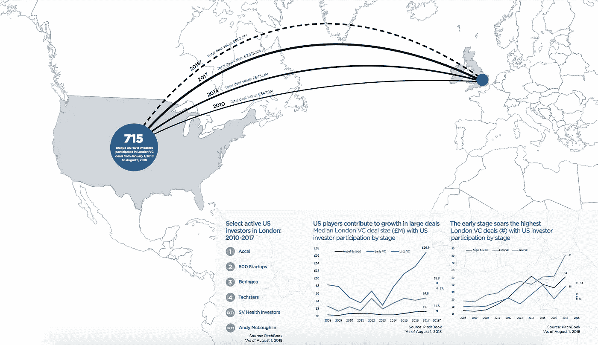

# 分享 dealflow 的一年(以及一点点)

> 原文：<https://medium.com/hackernoon/a-year-and-a-bit-of-sharing-dealflow-1facaf891bc7>

## TL；博士:44 家公司。474 个介绍。到目前为止，我在 6 家公司投资了 100 多万美元(据我所知)。

一年多以前，我开始和大约 35 个朋友分享 [dealflow](https://hackernoon.com/tagged/dealflow) 。灵感非常简单。我在美国和亚洲认识的许多投资者都想了解欧洲和世界各地有趣的公司——尤其是在种子前期、种子期和首轮融资阶段。我还受到了[安东尼](https://twitter.com/APompliano/status/821890538525835264)所做的事情，以及查理和萨曼莎[为纽约社区所做的事情](https://twitter.com/APompliano/status/821890538525835264)的启发，我想做更多的事情来为聪明的投资者和伟大的公司牵线搭桥。

到目前为止，这个想法还算成功。大约每个月，我都会发一封电子邮件，提供四到八家公司的信息。如果投资者对一家公司感兴趣，他们会让我知道，我会做介绍。我审查名单上的每个人，以确保他们是被认可的天使或来自一个基金。

最初的 35 名投资者已经增加到 500 多名，他们每个月都会收到电子邮件，而且还在不断增加。你可以在这里[报名](https://goo.gl/forms/7WqieIyyKgXfavu32)。这个群体来自美国、欧洲、亚洲、中东、拉美、澳大利亚以及更远的地方。我推荐的 44 家公司来自世界各地——美国、英国、爱沙尼亚、芬兰、乌克兰、葡萄牙、爱尔兰、日本、韩国、阿联酋和其他许多国家。

最令人兴奋的领域(基于介绍请求的数量)是食品、人工智能/人工智能、计算机视觉和增强现实(今天早些时候[尝试了](https://twitter.com/eamonncarey/status/1044593095298494464)Magic Leap，我知道为什么)。可能对 B2C 有一点点偏见，尽管这可能是我的偏见。

至少有六家公司已经募集了邮件的剩余部分。这些融资从规模较小的 5 万美元门票到即将宣布的 A 轮 50 万美元投资不等。我个人投资了其中两家公司，有时会滥用我的职位分享来自 Techstars [Connection](https://sociable.co/web/techstars-connection-demo-day/) 、Techstars [London](https://www.techstars.com/content/accelerators/machine-learning-vr-fish-join-2018-techstars-london-accelerator/) 等公司的融资信息。无耻，也许，但我不后悔。邮件发出后，总共有超过 100 万美元的资金投入。

我确实担心我没有投资的公司(T4)的负面信号风险，以及总体上过多的信号。事实证明，接受者名单在不同阶段、不同行业和不同地域之间相当分散，公司也是如此。打开率比我想象的要高(在 70%/80%的范围内)，查看公司网站/资料的点击率(30%到 40%)也比我想象的要高，所以兴趣是存在的。

我之所以让我这边的工作变得更加繁重，是为了让我可以看到是否是同一批人想要看到所有的东西(或者忽略所有的东西)。那没有发生。名单上大约 70%的人至少要求过一次介绍——甚至那些已经在名单上很长时间而没有要求介绍的人仍在打开，偶尔点击，并定期发电子邮件说，即使他们对这一期没有兴趣，我也应该考虑下一期的公司 a/b/c。

我觉得如果只是 10 家公司的爆料和对他们的描述，邮件的打开率和参与度会低很多。因为它更有策划性，而且(希望)更有个性——我认为它克服了信号风险——因为当我谈论我积极考虑投资的投资组合公司或个人时，我会非常坦率。我也很诚实，如果人们回来说‘你为什么不投资这家公司’——那么也许考虑到这是更私人的事情，这种风险会有所减少。我很好奇，如果我们增加一些或更多的投资者，这种趋势是否会继续。

它向我展示的是，资本比以往任何时候都更具流动性。聪明的投资者把目光投向更远的地方，寻找伟大的交易、优秀的创始人和优秀的公司。下面的推介书数据显示了仅从美国到伦敦交易的投资额。同样的事情也发生在来自亚洲的资本身上——日本和中国的基金越来越多地投资于他们西方的生态系统。

Data from [Pitchbook](https://files.pitchbook.com/website/files/pdf/PitchBook_2018_Venture_Ecosystem_FactBook_London.pdf)

公司的质量也没有显示出下降的迹象。在过去的 12 个月里，我有幸访问了 30 多个不同的城市和生态系统，并被这些公司的实力所震撼。

我学到的最重要的事情是，全球竞争环境正在变平——比许多人意识到的要快得多。感谢 Coursera、Udemy 和许多其他网站，人们可以获得类似的讲座、阅读材料等等。在一个大的中心城市仍然有意外之喜，但由于产品搜索、堆栈溢出、Slack [集团](https://www.ometrics.com/blog/slack-groups-for-entrepreneurs/)、哈利的 [20 分钟风险投资](http://www.thetwentyminutevc.com/)和无数其他人，你可以通过电话信号、Slack、浏览器和一些播客与同行交谈，获得反馈并向专家学习。

投资者对了解、接触和投资世界各地的公司的兴趣和热情令人振奋。更好的是，有几个人找到了我，他们正在建立自己的本地版本的电子邮件。我很兴奋看到他们如何成长。

那么，这封 dealflow 电子邮件的下一步是什么？受 SF 的 VC3.0 的启发，我建立了一个 Slack 社区，现在我需要正确地管理和培养它，以便人们可以获得来自世界各地的支持、合作伙伴、共同投资者和伟大的交易流。邮件会继续发出去——我未来 15 个月的大目标是把它安排在每个月的同一天同一时间发出去(有微目标就好)。如果有需求，它也可能两周一次。如果你愿意帮忙，如果你认为有一家很棒的公司我应该知道，或者如果你只是有一般的想法(好的、坏的、冷漠的和疯狂的)，请让我知道。我希望一年后再回来，能够向 100 多家公司做超过 1000 次介绍，并承诺投入超过 300 万美元的资金…

最后，如果你已经做到了这一步，还没有注册，你不需要担心回到起点。这里是注册您的详细信息的[链接](https://goo.gl/forms/7WqieIyyKgXfavu32)。