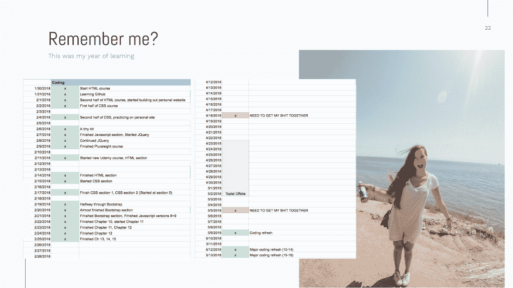

# 海绵的一年

> 原文：<https://medium.com/hackernoon/a-year-of-sponge-3b4f48d00042>

*原载于*[*blog . steph Smith . io*](https://blog.stephsmith.io/a-year-of-sponge/)*。*

# 四分之一生命危机

今年我 25 岁了。去年我 24 岁了，很自然地看到了这个“四分之一世纪”里程碑的到来。只要我活过这一年，我就会(也确实)过 25 岁。

这是我能预测的唯一半确定的事情，很自然地，它把我吓坏了。这个 25 岁的生日可能标志着我生命中的四分之一，但取决于命运把我带到哪里，它可能标志着更重要的东西——我的半生，我的 80%的生命，等等。毫无疑问，它标志着我 20 多岁的中期，这可以说是一个人一生中最投机的时期。由于没有什么责任和很多天真，在这个时期潜在的增长空间是巨大的。

今年是第 24 年，几个月后，我希望我的 25 岁之路能体现这一点。在我 20 岁出头的时候，我花了一生的时间去获得学位，然后花了几年时间去工作；两者都是任何人一生中极其“海绵样”的时期，但更多的是由他们所处的环境造成的。

但是 24 开始感觉很慢。世界的风不会自然而然地带我走上任何高速增长的道路，因此，我决定开始为期一年的学习。那一年我经历了一段时间的自我评估，更重要的是，客观地审视自己，让我再次以海绵的身份进入 20 多岁的后半期，这可能是迄今为止最有效、最专注的海绵。

到目前为止，这些都是我的二十几岁:

*   20–21 岁:学校海绵
*   22–23:工作海绵
*   23:远程工作海绵
*   24: [自残学习海绵](https://twitter.com/stephsmithio/status/1077692151020965889)

# WTH 是一块海绵？

在我进入这篇文章的实质之前，你可能会问“为什么她一直称自己为海绵？”。

> 我想在这篇文章的上下文中把“海绵”定义为快速吸收知识或意识的人，其结果是以某种方式大幅增长。

我还认为，重要的是要认识到，在生活中，只有少数几个时刻，社会会把你推向海绵阶段。一些例子:

*   成长(社会海绵)
*   生孩子(责任海绵)
*   获取学位(知识海绵)
*   失去心爱的人(情感力量海绵)

大多数经典的海绵阶段发生在接近生命开始时，随后是几十年的稳定期。虽然稳定并不坏，但我最近意识到，最好、最可持续的增长来自持续的海绵行为。我也开始意识到，在以后的生活中，这种行为需要自我引导。因此，从二月份开始，我开始了我的海绵年。

# 我的海绵年

为了开始我的海绵年，我需要做几件事:

*   承认我没有那么伟大
*   找出我生活中的差距
*   让自己负起责任，跟踪自己的进步

更实际的说法是，我给自己的生活拍了一张快照。我绞尽脑汁想出了可能对我的生活有益的事情，从更传统的(创业、写书、学习冲浪)到更另类的(T1)。我列出了一个我要做的事情的清单，更重要的是，积极地将其他事情去优先化——不仅仅是今年，在某些情况下是可预见的未来。

> *为了给最重要的目标腾出空间，我需要消除其他选项的干扰，这些选项虽然*不错*，但对我未来的成长和幸福没有益处。*

与过去的目标设定相比，我试图想得更长远，最终最重要的是学习编码。当我意识到它总是限制我去我想去的地方，限制我聪明地参与我参与的对话，限制我建立我长期以来优先考虑的生活时，这很快成为我的首要任务。

今年是我人生中最有收获的一年，我学习了一套新技能，并以自己的名字启动了 4 个项目，其中一些已经获奖或荣登 ProductHunt 榜首。正是因为这些原因，我选择分享在我的海绵年里对我有效的方法。

# 如何海绵

**让自己负起责任**

使“海绵王国”成为可能的最大发展之一是对我自己的彻底坦白。这是一种积极的认识，即我前一年花了大部分时间学习远程工作，但最终，这不是最终目标(我可以就此写一整篇文章)。

让自己负起责任的最好方法是积极盘点你的[【fuck bucks】](https://amzn.to/2TvZqLd)并承认你的行为！=你的价值观。

*   那些 Instagram 影响者，你知道他们的生活是假的？放开他们。或者更好的是，删除 Instagram。
*   那个背叛你的前任？别管他了。
*   你知道的那个电视节目没有任何价值？别看了。

> ***你的人生是由你度过的时间定义的，而*** [***时间加起来就是***](http://begreat.me/) ***。***

**设置关键绩效指标**

我采取的最重要的一步是为自己设定 KPI。我们在工作中，甚至在你的人际关系中(记分)都很快掌握 KPI，但不是对我们自己。你应该想成为对自己最负责的人。

对我个人来说，我知道很多不同版本的自己。有高效的 Steph，但也有永久疲劳的 Steph，饥饿的 Steph，分心的 Steph，等等。让所有版本的 Steph 负起责任的唯一方法是有一个我可以实际检查并尝试改进的指标。

人们错误地认为事情会自己改善，但是设置 KPI 有助于让人们意识到需要付出多大的努力才能真正取得进展。下面是我个人跟踪的一瞥，我积极地跟踪了这一年中的每一天，以及我编码、锻炼等等的频率。

关于这些 KPI 的一个非常重要的注意事项:与大多数 KPI 不同，这些是为你自己准备的。这些不是你在 LinkedIn 或 Twitter 上炫耀的学位，以证明你的“影响力”；这些是给你看的，所以没有必要错误跟踪或选择一个与你的目标不一致的指标。

> 但这就是美妙之处，没有人会欺骗你，你完全拥有自己的成功或失败。这不是胡说八道，自动化，或“重构”你自己的目标，当然也不是为达到目标所付出的努力。

**出主意< < <执行**

你可能有“非常好的想法”进入 2019 年，但我也是，公交车上的那个家伙和他的妻子和她的祖父也是。海绵(是的，它现在也是一个动词)，你必须承认许多人有好想法，但大多数人不会努力实现它们持续一段时间。我开始意识到，伟大只是好的，但可以重复。

我也认为积极承认学习的不适是必要的。

每项技能都可以通过上述学习周期来定义:

1.  无意识的无能:本质上，你甚至不知道你不知道什么或者你不擅长什么。这本质上是无知，又名极乐。
2.  有意识的无能:你已经意识到你可以在某方面有所提高。不是一个非常有趣的地方，但**这**是海绵阶段；即:成长阶段
3.  自觉能力:一旦你有所提高，你仍然非常专注于能够做那件事。
4.  无意识能力:很少，但是你非常擅长，只需要很少的精神能量。

总之，你也可以在生活的任何时候进入海绵阶段，带着一些内心的坦诚，个人的关键绩效指标，以及专注于在“有意识的无能”地带闲逛。既然跟踪了自己的进度，我其实可以量化这一年(2018 年)的部分内容，而不是回头看，用“这是很扎实的一年”之类的模糊术语来归类。

所以，因为我可以量化它，这是我作为代码海绵的一年(灵感来自这篇[等等，但是为什么文章](https://waitbutwhy.com/2015/12/the-tail-end.html)):

**目标达成**:

*   125 天学习编码(目标:未定，但是想象一下如果我每天都这样做，我能完成多少)

*   启动 4 个项目:(目标:2)
*   制作中的 264 美元(目标:1 美元)
*   做了 2 次演讲(目标:1)
*   度过了
*   3 full articles written: (goal: 3)

**错过的目标:**

*   21 本书(目标:24 本)
*   锻炼 121 天(目标:182 天——一半时间)
*   学开车(还是不会)

**其他不可预测的目标:**

*   成为一名“主管”,开始管理一个 20 人的团队
*   访问了我的第 50 个国家

如果你想听我的演讲，特别是回顾我是如何在一年内学会编码和构建项目的，你可以在这里[听。](https://twitter.com/stephsmithio/status/1070685923229208576)

自然，当我谈到今年的海绵年时，我计划继续海绵到 2019 年及以后。

对于 2019 年，我有几个目标:

*   在我的副业项目中打 1000 美元 MRR
*   了解更多开发知识(尤其是 Javascript)
*   至少发布 2 个项目
*   每月至少写 1 篇
*   在会议上发言
*   至少每隔一天锻炼一次(182 天)
*   通过多读 24 本书，了解更多关于我如何提高我的海绵宝宝的知识

虽然你不需要跟踪生活的每个方面或选择一个基于编码的目标，但我确实认为，随着时间的推移，让自己对自己的生活目标和期望负责只会变得更加重要。达到这一点的最好方法实际上是衡量你的表现，并成为你最严厉的批评家。

虽然就相对增长而言，我也有过类似的年份，但我认为这是最有意义的一年，因为这是我自己造成的，并激励我在未来几年做更大的事情。

*原载于 2018 年 12 月 30 日*[*blog . steph Smith . io*](https://blog.stephsmith.io/a-year-of-sponge/)*。*