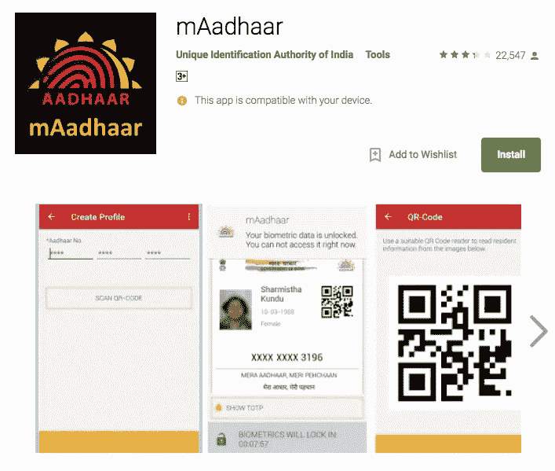
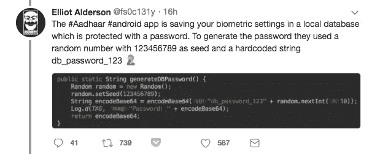

# 阿达尔保安公司，带着棍子去枪战

> 原文：<https://medium.com/hackernoon/aadhar-security-bringing-sticks-to-a-gun-fight-da2de6623a9b>

Credits: Rishi Mohan

我们被告知，我们的数据是完全安全的，是“防黑客”的。但是，让我告诉你，这个世界上没有什么是“防黑客”的。

第二次世界大战期间，德国人使用恩尼格玛机来保护他们的信息。他们可以输入一条信息(如“食物供应来自西方”)。这台机器会产生胡言乱语，(如“A1B2# C3D4$#ED JD@#KK #$%%#”)。这是通过无线电广播的。在接收端，当你输入同样的胡言乱语时，你得到的是原始信息。这只是时间问题。艾伦·特纳破解了在击败纳粹中起关键作用的“谜”密码。

恩尼格玛机的发明者做了一些数学假设。艾伦·图灵打破了那些使他能够破解密码的假设。安全性是围绕这样的技术假设建立的。我们有很多艾伦·图林斯(黑客)挑战并打破这些假设。这类事件在过去发生过无数次。它将继续发生，这就是我们前进的方式。 ***考虑往事*** ***怎么能称他们的系统为‘防黑客’呢？***

当你访问 Aadhar 的门户网站时，你会看到按钮、图像、信息等。但是，安全专家可以看到肉眼看不到的东西。他们已经看到了安全缺陷，并多次指出。他们给出了确凿的证据证明 UIDAI 的安全性很弱。他们的目的只是为了加强阿达尔的安全。

当你的孩子做错事时，你为了他们的利益而纠正他们。有时他/她会接受并纠正他们的错误。有时候他们不接受自己的错误，哭着说“ ***我不喜欢你*** *”。*

我们这里有这样一个孩子，他无法接受安全缺陷，并把那些试图提供帮助的人贴上“ ***反对阿达尔”*** *的标签。*

# 带着棍子去枪战

看看 mAadhaar 应用程序。

它存储您的个人资料信息(*姓名、出生日期等*)。它允许某些功能，如生物特征锁定/解锁和基于时间的 OTP 生成。

首次打开应用程序时，它会要求您设置密码。以后，您可以使用相同的密码解锁其功能。因此，即使有人偷了你的手机，他们也无法访问应用程序。

一名法国安全研究员下载了这款应用。他发现了一些奇怪的事情。

您在注册时设置的密码存储在保险箱中。每次，你打开应用程序，它要求你输入密码，然后应用程序打开保险箱，检查它们是否匹配。如果是的话，你就可以访问这个应用了。

保险箱里有一把钥匙，你的密码就存放在那里。关键只是一组类似“A233ASD”的字符。如果这个密钥被泄露，那么任何人都可以访问你的密码和应用程序的功能。

保险箱的钥匙必须是唯一的。你的钥匙和我的钥匙不应该一样。如果是相同的，我可以用我的钥匙打开你手机的保险箱，并访问它的功能。法国安全研究员发现所有 mAadhar 的客户都有相同的密钥。

> 这就像印度政府给公民一把锁和钥匙来保护他们的房子。问题是每个公民都有同样的锁。任何人都可以用自己的钥匙打开别人的房子。

我在苏潘迪的故事里见过如此愚蠢的事情。您的 mAadhar 应用程序目前易受攻击。人们可以选择相信或欺骗权威人士，他们说“ ***”你的数据是完全安全的，“防黑客”*** ”。

[Original Tweet](https://twitter.com/satishacharya/status/950359550896480257)