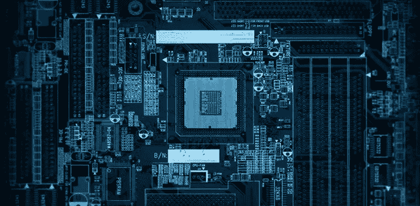

# 使你成为更好的开发者的能力

> 原文：<https://medium.com/hackernoon/abilities-that-makes-you-a-better-developer-82295c75de59>

像许多其他人一样，杰克森·布朗给了我们一句关于职业和激情的名言:*“找一份你喜欢的工作，然后每周增加五天时间”。我*在我看来，事实上，开发人员是一份我们必须带着职业去做的工作，我的意思是，*一个人内心深处的倾向或兴趣，去奉献一种确定的生活方式或工作。*科技世界每天都在发展，**所以如果你讨厌学习，你就出局了……**

如果我们对自己的工作有热情，为什么不每天都努力成为更好的专业人士呢？

现在，我将向你展示一个主题列表，它将使你成为一名更好的专业人士。重要的是要说，学习所有这些东西**并不容易，**也不是一次快速旅行，所以我们将需要大量的**努力**和**毅力。**

我要告诉你的最后一件事是，没有必要成为所有这些领域的专家，如果你是，对你有好处，但是作为一个开发者，如果你有兴趣学习更多，你会更好。你获得的知识越多，你的准备就越充分。

## 数学:

> 数学会给你一个更好的编程逻辑。学习算术、代数、离散数学、几何和统计。

## 算法和数据结构:

> 对我来说，这是基本的 T21 的三/四个科目之一。你对算法和数据结构(不依赖于语言)的了解越多，解决日常问题的效率就越高。了解堆、树、链表、队列、排序方法、图形等。

## 数据库:

> 在我看来，这是另一个非常重要的问题。作为一名开发人员，你可能会接触到一名数据库经理。研究和了解 SQL 和 NoSQL 数据库以及何时使用它们。这个主题将使你以非凡的方式成长为一名专业人士。

# 计算机架构:

> 知道计算机如何工作将会给你一个关于事物如何工作和为什么工作的总体印象。学习微处理器如何工作，存储器的层次结构，硬盘驱动器等。

## 操作系统:

> 你必须知道你的操作系统是如何工作的。基本上，操作系统是最重要的软件，学习它是如何工作的，以便在开发时有一个更好的方法。了解命令、内存管理等。

## 网络:

> 如今一切都是相互联系的，因此了解计算机网络是最基本的。了解协议，如 TCP / IP，FTP，HTTP，互联网如何工作，服务器等。

## 范例和设计模式:

> 这将给你一个开发计算机程序的更好的方法，在每种语言中都有不同的(有时没有)范例和设计模式。了解面向对象编程、函数式编程、反应式、固体原理等。

## 英语:

> 如果你的母语不是英语，像我一样(如果我犯了任何英语错误，这是一个说抱歉的好机会)，了解英语是很重要的，尤其是科技英语，因为大多数书籍、文档、博客、文章都是用英语写的。学习英语的说、写、读、听。

## 团队合作:

> 今天，作为一个团队，必须了解版本控制。了解 Git、Github、SCRUM 等。
> 
> 如果你在一个团队里，谦虚是根本，你不能把自己凌驾于队友之上，因为这是一个团队。而一个团队，每天都需要大家的帮助和学习。

**其他东西:**
◾️ Ux 设计。
◾️计算机安全
◾️机器人
◾️留下另一个。

# 一些在线资源:

**数学:** ◾️ [赛勒学院](https://learn.saylor.org/course/index.php?categoryid=13)
◾️ [可汗学院](https://www.khanacademy.org/math)
️◾️[coursera](https://www.coursera.org/courses?query=mathematics)
️◾[EDX](https://www.edx.org/course?search_query=mathematics)
**算法与数据结构:** ◾️ [算法介绍](http://amzn.to/1y5Ipd8)
◾️ [编程珍珠](https://www.amazon.com/Programming-Pearls-2nd-Jon-Bentley/dp/0201657880)
◾️ [破解编码面试](https://www.amazon.es/Cracking-Coding-Interview-Programming-Questions/dp/098478280X)
️◾️ [管理系统](https://codefights.com/)
◾️ [了解 MySQL 内部](https://www.amazon.com/gp/product/0596009577/)
◾️ [NoSQL 精华](https://www.amazon.es/NoSQL-Distilled-Emerging-Polyglot-Persistence/dp/0321826620)
◾️ [Elasticsearch:权威指南](https://www.amazon.com/Elasticsearch-Definitive-Guide-Clinton-Gormley/dp/1449358543/)
️◾️ [终极 MySQL Bootcamp:从 SQL 初学者到专家](https://www.udemy.com/the-ultimate-mysql-bootcamp-go-from-sql-beginner-to-expert/)
️◾[MongoDB 完全开发人员指南](https://www.udemy.com/the-complete-developers-guide-to-mongodb/)
**计算机架构:** ◾️
**操作系统:** ◾️ [操作系统概念](http://amzn.to/1x3rKFF)◾️ [操作系统](https://www.amazon.com/Operating-Systems-3rd-Harvey-Deitel/dp/0131828274)
️◾ [现代操作系统](https://www.amazon.com/Modern-Operating-Systems-Andrew-Tanenbaum/dp/013359162X)
◾[udemy](https://www.udemy.com/courses/search/?q=linux&src=ukw)
**网络:** ◾️ [计算机联网:一种自上而下的方法【T94 和 UNIX](https://www.quora.com/What-are-the-best-books-and-websites-for-studying-computer-networking)
️◾[uda city](https://www.udacity.com/course/computer-networking--ud436)
◾[思科](https://www.netacad.com/courses/networking/)
**范式和设计模式:** ◾️ [头先设计模式](https://www.amazon.com/Head-First-Design-Patterns-Brain-Friendly/dp/0596007124/ref=sr_1_1?s=books&ie=UTF8&qid=1517364745&sr=1-1&keywords=Head+First+Design+Patterns)◾️ [设计模式:可重用面向对象软件的元素](https://www.amazon.com/gp/product/0201633612/ref=as_li_qf_sp_asin_il_tl?ie=UTF8&camp=1789&creative=9325&creativeASIN=0201633612&linkCode=as2&tag=anjabl-20)
◾️ [干净代码:敏捷软件技术手册](https://www.amazon.com/gp/product/0132350882)
**团队合作:** ◾️[pro git](https://git-scm.com/book/en/v2)◾️[git&github 初学者教程](https://www.youtube.com/watch?v=3RjQznt-8kE&list=PL4cUxeGkcC9goXbgTDQ0n_4TBzOO0ocPR)
️◾[Scrum.org](https://www.scrum.org/resources/what-is-a-scrum-development-team)
◾️[如何赢得朋友&影响人](https://www.amazon.com/gp/product/0671027034/)
◾️ [谦逊:真正的伟大【T155](https://www.amazon.com/Humility-Greatness-C-J-Mahaney/dp/1590523261)

我必须提到一个我非常钦佩的开发者，他给了我写这篇文章的灵感: [Alan Chavez](https://medium.com/u/cfcd5dbcde54?source=post_page-----82295c75de59--------------------------------)

**你有我的**[***Github***](https://github.com/germancutraro)**如果你愿意跟随我，我会感谢你的！**

谢谢你😊