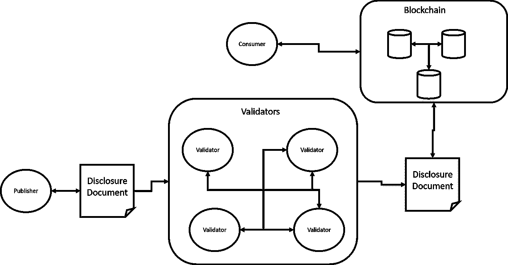

# 关于证券的披露和信息不对称

> 原文：<https://medium.com/hackernoon/about-disclosures-and-information-asymmetry-in-security-tokens-fc83c350548a>

当我们考虑安全令牌下一阶段需要构建的基础构建模块时，披露是重中之重。信息披露或缺乏信息披露，可以说是加密证券发展过程中的最大障碍，也是决定市场是有效还是无效的关键。【Stephen McKeon 教授经常将术语“披露市场”称为安全令牌的这一组成部分，它应该能够实现与加密证券相关的公开材料信息的透明度。虽然从概念上看微不足道，但在一个去中心化的生态系统中实现有效的令牌公开绝非易事。今天，我想探讨这方面的一些想法。

证券标志披露的相关性超出了透明度和监管的范围，涉及到市场的核心动态。如果我们无法获得加密安全的相关信息，我们如何知道我们是否为它支付了合理的价格？在公用令牌中，价格由协议的核心机制和交易势头决定，但这些机制在加密证券中几乎无关紧要。安全令牌的市场行为与关于令牌化实体的信息紧密相关。信息流不畅或不可靠会导致市场效率低下。经济学家将这一术语称为信息不对称，可以有效地将其视为安全令牌发展过程中的最大风险之一。

# Akerlof，Lemons 与安全令牌中的不对称信息

信息不对称是一个不言而喻的概念，自 20 世纪 70 年代以来，它给市场经济学带来了一场革命。作为一个形容词，不对称信息是指交易中的某个代理人拥有信息，而参与同一交易的其他代理人不拥有信息的情况。金融市场中信息不对称的研究对经济学产生了重要的贡献，例如[莫迪利亚尼-米勒](https://www.investopedia.com/terms/m/modigliani-millertheorem.asp)定理，该定理指出，公司的市场价值与其财务结构无关，而是与其感知的盈利能力和风险有关。因此，员工和股东之间的信息披露和激励比资产的财务模型更重要。

美国经济学家、2001 年诺贝尔奖获得者乔治·阿克洛夫是信息不对称市场的最高权威之一。在 1970 年一篇名为[“柠檬市场”](https://en.wikipedia.org/wiki/The_Market_for_Lemons)的论文中，阿克洛夫考虑了一个拥有二手车质量私人信息的卖家的例子。一个买主想买一辆汽车，但又渴望为它支付一个“公平”的价格。更具体地说，假设有九辆不同的汽车，每辆汽车都有“公平”价值，分别为 100 美元、200 美元……900 美元。由于买家无法观察质量，低质量汽车的车主总是声称他们出售的是价值 900 美元的高质量产品。一个公平的价格将反映市场的平均质量，在这种情况下是 500 美元。然而，在这种情况下，汽车价值超过 500 美元的卖家发现这样的价格太低，因此退出市场。平均价格必须下降到 300 美元，诱导更多的退出，等等。因此，除了价值 100 美元的质量最差的汽车之外，没有卖家愿意出售买家愿意购买的汽车！

将阿克洛夫的一些观点推广到安全代币，我们可以清楚地看到信息不对称如何成为市场演变的路障。信息不对称盛行的市场有利于不良行为，如内幕交易或市场操纵，其中一小部分人获得的信息不成比例，从而利用散户投资者。此外，与交易所/流动性池和流动性协议一起，披露是影响加密证券价格的关键支柱之一。

# 用于安全令牌的分散式 EDGAR

在美国，证券交易委员会(SEC)为公开证券的披露制定了非常明确的准则。从 1933 年的[证券法](https://www.investopedia.com/terms/s/securitiesact1933.asp)和 1934 年的[证券交易法](https://www.investopedia.com/terms/s/seact1934.asp)到最近的法规，如 2002 年的[萨班斯-奥克斯利法案](https://en.wikipedia.org/wiki/Sarbanes%E2%80%93Oxley_Act)，美国公共证券被要求遵守非常严格的披露机制。1984 年，SEC 引入了[电子数据收集、分析和检索系统(EDGAR)](https://www.sec.gov/edgar/searchedgar/webusers.htm) ，作为收集和搜索与公共证券投资相关的信息的主要机制。显然，埃德加完全集中在美国证券交易委员会的监督之下，该委员会利用法治作为一种强有力的激励机制，使不同的市场参与者保持诚实。在全球、分散和可编程的安全令牌生态系统中，我们有机会重新想象披露。我们需要一个分散的埃德加或者更酷一点:德加😊。

在安全令牌市场的当前状态下，可用的基本披露由令牌发行平台以集中的方式处理。虽然这种模式在市场的早期阶段可能有一定的意义，但它有一些非常明显的局限性和非常严重的风险。首先，在集中式模型中，市场参与者需要信任发行平台来断言令牌发行者披露的任何信息的有效性，这在大规模情况下几乎是不可能的。让证券代币发行平台或交易所托管与证券代币相关的披露信息，并不能解决市场中的信息不对称问题；恰恰相反。最后，安全令牌提供了一个独特的优势来重新想象现代证券的披露:可编程性。DEDGAR 模型应该提供可编程的、不可信的、分散的披露机制和工具，安全令牌市场的所有参与者都可以访问这些机制和工具。

# 可编程的披露协议

当我考虑最基本形式的安全令牌公开时，我不断回到新协议的想法，以在安全令牌市场的不同层实现这种能力。概括地说，在安全令牌的生命周期中，有三个相关方与披露进行交互:

**发布者:**发布有关加密证券的材料、公共信息的令牌发行者或实体。

**消费者:**令牌持有者、交易所和其他根据披露的信息对加密证券做出决策的参与者。

**验证者:**作为一个重要的角色，验证者是可以断言公开数据集真实性的参与者。

使用这三个角色，我们可以构建安全令牌公开协议的基础。安全令牌智能合约本身将包括发布和验证披露文档的机制。交易所、安全令牌发行平台和其他实体可以充当该信息的验证者。披露动态可以被视为令牌化协议(如证券化的 DS 协议)的扩展，甚至可能有机会将这些交互令牌化，以纳入正确的激励措施。

在证券代币这样的新兴市场，披露是在大投资者眼中使空间合法化所需的要素之一。我觉得披露的性质和重要性将挑战当前一代安全令牌平台中的一些集中式模型。希望这篇文章中的一些想法将有助于设想一条更好的道路。