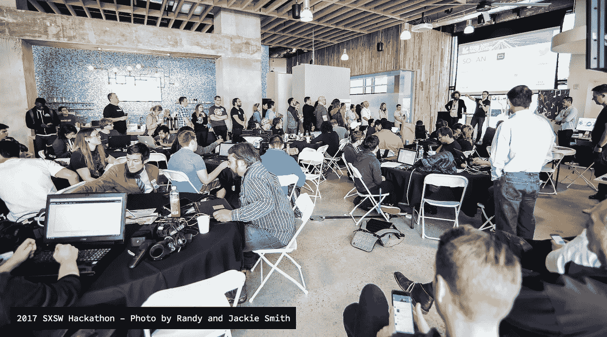

# 关于下周的 SXSW 黑客马拉松

> 原文：<https://medium.com/hackernoon/about-next-weeks-sxsw-hackathon-b8893834d9c0>

从 3 月 13 日星期二到 3 月 14 日星期三，第五届年度 [**SXSW 24 小时黑客马拉松**](https://goo.gl/QhEHLh) 将汇集黑客、创作者、制造者和编码者，共同解决问题，创造新工具，并推动现有技术跨越娱乐媒体的界限。

收到数百份申请后，我们将范围缩小到前 120 名黑客。会很有趣的。虽然这一领域已经基本确定，但我们仍在审查所有新的申请。[申请此处](https://goo.gl/8kyZ8V)。

特拉维斯·劳伦丁说:“当你想到 SXSW 时，根据你是谁，你会想到最好的新音乐、技术或电影。“作为一名博学的人，我共同创建了 SXSW 黑客马拉松，它是一个融合 SX 所有元素的混合器，也是一个孵化器，为获胜的团队提供 SXSW 本身，作为他们对现实世界用户的初始和非常肥沃的测试场地。”

“今年，作为对创新在技术和娱乐交叉领域的重要性的最终认可，我们邀请了美国一些最有价值的公司赞助和派遣工程师，帮助参与者为艺术家和他们的消费者制作产品，”特拉维斯继续说道。“我迫不及待地想看看这些超级明星开发者在这些消费者平台上构建了什么，转化为超过 1 万亿美元的市值。尤其是当他们看到 Capitol Records 带来的新沙盒中的内容以及我们为他们准备的其他音乐、电影和 API 惊喜时！”

在黑客中午，我们很荣幸成为如此激动人心的活动的媒体赞助商。我们将在活动中设立一个区域，您可以在那里向我们讲述您的技术故事。[也可以 DM 我](http://twitter.com/davidsmooke)。期待在那里见到你:-)

## **2018 SXSW 黑客马拉松导师**

自豪地宣布，黑客马拉松和孵化器的导师是:

*   [陈莉莉](https://www.linkedin.com/in/lichen6/)(通用)
*   杰罗姆·范赫夫(Leansquare/加州音乐技术公司)
*   [泰·罗伯茨](https://www.linkedin.com/in/tyroberts/)(泰·罗伯茨创新)
*   李修贤 (YG 娱乐)
*   安迪·伽丁尔(创始人大使馆)
*   [达诺莱曼](https://www.linkedin.com/in/danoleman/)(reven 8 te/票银河)
*   [路易丝-玛丽·马盖特](https://www.linkedin.com/in/louisemariemarguet/) (Emojam)。

## 2018 SXSW 黑客马拉松评委

黑客马拉松的评委*是:

*   图欣罗伊(环球音乐)
*   瑞安·沃尔什(水闸)
*   [蒂芙尼·钟](https://medium.com/u/e0f54ea3c1a5?source=post_page-----b8893834d9c0--------------------------------)(Z 世代的耳语者)
*   杰伊·扎罗威茨(黑客正午)
*   杰里米·加德纳
*   韦科胡佛 (XLIVE)
*   [杰夫·李本森](http://www.liebensonlaw.com/)(李本森定律)
*   大卫·西科尔斯基
*   [Lucy Guo](https://www.linkedin.com/in/lucy-guo-a7804955/) (刻度 API)
*   [大卫·斯穆克](http://twitter.com/davidsmooke)(黑客正午&阿米)

**之前在* [*中宣布，欢迎参加 SXSW 24 小时黑客马拉松*](https://hackernoon.com/join-us-at-the-sxsw-24-hour-hackathon-dd6092131c55) *。*

## 2018 SXSW 黑客马拉松赞助商

****。**以向会员提供银行和保险服务的创新方式而闻名的 USAA，将作为赞助商加入我们的 SXSW 黑客马拉松活动。**

**[**亚马逊 Alexa**](https://developer.amazon.com/alexa-skills-kit?ref=hackernoon.com) **。** Alexa 是亚马逊基于云的语音服务。Alexa 是亚马逊 Echo 和其他支持 Alexa 的设备背后的大脑。**

**[**亚马逊网络服务。**](https://goo.gl/VxhrTT) 亚马逊网络服务(AWS)是一个安全的云服务平台，提供计算能力、数据库存储、内容交付和其他功能来帮助企业扩展和增长。数百万客户目前正在利用 AWS 云产品和解决方案来构建具有更高灵活性、可扩展性和可靠性的复杂应用程序。**

**[**国会音乐组**](http://capitolrecords.com) **。**国会音乐集团(CMG)由国会唱片公司、维珍唱片公司、摩城唱片公司、蓝调唱片公司、Astralwerks、丰收唱片公司、国会基督教音乐集团和 CMG 的独立发行部门 Caroline 组成。**

****议会。ConsenSys 是一个全球性的组织，由技术专家和企业家组成，他们构建基础设施、应用程序和实践来实现一个去中心化的世界。****

****[**云淡风轻**](https://cloudinary.com/?ref=hackernoon.com) **。**利用领先的云服务 Cloudinary 管理 web 和移动媒体资产:图像和视频上传、存储、操作、优化、数字资产管理和交付。****

*****附加伙伴有*[***Devpost***](https://devpost.com/?ref=hackernoon)*和* [***黑客正午***](http://hackernoon.com) *。:-)*****

****直到下一次，不要把世界的现实想当然。****

****亲切的问候，****

****大卫·斯穆克****

********

## ******P.S** 。虽然这一领域已经基本确定，但我们仍在审查所有新的申请。[此处应用](https://goo.gl/8kyZ8V)。****

## ******P.P.S.** 以下是令我兴奋的 SXSW 小组和活动:****

*   ****[如何创建必要的、有针对性的、真实的媒体](https://schedule.sxsw.com/2018/events/PP72520)****
*   ****[嘎吱嘎吱音乐节](http://crunch.splashthat.com/oath)****
*   ****[为期两天的加密峰会将于 2018 年在 SXSW 举行，主题是区块链会议中的女性——“新女孩”](http://Two-Day Crypto Summit Coming to SXSW 2018, Featuring Women in Blockchain Conference — ‘New Girls on the Block.’)****
*   ****政治分裂的美国的包容艺术****
*   ****[如何建立一家最佳创意胜出的公司](https://schedule.sxsw.com/2018/events/PP99680)****
*   ****[专利巨魔在科技领域的持续存在](https://schedule.sxsw.com/2018/events/PP71729)****
*   ****[AI:准备好颠覆体验设计了吗？](https://schedule.sxsw.com/2018/events/PP74123)****
*   ****[现代出版商模式:超越广告](https://schedule.sxsw.com/2018/events/PP78345)****
*   ****[UX 动画:动作的潜意识影响](https://schedule.sxsw.com/2018/events/PP72962)****
*   ****[这是美国第二季大结局(包括演员阵容)](https://schedule.sxsw.com/2018/films/126346)****
*   ****平台战争:媒介还是信息吗？****
*   ****[什么样的用户体验暴露了你的文化](https://schedule.sxsw.com/2018/events/PP72532)****
*   ****[AI 能安抚野人评论段吗？](https://schedule.sxsw.com/2018/events/PP75792)****
*   ****从人工智能到人工智能:移情是新的科技超级力量****
*   ****[为什么机器学习是艺术的下一个前沿](https://schedule.sxsw.com/2018/events/PP80428)****
*   ****[《比利·穆雷故事:从一个神秘人身上学到的人生经验》](https://schedule.sxsw.com/2018/films/124329)****
*   ****[社交媒体&社会公益:创造者来拯救](https://schedule.sxsw.com/2018/events/PP75709)****
*   ****[人工智能时代的内容创作](https://schedule.sxsw.com/2018/events/PP76184)****
*   ****[小菲尔·赫尔穆特签售会](https://schedule.sxsw.com/2018/events/OE3352)****
*   ****[社交媒体+社会公益相遇](https://schedule.sxsw.com/2018/events/PP73284)****
*   ****驱动观众:如果你建造了它，他们就不会来了****
*   ****[ICO 创业另类融资](https://schedule.sxsw.com/2018/events/PP79250)****
*   ****[自由激进分子:切尔西·曼宁和《时尚》杂志的莎莉·辛格](https://schedule.sxsw.com/2018/events/PP99780)****
*   ****[构建社区:URL & IRL](https://schedule.sxsw.com/2018/events/PP98666)****

********