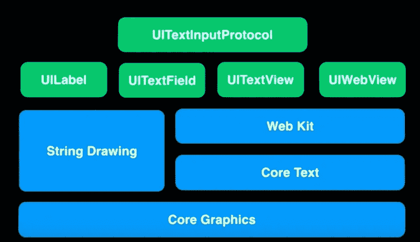
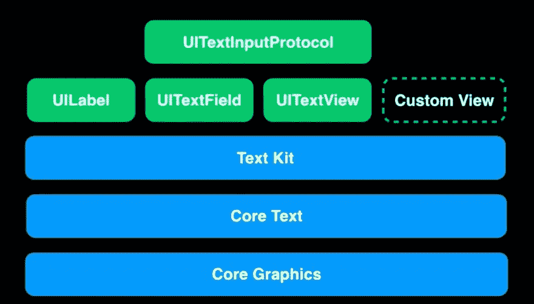
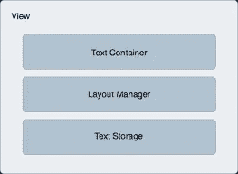
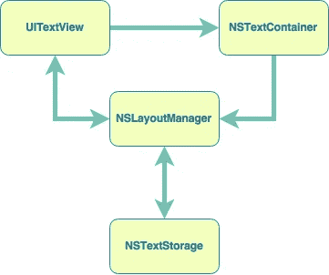

# 关于 iOS 中的 Text-Kit 和 UITextView

> 原文：<https://medium.com/hackernoon/about-text-kit-and-uitextview-in-ios-6b0bf8996c54>

在 iOS 7 之前，当我们给出属性文本时，UITextView 使用 web-kit 通过 HTML 来呈现输入。但是对于其他许多行数和复杂功能的定制，核心文本是留给开发者的选择。

*   **Core-Text : Core-Text** 是一个底层框架，位于 iOS 内核的 *Core-Graphics* 框架之上。换句话说，Core-Text 是一个低级的文本引擎，当我们与 *Core-Graphics/Quartz* 框架一起使用时，它可以对*布局*和*格式进行细粒度控制。*
*   **文本套件:**

在 iOS 7 中，苹果发布了一个名为 Text-Kit 的高级库，它是核心文本之上的一层，与头罩后面的核心文本进行交互。因此开发者可以利用这个新的库(文本工具包)API，在他们的应用设计中定制布局和格式。它继承了核心文本的所有主要功能，并将它们包装成对象，为开发人员提供所需的 API。

在需要修改文本细节时，比如字体或布局属性，必须处理核心文本，这是一个强大的框架，但是很难使用。随着*属性化字符串*的出现，事情变得更好，其中 *UITextView* 视图也可以显示丰富的文本、图像等。

TextKit 给了我们，

*   富文本编辑
*   格式和语法突出显示
*   自定义布局
*   用户交互
*   注释、文本效果、自定义输入行为、文本突出显示、与 UI 的交互等。

iOS 中的 TextKit 处理 3 种类型的文本属性。他们是

*   **人物属性**

这些特征包括字体、颜色、下标等与单个字符或一系列字符相关的特征。

*   **段落属性**

这些包括缩进、制表符、行距等。这些会影响布局管理器将文本行排列到页面段落中的方式。这些都封装在一个名为 *NSParagraphStyle* 的独立类中

*   **文档属性**

这些包括文档特征，如纸张大小、边距、视图缩放等。

→文本块中的每个 ***字符*** 都有一个*键和值*，【NSAttributedStringKey】的字典。Type: Any]与之相关联。

***→文字套件由三个主要类别组成:***

*   文本存储类(NSTextStorage)
*   布局管理器类(NSLayoutManager)
*   文本容器类(NSTextContainer)

**NSTextStorage :** 它是***nsmutableattributedstring***类的子类，作用是存储所有的文本相关信息(NSTextAttributedString)，如字体、段落样式、文本颜色、大小等。它的作用还在于确保所有编辑过的文本属性数据在整个管理和编辑会话中保持一致。

**NSLayoutManager :** 顾名思义，这个类的作用是管理视图对象上的文本数据显示。它从 NSTextStorage 对象获取文本数据(如属性数据),以在视图上呈现相同的编辑/更改。每当对文本属性进行更改时，NSTextStorage 对象都会通知它，所以每次更改都会立即反映在文本输入视图中。

它处理并支持任何可以在其中显示文本的视图对象，并执行操作以在视图上清晰地呈现 unicode 字符。

***注意:*** *字符串/字符串字符有 ASCII、Unicode 等多种形式。NSLayoutManager 对象(iOS)支持所有 unicode 字符，因此当您使用 unicode 字符编码/解码字符串时，(如 utf8、utf16)我们会获得一些值，因此我们可以安全地强制展开结果。*

NSTextContainer : 它指定了视图，在那里绘制文本。它管理和处理视图对象框架和边界，以指定文本绘制区域。它还以数组的形式保存 UIBezierPaths(路径)的信息，以便定义文本绘制区域，使其不排除与文本无关的对象，如图像。这样，我们可以在文本容器中显示图像和其他与文本无关的对象，而不会与文本重叠。

**注:** *除了 UIWebView 与 Web-kit 框架一起工作外，所有其他文本输入字段/视图，如 UITextView、UITextField 和 UILabel 对象，都与***Text-Kit**→**Core-Text**→**Core-Graphics**一起工作。

*在文本工具包中，* `*NSTextStorage*` *对象将* `*UITextView*` *对象显示的文本和* `*NSLayoutManager*` *对象布局的文本存储到* `*NSTextContainer*` *对象定义的区域中。这是它们之间的关系。*

注意:在印刷术中，一个字形是一组约定符号中的一个基本符号，用于书写时表示一个可读的字符。了解更多字形 [*在这里*](https://en.wikipedia.org/wiki/Glyph)

简单地说，字形是你看到的字符的视觉表现。

***其他备注:***

*   将段落样式应用于段落的第一个字符就足够了。
*   文本的垂直位置将通过使用 TextView 的属性独立配置和分隔。
*   如果 range = = 0，表示插入文本或替换文本

→上面提到的所有类都有很多使用 RichTextFormat 的有用方法，我们可以进一步扩展或子类化它们来配置更多。我们可以子类化 TextStorage、TextContainer、TextAttachment、NSAttributedStrings、NSLayoutManager 等。UITextVIew 可以用自定义的 TextStorage、LayoutManager 和 TextContainer 对象进行编程初始化。

— — — — — — — — — *********************** — — — — — — — — —

如果你喜欢我的教程请关注我的 ***中*、** [***推特***](https://twitter.com/Leelakrishn4)&[***linkedIn***](https://www.linkedin.com/in/leela-prasad-penumutchu-b44023157/)**账号**

**感谢阅读…**

******************************!！！再见！！！******************************