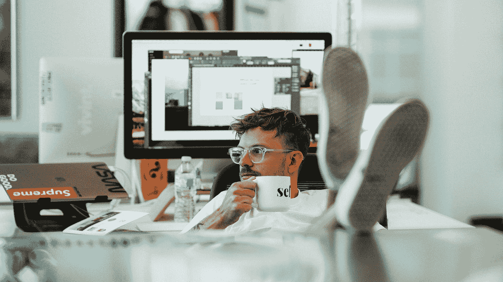

# 关于自由职业者生活的挣扎

> 原文：<https://medium.com/hackernoon/about-the-struggles-of-freelance-life-bac7caefb927>

by [Jj Mendez](https://unsplash.com/@jjmndz?utm_source=medium&utm_medium=referral) on [Unsplash](https://unsplash.com?utm_source=medium&utm_medium=referral)

“自由职业者，[自由职业者](https://hackernoon.com/tagged/freelance)，自由。我自由了！我可以随时随地做我想做的事情，在咖啡馆工作，吃些羊角面包，看日落，喝干红葡萄酒。”她的声音在我脑海中回响。她突出了全职员工的痛点，我无法抗拒也无法否认，她拿我们开玩笑，她说的没错。我抿一口我的[咖啡](https://hackernoon.com/tagged/coffee)，她的眼睛下面有黑眼圈，她还没睡。太可怕了，一如既往，不是她，是咖啡。我只是每次都付钱然后扔掉。我邀请人们喝杯咖啡聊聊天，所以这是事先计划好的。

我默默地走着，海浪冲击着我脑海中的岩石。下次我会准备得更充分、更专注，我会当面用事实打击她，看看会发生什么。要让自由职业者相信他们选择了艰苦的生活是不可能的，因为他们对自己的自由很有把握。他们不会改变，看起来他们有一个选择，但这就像朝鲜的选举，你知道——有 2-3 个政党，但 100%的选票投给了朝鲜劳动党。

## **6 年前**

社交媒体正在发展。我的前两份工作都是在市场营销部门，我做得很好，试图管理一切。自由职业者，自由职业者，自由。我自由了！我可以做任何我想做的事，任何我想做的时间，工作…..我的手机震动了，现在是凌晨 2 点。客户现在需要一些东西。我承诺了我不能兑现的东西。整整一个星期，我光着屁股在家里走来走去，看电影，喝可乐。我的上一份报告看起来像科学怪人电影里的怪物。我一直拖延到最后一天，因为我很懒。现在我凌晨 4 点醒着试图解决一切，因为“自由的生活，为什么不呢？”我有同样的圈子，我的朋友将有整整 6 年的时间。我下午 2 点醒来；一天过去了。我出去，坐在咖啡馆里，喝一口我的咖啡，一如既往的糟糕。每天都是另一天的搜索，我必须找到新的客户，我必须说服他们与我合作，从较低的价格开始。

起初，我想“哦，太酷了！新的人，不同的文化，”但一旦你遇到第一批糟糕的客户，每一点希望都开始消失。维吉尔继续带领我穿越九层地狱。我发现自己在一个巨大的冰湖中:科西特斯，地狱的第九层，但这并不重要。我完成这个项目；我累坏了。一个客户在付款前失踪了，我真幸运！

我没有套路；我每天在不同的时间醒来。我所有的网络都在网上，远离我，我根本不和人说话，我在我的舒适区。全职机会让我害怕。“我不能在某栋大楼里坐 8 个小时”我的脑海里重复着。睡眠成为问题，睡不好。会过去的，会过去的，会过去的；会吗？一只羊，两只羊，三只羊。现在是清晨；我醒着，日出很美，我眼睛下面的圈圈不美。抑郁症进入我的房间，让门开着。半夜，我被脑海中婴儿的哭声惊醒。我闭上眼睛，几个小时过去了，我的舌头大得让我窒息。我醒来；现在是清晨。萧条给我带来了一些客人喜欢的坏胃口和体重下降。现在我不孤单了。我读了一些积极思考的书，比如《如何停止担忧……》、《思考致富！、“积极思考的力量。”我读得越多，我就变得越虚无。我遇见医生，医生遇见我，我写故事，故事控制我。我有很多空闲时间把钱花在让我更痛苦的不必要的东西上，我有更多的时间去思考我们存在的意义。我坐在游泳池下，无缘无故地哭。我的人际关系破裂了，我开始讨厌所有的人。然后药物治疗来了，医生建议一些镇静剂不会伤害我。

“closeup photo of green water formation” by [Cristian Palmer](https://unsplash.com/@cristianla?utm_source=medium&utm_medium=referral) on [Unsplash](https://unsplash.com?utm_source=medium&utm_medium=referral)

后来有人建议我尝试一份全职工作。我申请了一些职位，没有人想雇用我，但我有很多经验。他们根本不在乎我的自由职业经历；不一样。终于有人给我机会了。我放弃了自由职业，专心工作。我开始每天在同一个时间醒来，开始吃东西，现在我有了一个日常计划，我开始收到基本收入，每个月，固定的，我不必每 2-3 周寻找一个新的客户。办公室里有很多有魅力的人，他们互相关心，我开始信任别人，我和他们交谈，上帝，他们很有趣！我意识到沟通是我的事情，我得到了一些人力资源相关的资料，而且从未回头。

## **6 年，4 家公司，18 公斤，后来 22 个成功项目…**

20 分钟后我会和我的朋友边喝咖啡边见面。我走得更快，我不想迟到，“我不是什么自由职业者。”我们在一个凉爽的地方，她很沮丧，我理解她。我想说服她去找一份新的全职工作，我不确定这对她是否有帮助，但这对我很有帮助。她打断了我的独白。“自由职业者，自由职业者，自由。我自由了！我可以做任何我想做的事，任何我想做的时间，在咖啡馆工作……”这个循环从未停止。我在争论中放弃了，因为她提出了一些很好的观点。我喝了一口咖啡。我呷了一口咖啡；她的眼睛下面有黑眼圈，她没睡觉。太可怕了，一如既往，不是她，是咖啡。我只是每次都付钱然后扔掉。我只是每次都付钱然后扔掉。我只是每次都付钱然后扔掉。我只是每次都付钱然后扔掉。“这句话代表自由职业者吗？哦，如果我大声说出来会很痛，但我想这是一个很好的笑话。”我脸上露出一丝微笑，她抓住了它，“什么？”“我只是觉得自由职业者就像我的咖啡。”“为什么，”她问。“他们就是烂，哈哈。”我把我的笑话分成两半，这样没人会生气。她笑得很疯狂，同时也哭了。每次我们见面都是情绪的过山车。我尽可能地开最愚蠢的玩笑，她笑到流泪。

我想今年我会全职雇佣她。我真的希望如此。让我们不要把这变成西酞普兰或艾司西酞普兰，因为每个人都还有希望。

向自由职业者大声呼喊！爱你们！

如果你还在，谢谢你！你可以看看我以前的故事:[有纹身的女孩(但不是龙)](/@ghukas.stepanyan1/hiring-stories-the-girl-with-a-tattoo-but-not-the-dragon-one-4914b0b30ee6)和[雇用你下一个最佳设计师的 19 个技巧](/p/da3a97f2663e?source=your_stories_page---------------------------)。让我们在 [LinkedIn](https://www.linkedin.com/in/ghukasstepanyan/) 上保持联系。