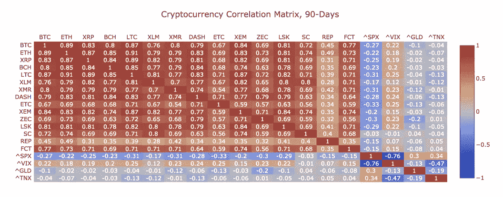

# 关于那些密码关联

> 原文：<https://medium.com/hackernoon/about-those-crypto-correlations-e68720707efe>

## 当股市波动时，比特币会波动吗？

> 投资加密货币的主要卖点之一是与大多数其他资产类别缺乏相关性。比特币创造了近 10 年，现在还是这样吗？

投资者在分析[加密货币](https://hackernoon.com/tagged/cryptocurrency)时会关注很多因素[比特币](https://hackernoon.com/tagged/bitcoin)，但其价格、波动性以及与其他资产类别的相关性通常是首要因素。

虽然比特币的价格和波动性得到了大量报道，但相关性的话题并没有得到应有的关注。考虑到相关性分析对于使用加密资产来分散其整体投资组合的投资者来说变得越来越重要，这一点尤其如此。

相关性是我们从第一天起就一直在思考的事情，坦率地说，它是开发有效篮子的关键因素。因此，重要的是后退一步，看看我们目前对密码相关性的了解。也许更重要的是——还有什么不知道。

# **关联哪个关联**

首先，重要的是要记住加密货币有两种主要的相关性:

*   加密货币之间的相关性(例如，BTC 的价格相对于瑞士法郎的走势)以及。
*   加密资产和传统资产之间的相关性(例如，BTC 的价格如何相对于标准普尔 500 变动)。

关于 BTC、ETH 和其他加密资产之间的相关性，当然有很多内容需要讨论，但现在让我们关注加密和传统资产类别之间的相关性。

理解比特币和其他加密货币的价格如何相对于股票、债券和大宗商品变动当然是一个发展中的不确定空间，但我们相信投资者有办法思考相关性，这可以帮助他们更好地理解所有这些可能的走向。

# **数字避风港**

在比特币的早期，*许多人认为这种新的数字货币将是完美的“避风港”资产*，这是一种不相关的替代品，不会受到影响更传统资产类别的宏观经济因素的影响。许多人说，长期购买比特币将确保你拥有一项与股市涨跌相关性最低的资产。

但是这仍然适用吗？

当然，答案并不完全非黑即白。虽然比特币和其他加密货币与股票、大宗商品甚至货币的相关性仍然很低，但最近出现了相关性增加的例子，这让许多人怀疑比特币是否真的是早期出售时的避险或避险价值储存手段。

对于一些最近的观点，让我们仔细看看比特币与其他市场相关性的一些可用数据。

今年早些时候，摩根大通的一份报告从整体投资组合多样化的角度分析了相关性。从本质上讲，他们使用现代投资组合理论考虑加密货币，就像他们考虑任何其他资产类别一样，评估加密资产将如何影响投资组合的风险回报特征。

除了发现加密波动性明显高于股票或商品外，[我们都很清楚](https://flipsidecrypto.com/blog/playingballwithbitcoinsvolatility/)，分析师还发现

> **虽然还不清楚加密资产在极端市场压力时期的表现如何，但它们可以提供多样化的好处，部分原因是它们与全球股票和债券的相关性极低。**

他们发现，过去 5 年，比特币与标准普尔 500、美国国债、黄金和其它大宗商品的相关性几乎为零。换句话说，投资组合的效率可以通过增加加密货币来提高。

最近，其他人观察到，加密和传统资产之间的相关性一直在上升。虽然看起来确实如此，但与其他市场相比，这些相关性仍然非常低。

在 5 月份的一份报告中，Bitwise Asset Management 发现比特币与股票和债券的相关性分别为 0.12 和 0.25(1.0 为完美相关性)。不像以前那样接近于零，但仍然很低。相比之下，Bitwise 强调，同期美国股市与国际股市的相关性为 0.88。

Sifr 数据[跟踪加密货币的相关性](https://www.sifrdata.com/cryptocurrency-correlation-matrix/)，截至 7 月 18 日，BTC 和标准普尔 500 指数的 90 天相关性为-0.27，表明加密货币和股票市场之间的关系持续疲软，而 BTC 与黄金市场的相关性为-0.1，表明同样缺乏相关性。

Sifr Data Crypto Correlation Matrix

这些低相关性是由于加密市场与股票和债券市场的回报驱动因素不同(例如，投资者采用、法律和监管发展)，股票和债券市场更多地是由经济增长、利率和公司利润等因素驱动的。

> 随着比特币变得越来越受欢迎，越来越多的人投资——尤其是机构投资者——它可能会变得越来越与传统市场相关。

相关程度将取决于许多因素，包括上面列出的因素，但理解这种新兴资产类别如何最适合更广泛的投资组合仍需要时间。

# **有些事情保持不变**

虽然加密资产和其他资产类别之间的相关性仍然很低，但有一点是始终如一的:就像股票一样，加密货币可能被夸大和定价过高。然而，围绕一些加密资产(这里是指 ico)的噪音并不意味着它们应该被视为风险过大或不可持续的投资。

由于目前密码市场的规模较小，破译密码市场和其他更发达市场之间的相关性趋势将继续具有挑战性。

但投资者不应忽视这种新兴资产类别在现实生活中的应用，其目前与其他市场缺乏相关性可能是最好的应用之一。

虽然没有灵丹妙药(就像任何其他类型的投资一样)，但风险总是存在的。如今，在投资者的投资组合中，加密资产绝对可以成为一种巨大的多样化优势。