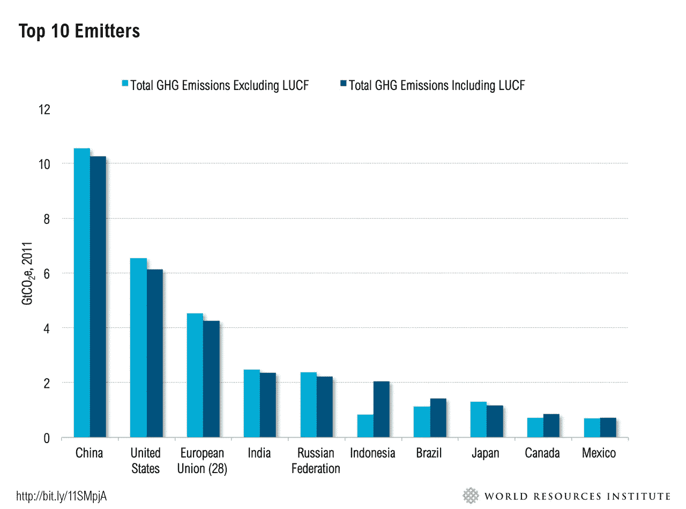

# 在杂音之上

> 原文：<https://medium.com/hackernoon/above-the-cacophony-fd6809fcd03a>

## 为什么世界需要一个草根全球合作的媒介

> "我对[每一个罐子]沉思，就像一个凡人的孩子从他的父母那里醒来一样温柔."
> 
> “我制作陶器是为了艺术，为了上帝，为了下一代，也为了——从目前的迹象来看——为了我自己的满足，但是当我离开后，我的作品……将会被珍视、尊重和珍惜。”—乔治·奥尔，密西西比州比洛克西的疯狂波特
> 
> “要获得成功，一个人需要高情商；如果你不想输得很快，你需要高智商，如果你想得到尊重，你需要高 LQ——爱的智商——阿里巴巴首席执行官马云

当世界各国领导人齐聚 2018 年达沃斯世界经济论坛**之际，脸书正试图重新定义其作为世界人口聚集地的目的。它理解社交媒体对影响实际结果的巨大影响，并在某种程度上试图削减其慷慨。虽然没有人否认社交媒体可能是一股更坏的力量，但也有必要考虑一个论坛，在这个论坛上，大众的智慧可以达成一致，并监测技术等全球性的变革。这篇文章提出了建立全球社交媒体论坛的必要性，在这个论坛上，世界可以聚集起来，就旨在应对人工智能(AI)、气候变化和不平等等全球大趋势的政策达成一致并提供反馈。有许多研究设计了解决世界问题的方案，但很少讨论对基层实时反馈机制的需求，该机制跟踪那些直接受变化影响的人的观点。**

*这篇文章认为，我们需要一个论坛来就更公平的社会达成一致，并监控不公平的优势和劣势。它提出了一个问题“我们是否混淆了平等和公平平等？”*

**当然，如果不为问题的最大促成者创造变革的激励机制，即激励资本所有者努力实现更公平的全球经济，这样的论坛就不会成功。这种观念不同于我们通常所说的追求平等，即经济不平等。尽管经济不平等是一个严重的问题，但摆在我们面前的一个更大的问题是:人类天生自私吗？也就是说，即使我们达到了众所周知的财富平等的乌托邦，是否至少会有一个人想要比其他人更富有？**

**就像上学一样，总有人想要第一吗？有可能，甚至在平等的人之间。**

*乔治·E·奥尔，又名比洛克西的疯狂波特，走在了他的时代的前面。他创作了他知道不会被他这一代人理解的陶器。他全心全意地投入工作，完全是为了满足自己。今天，我们比以往任何时候都更需要提前想出解决方案，以确保我们留给子孙后代一个珍惜的世界。*

# *人类心理学书中的一页*

*我清楚地记得我高中的最后一年。我带领一个由 5 名学生组成的团队进行一个科学项目，该项目旨在教育人们氯氟烃(CFC)对臭氧层的影响。臭氧层包围着地球大气层，保护我们免受有害的太阳紫外线辐射。我最生动的记忆之一是看到许多人嘲笑我们，因为他们觉得减少碳排放不是一个重要的优先事项。我问他们为什么，他们解释说*“…这个世界有很多迫在眉睫的问题要解决，以后总有时间解决气候变化问题”。**

*这样的解释让我心碎。想象一下，一个少年解释他的梦，被告知他的梦可以等等。实际上，它们并不重要。然而，今天，我盯着同一个问题，全世界都在谈论它。就个人而言，从一次明显的负面经历中我们学到了一个关键的经验，那就是每个人都是被激励所驱使的。没有一致的激励措施，就很难推动行动，更不用说激进的变革了。*

*大多数问题都可以通过帕累托分析或者 20%的参与者造成了 80%的问题来分析和解决。例如，任何减少碳排放的解决方案都必须包括最大的排放者。*

**

# *公平和相对性*

*假设有 10 个人，我们给他们每人 1 美元。这将是资源的平均分配。现在，让我们说，我们决定奖励相同的人按比例的努力，这将是一个不平等的，但在许多人看来，公平的分配。简而言之，这是一个两难的选择，代表着不平等但可能公平的结果。*

*还是那句话，公平也是一个相对的概念。然而，至少会有一部分人不支持奖励懒鬼。这也是普遍基本收入(UBI)作为一个概念所面临的一个问题。*

*公平和平等是相当微妙的问题。有人可能会说，在一个被人工智能扰乱的世界里，UBI 将会赢得时间，为所有人创造一个公平的竞争环境。*

*为了捕捉所有的细微差别，我们需要一个平台来捕捉世界各地人们的观点。*

# *为什么我们现在需要一个平台？*

*简单的答案是，我们正在开发的技术有可能造成生存威胁。这对一些人来说可能不是新闻，因为我们总是怀疑地看待深远的技术破坏，而且我们已经生存了这么久。那么，这次会有什么不同呢？*

*许多技术导致了金融泡沫，比如过去的网络泡沫和现在的首次发行硬币(ICO)。这些情况代表了席卷全球人民的经济海啸，然而各国对彻底变革的反应却截然不同。*

*想象一下，如果每个国家对自然资源枯竭或气候变化的反应都不一样，而很少有人看到整体的全球图景。或者，许多国家认为人工智能将是五十年后的威胁，因此，现在做出回应还为时过早。如果非常富有的人能够创造出一类超人，包括那些没有同情心的人，那么基因编辑可能会极大地加剧不平等。所有提到的三种情况将会以极快的速度席卷世界，几乎没有时间准备。*

*虽然世界上的知识分子已经开始思考影响整个人类的变化的长期影响，这无疑是一个优势，但也是时候让那些将直接受到基层影响的人，即普通人参与对话。*

*现在，想象一个平台，在这个平台上，我们与来自不同受影响方的群众或代表一起讨论处理变更的路线图。随后，同一批人可以对当地的实际情况进行实时评估。这个平台将致力于利用大众的智慧积极主动地解决我们的问题。创建这样一个平台的工具已经存在。建立在全球区块链上的平台，由对参与者负有信托责任的基金会支持。*

*许多人会说这样的想法在理论上听起来不错。我完全同意许多想法没有超越纸面。这绝对是其中一个想法。虽然平台是一个非常宏观的概念，但它不再是一个理论问题。相反，这是一场与时间的赛跑，全球合作是当务之急。*

# *当我们做的每件事都成为习惯时，什么是长期*

*有时候，我们必须停下来问自己:技术是为人类服务还是相反？我们需要我们正在走向的自动化程度吗？当然，最大的争论是自动化将削减成本和节省时间。对于许多应用来说，这个论点需要根据具体情况重新考虑。正如约翰·梅纳德·凯恩斯指出的..从长远来看，我们都死了”。但是，如果不是习惯的积累，长期来看又有什么意义呢？*

*我们所有人都犯有在社交媒体上花费时间追踪其他人的生活和世界各地不幸事件的罪行。相反，如果我们创建一个致力于定义和衡量积极变化的社交媒体会怎么样。让我们养成一个讨论解决方案的习惯。一个习惯将会塑造未来。由不和谐声音产生的交响乐。*