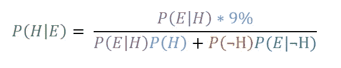

# 机器学习的绝对基础

> 原文：<https://medium.com/hackernoon/absolute-fundamentals-of-machine-learning-dca5deee78df>


[https://unsplash.com/photos/0E_vhMVqL9g](https://unsplash.com/photos/0E_vhMVqL9g)

机器学习，多么时髦的词。我相信你们都想了解机器学习，这也是我在这篇文章中要教授的内容。

我发现在学习编程的同时学习理论知识会让学习这两方面变得更容易，所以这篇文章的特点是既易于理解数学又易于理解用 Python 实现的算法。此外，技术会很快过时。本教程中使用的代码可能在 5 年后变得毫无意义。因此，我决定也教机器学习的数学方面，它不会在几年内消失。

# 什么是机器学习？

先说学习。学习是一个漫长而复杂的过程，但简而言之，它是将经验转化为知识。

机器学习是教机器如何学习，这听起来很疯狂，但实际上利用概率是可行的。

我高度推荐你阅读这篇关于概率的文章，因为它是机器学习和人工智能的重要基础。在本文中，我们将再次复习条件概率和贝叶斯理论。

# 学习的类型

机器学习有许多不同的方式，在这里我试着解释不同的类型。

## 监督学习

在监督学习中，我们从具有训练样本的数据集开始，每个样本都有一个标识它的分配标签。

这方面的一个例子如下:


Google ReCaptcha

我们希望机器能够识别饮料，因此我们向机器展示了 9 幅图像，其中一些包含饮料。然后我们选择包含饮料的图片，教计算机饮料是什么样子的。

它通过一种**学习算法来运行标记的数据。**监督学习的目标是能够正确识别提供给它的新数据，学会如何使用以前的数据集和学习算法识别数据。

## 无监督学习

无监督学习与有监督学习有很大不同，因为它几乎总是没有确定的输出。学习代理旨在发现数据中的结构或模式。

一篇关于无监督学习的好文章可以在这里找到[。](/machine-learning-for-humans/unsupervised-learning-f45587588294)

## 强化学习

强化学习是学习者因其行为受到奖励和惩罚的地方。奖励可以简单地是效用，代理人可以被告知接受尽可能多的效用以“获胜”。这里的效用可能只是一个正态变量。

强化学习的一个很好的例子是:

# 机器学习

现在我们理解了机器学习的一些术语，我们实际上要教机器一些东西。为了做到这一点，我们需要学习一点概率。

这里的大部分概率都是直接从我写的另一篇关于概率的博文中抄袭来的，但我在这里只包括机器学习所需的重要部分。

# 条件概率

条件概率是指一个事件只有在另一个事件已经发生的情况下才会发生。让我们从一个简单的问题开始:

```
John's favourite programming languages are Haskell and x86 Assembley. Let A represent the event that he forces a class to learn Haskell and B represent the event that he forces a class to learn x86 Assembley.On a randomly selected day, John is taken over by Satan himself, so the probability of P(A) is 0.6 and the probability of P(B) is 0.4 and the conditional probability that he teaches Haskell, given that he has taught x86 Assembley that day is P(A|B) = 0.7.Based on the information, what is P(B|A), the conditional probability that John teaches x86 Assembley given that he taught Haskell, rounded to the nearest hundredth?
```

因此概率 P(A 和 B)= P(A | B)* P(B)；将“|”读作给定，如在中，“A|B”读作“给定 B”。也可以写成 P(B|A) * P(A)。

之所以是 P(A|B) * P(B)是因为给定“给定 B 发生的概率，A 发生”的概率和 B 的概率 asP(B)。(A|B)是与 P(B)不同的概率，P(A 和 B)只有在 P(B)发生时才能发生，而 P(B|A)又允许 P(B | A)发生。

所以我们可以把它转换成一个数学公式:

```
P(A and B) = P(A|B) * P(B) = 0.7 * 0.5 = 0.35Solving it
P(B|A) * P(A)
P(A) = 0.5
So
0.6 * P(B|A)
Now we don't know what P(B|A) is, but we want to find out. We know that P(B|A) must be a part of P(A and B) because P(A and B) is the probability that both of these events happen so...P(A and B) = 0.350.35 = P(B|A) * 0.5
With simple algebraic manipulation
0.35/0.5 = P(B|A)
P(B|A) = 0.7
```

# 贝叶斯定理

贝叶斯定理允许我们在已知事件的先验知识的情况下计算出事件的概率。与其说它是一个定理，不如说它是一个观察结果，因为它总是正确地工作。贝叶斯定理是由托马斯·贝叶斯创立的，他在一个笔记本上记录了这个观察结果。他从未发表过它，所以他在有生之年没有因为他著名的理论而遭到反对。


From [https://betterexplained.com/articles/colorized-math-equations/](https://betterexplained.com/articles/colorized-math-equations/)

很困惑，对吧？让我们看一个例子。

```
Suppose a new drug is found on the streets and the police want to identify whether someone is a user or not.The drug is 99% sensitive, that is that the proportion of people who are correctly identified as taking the drug.The drug is 99% specific, that is that the proportion of people who are correctly identified as not taking the drug.Note: there is a 1% false positive rate for both users and non users.Suppose that 0.5% of people at John Moores (A rival university) takes the drug. What is the probability that a randomly selected John Moores student with a positive test is a user?
```

让我们给这个着色，然后把它放进等式里


注意:我们不直接知道阳性测试实际上是阳性的机会，它不是给我们的，所以我们必须计算它，这就是为什么公式在第二部分扩展了分母。

## 用贝叶斯理论学习

现在，贝叶斯定理不是被设计成只能用一次的。它设计用于处理连续数据。贝耶最初用一个思维实验创造了这个。他想知道，如果他的助手在桌子上扔一个球，他能预测它会落在哪里吗？

贝耶要求他的助手这样做。然后，告诉他它是在原来位置的左边还是右边。他记下了它击中的每一个点，随着时间的推移，每次投掷，他都能更好地预测它会落在哪里。这就是贝叶斯理论发挥作用的地方，通过重复使用贝叶斯理论，我们可以计算出球可能会更准确地落在哪里。

让我们做一个简单的例子来得到一些数字:


Medium doesn’t support colours, so I have to copy and paste images. Sorry!

那么，如果你去了另一家医院，获得了第二个意见，并由不同的实验室再次进行测试，会发生什么呢？这个测试也是阳性的，那么你得这种病的可能性有多大呢？

我们把测试前患病的概率改为 9%，所以看起来是这样的:



现在新的数字是 0.9073319 或 91%的患病几率。

有道理，两个不同实验室的两个阳性结果不太可能是一致的。如果你做了更多的实验，结果都是阳性，这个数字会逐渐增加到 100%。

# 朴素贝叶斯分类器

朴素贝叶斯分类器是一种基于贝叶斯理论的分类器，它假设预测器之间是独立的。朴素贝叶斯分类器假设特定特征的存在与任何其他特征的存在无关。例如，如果一个水果是红色的，圆形的，直径大约 3 英寸，就可以被认为是苹果。即使这些特征相互依赖或依赖于苹果所有其他特征的存在，所有这些都有助于该水果是苹果的概率，这就是为什么这种分类器被称为“幼稚”。

维基百科说得好:

> 简而言之，朴素贝叶斯分类器假定在给定类变量的情况下，类的特定特征的存在(或不存在)与任何其他特征的存在(或不存在)无关。例如，如果一个水果是红色的、圆形的、直径约为 4 英寸，那么它可以被认为是苹果。即使这些特征相互依赖或依赖于其他特征的存在，朴素贝叶斯分类器也会考虑所有这些属性，以独立地影响该水果是苹果的概率。

**问题**

假设我们有两个数据集，“游戏”和“天气”。我们想看看在这种天气下打球的可能性。


Image from [https://www.analyticsvidhya.com/blog/2017/09/naive-bayes-explained/](https://www.analyticsvidhya.com/blog/2017/09/naive-bayes-explained/)

1.  第一步是将数据转换成频率表
2.  第二步是创建一个可能性表，通过找到像阴天= 0.29 这样的概率，玩的概率是 4 / 14(其中 14 是他们玩的总次数)，4 是他们以前在那种天气玩的次数。
3.  现在使用奈伊夫贝叶斯方程来计算每个类的条件概率。

这里有一个使用上述数据和等式解决的问题示例。

**“如果天气晴朗，球员们就会比赛”这句话对吗？**

P(是|晴)= P(晴|是)* P(是)/P(晴)

记得贝叶斯定理吗？这是相同的，但是输入了变量名，以便于阅读。

```
Now we have P(Sunny|Yes) = 3/9 = 0.33.
P(Sunny) = 5/14 = 0.36\. 
P(yes) = 9/14 = 0.64Now using Bayes Therom we can work out
P(Yes|Sunny) = 0.33 * 0.674 / 0.36 = 0.60 which has high probability.Thus, given that it is sunny, there is a 60% chance they will play.
```

# 使用 Python 的机器学习

哇，这是一个多么无聊的阅读。我听到你说“理论计算机科学很无聊”。好吧，你会很兴奋地知道下一部分是关于使用 Python 的机器学习的应用。

我们用机器学习来计算一下一封邮件是垃圾邮件还是 ham(也就是正常的邮件)。

因此，考虑到大量的垃圾邮件，我们需要训练这个模型。我们首先计算每封邮件中的每个单词在垃圾邮件和业余邮件中出现的次数。

然后，我们将使用一个公式来计算每个单词的“spaminess”级别。我们将使用的公式非常简单。


因此，分子(上面的数字)显示该词在垃圾邮件中出现的次数，分母(底部)显示它在任何电子邮件中出现的次数。

因此，假设有 9 封垃圾邮件和 10 封垃圾邮件，总共 19 封。如果一个单词出现在 9 封垃圾邮件中，但有 1 封是垃圾邮件，那么等式是 9/10，这就给了我们 90%的机会，这个单词意味着它是一封垃圾邮件。

但是我们不能简单地只计算一个单词，我们需要对邮件中的所有单词都这样做。

我们基本上有 3 个步骤:

1.  查找邮件中每个单词的垃圾信息。
2.  找出一封邮件的垃圾邮件总数，比如通过乘以每个单词的垃圾邮件等级。这叫 S[M]。
3.  然后，通过将每个单词的(1-spaminess)级别相乘，找出每个单词的含意。这叫 H[M]。

然后，如果 S[M] > H[M]，则该消息是垃圾邮件，否则是垃圾邮件。

好的，让我们来实现它。我们将只使用电子邮件的正文，为了便于解释，不会有很多电子邮件。此外，垃圾邮件非常明显。下面是我正在使用的不良电子邮件文本文件

```
Viagra for sale, get sexy body soon!
U want sum viagra bby? u sexy s00n
VIAGRA VIAGRA VIAGRA VIAGRA VIAGRA
SEXY SOON VIAGRA PLEASE YASSSSS 
VIAGRA BUY PLEASE
I really like today
```

还有好的邮件

```
Hello, how are you?
I hope you have the work ready for January the 8th.
Do you like cats or dogs?
Viagra
viagra
```

所以第一步是以某种方式获取这个文件并将其拆分。

该代码读取文件，并将其拆分为新的一行，产生 2 个列表。列表如下所示。下面是坏邮件

```
['Viagra for sale, get sexy body soon!', 'U want sum viagra bby? u sexy s00n', 'VIAGRA VIAGRA VIAGRA VIAGRA VIAGRA', 'SEXY SOON VIAGRA PLEASE YASSSSS ', 'VIAGRA BUY PLEASE', 'I really like today']
```

还有好的邮件

```
['Hello, how are you?', 'I hope you have the work ready for January the 8th.', 'Do you like cats or dogs?', 'Viagra', 'viagra']
```

好了，现在我们需要计算每个单词的 spaminess。我们找到这个词，看看它在坏邮件中出现了多少次，在好邮件中出现了多少次，基本公式如下:


因此，为了找出坏的和好的电子邮件中出现了多少单词，我们可以使用嵌套的 for 循环；但我选择在这里发挥一点作用。

所以，第一行是一个 lambda(匿名)函数，它只是把一个列表变成一个列表。匿名函数是只打算使用一次或两次的函数。第二行和第三行也是如此。首先，他们将函数“x.split(" ")映射到列表中的每封电子邮件，生成电子邮件中单词列表的新列表，然后他们应用 flatten 函数将列表列表合并为一个列表。

现在我们有两个列表，一个包含一封糟糕邮件中的所有单词，一个包含一封好邮件中的所有好单词。

现在我们创建一个函数来计算一个单词的垃圾程度。首先，它计算一个单词在坏邮件中出现的次数。然后统计它在两封邮件中出现的次数。然后返回它在坏邮件中出现的次数除以它在所有邮件中出现的次数。

现在，我们需要一本包含每个单词及其语法等级的词典。

word_Dict 现在将返回

```
{'body': 1.0, '': 1.0, 'want': 1.0, 'get': 1.0, 'I': 0.5, 'January': 0.0, 's00n': 1.0, 'SOON': 1.0, 'you?': 0.0, 'dogs?': 0.0, 'sale,': 1.0, 'U': 1.0, 'are': 0.0, 'Viagra': 0.5, 'sexy': 1.0, 'ready': 0.0, 'SEXY': 1.0, 'the': 0.0, '8th.': 0.0, 'really': 1.0, 'Do': 0.0, 'Hello,': 0.0, 'BUY': 1.0, 'bby?': 1.0, 'like': 0.5, 'for': 0.5, 'sum': 1.0, 'work': 0.0, 'PLEASE': 1.0, 'VIAGRA': 1.0, 'YASSSSS': 1.0, 'how': 0.0, 'viagra': 0.5, 'cats': 0.0, 'u': 1.0, 'hope': 0.0, 'have': 0.0, 'you': 0.0, 'or': 0.0, 'today': 1.0, 'soon!': 1.0}
```

给定一条消息，这段代码将通过乘以每个单词的垃圾程度来计算这条消息有多垃圾。haskell 中的 reduce 函数是 foldl，它接受一个列表和一个函数，并通过将函数应用于列表中的每一项来返回一个值。在这种情况下，给定一个[x，y，x，y，x，y]列表，它将乘以 x*y，然后将它们相加。

现在我们需要找到每条信息的含意，这并不困难，因为我们可以找到 spaminess。

哈密尔顿是 spaminess

现在我们只需要创建一个函数来确定它是垃圾邮件还是火腿。

如果是真的，就是垃圾邮件，如果不是；是火腿。很明显，对于如此有限的数据集来说，这不会很好，但如果我们有数千封电子邮件，这应该会很好，尽管最初的启动时间很慢。

我们刚刚使用了 naieve bayes 分类器——一种基于监督机器学习的垃圾邮件检测方法。听起来是不是很酷？

# k-最近邻

像上面的 Naieve Bayes 一样，让我们创建一个关于 K-最近邻的直觉。

让我们从一些事实开始来建立这种直觉。

点是一个位置。它没有大小，但就像任何位置一样，它会告诉你东西在哪里。它可以用不同的方式来表示，这取决于它存在于多少个维度中。

线是一维对象。我们可以用这样的线来表示一个位置


假设这条线从数字 3 开始，到数字 9 结束，那么位置就是 3 到 9 之间的任何数字。在这个图中，它被表示为 x。

在二维物体中，比如正方形，我们可以用 X 和 Y 坐标来表示位置。


使用 X 和 Y 坐标可以到达这个正方形中的任何位置。

立方体是一个三维的正方形，我们可以用 3 个坐标来表示它的位置


Taken from [here](http://www.petercollingridge.co.uk/book/export/html/460)

几何中的点是一个位置。它没有大小，即没有宽度、长度和深度。一个点由一个点表示。

所以 n 维空间中的一个点需要 n 个坐标来表示。我们发现很难想象任何超过三维空间的东西(因为我们的世界是三维的)。

一个 n 维空间用一个 n 维**超立方体**来表示。

超立方体只是一个花哨的词，意思是任何位置都可以表示为 n 个数的元组。

现在，回到阻止垃圾邮件的例子。任何电子邮件都可以表示为超立方体中的一个点。

比方说，我们有一个列表，里面列出了所有可能出现在电子邮件中的单词。

所以有:

```
W1, W2, ..., Wn 
```

列表中的单词。让我们简单点，比如说电子邮件中出现的每一个单词都是

```
('Hello', 'Goodbye', 'Email', 'Cheese', 'United Kingdom')
```

为了简单起见，我们将假设在电子邮件中只有这些词是可能的。

每封电子邮件都会包含上述单词的子集，如下所示:

“你好，奶酪。”或者“英国，再见。”

这些消息中的每一条都可以表示为 1 和 0 的列表，就像位向量一样。

所以对于第一条信息:

```
('Hello', 'Cheese')
(1, 0, 0, 1, 0)
```

因此，我们简单地将电子邮件和所有可能单词中的单词转化为 1，在这个例子中，第一个元素“Hello”和第四个元素“cheese”转化为 1。

所以现在我们把一条信息转化成一个 n 维超立方体中的一个点。

现在，我们希望对我们想要分类的电子邮件以及我们保存信息的每封电子邮件都这样做。所以我们有训练数据，和要分类的消息。

现在我们在一个 n 维超立方体中有一堆点，我们想计算每个点之间的距离。有许多方法可以计算距离。我们将在这里使用 [**欧几里德距离公式**](https://en.wikipedia.org/wiki/Euclidean_distance) 。


Taken from [here](https://hlab.stanford.edu/brian/making7.gif). More on this later.

当我们插入要分类的新邮件时，我们会检查它最近的邻居。如果它附近的大部分邮件都是垃圾邮件，那么该邮件很可能就是垃圾邮件。但是如果它附近的邮件大部分是火腿，那么这个邮件很可能是火腿。


The feature space for spam and ham emails

我们对训练数据进行了分类，这是它在图表上的样子。当我们把要分类的电子邮件放入其中时，图表看起来会像这样:


Feature space

我们知道要分类的电子邮件放在哪里，因为我们之前已经将它转换为一组坐标。


Feature space

我们在要分类的电子邮件周围画一个圆圈，因为大多数垃圾邮件都在圆圈内，所以我们将此电子邮件标记为垃圾邮件。这个比现实稍微简单一点。

当我们将每封电子邮件分类为包含 0 和 1 的位向量时，通常我们会对电子邮件的子集进行哈希运算，并使用它来代替，距离可能不是一个简单的欧几里德公式，而是一个更复杂的公式，在训练中效果很好。

## 距离测量

我说过欧几里德距离是计算距离的一种方法，在这一节我会多讲一点。

欧几里德距离用于**定量的**数据，即只有数字的数据。

## 什么是「欧氏距离」？

首先让我们回到毕达哥拉斯的理论。我们都记得它是


Taken from [here](http://cdn.pythagorasandthat.co.uk/wp-content/uploads/2014/07/pythagoras-theorem-1024x675.png)

但是毕达哥拉斯的理论可以应用于许多实例。简而言之，就是求直角两点之间的距离。假设你向东走 3 米，向北走 4 米，你离最初的源头有多远？嗯，直线距离 5 米。如果你想进一步了解毕达哥拉斯公式是如何被用来计算距离的，请阅读这篇文章:

[](https://betterexplained.com/articles/measure-any-distance-with-the-pythagorean-theorem/) [## 如何用勾股定理测量任意距离

### 我们一直低估了勾股定理。这与三角形无关；它适用于任何形状。这不是…

betterexplained.com](https://betterexplained.com/articles/measure-any-distance-with-the-pythagorean-theorem/) 

欧几里德距离的实际公式是:


注意这和毕达哥拉斯的理论非常相似。

假设我们有这张桌子:


我们想要找出这两辆车之间的距离，因此我们将这些值插入欧几里德距离公式，如下所示:


因此，距离大约为 220。

## 定性数据呢？

定性数据是不能用数字表示的数据。让我们试一个例子:


Table inspired by slides from Frank Wolter, AI Lectuer @ UoL

假设您有 4 天的天气数据，以及学校里的孩子是否在休息时间玩耍。这里没有数字，所以我们不能用欧几里德距离。你不能对像“阳光”这样的概念求平方，也不能对由此产生的概念求平方根。

所以我们必须找到一种不同的方法来衡量一天和另一天有多近。让我们看看第一天和第三天。他们有多相似？有一种同样自然的方法，我们只需计算相同日期的特征的数量。

所以第 1 天和第 2 天除了风之外都有相同的特征，所以我们给它的距离是 1。我们计算不同特征的数量。

所以第 1 天和第 3 天的距离是 2。

你可以很容易地根据你认为更重要的东西来改变这个方法，这个方法不是一个放之四海而皆准的方法，而是一个你作为一个人类(而不是人工智能；希望)需要决定。

## “邻居”的定义是什么

你可能已经注意到了一些奇怪的东西，我没有在这里详述:


Feature space

圆的大小是怎么决定的？好问题。这是学习中非常典型的问题。你想要最近的 3 个邻居还是最近的 20 个邻居？这取决于你的训练数据。这完全取决于你。

## 用 Python 实现 K 近邻

现在我们了解了 K 近邻，让我们用 Python 来实现它。这是我们将使用的逗号分隔值(CSV)格式的数据。

注:本节使用此处[、此处](https://machinelearningmastery.com/tutorial-to-implement-k-nearest-neighbors-in-python-from-scratch/) [、此处](https://kevinzakka.github.io/2016/07/13/k-nearest-neighbor/)的代码。

通过运行以下命令，在这里下载文件

```
wget [https://archive.ics.uci.edu/ml/machine-learning-databases/iris/iris.data](https://archive.ics.uci.edu/ml/machine-learning-databases/iris/iris.data)
```

在终端中或通过选择网站上的所有行，将它们复制并粘贴到名为 **iris.data** 的文本文件中。

接下来，我们要像这样读入数据:

csv 模块允许我们处理逗号分隔值(CSV)文件。如果您通过在代码中添加以下内容来打印它

您将得到类似这样的输出，但时间要长得多。

```
6.5, 3.2, 5.1, 2.0, Iris-virginica
6.4, 2.7, 5.3, 1.9, Iris-virginica
6.8, 3.0, 5.5, 2.1, Iris-virginica
5.7, 2.5, 5.0, 2.0, Iris-virginica
5.8, 2.8, 5.1, 2.4, Iris-virginica
6.4, 3.2, 5.3, 2.3, Iris-virginica
```

现在我们需要制作 2 个数据集，一个是训练数据集，另一个是测试数据集。训练数据集用于允许 K 近邻(KNN)进行预测(注意:KNN 不*概括*数据)

我们刚刚加载的文件是作为字符串加载的，所以我们需要将它们转换成我们可以处理的数字，然后我们需要将数据集随机分成训练和测试数据集。2/3 用于培训，1/3 用于测试是通常使用的标准比率。

给读者的提示:我很难自己尝试导入虹膜数据，所以这段代码完全是从这里的[复制过来的](https://machinelearningmastery.com/tutorial-to-implement-k-nearest-neighbors-in-python-from-scratch/)。

现在我们要计算 2 个点之间的欧几里德距离，由于花数据集大部分是数字，最后是一个小字符串，我们可以只使用欧几里德距离，忽略最后一个特征。

哇哦。那是什么？这是函数式编程。我刚刚完成了为期 12 周的函数式编程课程，正如我的老师所说:

> 到 12 周结束的时候，你将会对你读到的每一点代码都说“这可以用一行函数来完成”

让我们快速地从人工智能转移到这个功能代码上来。对于函数式，最好是从内向外阅读，所以我们将从代码的第一个函数位开始

注意:remove_flowers 函数将在后面讨论，但是如果没有这个函数，它将在后面的代码中导致错误。remove_flowers 只是把一个数据项像

```
5.0,3.4,1.5,0.2,Iris-setosa
```

到…里面

```
5.0,3.4,1.5,0.2
```

Map 是一个将函数应用于列表中每一项的函数。它应用的函数是 lambda(匿名)函数。lambda 函数是一个只用于一个目的的函数，所以它不需要有自己的 define 语句。lambda 的语法如下所示:

```
Lambda var1, var2: calculation
```

在这个例子中，我们有两个变量，x 和 y，我们把它们放入毕达哥拉斯的定理中。映射语法是:

```
map ( function, list)
```

但是我们的映射有两个列表，X 和 y。当它进行数学运算时，它获取 list1 的第一个元素并将其转换为一个名为 X 的变量，然后获取 list2 的第二个元素并将其转换为一个名为 y 的变量。这样做直到两个列表中的所有项目都完成。

最后一部分，list，把我们的地图变成一个列表。所以我们得到了一个列表，包含了毕达哥拉斯对列表 1 和列表 2 中每一项的输出，这只是

```
[4, 4, 4]
```

我们的下一段代码是

现在我们知道了 list(map(…我们是否可以忽略它，把它当作一个返回[4，4，4]的函数。

所以留给我们这个时髦的函数:

现在，reduce 只是来自 Haskell 的 foldl，但用 Python 实现。它接受一个列表并把它转换成一个值。它通过将一个函数应用于一个列表来实现这一点。它应用的函数也是一个 lambda 函数，将 x 和 y 相加。x 和 y 是什么？假设我们有这样一个列表

```
[1, 2, 3]
```

然后当我们加上 x + y，我们得到

```
[1, 2, 3]
x = 1, y = 2
1 + 2 = 3
x = 3, y = 3
x + y = 6
```

现在，我们知道 lambda 函数在 reduce 里面做了什么，它应用于什么列表？嗯，reduce 是将我们之前的 map 函数生成的列表转换成一个值。

所以 list 取[4，4，4]并把它们加在一起。4 + 4 + 4 = 12.所以输出是 12。

现在我们只需要找到它的平方根，这很简单。

虽然这可能不可读，但一旦你了解一些函数式编程，就很容易理解了。

有一个小错误，所有的花都以一个字符串结尾，代表它是什么花。我们不能对它进行数学运算，所以我们必须使用这个函数

我们传递给欧几里德距离函数。

现在我们需要找出从训练集中的每个项目到测试集中的项目的距离。

这段代码简单地将一个 lambda(匿名)函数映射到训练集和测试集中的每个元素，该函数查找两个元素之间的距离，并在一个列表中返回这些距离。然后，第二部分以相应的距离将元素拉在一起。所以第一部分返回

```
[3.4641016151377544, 0.0]
```

当给定这些参数时

```
trainSet = [[2, 2, 2, 'a'], [4, 4, 4, 'b']]testInstance = [4, 4, 4]k = 1
```

第二部分返回这个

```
[([2, 2, 2, ‘a’], 3.4641016151377544), ([4, 4, 4, ‘b’], 0.0)]
```

代码的最后一部分对代码进行排序，并返回 K 个邻居，在本例中 K = 1，所以它只返回

```
[[4, 4, 4, 'b']]
```

接下来我们需要投票决定 K 可能是什么，现在我们知道了它的邻居。我们将创建一个投票系统。每个邻居将对其属性(即它是什么)进行投票，多数投票将作为预测。因此，如果它的大多数邻居属于“a”类，那么预测将属于“a”类。

所以这只是通过所有最近的邻居，并保持一个字典。字典就是花名+出现次数。每朵花为它们的类型投票到字典中，字典被排序，所以投票最多的出现在字典的第一项中，然后返回预测的花。

仅此而已。我们已经建立了一个 K 近邻分类器。如果你想阅读更多关于实现这个算法的内容，我建议你阅读[这个](https://machinelearningmastery.com/tutorial-to-implement-k-nearest-neighbors-in-python-from-scratch/)或者[这个](https://www.dataquest.io/blog/k-nearest-neighbors-in-python/)。

# k 近邻 vs 朴素贝叶斯

何时实现 KNN 或奈伊夫·贝叶斯完全取决于你。两者都有一些优点和缺点，所以我在这里列出来:

**K 近邻优势**

*   简单但有效
*   只有一个参数 K 可以通过交叉验证轻松学习

**K-最近邻缺点**

*   最近是什么意思？需要定义一个距离度量
*   计算成本—必须在测试时存储和搜索整个训练集。

注意:网飞进步奖获得者[实际上是 K 近邻。](http://cs229.stanford.edu/proj2006/HongTsamis-KNNForNetflix.pdf)

**奈伊夫·贝叶斯的优势**

*   实现起来非常简单
*   需要较少的训练数据
*   可以概括数据

**朴素贝叶斯的缺点**

*   数据越多，准确度越高，所以要达到 95%或更高的准确度，你需要大量的数据
*   [强独立性假设](https://stats.stackexchange.com/questions/183056/what-does-it-mean-disadvantage-of-naive-bayes-classifier-strong-feature-indepe)

你现在应该在机器学习方面有了坚实的基础。我决定教你定义这些算法的基础数学和理论，而不是教你一种很可能在 3 年内被取代的算法，然后展示两种可能会存在一段时间的最广泛使用的算法。

# 请随时与我联系:

[LinkedIn](https://www.linkedin.com/in/brandonls/) | [GitHub](https://github.com/brandonskerritt/)