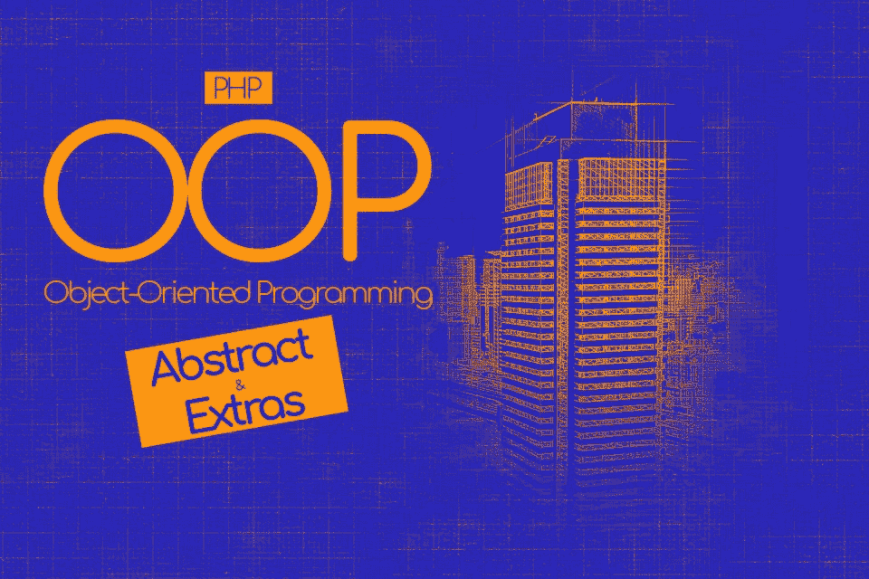
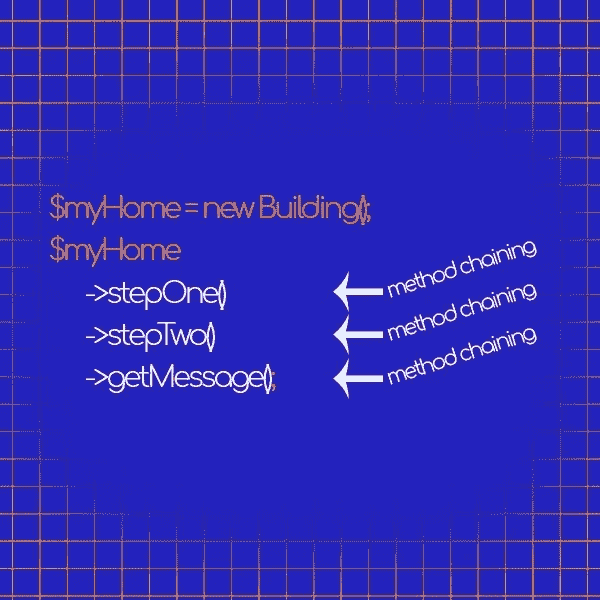

# 抽象类和 OOP extras

> 原文：<https://medium.com/hackernoon/abstract-classes-and-oop-extras-d087eeb1aca9>



# 介绍

本系列的最后一章。

如果您已经阅读了这些博客文章，那么您现在完全有能力使用面向对象的范例来创建项目。

我很高兴你已经完成了所有的部分，在这一部分，你将结束你已经开始的。

事实上，

现在你将学习如何使用抽象类和 PHP 其他一些不常用的特性，比如反射 API 和单例设计模式。

继续读下去，你会发现，和包括我在内的许多其他 web 开发人员一样，这些资源会让你实现你正在寻找的突破。

# 跟随系列…

这篇博文是“ [**面向对象编程完全指南:**](https://amzn.to/2OfCZej) 的第六部分

在 [PHP](https://hackernoon.com/tagged/php) 中从过程化编程成为 OOP 专家。”

如果你还没有阅读其他部分

你可以查看下面链接的其他博客文章
[【面向对象编程简介】](http://anastasionico.uk/blog/the-complete-guide-to-object-oriented-programming)
[PHP 中的继承和接口](http://anastasionico.uk/blog/inheritance-and-interfaces-in-php)
[更多接口和多态](http://anastasionico.uk/blog/interfaces-and-polymorphism-in-php)
[可见性和静态关键字](http://anastasionico.uk/blog/visibility-and-static-keyword-in-php)
[构造函数和魔法方法](http://anastasionico.uk/blog/php-magic-methods)和
[抽象类和额外的位](http://anastasionico.uk/blog/abstract-classes-and-oop-extras)

# 目录

*   [抽象类](http://anastasionico.uk/blog/abstract-classes-and-oop-extras#abstract)
*   [方法链接](http://anastasionico.uk/blog/abstract-classes-and-oop-extras#chaining)
*   [自动加载](http://anastasionico.uk/blog/abstract-classes-and-oop-extras#autoloading)
*   [匿名类](http://anastasionico.uk/blog/abstract-classes-and-oop-extras#anonymous)
*   [反射 API](http://anastasionico.uk/blog/abstract-classes-and-oop-extras#reflection)
*   [单身](http://anastasionico.uk/blog/abstract-classes-and-oop-extras#singleton)

# 抽象类

抽象类与接口非常相似，但是它们有不同的规则，web 开发人员需要了解这些规则。

定义非常简单，基本上，抽象类是包含抽象方法的类，

抽象方法是代码中已经声明但没有实现的方法。

这类类不能被构造成一个对象，事实上，它们需要被扩展。

扩展抽象类的“普通”类必须实现父类中的所有方法。

需要注意的是，子类必须用相同或更少限制的可见性定义抽象方法，

这意味着，如果抽象类中有一个受保护的方法，它只能作为公共方法或受保护方法来实现。

另一个规则是，所需参数的数量和类型需要与形参相同。

```
abstract class Building { abstract protected function getWindowsCount(); public function __construct() { echo “Building cannot be constructed”; }}class Office extends Building { public function getWindowsCount() { return 12; }}$myOffice = new Office;// This command will return “Building cannot be constructed”$myOffice->getWindowsCount();// This command will return 12
```

我已经定义了扩展抽象类*建筑*的 Office 类。

我已经实现了 *getWindowsCount()* ，并将其可见性从 protected 更改为 public。

在 *Office* 类中没有抽象方法，因此，我可以从它构造一个对象。

我在抽象类中添加了一个构造函数，这样你就能意识到当对象被实例化时，父类的构造函数被调用了。

接口和抽象类的区别是什么？

总而言之，

**把一个接口当做一个空壳。**

**它只有方法的签名，这意味着方法没有主体。**

接口不做任何事情，它只是一个模式，一组你需要复制的方法。

另一方面，抽象类是适当的类。

**尽管它们看起来像具有某些特定特征的接口。**

您可以通过给定的方法名来指定它们的用途。

下面的例子突出了两者之间的区别:

```
interface Building{ public function build(); public function getWindowsCount();}class Office implements Building{ public $windows; public function build() { echo “Office built”; } public function getWindowsCount() { return $this->windows; }}
```

在这里，我们说所有的建筑应该看起来像这样，而不是由 *Office* 类来改变功能。

```
abstract class Building
{
    public $windows;
    public function getWindowsCount()
    {
         return $this->windows;
    }
    abstract public function build();
}class Office extends Building
{
    public function build()
    {
        echo “Office built”;
    } 
}
```

相反，在抽象类中，我们是说所有的建筑都必须有 *getWindowsCount()* 。

然后我们说方法 *build()* 可以不同，所以我们预留了 *Office* 类根据其需求提供实现。

# 额外/奖金

我们差不多已经完成了 PHP 中面向对象编程的介绍，

很多信息已经被分享，我希望你能全部理解(如果没有，请在下面写下你的问题)。

然而，有几件事情刚刚被快速提到，我很想更深入地让你对这个话题有一个更广泛的理解。

# 方法链接

方法链是一种 OOP 技术，它允许程序员以一种连续的方式执行几个不同但相关的动作。

我们把这句话分解一下，
“执行不同的动作”是指调用不同的方法或函数；



**执行关联动作**可以翻译成与类的相同对象或实例相关的动作；

**按顺序**简单的说就是一个接一个的调用方法。

这里有一个例子可以阐明这个概念:

```
class Building{ public $message; function __construct() { $this->message = "Foundation poured - "; } function stepOne() { $this->message .= "framing, plumbing, electrical and HVAC completed -"; return $this; } function stepTwo() { $this->message .= "interior and exterior completed"; return $this; } function getMessage() { return $this->message; }}$myHome = new Building();echo $myHome->stepOne()->stepTwo()->getMessage();
```

给你，

**所有*构建*类的方法都有一个共同的特点，它们都通过使用关键字 *$this* ，**返回对象本身

如果你需要重温一下你的记忆，我已经在[面向对象编程介绍](http://anastasionico.uk/blog/the-complete-guide-to-object-oriented-programming)中解释了 *$this* 关键字的作用。

最后一个命令是链接该类中所有必要的方法，以便构建我们的句子。

最后一个命令的结果如下所示:

“基础浇筑—框架、管道、电气和 HVAC 完成—内部和外部完成”。

这非常简单，您可以毫无问题地直接在代码中实现它，只是要小心返回对象。

# 半自动的

任何类在需要使用之前都必须定义，

忘记这样做将导致抛出一个错误。

PSR-4 标准旁边的自动加载允许您在需要类别时定义它们。

我确信我不需要说这是一个非常重要的特性。

**在 PHP 中，自动加载是由*spl _ autoload _ register()*完成的，它接受一个函数作为参数，**

这完全是题外话，为了详细解释它是如何工作的，我需要再写一篇文章，

所以我会给你一个容易理解的例子:

假设您想要自动加载的类位于“classes/”路径中，

你应该这么做。

这或多或少是大多数 PHP 开发框架背后发生的事情。

```
function myAutoloader($className) { include 'classes/' . $className . '.php';}spl_autoload_register(myAutoloader);
```

spl_autoload_register 还有两个参数，

第二个是布尔值，定义当 autoload_function 无法注册时 *spl_autoload_register* 是否需要抛出异常，

第三个参数也是 boolean，如果为 true，它将预先设置自动加载程序，而不是附加它。

如果发生错误，并且函数无法找到指定的类，它将抛出致命错误。

# 匿名类

如果 PHP 允许 web 开发人员动态地创建和实例化对象，这不是很好吗？

PHP 7 的发行版在其特性列表中包括了这个礼物。

```
$myAnonymousBuilding = new class(“Main Street”){ public function __construct(string $address) { echo “a new class has been constructed in ” . $address; }}
```

很酷，对吧？

注意，内嵌实现这个类是多么容易，它甚至可以像普通类一样接受参数。

示例中的代码将输出字符串“Main Street 中构造了一个新类”。

匿名类的主要用途是在需要扩展命名类的情况下。

例如，如果您需要覆盖属性或方法，而不是声明它，您可以在您当前拥有的同一工作流中创建一个内嵌实现。

# 反射 API

反射是一个非常有用的特性，随着 PHP 5.0 的发布而引入，并在 5.3 以后成为一个标准。

**这个 API 允许你在运行时检查 PHP 元素并获取关于它们的信息。**

对我来说，

使用反射 API 最有用的地方之一是在自动化测试中，特别是在 PHP 单元中。

例如，当测试类中私有属性的值时，可以通过 API 输入属性，然后根据测试做出断言。

有不同的反射类，每一个都允许你检查不同类型的变量。

以下是一些类别:

*   反射类
*   反射对象
*   反射法
*   反射函数
*   反射属性

下面是如何使用 ReflectionClass 的快速示例:

```
$ReflectionObject = new ReflectionClass(“Building”);print_r($ReflectionObject->getMethods());
```

该示例将输出 Building 类中所有可用方法的数组。

传递给 ReflectionClass 的参数可以有两种类型，要么是带有类名的字符串，要么是该类本身的真实实例。

每个反射类都有一些方法，允许您检索关于正在检查的元素的不同信息。

# 一个

任何有自尊的 web 开发人员迟早都会在掌握编程艺术的道路上遇到设计模式。

**那些模式只不过是以预先定义的方式解决问题的既定方法。**

99%的 PHP 框架使用它们来提高性能和代码质量。

如果你从未听说过设计模式这个词，那么这就是你的机会。

我想给你介绍其中最简单的。

我们将再次使用我们想象中的城市，我们已经有了一些*建筑、办公室、学校*等等，

市政厅怎么样？市长需要关注所有这些类、实例化、方法和属性。

在一个城市里，只有一个市长，而且他只在市政厅一个大楼里工作。

一个城市不能有一个以上的市政厅。

嗯…

我们如何在编程中加入这个规则？

一个

```
class cityHall
{
    private static $instance = null;
    private function __construct()
    {
        ...
    }
    public static function getInstance()
    {
        if (self::$instance == null){
            self::$instance = new Singleton();
        }
        return self::$instance;
    }
}
```

在这里，

这是单例设计模式的一个实现。

它实际上是如何工作的？

如您所见，构造函数的可见性被设置为 private，它阻止了对象的创建。

为了创建类的实例，您需要调用静态方法 *getInstance()* 。

它检查是否已经创建了实例，如果没有，它使用命令创建一个新的实例

```
self::$instance = new Singleton();
```

否则，它只返回已经创建的对象。

结果是，在这种情况下，在你所有的程序中，你总是只有一个市政厅。

**在真实案例中，在哪里使用单体设计模式？**

Singleton 非常简单，但处理起来也会有问题，每当你必须有一个类的单一实例时，就考虑一下这种设计模式。

而且必须是长期的。

一个简单的实现是创建一个数据库类来连接数据库和代码，在大多数情况下，每个项目只有一个数据库。

这是它的完美用途。

# 结论


[*一体化版的《面向对象编程完全指南》完整版在亚马逊上有 Kindle 格式。*](https://www.amazon.co.uk/dp/B07J47L6PB)

如果您已经阅读了本文的所有部分，那么这将是一次不平凡的旅程。

你已经意识到面向对象编程或 OOP 并不像局外人看起来那么困难。

事实是，作为 web 开发人员，我们喜欢使用行话。

属性，参数，接口，抽象类，依赖注入。

这些话会很快让你头疼。

然而，

只要坚持下去，每次一点点，你会发现应用这些新知识不仅是可能的，而且比你想象的更容易。


# 下一步是什么？

如果您理解了本文的基本概念，您就准备好学习 PHP 框架了，

外面有很多，选择其中一个可能会让人不知所措。


下面是我写的一个非常深刻的比较，比较其中的 24 个，你在其他地方找不到任何类似的东西。
[PHP 框架指南。](http://anastasionico.uk/blog/guide-to-php-frameworks-part-1)

*如果你喜欢这个内容，并且你渴望更多的内容* [*加入脸书的社区*](https://www.facebook.com/anastasionico.uk/) *，在这里我们像这样分享信息和新闻！*