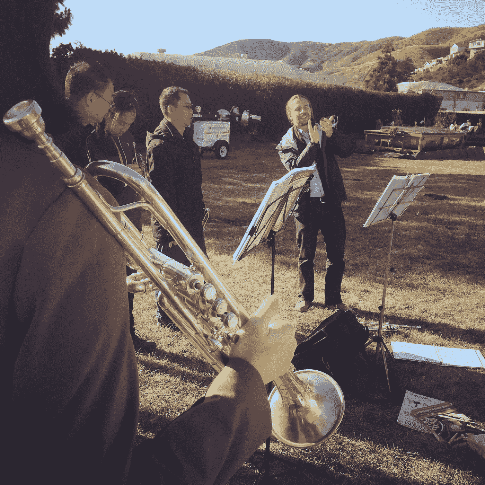
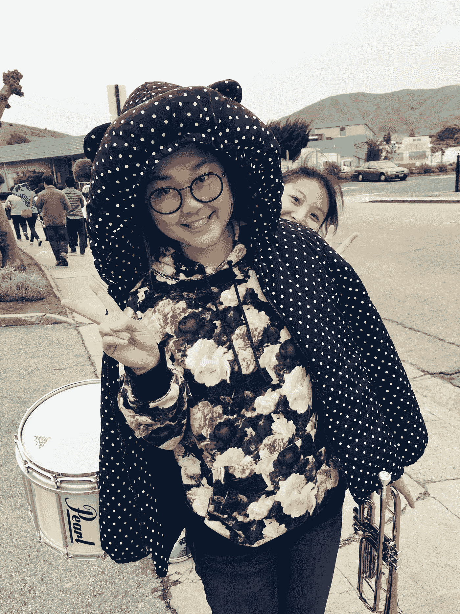
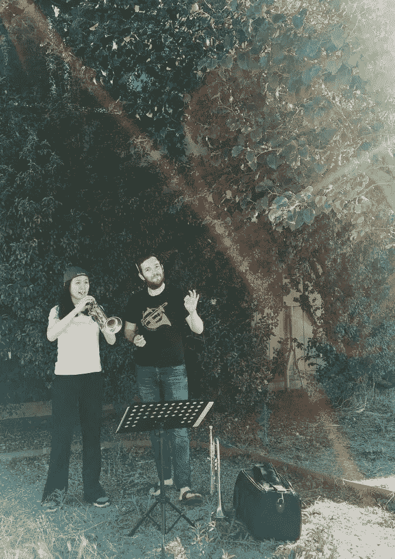

# 接受我们人生的每一个阶段，继续前行——我在小号训练 4 年的心得。

> 原文：<https://medium.com/hackernoon/accept-every-stage-of-our-life-and-keep-going-what-i-learned-from-4-years-of-training-in-trumpet-8fbbabd86b93>

Me holding my trumpet. Credit to Qing Li, my best friend, also a trumpet player.

在我四年的[小号训练](https://hackernoon.com/tagged/training)中，我多次质疑我是否应该继续浪费时间在吹小号上。

我已经在一个社区乐队吹了四年多的小号了。就演奏乐器而言，这对我来说一直很痛苦，直到最近，神奇的事情发生了。

我听起来很糟糕。也许因为我不能正常呼吸，当我演奏超过 5 个音乐小节时，我总是感到喘不过气来。因此，我无法跟上团队成员的节奏。(你能想象在乐队演奏时那有多尴尬吗？！)

当[音乐](https://hackernoon.com/tagged/music)的 D 调过高时，我只能调低八度，因为我根本无法在达到这些音符的同时跟上节奏。

你能想象用锯子切割金属的声音吗？这就是我的小号的声音。

Me holding a trumpet during group practice. Credit to Qing Li.

同龄人的压力可能是最令人不安的事情。每个人都打得更好！即使是比我晚加入很多的新成员，也是越打越好，追赶得很快。

但是我没有取得多大进展。我觉得不管我呆多久，或者我怎么练习，我都不会像其他人一样弹得好。如果我一直这样做，我只是在浪费时间。

"我应该继续浪费更多的时间吹小号吗？"我问过自己很多次。

但是我真的很喜欢这个乐队。我们参加了海湾地区的许多游行，在不同的街区演奏音乐。我喜欢看到人们看我们比赛时的笑容。我们甚至参加了波特兰、西雅图和洛杉矶的游行。它是非常有趣的。

加入乐队让我感觉又回到了高中时代。我和乐队成员很亲近，他们是我不想退出的重要原因之一。

我也很幸运，在我小号部有一个非常好的朋友，他总是鼓励我不要放弃，坚持到底。我想和他们在一起，和他们一起成长。

My lovely friends at the band who always encourage me to keep going.

然而，我仍然挣扎了很多，因为四年来，我没有取得多大进展。我甚至不能练习很多乐队音乐，因为演奏这些音乐只会让我喘不过气来，感到疲倦。

我们有一个非常好的小号老师，马特。有一天，我再次感到非常沮丧，我真的很想完成一首对我来说很有挑战性的配乐，但这似乎是不可能的。

我喘不过气来，所以节奏停止了，有一段我不能完全演奏，因为它开始的太高了。我已经练习了几个月了，但是毫无进展。

于是我非常沮丧地对马特说:“你是一个职业小号手，一直听到美妙的音乐。你怎么能忍受我演奏这些糟糕的声音这么久？!"

但是马特说，“嗯，作为一个音乐家，一件非常重要的事情是接受我们的演奏方式。只要你在进步，就没有必要和别人比，这才是重要的。”

听到这里，我想:“哇，即使是职业选手也需要接受自己的发挥。也许我不应该那么焦虑，因为我确实比刚开始时打得更好了。开始时我最多只能弹奏三个音符。现在，我至少可以从 C 弹到第二个 C。”

Practicing with Matt. Credit to Qing Li.

所以我试着不要感觉不好，只是继续做一些非常基本的热身运动，比如音阶，简单的口型，或者只是一些短时间的呼吸练习。我完全避开了高音。在某种程度上，我根本没有参加比赛，因为我感觉不舒服。

但是有一天，在我虚弱了一段时间没有碰我的小号之后，我拿起它吹了几个音。

哇…声音变得更加饱满了，最重要的是，当我像以前一样达到更高的音符时，我并没有感到很累。我没有上气不接下气，我能感觉到我的肚子在支撑着它。尽管我还不能演奏更高的音符，但我能听到一些好的音调，像优秀演奏者发出的闪闪发光的金属声！

于是我开始尝试一些以前做不到的音阶，还有一些乐队音乐。这简单多了！这并不是说我可以突然永远演奏《星条旗》这样的音乐，但我可以感觉到我从以前的演奏中有了很好的飞跃。老师教的许多东西对我来说更有意义，这意味着我现在开始知道如何应用它们。

接下来的几天，我试着每天练习一点。我还不是每首音乐都完美，但我能感觉到势头越来越好。

我不知道哪个部分是固定的。我不知道它们是怎么固定的。我确实学到了一些东西:任何练习都不会浪费，哪怕是很短的练习，只要我们不放弃。

所以，这需要一件事:接受我们在每个阶段的状态。我们不能拿自己和别人比较。我们可能会在学习或其他方面慢一点，但我们能做到！

我没有发挥出完美的水平；事实上，我不认为我能达到停止练习的程度。我认为这就是音乐和我们生活的奇妙之处。

所以我告诉自己:接受人生的每一个阶段，不断学习，不断实践。没有时间被浪费。即使没有大的进步，生活依然美好，总有一天，生活会开出旅途中种下的花。