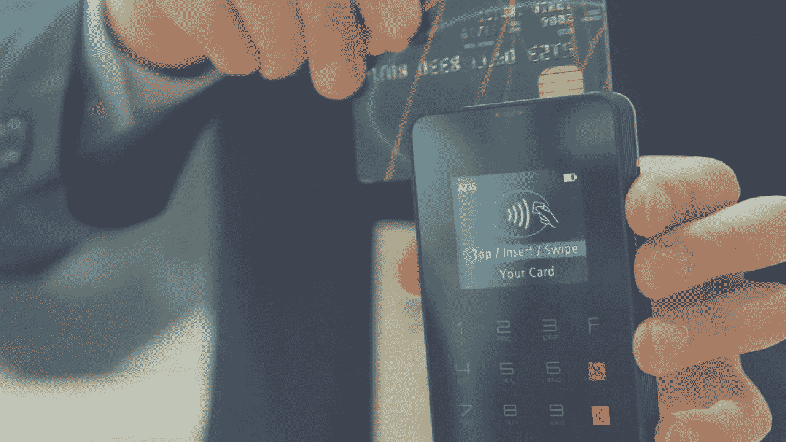

# 在现实世界中接受加密支付——好的、坏的和未来

> 原文：<https://medium.com/hackernoon/accepting-crypto-payments-in-the-physical-world-the-good-the-bad-and-the-future-a8ac89a9f71>

加密货币和区块链现在都有许多计划用途。然而，最初它们是打算作为货币使用的，类似于(如果不是完全相同的话)我们已经使用了几个世纪的法定货币。

但事情变得有些不同，许多加密货币很难甚至不可能以这种方式使用。[一些公司](https://tech.co/companies-accept-cryptocurrency-bitcoin-2018-03)正在接受加密支付，这种交易在网上比在现实世界中更常见，但仍远非主流。

现在，加密更多的是一个投机和投资的空间，而不是支付商品和服务的手段。

但是为什么不应该作为货币使用呢？使用密码而不是法定货币支付东西有很多好处。优势包括易用性提高、费用更低、潜在的等待时间更短、没有第三方干扰等等。

一些初创公司，如 [T.OS](https://www.tosblock.com/) ，正在寻求鼓励在商店、咖啡店和酒吧等实体世界中更广泛地接受加密货币作为支付手段。他们希望通过让供应商更容易、更有吸引力地接受加密货币，来帮助推动加密货币成为主流。

他们希望通过克服一些阻碍主流加密技术采用的障碍来做到这一点。让我们来看看现实世界中使用 crypto 支付的优缺点，以及未来可能会如何。

# 好人

有很多好的理由在你当地的大街上用加密货币购买商品和服务。这是一个安全、分散的支付系统，没有第三方的干扰。这确保了以简单明了的条款和条件顺利、清晰地进行支付。

加密还有可能比其他支付方式便宜得多，也快得多。还没有完全实现，我们将在后面更详细地解决这个问题。

# 坏事

阻碍主流加密技术采用的一个因素是它的不稳定性。众所周知，加密货币的波动性很大，价格往往会剧烈波动。

任何在 2017 年底投资了比特币等货币的人都很清楚价格可能会迅速发生巨大变化——比特币[在大约一个月内价值减半](https://coinmarketcap.com/currencies/bitcoin/)。

对于可能希望接受加密货币的供应商来说，这是一个问题。如果有一天他们接受了加密支付，那么第二天，在他们有时间出售或交换之前，同样数量的加密可能会变得更少。

除非你是一个认真的加密爱好者，或者准备拿你的业务利润冒很大的风险，否则这种波动性会让商家大倒胃口。

另一个问题是交易时间。如上所述，与 Visa 和 PayPal 等其他方法相比，crypto 有可能更快地处理交易。然而，由于加密货币目前的结构方式，等待时间在繁忙时间可能会飙升。

没有人愿意站几分钟，等着他们的付款被批准，而他们的咖啡凉了，他们的午餐时间慢慢流逝。

那么这些问题的解决方案是什么呢？T.OS 很可能有答案，尽管他们的项目目前仅限于新加坡，但它显示出很大的前景。

# 未来——将加密技术引入高街

T.OS 的方法相当简单。他们有两种不同的货币，在两个不同的区块链。第一种货币 T.OS 是一种普通的加密令牌，可以在加密交易所交易，没有固定价格。

然而，在特殊的交易所，用户可以将这种硬币换成另一种硬币，称为 T.OSP。这种硬币有固定的价格，并且在交易所所在地与当地货币挂钩。所以在美国，一只 OSP 霸王龙可能值一美元，而同时在加拿大，一只 OSP 霸王龙可能值一加元。

这很重要，因为这意味着硬币不会像其他加密货币一样波动价格。商人可以接受 OSP 货币的支付，因为他们知道当他们把它换成法定货币时，它的价值是一样的。

T.OS 系统还旨在快速、廉价地使用，挑战其他支付方式。

大街上的加密技术的未来很难预测，但有很多事情值得乐观。解决和应对对波动性和交易时间的担忧，可能是将加密支付一劳永逸地推向大众的关键。

*原载于 2018 年 8 月 7 日*[*【cryptopotato.com】*](https://cryptopotato.com/accepting-crypto-payments-in-the-physical-world-the-good-the-bad-and-the-future/)*。*