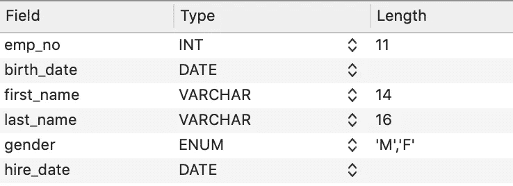
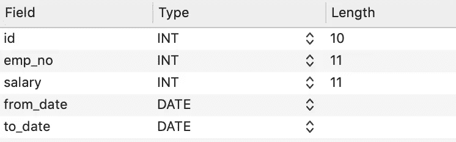

# MySQL 上的 ActiveRecord 使用条件迭代大型表

> 原文：<https://medium.com/hackernoon/activerecord-on-mysql-iterating-over-large-tables-with-conditions-453bd8761c8b>

在本文中，我将展示在一个包含数百万条记录的 MySQL 数据库表中迭代记录的两种方法之间的性能差异。在大容量分析系统中，包含数百万条记录的表非常常见，迭代整个表或这些表的子集经常是必要的，无论是执行计算、运行迁移还是对记录创建并行后台作业。在 [AirPR](https://www.airpr.com/) ，我们有许多包含数亿条记录的数据库表，编写高效的迭代代码变得非常重要，因为好的和不太好的方法之间往往存在数量级的差异。

# **找到每个方法**

ActiveRecord 本身提供的标准方法是`find_each`方法。

出于本练习的目的，我创建了一个`employees`表，向其中添加了大约 500 万行数据。



还有一个包含以下各列的`salaries` 表，它存储了不同时间范围内那些雇员的工资。该表包含大约 300 万条记录。



让我们使用`find_each`来测量遍历这个表的性能

```
DEFAULT_BATCH_SIZE = 1000time = Benchmark.realtime do
  Employee.select(:emp_no, :first_name, :last_name).
           find_each(batch_size: DEFAULT_BATCH_SIZE) do |employee|
  end
end=> 100.6963519999990
```

ActiveRecord 生成的底层查询如下所示:

```
Employee Load (2.1ms)  SELECT  `employees`.`emp_no`, `employees`.`first_name`, `employees`.`last_name` FROM `employees`  ORDER BY `employees`.`emp_no` ASC LIMIT 1000
  Employee Load (1.9ms)  SELECT  `employees`.`emp_no`, `employees`.`first_name`, `employees`.`last_name` FROM `employees` WHERE (`employees`.`emp_no` > 11000)  ORDER BY `employees`.`emp_no` ASC LIMIT 1000
  Employee Load (1.8ms)  SELECT  `employees`.`emp_no`, `employees`.`first_name`, `employees`.`last_name` FROM `employees` WHERE (`employees`.`emp_no` > 12000)  ORDER BY `employees`.`emp_no` ASC LIMIT 1000

...Employee Load (1.3ms)  SELECT  `employees`.`emp_no`, `employees`.`first_name`, `employees`.`last_name` FROM `employees` WHERE (`employees`.`emp_no` > 5127997)  ORDER BY `employees`.`emp_no` ASC LIMIT 1000
```

注意 ActiveRecord 是如何跟踪上一次迭代中的`id`,并在下一次迭代的 where 条件中使用它的。这称为基于值的分页，通常是分页的首选方法(优于其他方法，如基于偏移量的分页)。

# ID 迭代器方法

我建议我们现在尝试一种不同的迭代技术:

```
time = Benchmark.realtime do
  first_id = Employee.first.id
  last_id = Employee.last.id
  (first_id..last_id).step(DEFAULT_BATCH_SIZE).each do |value| Employee.where('employees.emp_no >= ?', value).
         where('employees.emp_no < ?', value + DEFAULT_BATCH_SIZE).
         order('employees.emp_no ASC').
         select(:emp_no, :first_name, :last_name).each do |employee|
    end end
end=> 101.34066200000234
```

在这个方法中，我们使用主键上的`where`条件将总行数分成若干批，以遍历表中的所有记录。请注意，这两种方法的性能几乎是一样的。下面是基本查询的外观:

```
Employee Load (1.1ms)  SELECT  `employees`.* FROM `employees`  ORDER BY `employees`.`emp_no` ASC LIMIT 1
  Employee Load (1.1ms)  SELECT  `employees`.* FROM `employees`  ORDER BY `employees`.`emp_no` DESC LIMIT 1
  Employee Load (1.5ms)  SELECT `employees`.`emp_no`, `employees`.`first_name`, `employees`.`last_name` FROM `employees` WHERE (employees.emp_no > 10001) AND (employees.emp_no <= 11001)
  Employee Load (1.9ms)  SELECT `employees`.`emp_no`, `employees`.`first_name`, `employees`.`last_name` FROM `employees` WHERE (employees.emp_no > 11001) AND (employees.emp_no <= 12001)...Employee Load (1.8ms)  SELECT `employees`.`emp_no`, `employees`.`first_name`, `employees`.`last_name` FROM `employees` WHERE (employees.emp_no >= 5128001) AND (employees.emp_no < 5129001)
```

如果 id 是有序的，这种方法效果最好，因为在这种情况下，迭代不必迭代&跳过许多缺失的记录。

# 使用连接进行迭代

现在，让我们比较一下当我们给查询增加一些复杂性时这两种方法的性能。

在这个新的场景中，比方说，我们想要遍历在公司任职期间任何时候工资都在 80，000 以上的所有员工。`find_each`方法看起来像这样:

```
time = Benchmark.realtime do
  Employee.select(:emp_no, :first_name, :last_name).
            joins(:salaries).
            where('salary > 80000').
            find_each(batch_size: DEFAULT_BATCH_SIZE) do |employee|
  end
end=> 1181.770457000006
```

另一方面，用于执行相同操作的 id 迭代器方法导致了一个数量级的性能提升。

```
time = Benchmark.realtime dofirst_id = Employee.first.id
  last_id = Employee.last.id(first_id..last_id).step(DEFAULT_BATCH_SIZE).each do |value|
    Employee.where('employees.emp_no >= ?', value).
         where('employees.emp_no < ?', value + DEFAULT_BATCH_SIZE).
         joins(:salaries).
         where('salary > 80000').   
         order('employees.emp_no ASC').      
         select(:emp_no, :first_name, :last_name).each do |employee|
    end
  endend=> 72.75677799998084
```

上述结果表明，使用`find_each`方法会导致更差的 performance⁴.ID 迭代器方法比 naive `find_each`大约快 15 倍。当您检查由这两种方法产生的查询时，原因就变得很清楚了。

`find_each`方法进行这种类型的查询:

```
SELECT  `employees`.`emp_no`, `employees`.`first_name`, `employees`.`last_name` FROM `employees` INNER JOIN `salaries` ON `salaries`.`emp_no` = `employees`.`emp_no` WHERE (salary > 80000)  ORDER BY `employees`.`emp_no` ASC LIMIT 1000
```

对该查询的解释揭示了以下内容:

```
1 SIMPLE salaries ALL salary,emp_no NULL NULL NULL 2837536 **Using where; Using temporary; Using filesort**
1 SIMPLE employees eq_ref PRIMARY PRIMARY 4 employees.salaries.emp_no 1 Using index
```

这表明 salary 上的索引和 emp_no 上的索引都没有用于筛选 sales 表。

id 迭代器方法进行这种类型的查询:

```
SELECT `employees`.`emp_no`, `employees`.`first_name`, `employees`.`last_name` FROM `employees` INNER JOIN `salaries` ON `salaries`.`emp_no` = `employees`.`emp_no` WHERE (employees.emp_no >= 5128001) AND (employees.emp_no < 5129001) AND (salary > 80000)
```

对该查询的解释表明，查询优化器使用 sales 表中 emp_no 的索引:

```
1 SIMPLE salaries range salary,emp_no emp_no 4 NULL 1 **Using index condition; Using where**
1 SIMPLE employees eq_ref PRIMARY PRIMARY 4 employees.salaries.emp_no 1 Using index
```

这揭示了为什么`find_each`方法比迭代器方法慢得多。

# TL；速度三角形定位法(dead reckoning)

这里的教训是始终使用解释来理解 MySQL 查询优化器实际做什么，以便您可以创建最佳的 queries⁵.基于对解释结果的分析，可以决定对大型表上的迭代需要采用哪种方法。

*   大型表上的连接通常会导致性能下降，所以最好避免使用。只有在通过对其中一个表使用基于索引的条件而大大缩小了结果集的范围时，才尝试使用联接。
*   一般情况下，尽量充分利用索引进行查询。使用导致 MySQL 查询优化器选择使用表中可用索引的查询。向表中添加索引，这可能有助于加快查询速度，同时了解写性能 degradation⁶.方面的权衡
*   避免运行 select *，而是只选择操作所需的列。这将减少需要发送的数据量，尤其是当表中有许多文本列时。
*   查询优化器可能会根据各种因素采用不同的路径，同样的查询在具有较大资源的服务器上可能会采用不同的路径，因为，比方说，一个索引可能适合内存。这将导致性能的巨大差异。在这些情况下，最好假设最坏的情况，并编写不依赖于在内存中保存大型索引的查询。
*   查看 ActiveRecord 生成的查询的最简单方法是打开调试日志记录。建议在开发中打开它，这样您可以尽早发现性能问题。
    `ActiveRecord::Base.logger = Logger.new(STDOUT)`
*   或者，您可以在一个`ActiveRecord::Relation`上使用`to_sql`来预先查看它将进行什么查询。
    

我从[这个](https://github.com/datacharmer/test_db)样本数据集开始，删除了除了`employees`和`salaries`表之外的所有内容。然后我复制了`employees`表中的记录，达到 5 百万行。

[这个](https://blog.novatec-gmbh.de/art-pagination-offset-vs-value-based-paging/)链接很好地比较了基于值的分页和基于偏移量的分页。

如果主键的`AUTO_INCREMENT`选项打开，记录自动按递增顺序排列。

⁴在较大的表上，性能下降得更多。当您达到几百万行时，理解底层查询变得更加重要，因为这可能导致[100 倍或 1000 倍的差异](/squad-engineering/blazingly-fast-querying-on-huge-tables-by-avoiding-joins-5be0fca2f523)。

⁵花时间阅读(并掌握)了关于解释输出格式的 MySQL 官方文档,因此很清楚什么是好的，什么是不好的。

⁶ [这个链接](https://logicalread.com/impact-of-adding-mysql-indexes-mc12/#.W_rzeJNKi_s)很好地描述了创建索引对性能的影响。重要的是要明白，在有很多索引的表上写会比较慢，所以要明智地使用它们。