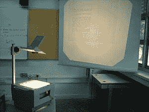
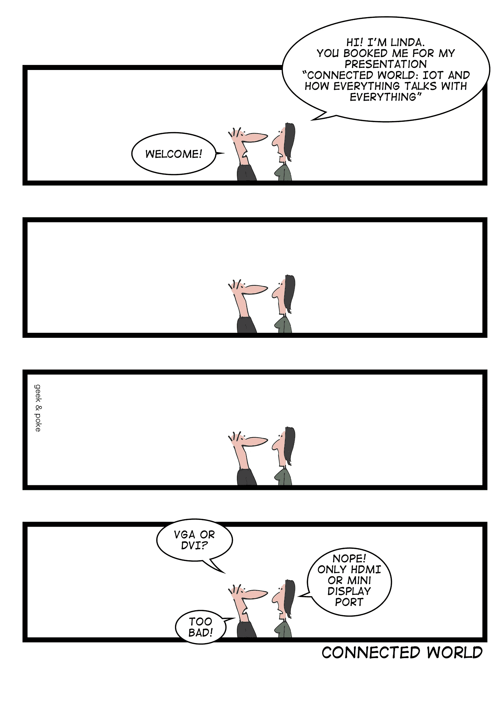

# 适配器-mageddon

> 原文：<https://medium.com/hackernoon/adaptor-mageddon-76ec3dde5dcb>

很久很久以前，当恐龙在地球上漫游的时候，曾经有这些东西叫做"[高射投影仪](https://en.wikipedia.org/wiki/Overhead_projector)"。你会出版——或者写作！—你的演讲被投射到“[透明胶片](https://en.wikipedia.org/wiki/Transparency_(projection))”(透明塑料片)上，这些胶片会被投射到屏幕上，或者更常见的是，投射到你要投射东西的那面墙上。你也可以实时在塑料上画画，更新你的 preso 来表达一个观点。请注意，没有动画过渡，尽管这可能是一件好事😝。最棒的是，基本上有三件事可能出错

1.  *灯泡烧坏*:容易处理
2.  没有屏风:你移开了家具，利用了墙壁。
3.  *你忘了你的幻灯片*:如果每次有人在最后一分钟“在幻灯片上乱涂 preso”时，我都有一只山羊，那么我将是世界上最大的山羊奶酪生产商…

然后，笔记本电脑出现了。

(*好吧，我知道你在想什么，我正要说“牛奶是 5 美元/加仑”或“滚出我的草坪”，但那不是我要去的地方*)

正如我所说的，笔记本电脑出现了。随着笔记本电脑的出现，PowerPoint 出现了。
不幸的是，宇宙平衡要求，除了 PowerPoint 的神奇之处——祝福它——还要确保你有正确的适配器😡。

/via [http://geek-and-poke.com/?offset=1450135954075](http://geek-and-poke.com/?offset=1450135954075)

所以是的，首先你带着 VGA 适配器到处走，因为这很简单。

后来，事情变得数字化了，所以你有了 DVI 适配器，但你也保留了 VGA 适配器，以便向后兼容。
而且，因为你时不时会把它们丢在一边，所以你开始批量购买适配器(看看沙发后面，你会发现几个适配器和一些零钱)

然后是 HDMI 和迷你显示端口，这意味着你永远不知道你会找到什么，而且你永远不会有合适的适配器，因为你只能批量购买这么多东西，所以你只能放弃并希望最好的结果。

这没什么，因为通常在投影仪旁边有一个小小的“显示适配器套件”，里面有你需要的适配器。只不过*没有*，因为现在*你*是那个拿走适配器的人，所以办公室(或者会议，或者其他什么)现在大量购买适配器。这不是一件坏事，因为，嘿，转移成本，对不对？

除此之外，一些“聪明”的人开始将适配器硬连接到投影仪上(或者用胶带把它包起来)。或者拧进去。随便)。这导致至少一个人的笔记本电脑被电缆绊倒而被拽倒在地(一个朋友。是啊。没错。一个朋友)。

好像这还不够糟糕，我们现在在新的 MacBooks 上有 USB-C 端口，这意味着每个人现在都需要 USB-C 到 DVI/HDMI/Mini DisplayPort 适配器来配合其他一切，在这一点上，它实在太复杂了，我们还不如放弃，重新开始使用透明胶片。

所以，是的，也许你们都需要离开我的草坪…

*(* [*)这篇文章也出现在我的博客上*](https://dieswaytoofast.blogspot.com/2018/10/adaptor-mageddon.html) *)*