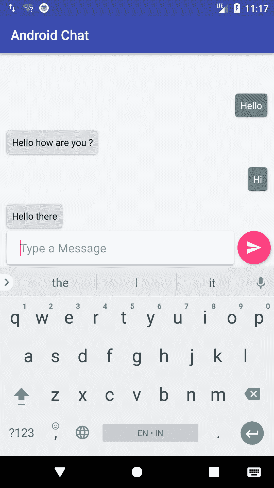

# 将聊天机器人添加到您的 Android 应用程序

> 原文：<https://medium.com/hackernoon/add-chatbot-to-your-android-app-524556c058ab>

> 更新(2020 年 1 月 14 日):*我已经更新了源代码以使用最新的协程，你可以检查一下 Presenter 类*

我试图为我的社会创新项目开发一个应用程序。它叫做 LISTEND——LISTEND 和 End Depression。这个项目是我作为 [XL 未来领袖](http://www.xlfutureleaders.com/)获奖者任务的一部分。Listend 现在发布了测试版。我们仍然需要收集数据来训练机器人，让它变得更智能，对用户更有帮助。基本上我们有几个功能，包括聊天机器人本身。我们的主要重点是通过早期预防来预防抑郁症或心理健康问题。如需了解更多信息，您可以查看此处的应用程序 [Listend 应用程序](https://play.google.com/store/apps/details?id=com.rahmat.app.listend)请提供您的反馈以使应用程序变得更好，谢谢:)。

unsplash.com

好了，现在我们来编码吧！

对于这个聊天机器人的后端，我使用 firebase 实时数据库，并使用 Dialogflow 作为聊天机器人引擎。

**注意:在本教程中，我不打算深入训练聊天机器人，我只是展示了在你的 android 应用程序中添加聊天机器人的一般方法。**

**设置对话流。**

出于教程的目的，我们需要在 dialogflow 控制台中激活聊天机器人代理的聊天功能。只需转到您的 dialogflow 控制台并创建代理。填写所需的表格，包括时间和默认语言。现在你有一个代理，但它什么都不知道。为了让它发挥作用，我们需要训练它。正如我之前提到的，我们不打算关注这一点，而是可以使用预构建的代理。预构建的代理基本上是经过培训以理解特定上下文的预配置代理。去侧边栏。在那之后进口闲聊代理。现在我们有了一个可以参与闲聊的代理人。耶！

**在 android 项目中设置依赖关系。**

有几件事，我们需要为了建立应用程序，这些是:

*   对话流
*   Firebase 实时数据库
*   Firebase UI

正如我之前所说，我们将使用 Firebase 实时数据库作为后端，这意味着所有来自用户和聊天机器人的对话都将存储在这个数据库中。为了简化我们的 ui 创建，我们使用 Firebase UI，我们可以简单地集成从数据库中获得的数据，并将其填充到 UI 中，我们还可以观察数据，如果有新的变化，会自动更新。你也可以使用你自己的 firebase，只需在 android 工作室[的 firebase 助手中添加 Firebase，进入工具- > firebase - >添加 Firebase 实时数据库。](https://hackernoon.com/tagged/android)

最后，这里是 *build.gradle* 文件:

**创建用户界面**

我们将创建一个简单的 UI 来显示消息。我们将通过使用 recyclerview 来实现这一点。所以首先我们需要创建 item_view。像这样:

之后，我们将创建包含显示聊天的 recyclerview 的布局，并在屏幕底部创建一个带有编辑文本的按钮，用于输入和发送消息。代码是这样的:

**处理业务逻辑**

在本教程中，我们将使用 MVP 方法来使架构松散耦合(如果你专注于 android 开发，我建议你学习这种或其他方法)。首先，我们需要指定一个契约来明确视图和演示者的角色。基本上，主持人将接收用户的输入信息，并将其发送到数据库，并从[聊天机器人](https://hackernoon.com/tagged/chatbot)中检索回复的信息。而视图负责获取用户键入的消息，并用用户消息和机器人消息填充 recyclerview。合同看起来是这样的:

正如你在上面看到的，视图没有任何功能，因为 firebase adapter 可以观察数据库中的数据变化，所以我们不需要处理它。

现在我们有了明确的角色，第二步是实现每个角色的契约。在我们转到视图和表示器之前，我们需要首先为 recyclerview 编写适配器。这里我们使用了 firebaseadapter 和 viewholder。代码看起来像这样:

**主讲人**

在 presenter 中，我们处理用户输入的消息，将其发送到 firebase 数据库，并在 dialogflow 中触发 chatbot，在这里，为了使请求在后台执行，我使用了 kotlin 协程。

现在我们只需要设置活动，获取用户输入，填充 recyclerview 并观察 firebase 实时数据库中的数据变化。

最后一步，我们需要开始监听 onStart 函数上的请求，简单地写:

*adapter.startListening()*

现在我们完成了，如果你尝试运行这个应用程序，你可以简单地与聊天机器人聊天，这里有一个截图:

**ps:聊天机器人不是很聪明，我们需要训练它让它更聪明，你也可以通过改变客户端访问 id 来使用你自己的 dialogflow 代理。**

您可以在此查看完整代码:

 [## muhramatullah/安卓聊天机器人

### 使用 dialogflow 作为聊天机器人引擎的示例项目。通过创建……为 muhramatullah/Android-chatbot 开发做出贡献

github.com](https://github.com/muhrahmatullah/android-chatbot) 

好了，这个帖子到此为止。感谢你阅读这篇文章直到最后。如果你认为这个帖子有用，别忘了**关注，分享**和**给它一个掌声！如果你有什么问题或建议，请在下面的评论区留言！谢谢你。**