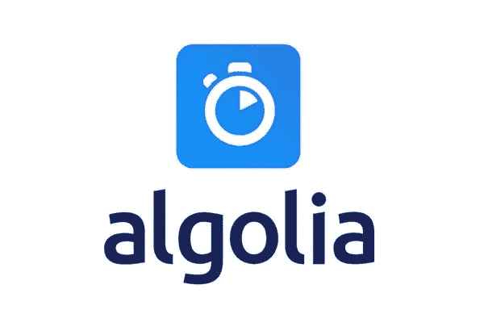
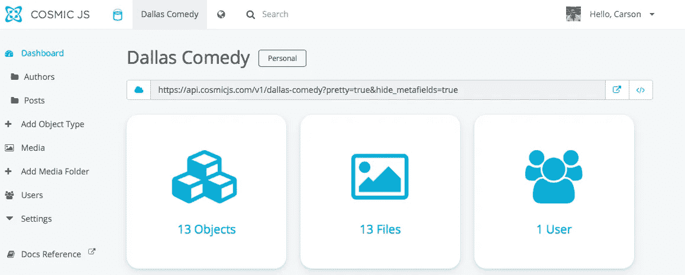
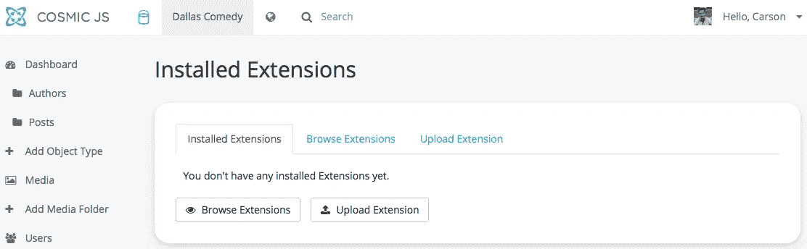
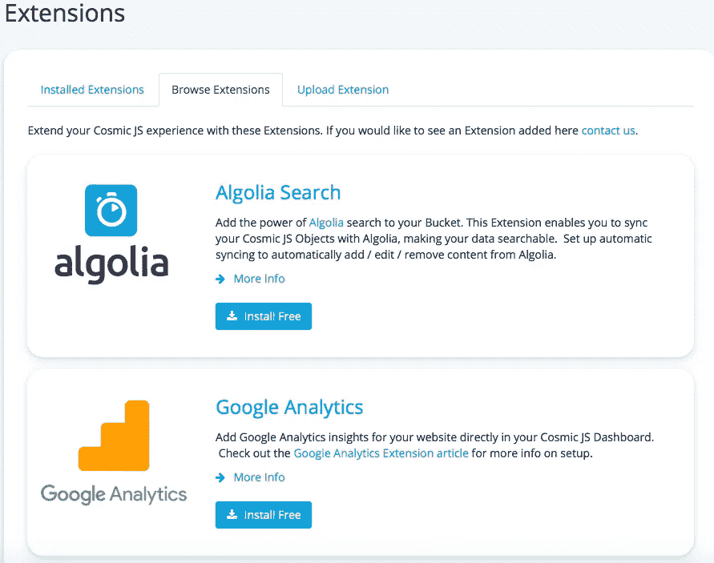
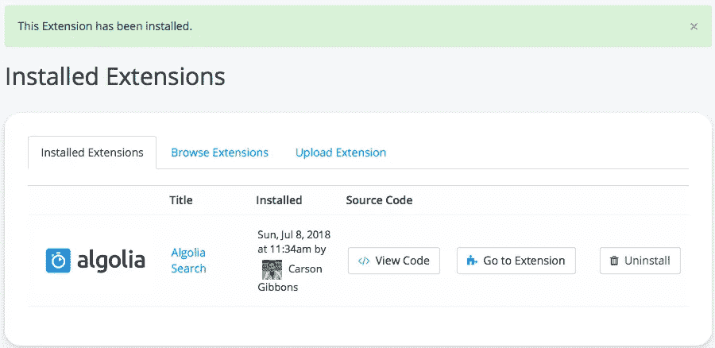
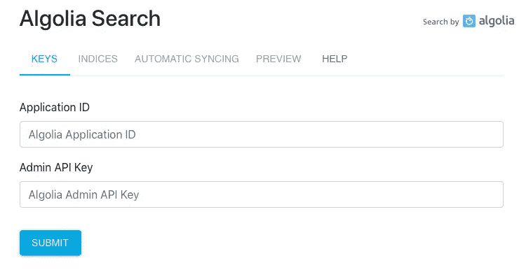

# 将 Algolia 搜索的能力添加到您的宇宙 JS 桶中

> 原文：<https://medium.com/hackernoon/add-the-power-of-algolia-search-to-your-cosmic-js-buckets-a3408fa84a88>

Cosmic JS 扩展使开发人员和编辑人员扩展 Cosmic JS 的功能成为可能。开发人员可以创建交互式视图、连接第三方 API 和定制编辑器体验。把它想象成你桶里的一个可控应用。

你现在可以在你的桶里增加[搜索的能力。这个新的扩展使你能够用 Algolia 同步你的宇宙 JS 对象，使你的数据可搜索。设置自动同步以自动添加/编辑/移除 Algolia 中的内容。按照下面的简单步骤安装和设置您的 Algolia 搜索扩展。](https://www.algolia.com/)

**TL；DR:** [Algolia 搜索扩展](https://cosmicjs.com/extensions/algolia-search)
[Algolia 搜索扩展代码库](https://github.com/cosmicjs/algolia-extension)
[宇宙 JS 扩展](https://cosmicjs.com/extensions/)
[宇宙 JS 扩展文档](https://cosmicjs.com/docs/extensions)

## 安装 Algolia 搜索扩展到你的宇宙 JS 桶

## 导航到左侧导航栏中的扩展

## 点击“浏览扩展”安装 Algolia 搜索

## 安装 Algolia 搜索扩展

## 在扩展中添加您的 Algolia API 密钥

## 请遵循以下步骤:

1.  [登录您的 Algolia 账户](https://algolia.com/)
2.  转到您的应用> API 密钥
3.  将您的 API 键(应用程序 ID 和管理 API 键)复制并粘贴到扩展中
4.  手动与您的 Cosmic JS Bucket 内容同步，或设置自动同步以使 webhooks 自动向 Algolia 添加记录。

宇宙 JS 使内容管理者和开发者能够更好地合作。通过提供直观的管理仪表板、强大的 API 和灵活的用户角色，应用程序的构建速度更快、重量更轻，并且您的整个团队在这个过程中节省了时间。

[Cosmic JS](https://cosmicjs.com/) 是一个 API 第一的基于云的内容管理平台，可以轻松管理应用和内容。如果你有关于 Cosmic JS API 的问题，请在 [Twitter](https://twitter.com/cosmic_js) 或 [Slack](https://cosmicjs.com/community) 上联系创始人。