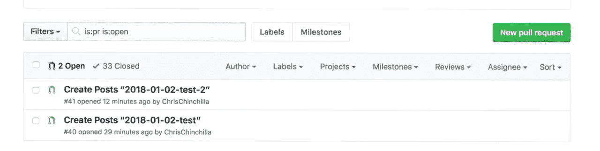
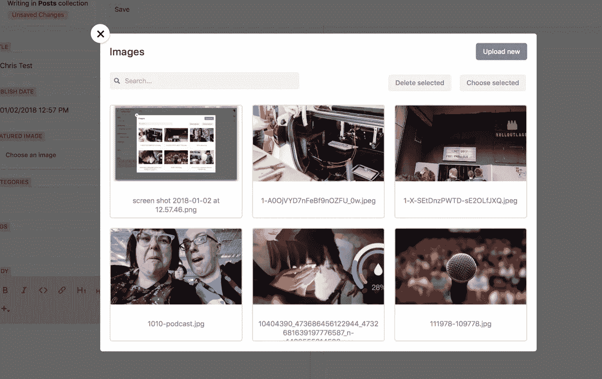
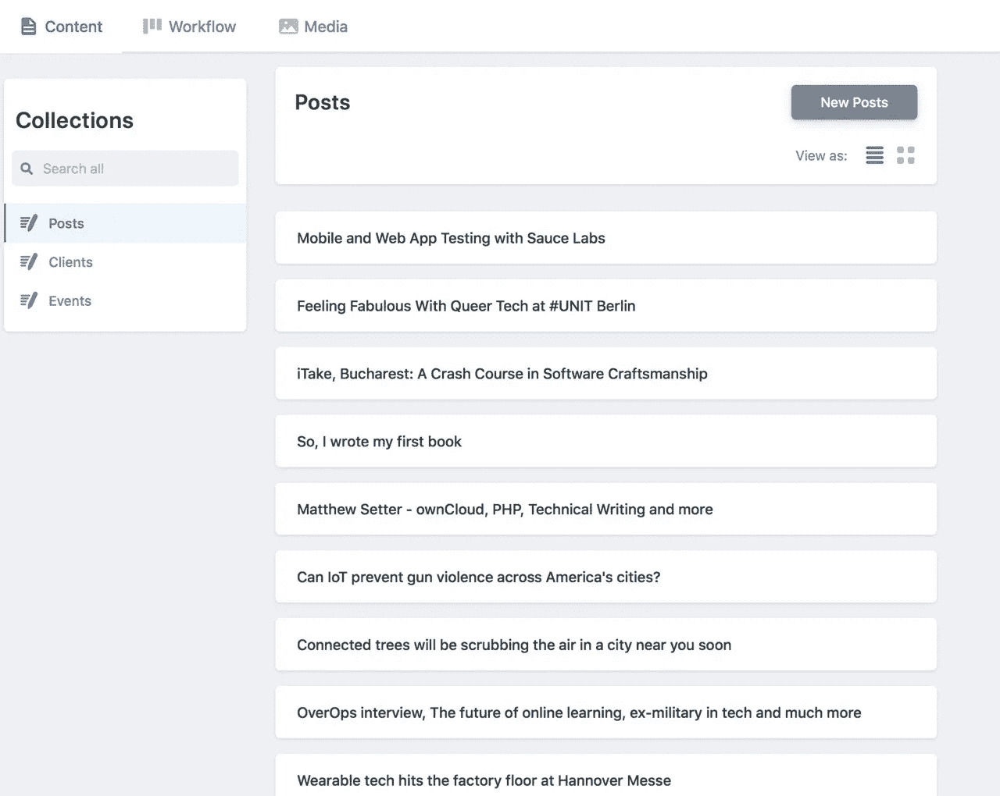
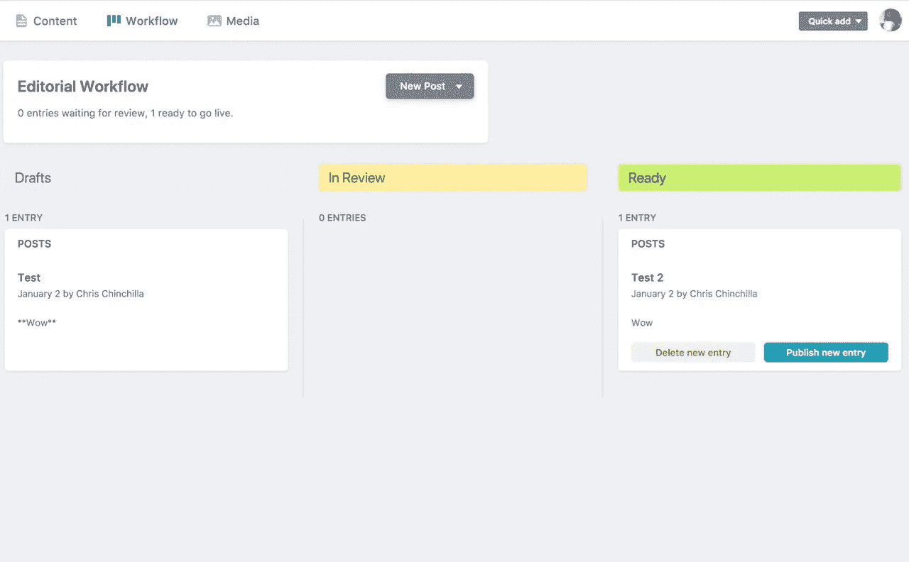
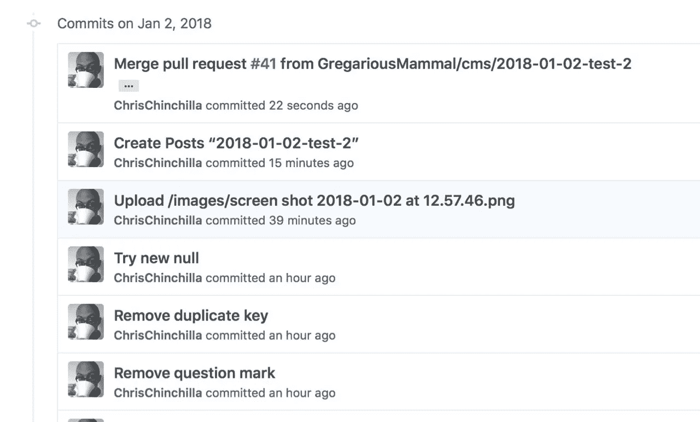

# 使用 Netlify CMS 向静态站点添加 CMS

> 原文：<https://medium.com/hackernoon/adding-a-cms-to-your-static-site-with-netlify-cms-4adadf49aac2>

近七年来，我一直是 CMS 的实现者和贡献者，主要是用 Drupal，但偶尔也用 Joomla！还有 WordPress。大约 3 年前，我遇到了 Jekyll，我有了一个启示，一个让我管理和呈现内容的系统，但以一种适合我作为一个作家的方式，使用标记格式，如 markdown，reStructuredText 和 Asciidoc。虽然纯文本和版本控制方法对某些人来说很好，尽管 GitHub 和 GitLab 等供应商尽了最大努力，但对技术不太精通的人来说仍然不太容易使用。许多项目试图弥合这一差距，融合两个世界的精华，从商业 SaaS 提供商如 [Contentful](https://www.contentful.com/) 、 [Prismic](https://prismic.io/) 或 [CloudCannon](https://cloudcannon.com/) 到开源选项如 [Cockpit](https://getcockpit.com/) 和 [getmesh](https://getmesh.io/) 。

就在一年多前， [Netlify](https://www.netlify.com/) ，静态网站的神奇主机宣布了“ [Netlify CMS](https://www.netlifycms.org/docs/) ”，它看起来很有前途，为 git 工作流添加了一个类似 CMS 的接口。我做了一些初步的调查，但现在终于有时间来研究如何设置和使用它了。

我会将 Netlify CMS (NC)与 Jekyll 一起使用，但您可以找到如何将其添加到[其他现有静态站点](https://www.netlifycms.org/docs/add-to-your-site)或[从一个新站点](https://www.netlifycms.org/docs/start-with-a-template/)开始的说明。

# 将 Netlify CMS 添加到 Jekyll

用*index.html*和 *config.yml* 文件创建一个 *admin* 文件夹；它们分别作为管理界面及其背后的设置的网关。

在*index.html*中，添加创建管理界面所需的框架 HTML、JavaScript 和 CSS，对于完全定制的品牌，你也可以添加链接到你的样式表，但由于这是管理“后端”，你可能不需要它们。

```
<!doctype html>
<html>
<head>
  <meta charset="utf-8" />
  <meta name="viewport" content="width=device-width, initial-scale=1.0" />
  <title>Content Manager</title>
  <!-- Add your own styles here -->
  <link rel="stylesheet" href="[https://unpkg.com/netlify-cms@](https://unpkg.com/netlify-cms@)^1.0.0/dist/cms.css" /></head>
<body>
  <!-- Include the script that builds the page and powers Netlify CMS -->
  <script src="[https://unpkg.com/netlify-cms@](https://unpkg.com/netlify-cms@)^1.0.0/dist/cms.js"></script>
</body>
</html>
```

当然，配置文件因您的用例而异，但是我将向您展示我在我的'[群居哺乳动物](https://www.gregariousmammal.com/)'站点中使用的文件，您可以从那里进行推断。

首先，确定后端类型，如果用户需要认证才能访问它，您可以使用 Netlify 或 GitHub 中定义的用户(那些具有推送访问的用户)。我想允许用户在 Netlify 之外更改内容，所以使用 GitHub 方法:

```
backend:
  name: github
  repo: GregariousMammal/Main-Site # Path to Github repository
  branch: master # Branch to update
```

要定义哪些用户可以访问管理后端和编辑内容，我建议你阅读 [Netlify 的步骤](https://www.netlifycms.org/docs/add-to-your-site/#authentication)。你可以用各种不同的方法进行认证，或者通过你已经设置好的 Netlify 的身份服务来处理这个过程。

如果您添加以下设置，则帖子将通过一个工作流流程，在您发布帖子之前，特定用户可以查看和编辑拉请求中的帖子。否则，NC 向上面定义的分支提交帖子。

```
publish_mode:editorial_workflow
```



该网站使用了大量的图片，我希望人们在每篇文章中添加一张图片，所以你需要定义图片的存储位置，使用`media_folder`参数添加图片，还需要使用`public_folder`来设置图片的位置:

```
media_folder: "images" # Media files will be stored in the repo under images
public_folder: "/images" # The src attribute for uploaded media will begin with /images
```

我确实发现了一些存储在子文件夹中的图像的问题，[有一个问题](https://github.com/netlify/netlify-cms/issues/513)讨论子文件夹，但是我不确定这是否相关。



现在到了最复杂的部分。我的网站有许多不同的“内容类型”来表示不同的内容项，有时使用集合，有时在不同的地方使用不同的字段。该部分将是您的配置部分，由一系列代表您的内容的 YAML 部分组成。一般结构是:

```
collections:
  - name: "posts" # Used in routes, e.g. /admin/collections/blog
    label: "Posts" # Used in the UI
    folder: "_posts" # The path to the folder where the documents are stored
    create: true # Allow users to create new documents in this collection
    slug: "{{year}}-{{month}}-{{day}}-{{slug}}" # Filename template i.e. YYYY-MM-DD-title.md
    filter:
      - field: publication_url
      - value: ""
    fields: # The fields for each document, usually in front matter
      - {label: "Layout", name: "layout", widget: "hidden", default: "post"}
      - {label: "Title", name: "title", widget: "string"}
      - {label: "Publish Date", name: "date", widget: "datetime"}
      - {label: "Featured Image", name: "image", widget: "image"}
      - {label: "Categories", name: "categories", widget: "string"}
      - {label: "Tags", name: "tags", widget: "string"}
      - {label: "Body", name: "body", widget: "markdown"}
      - {label: "Publication URL", name: "publication_url", widget: "string"}
```

您可以使用大约 [12 个默认小部件](https://www.netlifycms.org/docs/widgets/)中的一个，如果您知道 React，那么[创建您自己的](https://www.netlifycms.org/docs/custom-widgets/)并不太难。默认情况下，字段被设置为`required`，所以如果它们不在您的内容模型中，就添加`required: false`，即:

```
- {label: "Publication URL", name: "publication_url", widget: "string", required: false}
```

我的网站有很多内容，我无法让 Netlify CMS 加载所有内容——这可能是 JavaScript 调用或 GitHub API 的限制。可能有一种方法可以解决这个问题，但是由于很多帖子都是针对聚合内容自动生成的存根文件，所以我不需要编辑它们。Netlify CMS 提供了一种使用字段值的`filter`属性来过滤这些内容的方法。

```
filter:
  - field: language
  - value: en
```

我想通过日期过滤来加载最近的帖子，但这是不可能的，所以我试着过滤没有`publication_url`的帖子，但没有多少运气让过滤器工作，你的里程可能会有所不同。从 GitHub API 中获取的内容也有限制，所以我可能需要将我的内容重新组织到更多的集合或子文件夹中。

你可以在这里看到我的网站[的完整内容类型。](https://github.com/GregariousMammal/Main-Site/blob/master/admin/config.yml)

# 使用 Netlify CMS

像往常一样启动你的静态站点发生器，然后访问 *_admin* 。您应该会看到针对您定义的每种内容类型的部分，以及针对媒体和工作流(如果启用)的部分。



该界面有有限的过滤和排序选项，但有一个搜索框。您可以使用*添加*按钮，用一个方便的 GUI 创建内容并预览。当您单击*保存*时，帖子将被保留在一个拉请求中，直到您发布它们，然后它们将被合并到母版中。[这里有一个总结](https://www.netlifycms.org/docs/configuration-options#publish-mode)什么样的 GUI 动作导致什么样的 git 动作。



# SSCMS(静态网站 CMS！)

在我看来，到目前为止，Netlify 已经尽最大努力为静态网站创建了一个类似 CMS 的前端，以适应技术和非技术用户的工作流。现在还处于早期，还需要一些缺陷和特性，但是随着 Netlify 商业产品和社区驱动力的增强，我对它的发展抱有很大的希望。

*原载于*[*dzone.com*](https://dzone.com/articles/adding-a-cms-to-your-static-site-with-netlify-cms)*。*