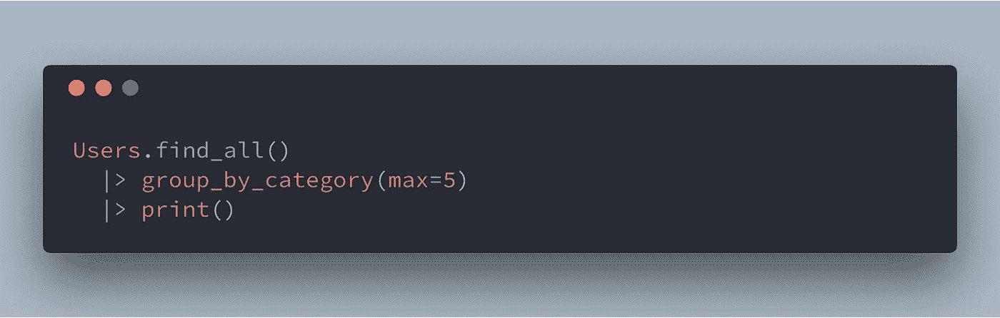
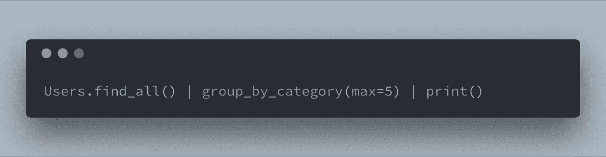
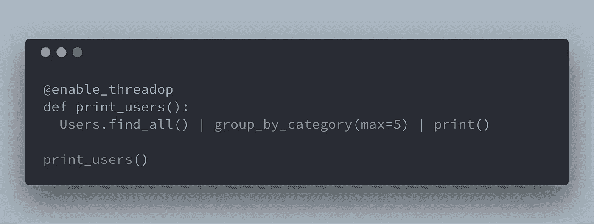

# 向 Python 添加管道运算符

> 原文：<https://medium.com/hackernoon/adding-a-pipe-operator-to-python-19a3aa295642>

## 或者，“你永远不应该在生产中做的事情”

有一天，我在看一些由一系列深度嵌套的函数调用组成的 Python 代码，一个想法立即被推上了大脑的堆栈:

> 如果 Python 有一个类似于 Elixir 的[管道操作符](https://elixirschool.com/en/lessons/basics/pipe-operator/)的操作符，岂不是很酷？

# 管道操作员？

对于那些不熟悉 Elixir 的人来说，管道操作符`|>`可以用来转换如下所示的代码:

Nested function calls.

变成类似这样的代码:

Refreshing!

本质上，假设右边的表达式是一个函数调用，管道操作符将左边的表达式移到右边表达式的第一个参数位置。

# 用 Python 来做

尽管在不改变 Python 解释器的情况下不可能向语言中添加实际的管道操作符，但是没有什么可以阻止我们重新利用现有的操作符！这正是我要做的。

借鉴 shells，我认为“按位 or”(也称为“管道”)操作符非常适合这种功能:

我能想到的改变管道操作符用途的最简单的方法是使用装饰器重写函数。Python 的内置`ast`模块使这变得特别容易。

我所要做的就是

*   获得一个函数的源代码(使用`inspect.getsource`)，
*   通过把它传递给`ast.parse`，把它变成一个抽象的语法树，
*   遍历树，根据我在上一节末尾概述的规则转换管道操作符的任何出现，
*   最后，编译并返回重写后的函数对象。

这听起来比实际情况复杂得多。

`ast`模块提供了一个名为`NodeTransformer`的类，它实现了访问者模式:它的`visit`方法通过 AST 进行深度优先搜索，并为树中的每个节点调用其自身的任何形式为`visit_NODETYPE`的声明方法。顾名思义，您可以使用节点转换器来访问和操作 AST 的节点:

每当转换器遇到二元操作符时，它就会递归，以便首先对其左侧和右侧节点进行任何需要进行的转换，然后检查当前操作符是否是“按位或”。

如果当前节点的运算符是“按位 or ”,并且右侧是函数调用节点，则它将左侧插入函数调用的第一个参数位置，然后返回右侧的节点，用树中的调用节点替换二元运算符节点。

当转换器看到一个函数定义时，它也会介入，这样它就可以移除`enable_threadop`装饰器。一旦你看一看装饰器本身，这就有意义了:

装饰器将一个函数作为参数，获取它的源代码并删除任何缩进(这很重要！否则，修饰类方法会产生一个`SyntaxError`，解析代码并转换 AST，最后，它编译并执行函数定义，返回结果函数对象。

如果转换器没有从最终的树中移除装饰器，那么我们将面临一个无限循环，因为在执行函数定义时`enable_threadop`会被一遍又一遍地调用(第 13 行)。

有了这些，就可以使用`enable_threadop`装饰器来有选择地改变管道操作员的行为:

If that’s not a realistic example, I don’t know what is!

## 限制

正如您所料，这种方法有一些限制。

首先，`inspect.getsource`从文件系统中抓取函数的源代码，这意味着装饰器不能在 Python 解释器中工作。

其次，转换器要求管道操作符的右边是一个函数调用。

# 是时候在生产中使用它了！

哇哦，慢点！这只是一个简单的小实验，绝对不应该强加给你的同事！

也就是说，如果你想玩它，你可以找到完整的代码(50 行加注释！)在 [GitHub](https://github.com/Bogdanp/threadop/blob/master/threadop.py) 上。

*感谢阅读！如果你喜欢这篇文章，给它一个掌声！你也可以在我的网站上找到我，网址是*[*https://defn . io*](https://defn.io)*，在*[*GitHub*](https://github.com/Bogdanp)*和*[Twitter](https://twitter.com/Bogdanp)*。*

 [## 波格丹一世·波帕(@波格丹)|推特

### 波格丹一世·波帕的最新推文。程序员，https://t.co/FFd6cPhKk5 和…

twitter.com](https://twitter.com/bogdanp)