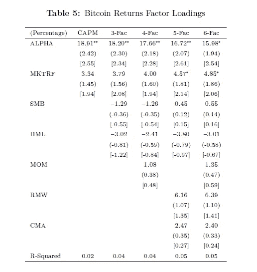
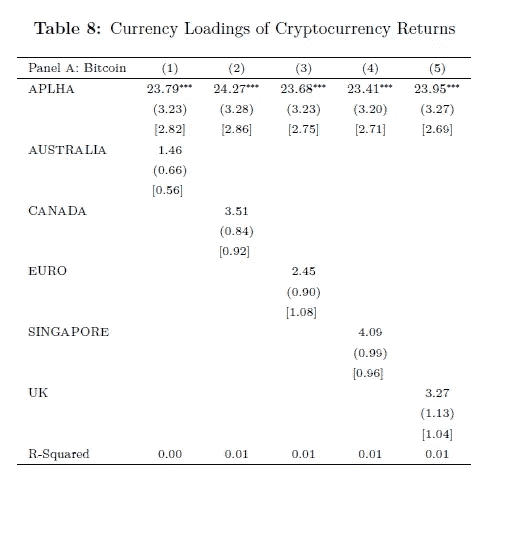
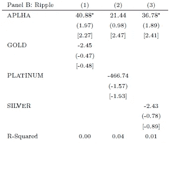
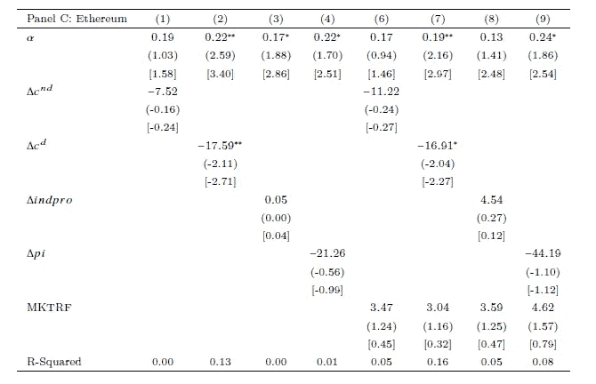
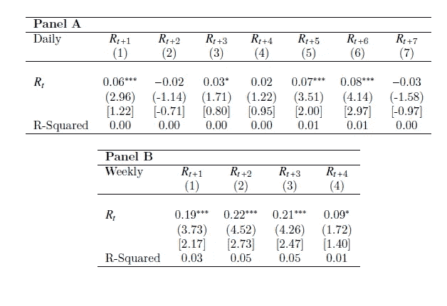
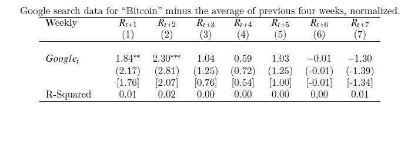

# 疯狂中加入数学:关于加密货币价格的最重要的研究已经发表，结果将会让你震惊

> 原文：<https://medium.com/hackernoon/adding-math-to-the-madness-the-most-important-research-study-on-the-price-of-cryptocurrencies-has-66bdc304b116>

预测和合理化影响加密货币价格的因素仍然是加密资产市场的圣杯之一。这种新的资产类别已被证明对许多传统的定量金融分析方法具有弹性，而传统的技术分析在加密领域几乎是一个笑话。毫不奇怪，每周我们都会从图表分析师那里获得大量关于加密货币价格的失败预测，他们一直试图将普通的技术分析方法应用于加密领域。我不是技术分析的粉丝，但是，即使你是，你也会同意，将它应用到加密货币领域可能需要一些改进。

将量化技术应用于加密资产的根本挑战在于，我们对影响其价格的因素一无所知。杰米·戴蒙(Jamie Dimon)和权证·巴菲特(Warrant Buffett)等加密怀疑论者将声称，影响加密货币价格的唯一因素是其他人愿意为其支付的价格[我们知道这在数学上和事实上都是错误的，但那是另一个故事了]。另一方面，大多数加密分析师有强烈的直觉，认为加密货币的价格与市场因素(如法定货币、商品和特定股票组的行为)之间存在相关性。很少有人从统计学上验证这些直觉，但它们似乎在逻辑上有意义。好吧。事实证明，在诺贝尔奖得主丹尼尔·卡内曼和理查德·塞勒喜欢称之为“有效性的幻觉”或纳西姆·尼古拉斯·塔勒布经常提到的“叙事谬误”之后，这些市场直觉可能完全没有根据。

本周，耶鲁大学的研究人员发表了我所见过的关于影响加密货币价格的因素的最全面的研究之一。该论文的作者，经济学教授[阿莱赫·齐文斯基](https://economics.yale.edu/people/aleh-tsyvinski)和经济学博士候选人[刘宇昆](https://economics.yale.edu/people/yukun-liu)，试图“制定和调查加密货币回报的潜在预测因素”，根据该论文，并分析了比特币、Ripple 和以太坊过去几年的价格数据。具体而言，本文分析了加密货币价格与普遍认为对其价格起作用的四个主要因素之间的相关性:

**a)股票**

**b)法定货币**

**c)商品**

**d)宏观经济因素**(非耐用消费增长、耐用消费增长、工业生产增长、个人收入增长)

省得你看完这篇文章才痛苦😉让我告诉你结论。耶鲁大学的研究得出了两个主要发现:

1)加密货币的价格与股票、货币、商品或宏观经济指标的价格之间不存在统计上一致的相关性。

2)有两个加密货币特有的因素似乎对加密价格有很大影响，研究人员称之为“动量”和“投资者注意力效应”。

# 加密货币和股票

为了确定加密货币和股票之间的相关性，耶鲁大学的研究论文依赖于 [CAPM Fama 模型](https://en.wikipedia.org/wiki/Fama%E2%80%93French_three-factor_model)的不同变体，该模型试图预测遵循正常投资组合理论的股票的价格/风险。该模型是以尤金·法玛教授的名字命名的，他著名地提出了“有效市场假说”，这一假说在金融市场上引起了许多梦想和噩梦。CAPM 理论使用一系列指标，如 SMB(小减去大)或 HML(高减去低)，来计算不同类型股票(小、中、大盘股)的股票敞口。你可以在这里了解所有这些因素[……](http://mba.tuck.dartmouth.edu/pages/faculty/ken.french/Data_Library/f-f_5_factors_2x3.html)

下表显示了所有 CAPM-Fama 模型的比特币价格分析。

该研究表明，不同的加密货币与股票投资组合的相关性水平不同，且没有统计学意义。例如，以太坊似乎更接近成长型公司，而比特币似乎与价值型公司更相关，在这两种情况下，相关性都不显著。

# 加密货币和法定货币

耶鲁大学的研究评估了加密货币奖与五种主要货币的相关性:澳大利亚元、加拿大元、欧元、新加坡元和英镑。在这种情况下，统计数据更加确凿，表明与资产相关的 alpha 因子几乎没有变化，如下表所示:

# 加密货币和商品

该研究随后转向分析与黄金、铂金或原油等大宗商品相关的加密货币的价格。又一次三振出局。除了黄金价格对以太坊的一些轻微影响，加密货币和商品之间没有明显的相关性。

# 加密货币与宏观经济因素

最后，该研究考虑了非耐用消费增长、耐用消费增长、工业生产增长和个人收入增长等宏观经济因素如何影响加密货币的价格。又一个震惊。对于比特币和 Ripple 来说，所有的风险敞口在统计上都不显著。值得注意的是，对以太坊来说，耐用消费增长因素具有显著的负荷。

# 那是什么？

如果加密货币对股票、商品、法定货币和宏观经济因素的行为没有反应，那么是什么影响了它们的价格呢？耶鲁大学的研究确定了两个主要的加密特定因素，这些因素似乎与加密货币的价格高度相关。

# 加密货币势头

动量是市场上几乎所有相关资产类别的经典因素。从概念上讲，动量量化了一项资产在经历小幅增值后增值的倾向。简单来说，*“东西涨了就平均继续涨，东西跌了就继续跌”。。*报告发现，如果比特币的价格在一周内大幅上涨，那么接下来的一周很可能会继续上涨。

研究发现，动量是预测加密货币价格的一个重要因素。对于比特币的每日回报，当前回报在统计上显著正向预测 1 天、3 天、5 天和 6 天的未来回报。今天的收益增加一个标准差会导致 1 天、3 天、5 天和 6 天的日收益分别增加 0.33%、0.17%、0.39%和 0.50%。

# 投资者关注

没有任何研究能够证明炒作对加密货币的价格没有影响。没必要。Tsyvinski 和刘发现，投资者在网上搜索和发布的加密货币的兴趣和炒作程度是价格走势的重要预测因素。说得好听一点，他们称这个因素为“投资者注意力”因素(我肯定会有不同的叫法)。

以下矩阵将比特币的价格与谷歌搜索相关联。对于每周回报，谷歌搜索代理从统计上显著预测了未来 1 周和 2 周的回报。本周搜索中一个标准差的增加导致 1 周和 2 周提前回报的周回报增加 1.84%和 2.30%。

# 最后一些统计上的严格性

在写这篇文章的时候，我们仍然在通过研究中发表的数学来评估一些概念，但是结果有很多概念上的意义。加密货币是一种不同于现有资产类别的新资产类别。因此，加密资产的行为价格与一组新的因素相关联。该研究表明，这些因素往往是特定于密码的，与整体市场无关。势头和投资者的注意力只是数百个可量化因素中的两个，这些因素对加密资产的价格起着作用，但最终给这种疯狂加上一些数学因素还是不错的。