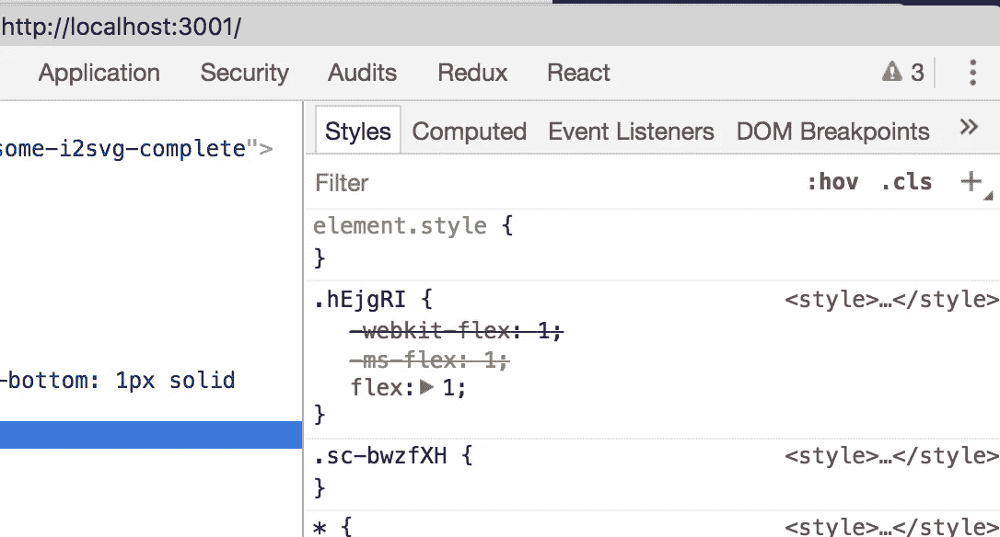
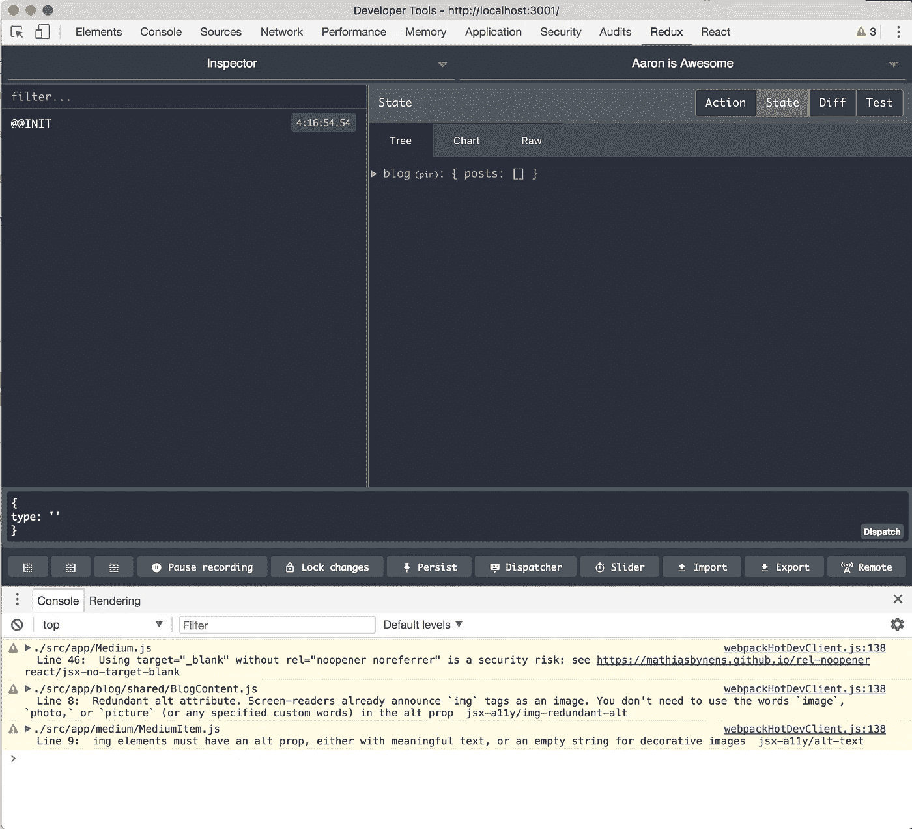

# 向 React 博客添加 Redux

> 原文：<https://medium.com/hackernoon/adding-redux-to-a-react-blog-97f5fea606c2>

## React 博客系列:第四部分


本文是用 React 创建博客的每周系列的第四部分，是前几部分创建的代码的扩展。

## React 博客系列

[**第一部分:**用 React 和布尔玛](/front-end-hacking/building-a-website-with-react-and-bulma-d655214bff2a)
[**建立一个网站第二部分:**用 React 和 Contentful 建立一个博客](/@aaron.klaser/building-a-blog-with-react-and-contentful-fd538f68f6fb)
[**第三部分:**将你的媒体提要导入 React](/@aaron.klaser/import-your-medium-feed-into-react-ceadbaf785c7)
**第四部分:**向 React 博客添加一个 Redux
[**第五部分:**用 Redux Sagas 替换 Redux Thunks](https://hackernoon.com/replacing-redux-thunks-with-redux-sagas-4aa306854925)

这就是你们一直在等待的时刻。——***Redux！！！***

```
npm install react-redux redux-thunk redux-immutable-state-invariant
```

> **注意:**你也可以安装 redux 作为一个开发依赖项。传闻是**纱**解决了这个问题，但你也可以手动安装到依赖。`npm install redux --save-dev`

# 添加商店

因此，这可能是一个不受欢迎的观点，因为我知道每个人都有一个努力的 ReDucks，但这不是正确的方法。当您将存储文件与组件放在一起时，您正在将表示层与应用程序业务层和状态结合起来。如果有新的东西来取代 Redux，你不必从我们所有的文件夹中删除文件，只需删除整个存储。但是我们将在商店中分离我们的文件类型。

## 分形概念

记住我们使用的是分形文件结构键值概念。在商店中，我们将遵循这种模式，**key = public actions(thunks)**和**value = private(type reducers 和 actions)，**这意味着我们的应用程序永远不会与我们文件夹中的文件进行对话。它们将**只与 thunk** (键，公共动作)对话，后者将与其文件夹中的文件(值，私有类)对话。在大多数情况下，我们的 **thunk** 会从某个地方获取数据，并将其发送到我们的商店。

困惑了吗？我想是的。

下面是一个用户存储文件结构的例子。我们的组件将只与 **User.js** 对话，而后者将与用户文件夹中的文件对话。随着时间的推移，这将更有意义。

```
src 
- app 
  - ... app code ...
- store
  - User.js
  - user
    - actions
    - reducer
    - types
```

## 建立

在`src`文件夹中添加一个名为**的文件夹存储**。

然后添加三个文件: **index.js** 、 **initialState.js** 和 **rootReducer.js**

设置 index.js

```
import { createStore, applyMiddleware } from 'redux'
import { rootReducer } from './rootReducer'
import reduxImmutableStateInvariant from 'redux-immutable-state-invariant'
import thunk from 'redux-thunk'export function configureStore(initialState) {
  return createStore(
    rootReducer,
    initialState,
    applyMiddleware(
      thunk,
      reduxImmutableStateInvariant()
    )
  )
}
```

Setup initialState.js

```
export default {}
```

安装 rootReducer.js

```
import { combineReducers } from 'redux'export const rootReducer = combineReducers({})
```

要连接到应用程序，请打开 **src 文件夹**中的应用程序`index.js`，然后存储并打包应用程序。

```
import React from 'react';
import ReactDOM from 'react-dom'
import registerServiceWorker from './registerServiceWorker'
import { BrowserRouter as Router } from 'react-router-dom'
import App from './App'***// Redux Store* import { Provider } from 'react-redux'
import { configureStore } from './src/store'**import './index.css'**const store = configureStore()**ReactDOM.render((
  **<Provider store={store}>**
    <Router>
      <App />
    </Router>
  **</Provider>**
), document.getElementById('root'))
registerServiceWorker()
```

ConfigureStore 是我们商店的 **index.js** ，在设置期间，我们目前没有传递任何初始状态。

此外，如果您需要应用程序检索任何初始数据，将在我们将存储设置为 configureStore 后调用它。

# Redux 博客商店

现在简单的部分已经过去了，让我们卷起自己，创造一些奇迹。

在我们的商店文件夹中创建一个名为 **Blog.js** 的文件和一个名为 **blog** 的文件夹。在博客文件夹中创建三个填充: **actions.js** 、 **reducer.js** 和 **types.js**

先说我们的类型。这些是我们的操作调用调度使用的常量。首先，我们只需要一个加载我们的博客数据到我们的商店。

在`store/blog/types.js`添加

```
*/**
* Blog Types
*/*export const LOAD_BLOG_SUCCESS = 'LOAD_BLOG_SUCCESS'
```

在我们继续之前，让我们添加一个 blog 对象，用一个空的 posts 数组作为 blog 的初始状态。这将在设置我们的减速器时通过。它还允许应用程序在没有数据的情况下加载，而不会抛出空异常。

在`store/initialState.js`中添加

```
export default {
  blog: {
    posts: []
  }
}
```

接下来，让我们设置我们的减速器。这是更新我们状态的东西，也是我们数据存储的地方。这些操作将调用它们，并通过一个 switch 语句来查找该操作所调用的类型。

在`store/blog/reducer.js`添加

```
*/**
* Blog Reducer
*/*
import initialState from '../../store/initialState'
import * as types from './types'export default function blogReducer(state = initialState.blog, action) {
  switch (action.type) {
    case types.LOAD_BLOG_POSTS_SUCCESS:
      return {
        ...state,
        posts: action.posts
      } 
    default:
      return state
  }
}
```

接下来，我们需要设置一个动作来分派该类型，并将其数据设置为有效负载(posts)。

在`store/blog/actions.js`添加

```
*/**
* Blog Actions
*/*
import * as types from './types'export function loadBlogSuccess(post) {
  return { type: types.LOAD_BLOG_SUCCESS, post}
}
```

现在，我们需要将它包含在我们的 rootReduce 中。rootReducer 将所有存储的 Reducer 组合成一个巨大的 reducer，它创建了一个全局状态，可以在应用程序的任何地方访问。

在`store/rootReducer.js`中添加

```
import { combineReducers } from 'redux'
**import blog from './blog/reducer'**export const rootReducer = combineReducers({
 **blog**
})
```

> **注意**我们没有将它作为 blogReducer 导入，因为无论你在 combineReduces 中如何称呼它，都是你在应用程序的其余部分如何访问它。**导出缺省值**是当我们导入缺省函数时，允许我们命名任何我们想要的东西。我们可以把它作为 blogReducer 导入，然后由 combineReducers 函数完成。#CodeIsArt

# 测试 Redux 是否正常工作

现在我们的代码正在工作。它还没有做任何事情，因为它实际上没有做任何我们可以看到的事情，但它正在工作 ***和*** 我可以证明这一点。

首先你需要 chrome 的 Redux 开发工具扩展。[https://github.com/zalmoxisus/redux-devtools-extension](https://github.com/zalmoxisus/redux-devtools-extension)

```
npm install --save-dev redux-devtools-extension
```

那我们需要把它连接起来。在`store/index.js`中，我们将删除 **initialState** ，因为我们将在每个商店的 reducers 中设置它们，我们将用 **composeWithDevTools** 函数包装我们的中间件。

```
import { createStore, applyMiddleware } from 'redux'
import { rootReducer } from './rootReducer'
import reduxImmutableStateInvariant from 'redux-immutable-state-invariant'
import thunk from 'redux-thunk'
**import { composeWithDevTools } from 'redux-devtools-extension';**export function configureStore() {
  return createStore(
    rootReducer,
    **composeWithDevTools(**
      applyMiddleware(
        thunk,
        reduxImmutableStateInvariant()
      )
    **)**
  )
}
```

然后在 chrome 中安装扩展，打开 chrome inspector(我一般是在页面上右键点击 inspector)。在顶部导航你现在应该有 Redux 选项。



单击它并刷新您的应用程序。当应用程序加载时，Redux 选项卡有时必须打开才能工作，这是因为连接是在 **createStore(…)** 功能中的站点加载上建立的。

现在，你应该看到你的 Redux 状态和历史。它默认为 **Diff** ，因此单击**状态**选项卡，您应该会看到您的默认对象



很酷，对吧！

# 将博客数据放入博客存储中

请记住 **Blog.js** 文件中是我店的**公共行为** (the thunk) 。当站点加载时，我们将在这里放置 thunks 并检索我们的数据。

我们可以重用来自`app/Blog.js`的一些逻辑，因为它不再需要调用 Contentful。我们认为那会发生。

让我们设置我们的 thunk。打开`store/Blog.js`并添加

```
import * as contentful from 'contentful'
import * as actions from './blog/actions'const client = contentful.createClient({
  space: 'qu10m4oq2u62',
  accessToken: 'f4a9f68de290d53552b107eb503f3a073bc4c632f5bdd50efacc61498a0c592a'
})const error = err => console.log(err)export function loadBlog() {
  return dispatch =>
    client.getEntries()
      .then(({items}) => {
        dispatch(actions.loadBlogSuccess(items))
      })
      .catch(error)
}
```

> thunk 自动将分派传递给我们的函数，这是第一个参数所做的。

这段代码将调用 Contentful，并将数据发送到 loadBlogSuccess 操作，该操作将数据存储在 posts 下的博客状态中。

但是它不会自动发生，我们需要在网站加载时调用这个函数。

我们将通过在我们的**根**文件中添加一行来做到这一点

```
...*// Redux Store* import { Provider } from 'react-redux'
import { configureStore } from './store'
**import { loadBlog } from './store/Blog'**import './index.css'const store = configureStore()
**store.dispatch(loadBlog())**ReactDOM.render((...
```

我们告诉商店，一旦它被创建，就分派 **loadBlog()** 函数。

当您刷新应用程序并检查 Redux dev 工具时，您现在应该会在**博客>帖子**中看到一些数据

# 在组件中使用存储

这是一个非常简单的步骤。Redux 给了我们一个可以使用的函数 mapStateToProps，正如你可能猜到的，它将我们的 redux 状态映射到我们的页面属性。然后我们将 mapStateToProps 和 Blog.js“连接”到 Redux。

神奇的是，打开 app/Blog.js 并删除我们的旧代码以获得帖子并添加/更新 8 行代码。

```
import React from 'react'
**import { connect } from 'react-redux'**
import * as contentful from 'contentful'
import BlogItem from './blog/BlogItem'
import PageHeader from './components/PageHeader'
import PageContent from './components/PageContent'class Blog extends React.Component {
  render() {
    return (
      <div>
        <PageHeader color="is-info" title="Code Blog">
          Your standard <strong>JavaScript</strong> programming blog, albeit, probably not very good, but I will at least try to keep it entertaining. This blog is a chronological mix of random posts on Angular, React, Functional Programming, and my <strong>project walkthroughs</strong>.
        </PageHeader>
        <PageContent>
          { **this.props.blog.posts.map**(({fields}, i) =>
            <BlogItem key={i} {...fields} />
          )}
        </PageContent>
      </div>
    )
  }
}**function mapStateToProps(state, ownProps) {
  return {
    blog: state.blog
  }
}**export default **connect(mapStateToProps)(Blog)**
```

Blammo！Redux！

# 正确使用博客状态

我将是第一个承认当我第一次开始使用 Redux 的时候，我是把它作为一个数据存储来使用的，它远不止于此。它是你的应用程序的状态，它去了哪里，去了哪里，在做什么，它知道什么…只用它来存储数据是对它的存在的侮辱。例如，我们的应用程序现在运行得很好，因为 Contentful 很棒，速度很快，我们只有很少的数据，但如果我们有很多数据或很慢的连接呢？我们不想为用户加载一个空白的剧本。

让我们为加载创建一个博客状态，也就是说，当它从 Contentful 获取数据时，我们可以显示一个加载图标。

store/initialState.js

```
export default {
  blog: {
    **loading: false,**
    posts: []
  }
}
```

store/博客/types.js

```
*/**
* Blog Types
*/* export const BLOG_LOADING = 'BLOG_LOADING'
export const LOAD_BLOG_SUCCESS = 'LOAD_BLOG_SUCCESS'
```

store/blog/reduce . js

```
*/**
* Blog Reducer
*/* import initialState from '../../store/initialState'
import * as types from './types'export default function blogReducer(state = initialState.blog, action) {
  switch (action.type) {
    case types.BLOG_LOADING:
      return {
        ...state,
        loading: action.isLoading
      }
    case types.LOAD_BLOG_SUCCESS:
      return {
        ...state,
        posts: action.posts,
        loading: false
      }
   default:
     return state
  }
}
```

> 是的。State 只包含 posts 和 loading，但我们仍然将它展开。如果你在记分数，你可能早就注意到了。这是一个很好的实践，因为我们每次都在设置一个新的状态对象。购买总是传播状态首先，我们得到所有以前的值，不要忘记任何，然后新的字段简单的覆盖以前的值。喜欢`**Object.assign({}, previouseState, { …newStateValues})**`

商店/博客/行动. js

```
*/**
* Blog Actions
*/* import * as types from './types'**export function blogLoading(**isLoading = true**) {
  return { type: types.BLOG_LOADING, isLoading}
}**export function loadBlogSuccess(posts) {
  return { type: types.LOAD_BLOG_SUCCESS, posts}
}
```

> 我们将 **isloading** 设置为默认值 true，所以我们通常不会在调度博客加载时传递任何数据。**但是**，通过让它让我们**可以**传入类似 false 的东西，意味着我们不需要创建一个动作来将 loading 设置为 false，比如说加载是否有错误。

store/博客. js

```
import * as contentful from 'contentful'
import * as actions from './blog/actions'const client = contentful.createClient({
  space: 'qu10m4oq2u62',
  accessToken: 'f4a9f68de290d53552b107eb503f3a073bc4c632f5bdd50efacc61498a0c592a'
})export function loadBlog() {
  return dispatch => **{**
    **dispatch(actions.blogLoading())
**    **return** client.getEntries()
      .then(({items}) => {
        dispatch(actions.loadBlogSuccess(items))
      })
      .catch(**error => {
        console.log(error)
        dispatch(actions.blogLoading(false))
      }**)
  **}**
}
```

> 所以我们需要做一些重新安排，我们稍后会清理它，但是我们需要能够调用 dispatch 来调用我们对 **blogLoading** 的操作。

现在，您应该可以在 Redux 开发工具中看到一些额外的动作。

## 更新视图以添加装载图标

回到`app/Blog.js`让我们设置一些占位符文本，以确保我们的逻辑工作。

```
<div>
  <PageHeader color="is-info" title="Code Blog">
Your standard <strong>JavaScript</strong> programming blog, albeit, probably not very good, but I will at least try to keep it entertaining. This blog is a chronological mix of random posts on Angular, React, Functional Programming, and my <strong>project walkthroughs</strong>.
  </PageHeader>
  **{ this.props.blog.loading
    ? <div>Loading</div>
    :** <PageContent>
        { this.props.blog.posts.map(({fields}, i) =>
          <BlogItem key={i} {...fields} />
        )}
      </PageContent>
 **}**
</div>
```

我们用三元运算符包装前面的代码来处理 if 语句。这意味着，如果 loading 为真，我们将显示 loading div，否则我们将显示内容 dev。

> 如果你和我一样，Contentful 只是太快了，你看不到它。我们可以在 getEntries 成功承诺上包装调度，并设置一个超时。`setTimeout(() => dispatch(actions.loadBlogSuccess(items)), 5000)`
> 
> 现在，您应该能够看到加载 div。
> 
> **或**，可以在 Redux Dev 工具中实现历史跳转功能。我会让你自己去发现那颗小宝石。)

现在，在`app/components`中创建 **Loader.js** ，这将是我们的 spinner 的样式组件。

现在回到我们的`app/Blog.js`让我们添加旋转器。将`<div>Loading</div>`替换为

```
<Loader className="has-text-primary"></Loader>
```

别忘了导入加载器`import { Loader } from ‘./components/Loader’`

加载器默认为白色，所以你需要硬编码颜色或者使用**布尔玛**我们可以给它一个类 **has-text-$color** (类似 has-text-primary) **。**

# 我发现了一个 bug:(

回到[用 React 和 Contentful 创建博客的清理阶段](/front-end-hacking/building-a-blog-with-react-and-contentful-fd538f68f6fb)，我忘记在博客条目导航中更改“阅读更多”和“返回博客”的文本。

使用`to`道具，在`<Link>`中使用一个简单的三进制操作符就可以很容易地解决这个问题。

在`app/blog/shared/BlogNav.js`可以链接到这个

```
<Link className="level-item button is-small is-link is-outlined" to={to}>
  **{ to === '/blog' ? 'Back to Blog' : 'Read More'}**
</Link>
```

# 将商店添加到媒体页面

现在我们可以为我们的媒体页面做完全相同的事情。我不会向你展示每一个步骤，因为这不是我们学习的方式，但我会为你列出它们。

**步骤 1:** 创建类型
**步骤 2:** 将状态添加到初始状态
**步骤 3:** 设置还原器
**步骤 4:** 设置操作
**步骤 5:** 将还原器添加到根还原器
**步骤 6** :设置我们的 thunk *(提示如下)*

```
import * as actions from './medium/actions'
import axios from 'axios'const fetchPosts = () => axios.get(`https://cors.now.sh/https://us-central1-aaronklaser-1.cloudfunctions.net/medium?username=@aaron.klaser`)const setPosts = ({data}) => Object.values(data.payload.references.Post).map(
  ({ id, title, createdAt, virtuals, uniqueSlug }) => Object.assign({},{
    title,
    createdAt,
    subtitle: virtuals.subtitle,
    image: virtuals.previewImage.imageId ? `https://cdn-images-1.medium.com/max/800/${virtuals.previewImage.imageId}` : null,
    url: `https://medium.com/@aaron.klaser/${uniqueSlug}`
  })
)export const loadMedium = () => async dispatch => {
  dispatch(actions.mediumLoading())
  const data = await fetchPosts()
  return dispatch(actions.loadMediumSuccess(setPosts(data)))
}
```

**第 7 步:**向组件添加状态

测试它，继续生活。你现在是 Redux 大师了！

# 让我们回顾一下

*   将 Redux 和朋友添加到您的项目中。
*   使用分形文件结构设置商店
*   设置商店的类型缩减器和加载数据的操作
*   设置商店的 thunk，这是我们的公共操作类
*   将商店添加到页面组件中
*   添加了加载状态和加载动画
*   修正了一个预览错误
*   将商店添加到介质页面

> 接下来— [用 Redux Sagas 替换 Redux Thunks](https://hackernoon.com/replacing-redux-thunks-with-redux-sagas-4aa306854925)