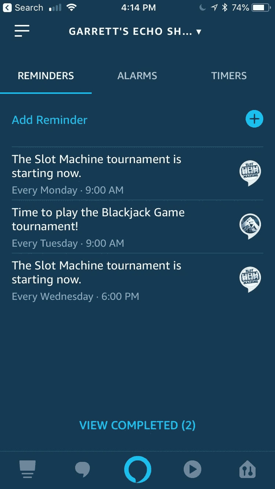

# 添加提醒到您的自定义 Alexa 技能

> 原文：<https://medium.com/hackernoon/adding-reminders-to-your-custom-alexa-skill-2ff2bd33101f>

亚马逊最近宣布了一项针对 Alexa 技能开发者的新功能，即[提醒 API](https://developer.amazon.com/docs/smapi/alexa-reminders-overview.html) 。这个 API 允许你为你的技能的用户设置自定义提醒，它将在请求的时间播放钟声，如果你安装了 Alexa companion 应用程序，还可以在你的手机上发出警报，如下所示。如果使用得当，这个新的 API 有望为您的客户提供大量的重复参与。在这篇文章中，我将谈谈我是如何将提醒与我的两项技能相结合的，我认为这些方法提供了真正的客户价值，并有可能增加我的技能的参与度。

Reminders shown in the Alexa app

# 用例:锦标赛提醒

我的一些技能每周都有一个特殊的“锦标赛”。对于 21 点游戏，每周二你可以用单独的资金与其他玩家对战，看谁能在 100 回合内获得最高的资金。对于吃角子老虎机，在周三晚上和周一早上有一个小时的窗口，在此期间，您可以通过旋转的“锦标赛机器”尝试获得最高的资金(为了更好地满足这些客户的需求，当这项技能在欧洲上线时，我增加了第二场每周一次的比赛。)对于这两种技能，在锦标赛窗口期间的使用量每周都会激增，证明这是一个受欢迎的产品功能。

我对吃角子老虎机锦标赛特别满意，实际上我自己时不时也会玩(我保证我不作弊！)，作为一名顾客，我发现有时我会忘记锦标赛，直到它结束。当提醒 API 发布时，我知道我必须把它融入我的技能中，这样用户(包括我！)可以知道比赛回合何时开始。

与任何新功能一样，我从对话流程开始——我想如何向客户展示这项功能，确保他们能够设置提醒并理解这样做的好处，同时不要经常唠叨。我决定以两种方式提供这一功能——一种是新的自定义提醒内容，允许他们专门请求提醒(“为锦标赛设置每周提醒”)，另一种是在会议结束时进行追加销售，如果锦标赛即将在不久的将来举行(“下一场锦标赛将在 10 小时后开始。您想在每周三下午 6 点设置锦标赛的每周提醒吗？”).在后一种情况下，我不想在每次他们玩我的技能时都问这个问题，从而惹恼客户，但我确实想偶尔提示他们，因为如果他们玩锦标赛，这对我也有好处。我也不想提示他们是否已经为即将到来的锦标赛设置了提醒，当然也想确保他们知道锦标赛是在他们自己的时区。

# 实施细节

记住这个流程，有三个主要步骤必须发生:(1)设置提醒，(2)处理来自 API 的响应，以及(3)在开始这个流程之前检查现有的提醒。让我们从设置提醒的代码开始。

Code to set a reminder in the customer device’s timezone

目前，ask-sdk 中没有一个干净的 API 来调用 Reminder API，但是使用 request-promise 这样的库直接向 Alexa 请求中提供的端点发出 POST 命令是很简单的。

在我的代码中，您可以看到我在构建警报时将时区设置为 America/US_LosAngeles(太平洋时间)。这是因为锦标赛回合在全球范围内同时进行，每个人都在一起玩！在正确的时区设置闹钟应该会自动调整提醒，提醒那些居住在没有夏令时或夏令时与西海岸锦标赛时钟不同的地区的客户。您还将看到，我正在使用 moment 包来获取每周提醒所需的双字符代码(确保首先将区域设置为英语)。我在其他地方也使用这个模块——如果不是这样，我可能会使用 getDay()并使用一个由两个字符组成的日期名称数组。

在管理来自这个 API 的响应时，您必须记住尝试设置提醒可能会失败。如果用户没有提供技能的许可(在这种情况下，错误代码将是未授权的)，或者如果可能是另一个错误，就会发生这种情况。在我的情况下，我将其他错误集合到一个单一的“某事出错”消息中，但我确实为客户提供了一个有意义的行动呼吁，并在 Alexa 应用程序中提供了一张同意卡，供客户尝试设置另一个提醒。

Handling the response from setting a reminder

最后，我还想在提示用户设置提醒之前检查是否设置了提醒。为此，我们调用该技能来设置所有活动提醒。因为吃角子老虎机可以在不同的日子为多个锦标赛设置提醒，所以这段代码检查返回的提醒的完整列表，以查看这一天是否与我们想要设置提醒的下一场锦标赛的日期相匹配。

Check whether a reminder is set

# 其他注释

上面的代码演示了如何设置提醒，检查活动提醒，以及处理设置提醒的结果。如果您只是为了响应一个明确的用户请求(比如我的 ReminderIntent)而处理提醒，那么这段代码就可以很好地工作，但是对于我的另一个用例，当客户退出该技能时我会提示他们，那该怎么办呢？在这种情况下，我保留了一个时间戳，这样就不会每周打扰用户超过一次。当然，还有许多其他方式可以处理这种情况，例如将这种逻辑与一条提示结合或替换，即客户可以通过明确请求设置提醒，或者作为帮助文本的一部分提及，甚至在锦标赛结束时提及。这个功能太新了，以至于我还没有机会尝试这些不同的选项来确定哪一个是最好的，但关键是，在考虑这些选项时，应该将客户放在心上。