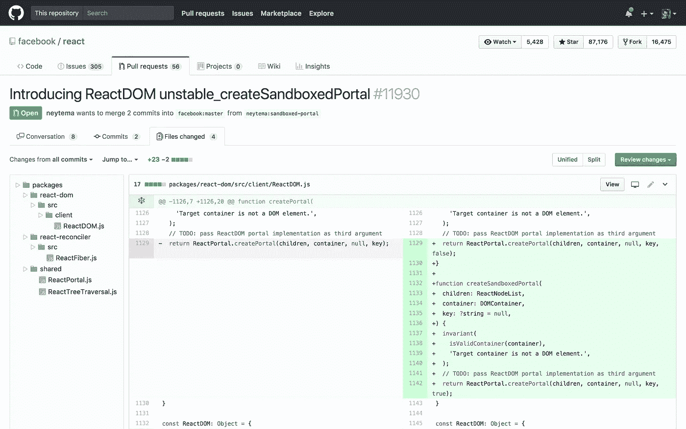

# 向 GitHub Pull 请求添加缺少的功能

> 原文：<https://medium.com/hackernoon/adding-the-missing-features-to-github-pull-requests-faf2d94e32fe>

我喜欢 GitHub，但是他们的代码审查和拉请求的接口还需要改进。因此，除了抱怨，这里还有一个 [Chrome 扩展](https://chrome.google.com/webstore/detail/github-pull-request-tree/nfhdjopbhlggibjlimhdbogflgmbiahc)，它添加了一个文件树视图来拉取请求和粘性文件头:

“GitHub Pull Request Tree” extension on the Chrome Web Store

代码是开源的，托管在 GitHub:【https://github.com/berzniz/github_pr_tree】T2 上。

享受吧。