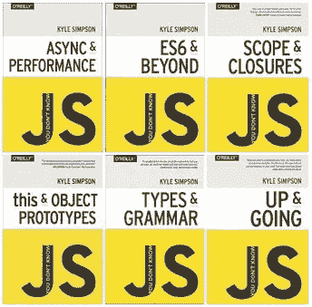

# 凯尔·辛普森的高级 JavaScript

> 原文：<https://medium.com/hackernoon/advanced-javascript-with-kyle-simpson-50e9276e5426>

我的博客记录了我作为一名技术人员进入硅谷的经历。我是一个有色人种的怪人，性别不合群，移民，曾被收养的年轻人。我来自一个[非传统](https://hackernoon.com/tagged/non-traditional)的编码背景。我在大学里学了几门 CS 课程，最后在成为老师之前主修了人文学科。向青少年教授 web 开发让我对编码产生了兴趣。在一所编码学校毕业后，我开始在旧金山的初创企业工作。我的博客一半是关于技术主题，另一半是关于平等和技术访问(我的旅程)。



我在博客上发布我在[前端大师](https://frontendmasters.com/)上完成的教程。这是凯尔·辛普森的高级 [JavaScript](https://hackernoon.com/tagged/javascript) 工作坊。Kyle 是当今最流行的编程语言之一的作者和教师，这是一个流行的 Javascript 系列书籍，名为[“你不知道 JavaScript。”](https://github.com/getify/You-Dont-Know-JS)

诚然，这不是一个“性感”的前端大师的课程，但是，如果你想成为一名优秀的 Javascript 开发人员，你必须有坚实的基础知识，这就足够了，凯尔辛普森在本教程中教你。

除了是 JS 方面的专家，凯尔也是一个好老师。作为一名教师和学生，我经历过好的、坏的和丑陋的事情。他说话清晰，直接与观众互动(在研讨会视频中)，反复强调这个概念，直到我们理解为止。

大外卖:

*   范围
*   关闭
*   “这个”和“新的”
*   面向对象编程(OOP)
*   异步模式
*   该做的和不该做的

# **范围**

## [词法范围](https://spin.atomicobject.com/2014/10/20/javascript-scope-closures/)

凯尔为 [**词汇范围**](http://javascriptissexy.com/tag/variable-scope/) 、建筑物内部的地址给了我们一个巧妙的类比。如果你找不到某一层的地址，那么进入下一层，你的搜索就会像同心圆一样迅速展开。 [**范围**](https://www.sitepoint.com/demystifying-javascript-variable-scope-hoisting/) 在 JavaScript 编程中无处不在。所以，学习 JavaScript 需要对词法范围有扎实的理解:如何 [**遍历**](https://stackoverflow.com/questions/18465211/javascript-loop-variable-scope) 它，通过使变量 [**私有**](https://crockford.com/javascript/private.html) 来隐藏变量。

如果你想欺骗词法作用域，并创建私有变量你可以立即使用[**【IIFEs】**](/@vvkchandra/essential-javascript-mastering-immediately-invoked-function-expressions-67791338ddc6)调用函数表达式。开/闭括号会立即调用 JavaScript 函数。在下面的例子中，变量 foo 在全局命名空间中受到保护。

```
var foo = “foo”;
(function(){
   var foo = “foo2”;
   console.log(foo);
})();console.log(foo);
```

## **封锁范围**

[**让**](https://stackoverflow.com/questions/762011/whats-the-difference-between-using-let-and-var-to-declare-a-variable-in-jav) 关键字附加到 [**块范围**](https://edgecoders.com/function-scopes-and-block-scopes-in-javascript-25bbd7f293d7) 。在一个`for loop`中，关键字`let`附加到“I”和“for 循环”的代码块中。权衡是，let 关键字允许变量重用，但它不提升那个变量。

```
// i accessible to let
for(let i = 0; i < list.length; i++){
//i accessible here too
  return i 
}
```

## [**动态范围**](https://github.com/getify/You-Dont-Know-JS/blob/master/scope%20%26%20closures/apA.md)

在下面的代码中,“function foo”可以访问“var bar ”,因为它查看的是 [**调用堆栈**](/@gaurav.pandvia/understanding-javascript-function-executions-tasks-event-loop-call-stack-more-part-1-5683dea1f5ec) 而不是其词法范围。

```
function foo() {
  console.log(bar); //dynamic!
}function baz() {
 var bar = “bar”;
  foo();
}baz();
```

# **合拢&吊装**

## [**吊装**](http://javascriptissexy.com/tag/variable-hoisting/)

当变量声明和函数声明在编译阶段被移到顶部时。

```
function showName () {
console.log ("First Name: " + name);
var name = "Ford";
console.log ("Last Name: " + name);
}

showName (); 
// First Name: undefined
// Last Name: Ford

// Undefined prints because the local variable name is hoisted to the top of the function
// Local variable gets called the first time// This is how the code is actually processed by the JavaScript engine:

function showName () {
  // name is hoisted (note that is undefined at this point, 
     since the assignment happens below)
  var name; 
  // First Name: undefined
  console.log ("First Name: " + name); 
  // name is assigned a value
  name = "Ford"; 

// now name is Ford
console.log ("Last Name: " + name); 
// Last Name: Ford
}
```

在提升中，首先调用函数，接着是变量声明，执行，然后是函数表达式。

## [**封**](http://javascriptissexy.com/understand-javascript-closures-with-ease/)

是函数访问并记住其词法范围的能力，即使该函数在其词法范围之外执行。Javascript 中的一个必要机制，允许一级函数的可用性

关闭示例#1

```
function foo(){
  var bar = “bar”;
  function baz() {
    console.log(bar);
  }
  bam(baz);
}function bam(baz) {
  //can still access the variable bar — that is closure
  baz(); 
}foo();
```

关闭示例#2

```
function foo(){
  var bar = “bar”;
  return function() {
    console.log(bar);
  }
}function bam() {
  //can still access the variable bar — that is closure
  foo()(); 
}bam();
```

## **‘这个’**

每个正在执行的函数都有一个对其当前执行上下文的引用(包括不止['**'**'](http://javascriptissexy.com/understand-javascripts-this-with-clarity-and-master-it/)、局部变量、调用堆栈)。 [**执行上下文**](http://davidshariff.com/blog/what-is-the-execution-context-in-javascript/) 表示函数被调用时是如何被调用的。

规则——取决于“调用位置”——放在代码中执行函数的位置。

*   硬绑定—可预测地使用“this”

```
function foo(){
  console.log(this.bar);
}
var obj = { bar: “bar” };
var obj2 = { bar: “bar2” };
var orig = foo;foo = function(){ orig.call(obj); };
foo();
foo.call(obj2)
```

有没有一个效用函数可以做到这一点？是的，有—绑定:

```
function bind(fn, o){
  return function() {
    fn.call(o);
  };
}function foo() {
  console.log(this.bar);
}var obj = { bar: “bar” };var obj2 = { bar: “bar2” };foo = bind(foo, obj);foo();foo.call(obj2);
```

2.显式绑定规则—在调用位置，如果存在显式指定“this”的调用或应用

```
function foo(){
  console.log(this.bar);
}var bar = “bar1”;var obj = { bar: “bar2” };foo(); //default bindingfoo.call(obj); //explicit binding
```

3.隐式绑定规则—参见下文“this”如何绑定到对象属性引用

```
var implicitBinding = { bar: “bar2”, foo: foo };
implicitBinding.foo(); //’this’ binds to object property reference
```

4.默认绑定规则—如果您处于“严格模式”，则将“this”关键字默认为未定义的值。否则，将“this”关键字默认为全局对象

```
function foo() {
  console.log(this.bar) //this is bound to an object with property
}
foo(); //call site looks like this and default binding applies
```

关于“this”关键字的 4 个问题:

*   该函数是用“new”关键字调用的吗？
*   是否使用“call”或“apply”调用了函数，使其成为显式绑定？
*   该函数是通过包含/拥有对象(上下文)调用的吗？(隐式绑定)
*   默认值:全局对象(严格模式除外)

# [**新**](https://stackoverflow.com/questions/1646698/what-is-the-new-keyword-in-javascript)

当“new”关键字放在函数调用前面时，会发生 4 种情况:

*   创建了一个新对象。
*   新对象链接到不同的对象。
*   新对象被绑定到“this”关键字
*   如果该函数不返回任何内容，它将隐式插入一个返回 this

```
function foo() {
  this.baz = “baz”;
  console.log(this.bar + “ “ + baz);
}var bar = “bar”;
var baz = new foo();
```

## **该做和不该做的事情**

*   不要使用未命名的匿名函数。这是一种不好的做法，(喘息脸表情符号)——因为你不能递归调用这个函数。
*   不要使用“with”或“eval”—eval 修改现有的词法范围以在运行时添加新的声明，这会使您的代码变慢
*   使用[文件](http://benalman.com/news/2010/11/immediately-invoked-function-expression/)使变量私有