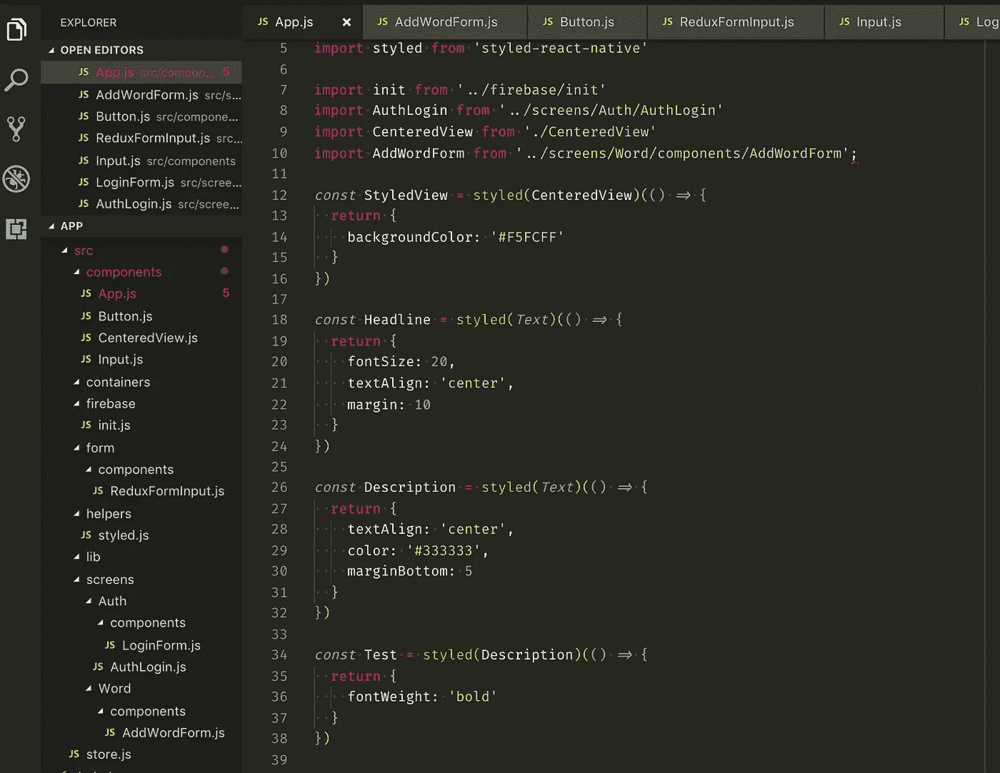

# 用几行代码实现高级 React 本机样式

> 原文：<https://medium.com/hackernoon/advanced-react-native-styling-with-a-few-lines-of-code-4b6a94385015>



最近来到 [React Native](https://hackernoon.com/tagged/react-native) 世界。但是，我对 Reactjs 环境有很多经验。我曾经使用[迷人的](http://glamorous.rocks/) lib(现在演变成 [Emotion.sh](https://emotion.sh/) )来维护我的 Reactjs 应用中的 CSS 样式。这正是我在 React Native space 中所缺少的。

我不想使用任何复杂的东西，因为我的 React 本机应用程序应该是简单的。然而，我仍然想要某种抽象，因为否则项目代码样板很容易变得混乱。主要是，我希望能够使用 React 本机元素，轻松修改其样式，创建可重用的组件，并在其后代中覆盖其样式。

## 要求

1.  简单熟悉的界面。
2.  使用 React 本机元素(以及任何其他 React 组件)。
3.  组件样式[组成](https://hackernoon.com/tagged/composition)。
4.  不需要使用 React Native *样式表*(增强的*样式*属性)。

这里有一个例子:

1.  我想使用内置的*文本*组件。
2.  继承它的风格，添加自定义的，并创建一个组件，将可在我的应用程序。
3.  继承这个自定义组件，修改它的样式(或添加新的样式)并将其呈现在我的屏幕上。

这可以通过简单的组件抽象/组合很容易地完成:

```
 import { Text } from 'react-native'

  const Headline = styled(Text)(() => {
    return {
      fontSize: 20,
      textAlign: 'center',
      margin: 10
    }
  })

  const BoldHeadline = styled(Headline)(() => {
    return {
      fontWeight: 'bold'
    }
  }) <BoldHeadline {...{style: {backgroundColor: 'red'}}}>My Headline</BoldHeadline>
```

我们的抽象允许我们这样做，它被封装在**风格的**方法中，看起来像这样:

```
import React from 'react'
import { StyleSheet } from 'react-native'

const styled = Component => {
  const comp = styles => {
    return ({ style, children, ...rest }) => {
      let composed = []
      if (styles) {
        composed = [
          ...composed,
          StyleSheet.create({
            styles
          }).styles
        ]
      }

      if (Array.isArray(style)) {
        composed = [...composed, ...style]
      } else if (style) {
        composed = [
          ...composed,
          StyleSheet.create({
            style
          }).style
        ]
      }

      return <Component {...{ style: composed }} {...rest}>{children}</Component>
    }
  }

  return arg => {
    if (typeof arg === 'function') {
      return comp(arg())
    }

    return comp()(arg)
  }
}

export default styled
```

Styled function 允许我们以两种不同的方式使用其组件:

1.  **作为组件包装器(用于组合)。**

它允许我们获取任何组件，覆盖它的样式并返回一个新的组件。如上例所示:

```
const Headline = styled(Text)(() => {
   return {} // your styles goes here
})const InheritedHeadline = styled(Headline)(() => {
   return {} // another styles here
})
```

2.**作为成分的“增强剂”。**

如果您不想在组件声明级别定义任何样式，但是您希望以后能够使用*样式*属性:

```
const CustomButton = styled(Button)<CustomButton {...{style: {backgroundColor: 'black'}}}>Label</CustomButton>
```

正如你所看到的，风格化的函数非常简单，但是它允许我们做很多事情来更好地维护组件，降低代码复杂度，提高代码可读性。

我用上面的代码创建了名为[**styled-react-native**](http://bit.ly/2lK3vMn)**的 npm 包。**

[](https://github.com/jsifalda/styled-react-native) [## jsifalda/styled-react-native

### styled-react-native -用于 react 本地组件及其样式组合的简单样式化

github.com](https://github.com/jsifalda/styled-react-native) 

您也可以使用以下命令将包添加到依赖项中来开始使用它:

```
npm install --save styled-react-native
```

在您的项目中:

```
import styled from "styled-react-native"
const CustomText = styled(Text)
```

感谢阅读！我希望这能对你有所帮助。🤩

顺便说一下，如果你想关注更多我的代码，我现在也在 Twitter 上。