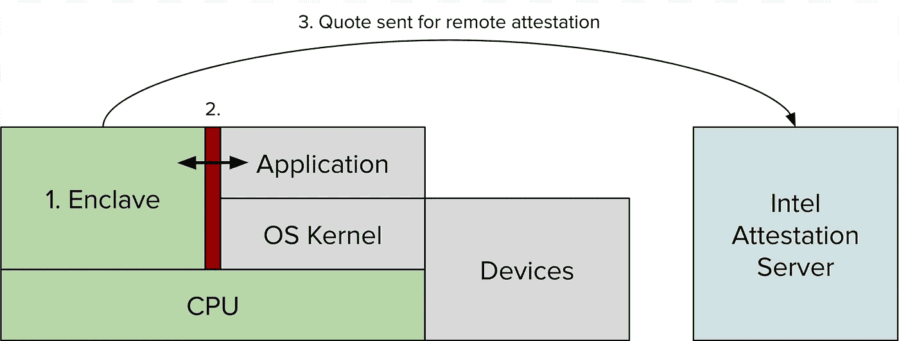
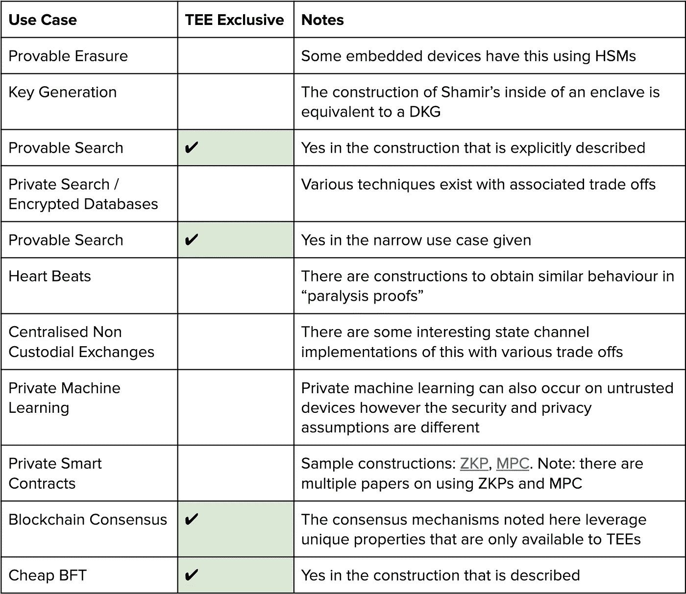

# 飞地历险记(SGX /蒂斯)

> 原文：<https://medium.com/hackernoon/adventures-of-an-enclave-sgx-tees-9e7f8a975b0b>

## 那么，除了显而易见的情况之外，SGX 和发球台还有什么用途呢？

Treasure Map

想象一个神奇的硬件，没有人能看到它的内部，即使他们打开它，这就是英特尔 SGX 和可信执行环境的承诺。

几十年来，密码学家一直在挑战安全计算的极限。这是计算方忘记结果和底层数据的时候。例如:Alice 或 Bob 是否提供了一个更大的数字，而没有透露基础数字，以根据加密数据训练机器学习模型。这些问题中的一些已经被解决了，但是通常解决方案既不通用也不有效。

在讨论使用该技术的各种区块链项目和 TEEs 的未来之前，让我们讨论可信硬件如何工作，它的标准用例以及一些更独特的用例。

注意，SGX 是目前使用最广泛的发球台的子集，我在整篇文章中交替使用这两个术语。

# 为什么选择私人电脑？

在特殊情况下，隐私往往被高度重视，而在其他情况下却被置之不理。让我们举一些隐私确实重要的例子。

*   安全彩票，其中[没有人可以欺骗或操纵号码](http://time.com/4911802/eddie-tipton-powerball-lottery-prison-sentence/)，代码是公开的，个人可以证明彩票正在运行该代码。
*   如果图像被 HIPPA、GDPR 和其他数据隐私控制锁定，如何通过算法共享图像进行分类。

# 隐私实现

当前可用于安全计算的一些密码原语工具包括诸如[全同态加密](https://blog.cryptographyengineering.com/2012/01/02/very-casual-introduction-to-fully/) (FHE)、[安全多方计算](https://crypto.stanford.edu/RealWorldCrypto/slides/smart.pdf) (sMPC)和[零知识证明](https://hackernoon.com/eli5-zero-knowledge-proof-78a276db9eff) (ZKPs)的技术。然而，这些技术要么太专业(不通用)，要么太慢，要么计算量太大，使得它们在生产环境中不实用。像 SGX 这样的系统提供了类似的安全保证，但是今天要快得多，便宜得多，实用得多。

**Figure:** High level on how SGX works, which is relatively comparable to TEEs.

**技术细节**

这就是 SGX 在高层次上的工作方式，具体的实现细节在这里传递。

1.  代码在独立于操作系统的硬件保护范围/区域[1]中运行，它有一个相关的秘密私钥
2.  Enclave 可以通过特殊的通道与应用程序通信
3.  使用远程证明来证明一段特定的代码在一个合适的 enclave 上运行，产生一个特定的结果(“引用”)，其完整性得到验证[2]。

这样，开发人员可以将开源代码发送到 enclave，用户可以通过远程证明来验证 enclave 中运行的代码是否等同于开源代码。然后，用户可以检查代码中的任何后门或意外功能。

# 常见使用案例

让我们从这项技术常见且明显的用例开始。

**最常见的使用案例**

这些用例已经有相当常见的加密结构，但也可以在 tee 中完成。在不透露实际价值的情况下确定爱丽丝和鲍勃谁更富有([姚的百万富翁问题](https://en.wikipedia.org/wiki/Yao%27s_Millionaires%27_Problem))。在不显示投票和施法者之间的联系的情况下计算票数。生成[随机数](https://software.intel.com/en-us/sgx-sdk-dev-reference-random-number-generation-functions)。盲目拍卖，主持拍卖的个人看不到出价，也被迫在结束时透露所有出价。

**可证明擦除**

后悔那一瞬间你把一些照片分享给了曾经的恋人？你怎么能证明他们删除了照片，这同样适用于 GDPR，你怎么能证明数据不再在数据库中或在某人手中谁可以访问它？如果数据存储在 enclave 内，用户可以证明数据已经在 enclave 内被删除，或者数据的相关私钥已经被删除，并且数据不能再被解密。如果他们没有拍照片的话…

**密钥生成**

Shamir 的秘密共享是一种加密技术，其功能类似于多签名钱包。生成 *m* 个碎片和 *n* 个号码是启动交易所必需的。然而，作为一个前兆，有一个公钥和私钥对是必要的，但如何证明密钥被破坏，而不是复制？接下来是 TEEs 的可证明擦除属性，在 enclave 中生成公钥和私钥对，创建碎片，然后可证明删除并且不泄漏私钥。

**私人搜索和加密数据库**

假设存在一个我想要搜索的餐馆数据库，并且我不想向所有者透露我的搜索。主要是我担心所有者会把数据卖给狗仔队。目前还没有一种简单的方法能够用标准的加密技术实现数据的私人搜索。然而，使用 SGX 和蒂斯，可以在 enclave 加密的数据集内[进行搜索，而无需向操作员透露搜索的内容。类似的技术可以用于网络搜索 [这里](https://arxiv.org/abs/1805.01548) ][ [这里](https://arxiv.org/abs/1805.01742) ]

**可证明搜索**

最初我们想要私人搜索，那么为什么突然之间我们想要可证明的搜索呢？传统数据库不是已经在日志中提供了吗？是的，但是假设我们给了国家安全局一些隐私区块链的查看钥匙。(查看密钥用于对 [Zcash](https://z.cash/blog/viewing-keys-selective-disclosure/) 和 [Monero](https://www.getmonero.org/resources/moneropedia/viewkey.html) 等协议中的私有交易内容进行解密)。我们能否构建一个系统，记录使用了哪些密钥子集，有了 TEEs，就有可能获得防篡改日志，这是其他密码系统无法提供的。

# 不常见的用例

这就是乐趣的开始，我们如何以非直觉的方式使用球座？这些想法有些来自学术论文，有些是由该领域的研究人员凭空想象和验证的。

**心跳**

心跳是一种表明某人或某物仍在附近的技术(相当于死人开关的软件)。假设我没有每个月给我妈妈发一条特别的信息，她会认为我失踪了。但是让我们把它变成可操作的。在[瘫痪证明](http://hackingdistributed.com/2018/01/18/paralysis-proofs/)中，有三个朋友想要 3 对 3 的 multisig，但是他们不想在一个朋友消失的情况下失去资金。利用在 SGX 飞地内部运行的一些代码，它要求三方提交单独的信息，以授权资产转移。如果一个朋友失踪了，另外两个人可以发送一条特殊的消息，要求失踪的朋友在一个时间范围内提交心跳信号，否则钱包就变成了 2-2 multisig。(可能那个朋友躲起来了，谁知道)。

**集中非托管交易所**

从某种程度上来说，这听起来有点矛盾，但是有一个集中的[非托管交易所是可能的，它永远不会窃取用户的资金。也许非托管是一个误称，因为资金在技术上与飞地的私钥相关联。用户可以证明在 enclave 中运行的代码等同于开发人员开源的代码，并且没有秘密的后门。更令人兴奋的是，当新代码被推送到 enclave 时，开发人员可以实现一个功能，允许用户使用旧代码，直到新代码被完全审计，等等。](https://eprint.iacr.org/2017/1153)

**私人机器学习**

数据是新的石油(哈希力量可能是这些天来的),公司将他们的数据保存得非常紧密，除非被迫，否则很少共享。有时这是一种市场失灵，例如:如果医院相互分享他们的骨折 x 光片，他们可以[训练出一个比使用他们的数据子集更好的模型](https://arxiv.org/abs/1811.01431)[另一篇论文](https://arxiv.org/pdf/1807.06689.pdf)。这将改善患者的结果，但由于 HIPPA 和 GDPR[3]而无法实现。无论拯救行动有多安全，每家医院都会向 enclave 发送加密图像，enclave 会在本地解密图像并训练一个模型。更有趣的是，该模型可能只能驻留在飞地中，并且永远无法导出。一个限制是，大多数飞地的计算能力有限，因此模型的训练将需要一些时间，但有一些最近的进展可能会绕过这个。以及带三通的[GPU](https://www.microsoft.com/en-us/research/publication/graviton-trusted-execution-environments-on-gpus/)。

尽管私人机器学习最常引用的是医学原因，但还有一个更深远的含义。为了让自动驾驶汽车变得更加安全和普遍，收集更多数据以改进其算法和模型是必不可少的。但是，汽车收集了如此多的数据，以至于无法将其发送到中央数据中心，然而，如果在本地对数据进行可验证的分析，并将输出发送到中央服务器，则输出的数量级会更小(可验证的联合学习)。因为汽车制造商不能让恶意用户发送修改过的输出，他们需要[驯服对大规模监控的恐惧](https://www.usenix.org/system/files/conference/soups2017/soups2017-bloom.pdf)。

**秘密区块链和智能合约**

设想一个区块链，他的客户机/节点代码只有开发人员知道，其他任何人都无法破译。开发人员对字节码进行加密，并将其发送到每个飞地，一旦进入，字节码就被解密，并根据一套正式的验证测试运行，以证明代码功能是人们假设的功能。

**区块链共识**

这通常与加密货币社区的“去中心化”精神背道而驰，但如果 SGX 被用作共识机制的一部分会怎样？在《T4》的《运气的证明》中，SGX 的随机数发生器被用来选举一个共识领袖，他将创造下一个街区。作者列举了“低延迟交易验证、确定性确认时间、可忽略的能耗和公平分布的挖掘”作为该系统的优势。[时间证明和所有权证明](https://www.initc3.org/files/retreat/sgx_contracts.pdf)以及[有用工作证明](https://www.usenix.org/system/files/conference/usenixsecurity17/sec17-zhang.pdf)和[经过时间证明](https://sawtooth.hyperledger.org/docs/core/releases/1.0/architecture/poet.html)是使用 SGX 设计的附加共识机制，并且仅在飞地的给定属性下才是可能的。

**便宜的 BFT 电脑**

拜占庭容错计算机是指任何不可阻挡计算机，就像任何 BFT 共识机制一样。以太坊可以被看作是一个巨大的 BFT 计算机，然而它的运行极其昂贵，但是网络上的任何智能合同都会在激励下得到执行。网络审查很难。我们怎样才能拥有同样的抗审查的计算机，但价格却便宜得多呢？如果我们在 enclave 中有一个[可公开验证的 VM，我们就知道代码应该如何执行。因为 enclave 本身不知道虚拟机上运行的是什么代码，所以我们有更便宜的私有 BFT 计算。想象一下匿名的、不可阻挡的计算机程序…还没有人真正理解这一点的后果。想想匿名(不是假名)暗杀市场。](https://arxiv.org/abs/1804.05141)

**还有更多**

这只是触及了 TEEs 的权力的尖端，这里有一些额外的用例，你可以在自己的时间里阅读:[用暗道](http://hackingdistributed.com/2018/07/02/on-chain-vote-buying/)投票购买、[比特币混合](https://eprint.iacr.org/2017/974.pdf)、[安全 Tor](http://ina.kaist.ac.kr/~dongsuh/paper/kim-hotnets2015.pdf) 、[从其他飞地窃取比特币](https://www.blackhat.com/docs/asia-18/asia-18-Schwarz-When-Good-Turns-Evil-Using-Intel-SGX-To-Stealthily-Steal-Bitcoins-wp.pdf)和[安全公共云](https://arxiv.org/abs/1805.01783)。

# 用例摘要

这里是这篇文章中探索的用例列表，其中只有一些是 TEEs 专有的，但是使用其他技术可能性能较差。像任何加密技术一样，有多种方法可以实现相同的目标，但也有内在的权衡。为了简明起见，我们不会过多地讨论不同加密结构之间的权衡。

**Figure:** Table of use cases, examples from the table linked here: [ZKP](https://eprint.iacr.org/2018/962), [MPC](https://eprint.iacr.org/2017/878.pdf)

# 使用 TEE / SGX 的区块链项目

鉴于 TEEs 的这些独特属性，难怪一些区块链协议会将这种技术作为核心技术的一部分或作为辅助功能来实现。他们中大多数人把它用于私人计算，但有些人有独特的想法。以下所有项目和公司目前都在建设中和/或在过去已经用于生产，该列表不包括许多更侧重于研究的学术项目。

**学术项目背景**

*   [宇宙魔方](https://eprint.iacr.org/2017/1153.pdf)
*   [城镇传令官](http://www.town-crier.org/)
*   [绿洲实验室](https://www.oasislabs.com) / [Ekiden](https://arxiv.org/abs/1804.05141)
*   [Hyperledger 面料和 t 恤](https://arxiv.org/pdf/1805.08541.pdf)
*   [TeeChain](https://www.teechain.network/)

**使用 SGX 的区块链公司**

这些是一些公司在询问时出现的，我还没有核实他们的生产准备情况，名单是按字母顺序排列的，没有偏见。

*   [Ankr 网络](https://www.ankr.network/)
*   [阿塔那网](https://www.atana.io)
*   [链环](https://chain.link/)
*   [共价 AI](https://covalent.ai)
*   Engima — [秘密节点](https://blog.enigma.co/secret-nodes-part-2-exploring-eng-economics-and-building-a-sustainable-network-3d0e9f8a9d40)
*   假人— [石墨烯 NG](https://blog.golemproject.net/introducing-graphene-ng-running-arbitrary-payloads-in-sgx-enclaves-a03f219447a5)
*   [iExec](/iex-ec/iexec-end-to-end-sgx-solution-fee1e63297b2)
*   [Jupiterchain.tech](https://jupiterchain.tech)
*   [手机摄像头](https://www.mobilecoin.com/)
*   [分类群网络](https://taxa.network/)
*   [三人组](https://github.com/trias-lab/Documentation/blob/master/EN/Whitepaper-EN.md)
*   我们的

# 你会用 SGX 和 t 恤创作什么？

在对不常见的 TEE 用例进行调查后，我意识到这些用例将成为最常见的用例。这些工具的价值在于密码学尚未解决的难题，比较两个数字很容易，但对完全匿名的智能合约平台的可验证的联邦学习是我们所看到的未来。我们才刚刚开始真正理解用例及其后果。

# 进一步阅读和研究

**Arxiv 论文**

*   [可信执行环境](https://arxiv.org/search/?query=%22Trusted+Execution+Environment%22&searchtype=all&abstracts=show)
*   [SGX](https://arxiv.org/search/?query=sgx&searchtype=all&abstracts=show)

**攻击和漏洞**

不幸的是，SGX 和蒂斯并不是一贯正确的，就像所有的加密工具一样，也有取舍。这些问题普遍存在于所有形式的现有发球台，但我们将重点关注 SGX 的特殊失误，因为它们有更好的记录。

*   侧通道攻击(这是一类攻击)，[缓存计时攻击](https://www.cs1.tf.fau.de/research/system-security-and-software-protection-group/sgx-timing/)，[缓存攻击](https://www.usenix.org/conference/woot17/workshop-program/presentation/brasser)，[推测执行攻击](https://foreshadowattack.eu/)(这个比较臭名昭著)，[异推测执行攻击](https://arxiv.org/pdf/1802.09085.pdf)(其中一些已经部分修复)
*   许可问题(如果英特尔停止向特定项目授予许可，该怎么办)
*   集中式远程证明(服务器由英特尔运行，英特尔的证明)
*   非匿名验证(英特尔知道它验证的是什么特定设备)
*   封闭源代码(硬件设计和一些软件组件)
*   英特尔的证明(对于设备的认证和制造，不想再有一个[超微事件](https://www.bloomberg.com/news/features/2018-10-04/the-big-hack-how-china-used-a-tiny-chip-to-infiltrate-america-s-top-companies)，它被证明是假的，但有类似的事情[像](https://arstechnica.com/tech-policy/2014/05/photos-of-an-nsa-upgrade-factory-show-cisco-router-getting-implant/)这个和[这个](https://www.usenix.org/legacy/event/leet08/tech/full_papers/king/king.pdf)

**光明未来**

然而，未来并不是那么暗淡，尽管英特尔的 SGX 存在一些缺陷，但新一代的 t 恤正在出现。这包括正在进行开源 RISC-V 实现的 Keystone 项目。随着[梯度](/gradient-tech/introducing-gradient-715e11be685b)这是侧信道免疫和 SGX 2.0。

**非区块链公司使用 SGX /三通**

*   [1 密码](https://blog.agilebits.com/2017/01/03/intel-sgx/)
*   [信号](https://signal.org/blog/private-contact-discovery/)
*   安茹娜
*   [IBM 云](https://www.ibm.com/blogs/bluemix/2018/05/data-use-protection-ibm-cloud-using-intel-sgx/)
*   [微软 Azure](https://azure.microsoft.com/en-us/solutions/confidential-compute/)
*   [阿里云](https://www.alibabacloud.com/help/doc-detail/60576.html?spm=a2c5t.10695662.1996646101.searchclickresult.67d875edbpNB54)

# 脚注

[1]飞地应该是与操作系统分离的硬件隔离区域。然而在 SGX，情况并非如此。SGX 框架中的飞地不是与操作系统隔离的硬件。它们基本上是一个内存原语，其中 enclave 正在执行的代码的内存地址空间，以及 SP、PC 和一些微体系结构状态对操作系统是模糊的。为了真正抵御侧信道攻击，需要对操作系统隐藏页表和错误，而 SGX 没有做到这一点。SGX 的页表故障可以被操作系统观察到，并且操作系统可以导致故障，因此恶意操作系统可以在页面粒度上直接获知安全容器的内存访问，并且任何软件都可以执行缓存计时攻击，这种攻击使用缓存标签状态作为渗透路径。这些漏洞在 2018 年通过伏笔攻击得到了证明

[2]Christian 从 Gradient 注意到，可以修复飞地旁道攻击，但是远程证明是一个弱点。SGX 和苹果的 [SEP](https://www.blackhat.com/docs/us-16/materials/us-16-Mandt-Demystifying-The-Secure-Enclave-Processor.pdf) 使用高度隔离的设备密钥来进行认证引导至诚实状态。在他们的情况下，认证是英特尔或苹果服务器，而不是其他任何人。该证明在证明者阶段是**而不是**匿名的。然而，使用 Gradient，他们正在研究一种匿名证明方案，因此人们可以检查处理器的完整性，而不依赖于中央第三方，也不会暴露身份。

[3]这更是一个社会问题，医疗团体可以征得病人的同意，与他人分享数据，但他们选择不这样做。因此，即使工具被创造出来，也不太可能有很多人会使用它。

*特别感谢审稿人:Lorenz Breidenbach (IC3 /苏黎世联邦理工学院)、Christian Wentz (Gradient)、Martina Long (Primitive Ventures)、Dawn Song (UC Berkeley / Oasis Labs)、Kevin Britz (Totient Labs)*