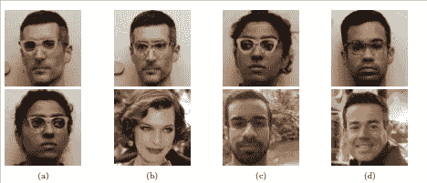

# 对抗性攻击:如何欺骗计算机视觉

> 原文：<https://medium.com/hackernoon/adversarial-attacks-how-to-trick-computer-vision-7484c4e85dc0>

2014 年，谷歌领导的人工智能研究团队发表的一项研究开辟了一个新的黑客领域，称为*对抗性攻击*。这篇论文展示的技术不仅改变了我们对机器学习如何运作的理解，还从实际角度展示了人工智能革命中最具商业前景和最受期待的方面之一可能会受到破坏。

事实证明，这种新的攻击面对于深度神经网络的基本结构来说是如此内在，以至于到目前为止，人工智能研究中最优秀的人才很难设计出有效的防御措施来对付它。

这不是 Y2K 式的可修复的编程疏忽，而是一个系统性的架构漏洞，除非有新的突破，否则它可能会从当前的学术和理论发展阶段延续到未来的商业、军事和民用人工智能系统。

如果机器学习有一个基本弱点，相当于加密货币方案中的 [51%攻击](https://www.investopedia.com/terms/1/51-attack.asp)场景，那么它对对抗性攻击的敏感性似乎就是它。

# 形象就是一切

新一代神经网络的核心优势是处理视觉世界的能力。基于人工智能的[图像分析软件](https://www.iflexion.com/services/image-analysis-software)可以驾驶车辆，分析医学成像，识别人脸，进行安全检查，赋予机器人权力，对图像数据库进行分类，在增强现实中创建空间，分析和解释事件和语言的视频镜头，甚至协助外科手术。

为了实现这一点，基于图像的机器学习系统需要两种资源。第一个是静态图像或视频的训练集，这允许它获得对稍后可能需要识别的对象和事件的适当准确的理解。第二种是可操作的图像，如闭路电视镜头。

从经济角度来看，这种系统必须设计成能利用现有材料。即使图像输入存在压缩伪像或低分辨率等问题，人工智能也必须将这些限制因素纳入其处理过程。

事实证明，这种高水平的容错能力使攻击者能够毒害输入数据，并影响——甚至控制——人工智能的分析结果。

# 机器中的恶意幽灵

2014 年，谷歌人工智能研究员克里斯蒂安·塞格迪(Christian Szegedy)在一篇论文中首次提出了“对抗性攻击”这一术语。通过微妙地改变 ImageNet 数据库中完全不同的测试图像，研究人员使机器学习系统在流行和受尊重的 AlexNet 卷积神经网络的一个实例上将它们都错误地分类为“鸵鸟”。

[图片来源](https://arxiv.org/pdf/1312.6199.pdf)

*左栏显示的是 ImageNet 的原始源图像。中间一栏显示了研究人员应用的细微差异矩阵。右栏显示了最终处理后的图像，它们都被归类为“鸵鸟”*

这个过程不仅容易复制，而且令人惊讶的是，它被证明可以广泛地移植到不同的神经网络模型和配置中。

该攻击是对基于图像的机器学习系统的概念模型中的基本特征的误用，利用了系统在估计将哪个标签应用于图像时使用的排除过程。

可以从最有可能被归类为——例如——鸵鸟的图像*中提取特征，然后不知不觉地应用到非鸵鸟图像上，使这些图像被归类为“鸵鸟”为消除例程提供动力的数学允许攻击者系统地将中毒图像推入目标分类的边界。*

这种对立图像中的视觉“干扰”水平如此之低，以至于人眼和神经网络都被训练成将它们视为噪声。但是神经网络不能做到这一点，因为这种噪声被成形为已建立的(尽管不正确的)分类的提取“散列”。因此，机器突然关闭分析例程并返回错误的结果，神经网络的简化主义数学以攻击的形式转向自己。

# 对系统的冲击

Szegedy 的发现加倍令人震惊，因为它揭示了深度网络学习模型的高维空间的线性性质。在这一点上，神经网络被认为在这种操作水平上几乎不具有线性——具有讽刺意味的是，这一古怪的特征应该保护它们免受像这样的系统化攻击，事实上这促成了人工智能系统的[有争议的“黑盒”性质](/@PhilippeHocquet/trust-and-dont-verify-the-ai-black-blox-problem-442c2b15e79e)。

相反，这种攻击不仅重现起来很简单，而且很快被证明具有“真实世界”的应用。

2016 年，卡耐基梅隆大学的[研究](https://www.ece.cmu.edu/~lbauer/papers/2016/ccs2016-face-recognition.pdf)基于赛格迪的发现，创造了一种能够通过使用 2D 印刷的眼镜来欺骗最先进的面部识别系统(FRS)的方法。

[图片来源](https://www.ece.cmu.edu/~lbauer/papers/2016/ccs2016-face-recognition.pdf)

*第一栏:两名研究人员逃避 FRS 检测。第二栏:研究员成功确定目标，女星米拉·乔沃维奇[* [*来源*](https://upload.wikimedia.org/wikipedia/commons/c/c1/Milla_Jovovich_Cannes_2011.jpg)*；第三列:研究员成功识别为同事；第四栏:研究员成功冒充电视主持人卡森·戴利[* [*来源*](https://www.flickr.com/photos/quintanomedia/11464515996/in/photolist-HSpq5-HSttT-it5NSp-it5CT9-it5NVv-it5D3N-it5NBK-it52cD-it5fQE-it5D3h-it5DbU-it5fxA-it5fJh-it5DdY-it5D1J-it5D8Y-f4JZFt-f4JZAt-f4ZfNf-f4JZsH-f4JZv6-f4JZqK-pft3M4-pft3Z8-dMABCJ-dMv3Ue-dMv4LK-dMACx9-dMAC2Y-dMv55e-dMACCd-dMv45c-dMAE4U-dMv5bF-dMAEUy-dMABdu-dMAEN9-dMv5ht-dMAECd-dMACeA-dMv5qR-dMACaY-dMAC6f-dMv5zk-dr44wy-msNG2-5NUJWV-dMAEJ1-qv24S7-8ZRt1f) *]。*

到这个阶段，大量新的研究论文抓住了对抗性攻击的理论，并开始区分错误分类(逃避正确识别)和有针对性的分类(将特定的错误目标身份嫁接到图像上)。

在这种情况下，研究人员能够说服面部和物体识别系统，其中一名男性研究人员是好莱坞女演员兼模特米拉·乔沃维奇，另一名是电视节目主持人卡森·戴利。此外，他们能够在自己之间交换身份，或者以其他方式导致 FRS 无法识别他们。

在所有情况下，诡计的关键是打印在他们特大号眼镜上的编码纹理，这足以让机器学习系统“哈希”到目标。

2017 年，当麻省理工学院的研究人员 3D 打印出一个特制的海龟模型，能够说服谷歌的 InceptionV3 图像分类系统[这是一支步枪](https://www.theguardian.com/technology/2017/nov/03/googles-ai-turtle-rifle-mit-research-artificial-intelligence)时，关于目标启用纹理的弹性的任何疑问都被消除了。

麻省理工学院的乌龟物体上的编码纹理在谷歌的物体识别算法中一直读为“步枪”。

# 防守努力

自从敌对攻击的存在被揭露以来，已经考虑了广泛的对策。哈佛大学在 2017 年的研究提出[将图像输入](https://arxiv.org/pdf/1711.09404.pdf)规范化，以便创造公平的竞争环境，并使精心制作的攻击图像更容易识别。然而，这项技术需要将运行可行的机器学习系统所需的已经紧张的资源增加一倍。即使这种“梯度掩蔽”技术的变体变得可行，[反击也是可能的](https://arxiv.org/abs/1608.04644)。

2017 年斯坦福大学的一篇研究论文提出了[“受生物启发的”深度网络保护](https://arxiv.org/pdf/1703.09202.pdf)，它人为地创造了研究人员在 2014 年论文之前假设存在的非线性。然而，同行的批评表明[通过稳定梯度输入，该技术很容易被否定](https://arxiv.org/abs/1704.01547)。

来自电气和电子工程师协会(IEEE)的一份[最新报告](https://arxiv.org/pdf/1801.00553)评估了在披露对抗性攻击技术后四年的防御导向研究，并没有发现任何可以明确且经济地克服漏洞的系统性的提议方法。该报告的结论是，对抗性攻击“在实践中对深度学习构成了真正的威胁，特别是在安全和安全关键应用中。”

2018 年意大利的研究[同意](https://arxiv.org/pdf/1808.08426.pdf)敌对攻击场景不受当前对策的影响。

# 对抗性攻击的广泛适用性

对抗性攻击最令人担忧的方面是它的可转移性，不仅可以跨不同的机器学习系统和训练集，还可以进入除计算机视觉之外的其他机器学习领域。

# 音频中的对抗性攻击

[加州大学](https://arxiv.org/pdf/1801.01944.pdf)2018 年的研究表明，可以向声波(如语音记录)添加对抗性扰动，并完全改变语音到文本的转录为目标短语——甚至可以在其他类型的音频中隐藏语音信息，如音乐。

这是一种威胁人工智能助手完整性的攻击场景，还有其他可能性。对家庭中持续监听设备的商业利用已经受到了激烈的批评，对用户语音输入的欺骗对侵入式营销活动有明显的影响。

# 文本中的对抗性攻击

来自 IBM 印度研究实验室的 2017 年[论文](https://arxiv.org/pdf/1707.02812.pdf)概述了一种基于纯文本输入的敌对攻击场景，并观察到这种技术可用于操纵和欺骗情感分析系统，这些系统使用自然语言处理(NLP)技术。在广泛的层面上，这种技术可能会在“假新闻”类别中引发一场由分析主导的错误信息运动。

# 对抗性攻击漏洞对机器学习的影响

Ian Goodfellow，[生成对抗网络](https://cs.stanford.edu/people/karpathy/gan/)的创始人，也是对抗攻击辩论的主要贡献者，他评论道[机器学习系统不应该重复早期操作系统的错误，在早期操作系统中，防御不是最初构建在设计中的。](https://www.technologyreview.com/s/610656/to-protect-artificial-intelligence-from-attacks-show-it-fake-data/)

然而，IEEE 的报告，在其他研究综述的支持下，表明深度学习网络从概念上就有这个弱点。所有试图用它自己的术语来对抗综合症的尝试都可以被击退，因为它们是同一数学的迭代(和反迭代)。

剩下的是数据清洗的“防火墙”或哨兵方法的可能性，其中卫星技术围绕持续脆弱的机器学习框架发展，代价是网络和机器资源，以及整个过程的完整性不断下降。

商业考虑似乎占据了优先地位。迄今为止，唯一一个向媒体强调问题潜在严重性的对抗性攻击的真实例子是，一组研究人员通过简单地[打印微妙改变的版本](https://arxiv.org/pdf/1602.02697.pdf)来使机器学习系统误解交通标志。

尽管如此，IEEE 的报告指出了学术界对这种威胁的普遍不屑一顾的态度:*“尽管很少有作品表明对深度学习的敌对攻击可能不是一个严重的问题，但大量相关文献表明情况并非如此。”*

如果基础漏洞在以后的生产系统中仍然存在，那么对抗性攻击的当前适用性或范围就无关紧要了。到了商业化和广泛传播的时候，这样的系统可能会成为更有吸引力的目标，值得那些开发未来最敏感和最关键的人工智能驱动的新应用的人提供更多资源。