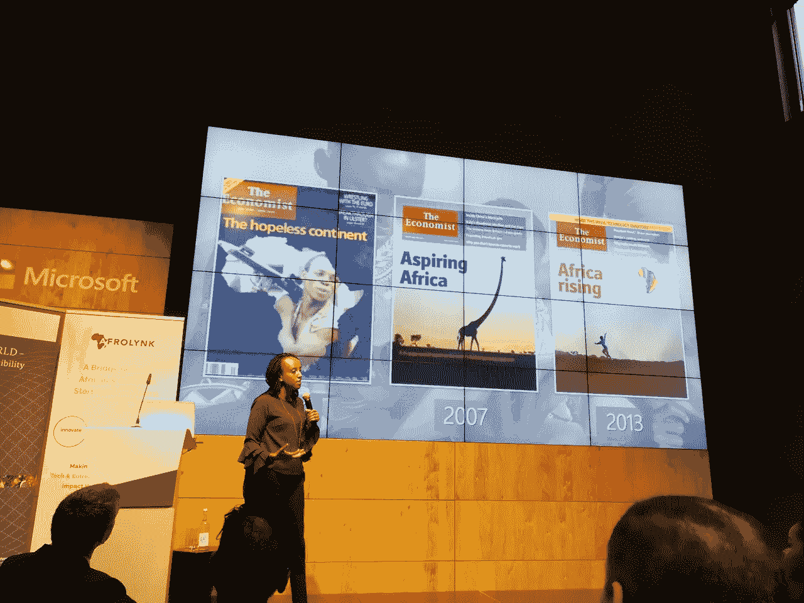

# Afrolynk:非洲技术和企业家精神

> 原文：<https://medium.com/hackernoon/afrolynk-african-tech-and-entrepreneurship-49fa8e00940>

我参加了欧洲各地(偶尔也参加世界各地)的许多科技会议，而非洲总是代表不足。我很高兴收到参加 Afrolynk 的邀请，这是一年一度的活动，旨在为欧洲和非洲的企业家搭建桥梁。进入微软在柏林的办公室参加活动时，迎接我的人群与典型的科技和创业活动不同，这是一个令人难以置信的景象。

这一天以一轮鼓声开始，让人们进入房间，并开始了一整天的小组讨论和主题演讲。与会者衣着鲜艳，精力充沛，会场周围使用的各种语言凸显了非洲大陆的多元文化。

# 障碍

非洲拥有世界 20%的人口、30%的土地和资源，但仅占全球 GDP 的 1——2%。许多人整天都在争论，我们经常被大规模的企业家精神分散了注意力。他们认为我们忘记了在整个大陆有成千上万的小企业为他们的当地社区提供有价值的服务。与技术相关，这包括像 [Mawingu](https://www.mawingunetworks.com/) 这样的项目，它创建了横跨非洲的互联网接入网状网络，当地人向这些企业支付接入费用。这种小型点对点企业的模式在非洲很普遍，许多当地企业家都在效仿。以至于有一家初创公司[推出了一个新项目，名为“Hustla MBA”，低层次(没有许多人认为这个词有负面含义)的忙碌是非洲的一种典型生活方式。这个项目是众多承认非洲问题的项目之一，它没有抱怨，而是正面解决了这些问题。该项目还旨在改变人们对教育的态度，这是许多人提到的问题。几乎每个发言者都提到了非洲教育体系的不足，指责其过时的课程导致劳动力的热情与他们国家提供的不匹配。可悲的是，这包括孵化器项目的毕业生，他们经常从国外回来，发现缺乏一个准备好支持他们想法的生态系统。](http://www.welltoldstory.com/)

# 这些技术

很大一部分非洲企业家涉足金融、卫生和农业技术领域。这符合非洲大陆的许多需求，同样，那些最成功的反映了我上面提到的类似的点对点分散模式。我觉得这些模式很受欢迎，不仅因为它们经常绕过行动缓慢、无知和不知所措的政府，还因为它们让人们能够积累技能和经验。非洲和它的投资者从以前的经验中了解到，空运援助，然后再离开，从长远来看是行不通的，现在他们正在尝试新的想法。甚至当(只有一次)有人提到中国时，房间里的许多人似乎对他们参与非洲事务持肯定态度。至少在目前，当地人认为中国对非洲采取了一种不同于早期外国势力的、更具建设性的方式。

当一位小组成员 Mervyn Maistry 博士就这种方法的改变及其背后的政治观点发表意见时，讨论发生了有趣的转变。他认为，即使是保守的政府也明白，通过改善当地经济，流向发达国家的移民数量将会减少。

非洲在对待新兴技术方面似乎也更加务实，而不仅仅是把它们当作寻找问题的时髦词汇。人工智能是一种帮助农民更好地远程管理作物的技术，区块链帮助创建通用货币、原产地计划或分散激励项目。[【微软非洲】(微软非洲)的阿姆罗特·阿卜杜拉](https://www.linkedin.com/in/amrote-abdella-11bb3a6/)提出了一个有趣的观点，这是我从未想到过的云计算。像 AWS 或 Azure 这样的云服务为任何人带来了高性能的计算资源，不管他们住在哪里，非洲人是大用户。为了反映这一点，微软计划很快在南非建立他们的第一个非洲 [Azure 数据中心](https://azure.microsoft.com/en-us/global-infrastructure/regions/)。

# 散居者

非洲有 54 个国家，把它们作为一个同质的整体来对待是不负责任的。在这一天中，有几个国家被多次提及，尤其是肯尼亚和尼日利亚，但其他国家从未提及。去年 11 月,《经济学人》报道称，非洲大陆在经济和治理方面的改善喜忧参半，一些国家发展迅速，另一些国家停滞不前。

性别平等略好于世界其他地区，但多元化团队表现出更好的结果。年轻的民众很乐观，渴望去工作。然而，随着世界上最大的劳动力增长，但没有就业增长相匹配，目前有 2000 万工人的短缺。这种短缺为企业家提供了一个理想的机会，但由于初创企业通常是小雇主，我们只能希望这足够了。

# 寻找更多

为了显示对非洲日益增长的兴趣，回复:publica 正前往阿克拉和 [TechCrunch Disrupt 正在拉各斯](https://techcrunch.com/events/startup-battlefield-africa-2018/)。

【dzone.com】最初发表于**。**