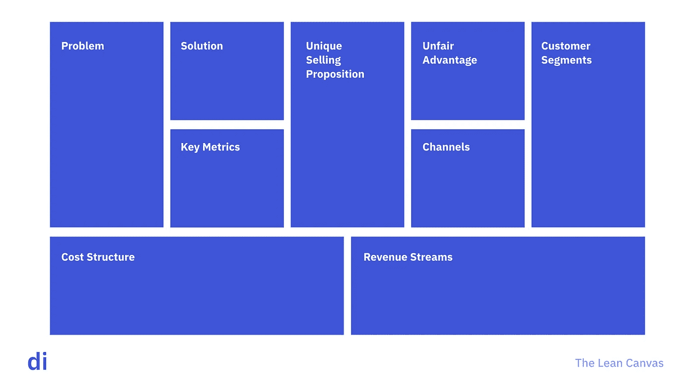

# 在设计冲刺之后

> 原文：<https://medium.com/hackernoon/after-the-design-sprint-5cf81a8a898c>

## 获得动力并从设计冲刺到 MVP 的 5 种方法。

设计思维已经成为创新团队提出想法的重要部分。

一个具体的工具是设计冲刺——通常是一个为期 5 天的练习，使用以用户为中心的设计方法来快速找到问题的潜在解决方案。

这是一个很棒的工具——一个我们自己使用并教给客户的工具。但是从它们中出来，经常会有下一步该做什么的问题。

# 卡住了

在我们与创新团队的对话中，非常常见的是进行一系列设计冲刺，确定一系列潜在的解决方案，但随后陷入困境。

在许多情况下，粗略的原型和小样本的客户反馈，即使是积极的，也不足以在内部获得资源来转移到 MVP 构建。

因此，现在不是一堆想法堆积起来，而是一堆经过验证的原型堆积起来。你把球向前移动了，但移动的幅度不大。

# 验证精益画布的其余部分。

在一张纸上总结潜在解决方案的一个很好的工具是精益画布。

一个想法的背后是一组假设:

*   你假设某个涉众(或一组涉众)有问题。
*   你有解决这个问题的方法。
*   以一种为涉众创造价值的方式解决问题——足以让他们开始为此付费，或者将它融入他们的生活。
*   有足够多的利益相关者存在(并且你可以很容易地接触到他们),让这些时间和努力物有所值。
*   让他们使用它的成本相对于你从他们的使用中获得的价值来说是足够便宜的。
*   该解决方案具有足够的防御性，可以避免立即被复制。

设计冲刺可以帮助解决其中的一部分，但显然不是全部。

假设你遵循以用户为中心的设计实践，在开始设计冲刺之前，你已经完成了验证涉众需求的工作。通过 sprint 过程，您至少会在一定程度上发现该解决方案可能会解决问题。

但是就像一个风险基金不太可能根据一个可点击的原型和与最终用户的 6 次对话来投资一家公司一样，你的增长委员会或其他创新治理团队可能不会认为这足以为建立 MVP 的资源开绿灯。

那么，您如何缩小差距、改进您的案例并推进计划呢？这里有 5 条建议帮助其他客户打破了僵局。

# 打磨原型，获得更多数据点

在 sprint 期间，你做一些快速而肮脏的事情来获取用户反馈。现在是时候创建那个原型的高保真版本了。

这不需要是工作软件。它仍然可以利用像 Invision 这样的工具。但是它应该具有成品的外观和感觉。

有了这些，走出会议室，展示给更多的用户。围绕使用意愿和支付意愿(如有必要)获取他们的反馈。

当你得到不冷不热的反馈或异议时，不要感到惊讶。用这些来改进原型，然后回到那里。

获取更多数据点有助于构建您的案例。有趣的是，仅仅拥有一个高度设计的原型也能增加内部动力。它给人的印象是那里有一个“那里”。

展示漂亮的屏幕往往比抽象地谈论一个想法更能激发人们的热情(甚至展示一个想法的低保真度版本，这表明它是半生不熟的)。)

# 创建功能规格

假设解决方案是一个软件，那么下一步就是将原型转化为功能规范文档。这通常包括:

*   详细写出用户故事。
*   概述您对集成点和其他需要获取的数据的所有假设。
*   使用您在 MVP 和后续版本中设想的功能创建产品路线图。
*   最重要的是，使用这些信息来获得构建的时间表和预算估计。

这样做可以让你的内部团队从努力的角度获得他们需要的数据，这显然是你的案例的重要部分。

这也有助于你以一种增加成功可能性的方式来构思信息。团队经常试图推销宏伟的愿景。他们需要预算来创造最终的产品。但这增加了你的成本和风险，无论是感知的还是实际的。

相反，确定属于 MVP 的“核心体验”。把你的精力集中在第一次 UX 和核心体验上。推迟剩下的。

无论如何，这是一个好的实践，因为更简单、更紧凑的产品往往会导致更高的用户满意度，并限制需要采用的行为变化量。

获得时间表和预算数字也有助于你确定潜在的权衡，决定核心体验包括什么和不包括什么。它帮助您对 MVP 开发提出更适度的要求，同时也提供了对潜在的长期路线图的成本的可见性。

我们通常建议在此阶段从外部供应商处获取评估，即使您的内部团队计划构建。这解决了两个潜在的问题:

*   它避免了内部团队有太多其他事情正在进行的异议。
*   从预算和时间方面来看，内部估计通常比供应商的估计要高。拥有第二个数据点对证明这一点非常有用。

# 创造一种增长模式。

我们已经详细讨论了[我们如何使用增长模型](https://digintent.com/growth-model)围绕获得牵引力提出现实的假设。我们发现它是制作 MVP 的无价工具。

该模型在客户或利益相关者漏斗的每一层做出了一系列详细的假设:

*   **收购**:我们如何让人们找到解决方案？从什么渠道？那些频道要花多少钱？那些频道的观众规模有多大？
*   **激活**:用户从认知到采用需要哪些步骤？在入职流程的每一步，我们对转换率的估计是多少？
*   **:我们认为在 3/6/12 个月的时间内，员工的忠诚度会是怎样的？(注意，基准在这里非常有用。)**
*   ****收入**:如果这些用户以某种方式被货币化，我们对货币化的假设是什么？广告展示次数，付费用户中免费用户的百分比等。**
*   ****Referral** :如果有一个 Referral 组件，那么这个循环看起来像什么？每个用户发送的邀请数量、接受邀请的用户百分比、他们的上传行为(注意，这通常不同于由于推荐而感冒的用户)等。**

**这些显然都是假设。但是他们向你的团队证明你对事情做了更多的思考。你有一个合理的计划，一旦产品上市，你将如何发展，你对投资回报率的估计是由影响它的杠杆的详细分解支持的。**

# **创建冒烟测试**

**为了进一步验证模型中的一些假设，您可以创建一个冒烟测试来测试采集。**

**冒烟测试可以采取多种形式——通常它看起来像一个登录页面(带有漂亮的屏幕),上面有一个注册行动的号召。后面有一页说我们还没准备好，要求在你发布时通知你一个电子邮件地址。你用战术性的付费收购活动来补充这一点，以获得潜在客户。**

**这有助于您验证一大堆东西:**

*   **从我们的目标用户那里获取流量，哪些渠道最划算？**
*   **什么价值主张和创造治疗最有效？**
*   **一旦知道我们的产品，有百分之多少的人有足够的兴趣点击注册按钮？**
*   **一旦他们看到它还没有准备好，有多少百分比的人仍然认为它足够吸引人，可以提供他们的联系信息？**

**作为一个可选的中间步骤，您甚至可以在登录页面和电子邮件收集之间添加一个定价页面(如果相关的话)。这也让您可以测试各种定价模型。**

# **进行冷外联**

**最后，在处理 b2b 解决方案时，我们经常提倡进行冒烟测试，并辅之以积极的冷外联活动。**

**你想登陆页面，因为它给这个想法的可信度。你可以在登录页面上添加电子邮件地址和在那里“工作”的人的链接简介。你建立了一个目标潜在客户的名单，你策划了一个多模式的推广活动来产生潜在的销售线索(通常是电子邮件、电话和社交销售的组合。)**

**这再次迫使你走出大楼，测试价值主张——客户适合度。**

**虽然我们相信在前端以其他方式进行利益相关者研究(通过问题访谈等来验证痛苦)。)，我们确实认为在此阶段尝试销售解决方案是有价值的。**

**与认为解决方案以某种形式存在的潜在客户会面是有帮助的，因为他们不再只是给你建议。他们正在被出售，这增加了阻力。结果，你获得了大量新的有用信息:**

*   **它暴露了你最终需要学会克服的异议。**
*   **通过了解像这样的解决方案的决策者可能是谁，它开始帮助您规划购买流程。**
*   **如果在有兴趣的时候再加上一封签名的要约信，你就给了你的团队最有说服力的前进理由——一份一旦产品上线就购买的签名承诺。**

# **设计冲刺很重要，但还不够**

**请继续做设计冲刺。据我们所知，没有比这更好的工具可以在解决方案的概念上快速取得进展。**

**但要意识到这不是灵丹妙药。你仍然需要做构建你的案例的工作来赢得继续前进的权利。**

**你可以从根本上消除一个想法的风险，并以很少的时间和很低的成本获得建立 MVP 的资源。考虑将上面的工具运用到你的过程中，以提高你测试想法的速度。**

**DI 已经为客户做了很多次以上的工作。我们很乐意帮你执行其中任何一个。要了解更多信息，[请联系](https://digintent.com/contact)我们。**

***原载于 2018 年 11 月 12 日*[*【digintent.com】*](https://digintent.com/after-the-design-sprint/)*。***