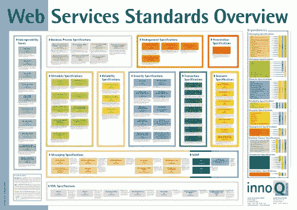
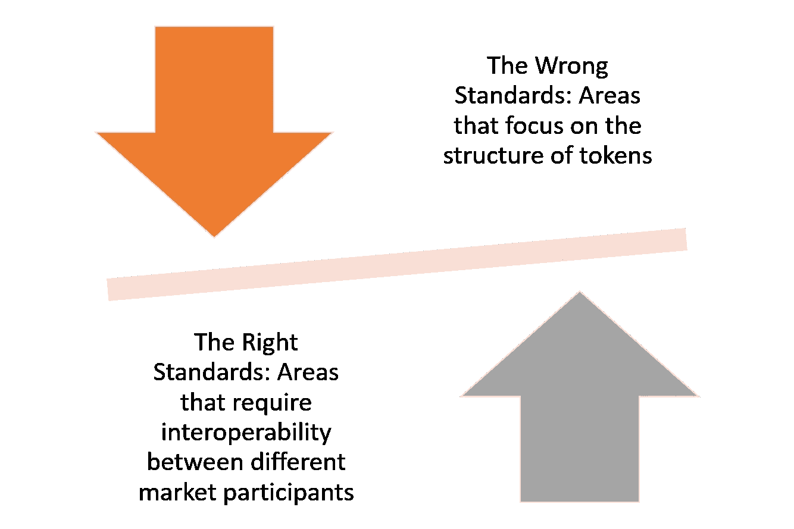
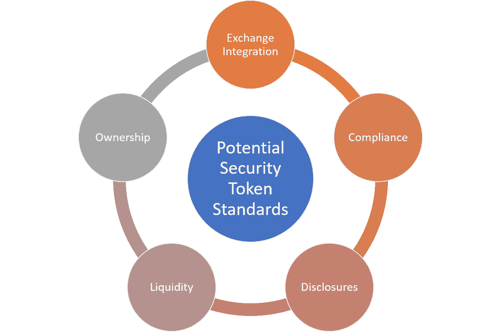

# 对照安全令牌标准

> 原文：<https://medium.com/hackernoon/against-security-token-standards-ae896cc5bb4>

最近，我在欧洲的一次区块链会议上谈到了安全令牌的未来。在该事件的一次卫星招待会期间，一位密码界的杰出人物找到了我，他显然已经阅读了一些关于安全令牌的文章，并提出了一些关于空间进化的非常有趣的论文。作为一名技术专家，这个人正在努力将区块链领域以计算机科学为中心的方法与他在安全令牌市场上看到的半集中化、繁文缛节优先的方法相协调(顺便提一下，我也有同样的问题)。在我们谈话的某个时候，他直截了当地问我*“关于安全令牌社区，有一件事我仍然不明白:为什么对标准如此着迷？这不是一堆[哔哔哔]在这一点上[哔哔哔哔…]？”*。

安全令牌空间中的标准主题可能是一个敏感的话题。显然，社区中有一部分人相信标准化的必要性。我倾向于同意不同的论点。安全令牌空间太过新生，它仍然缺少成为证券相关工具所需的 99%的基础设施，而且根本没有足够的安全令牌来进行统计意义上的采样。在这个阶段，标准更像是一种约束力量，而不是创新的工具。在这一点上，我们对安全令牌将如何发展还没有足够的了解，我们当然也没有遇到任何需要标准化的挑战。在我看来，*“没有应用的标准是幻觉的虚构。”*

# 思考标准的正确和错误方式

技术史告诉我们，最好的标准来自市场参与者之间的创新和竞争。标准的目标是解决互操作性和可移植性的挑战，从而简化技术领域的采用。不幸的是，很多时候标准变成了官僚机构和技术供应商的工具，通过创造“游戏规则”来投射虚假的思想领导地位。

为了说明这一点，让我们举两个在最近的技术运动中不同的标准化方法的例子。

# 通向标准的错误之路:面向服务的架构

几年前，面向服务的体系结构(SOA)被定位为一种体系结构风格，通过使用一种称为 web 服务的工件，最终可以解决企业中系统之间的互操作性。从一开始，SOA 就引发了微软、IBM、甲骨文、Tibco、SAP 等技术巨头之间的激烈竞争。甚至在 SOA 取得任何有意义的进展之前，供应商就建立了两个标准，即简单对象访问协议(既不是简单的也不是协议)和 Web 服务描述语言(WSDL)。这仅仅是个开始，像 W3C 和 OASIS 这样的组织中的委员会开始为从基本通信到复杂安全的每一个方面推动新的 web 服务标准。WS-*协议引入了难以置信的复杂程度，以至于它们自己的创建者不可能实现它们。最终结果是整个行业转向了更简单的方法，如依赖通用互联网协议(如 HTTP)而不是委员会设计的标准的代表性状态转移(REST)。

# 通向标准的正确道路:浏览器战争

标准应该如何从竞争中有机发展的一个很好的例子是

你用来阅读这个博客的浏览器。几十年来，浏览器一直是微软、网景、Opera、谷歌、苹果和许多其他公司之间激烈斗争的中心。激烈的创新导致消费者使用不同的浏览器，迫使他们需要互操作性。因此，该领域的最佳技术，如 HTML5 或 Google v8，在整个生态系统中被广泛采用。

# 标准和安全令牌

将关键技术运动的一些经验引入安全令牌，我们可以确定好的和坏的标准化背后的一些核心原则。

在安全令牌的上下文中，标准应该更少地关注令牌的结构，而更多地关注需要不同参与者之间交互的市场领域。以下是我认为比其他领域更适合标准化的五个例子:

**与交易所的集成:**上市、转让、通知等方面是标准化的良好候选，因为它们需要不同参与者之间的互操作性。此外，安全令牌交换是建立在多年的加密交换研究基础上的，这使得采用标准变得更加成熟。

**披露:**发布和披露关于安全令牌的重要公共信息的协议是另一个与标准相关的领域。安全令牌领域迫切需要能够集成到交易所或令牌发行平台中的通用披露协议

**链上合规:**我相信安全令牌的许多监管方面将以某种形式的链上协议和智能合约来表达。鉴于金融市场中广泛的监管知识，这可能是标准化的另一个坚实领域。

**流动性:**流动性可以说是安全令牌市场的最大挑战，流动性机制必须在协议层面有所体现，而不仅仅依赖于市场互动。来自 Bancor 等协议的一些想法可以以标准的形式将其应用到安全令牌中，这些标准可以在令牌和交换级别进行整合。

**所有权:**安全令牌最终是为了表达所有权声明。虽然区块链为表达合法可行的所有权结构提供了所有必要的构件，但该领域的标准可能有助于简化安全令牌的采用。

随着空间的发展，其他领域，如隐私、红利分配或治理，也可能成为安全令牌标准的相关领域。

标准的主题可能会继续成为安全令牌空间中的一个热烈讨论的领域。如果安全令牌市场取得成功，标准将有机地发展，标准化的领域将变得清晰可见。此时此刻，我们不需要标准，我们需要更多更好的安全令牌。毕竟，没有在任何安全令牌中实现的安全令牌标准是矛盾的定义。