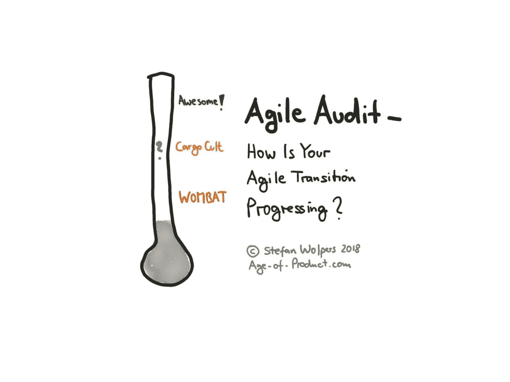
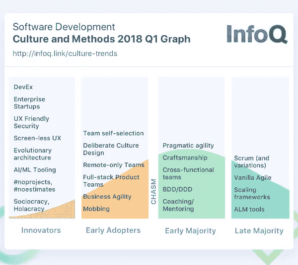
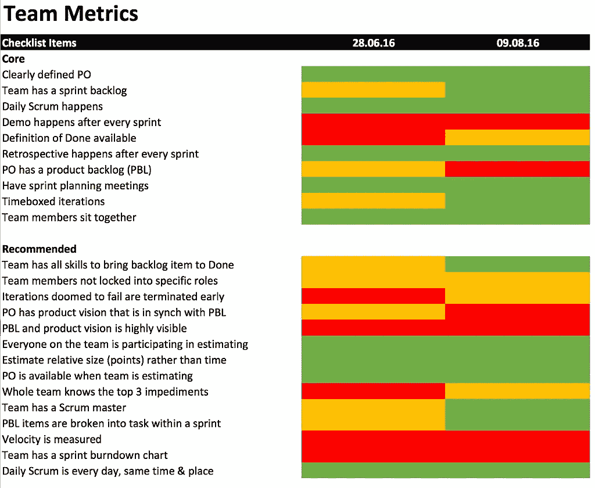
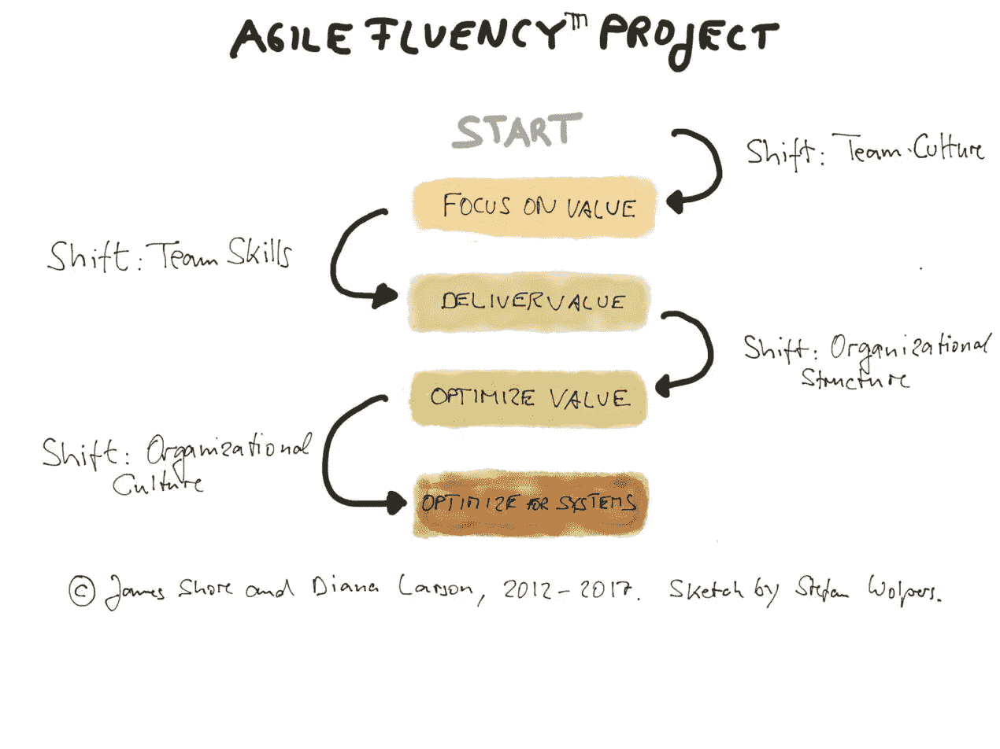
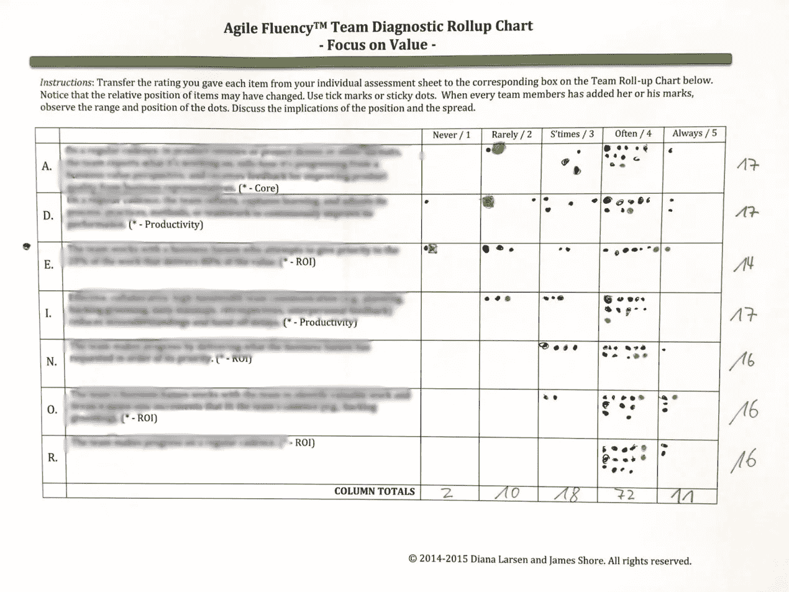
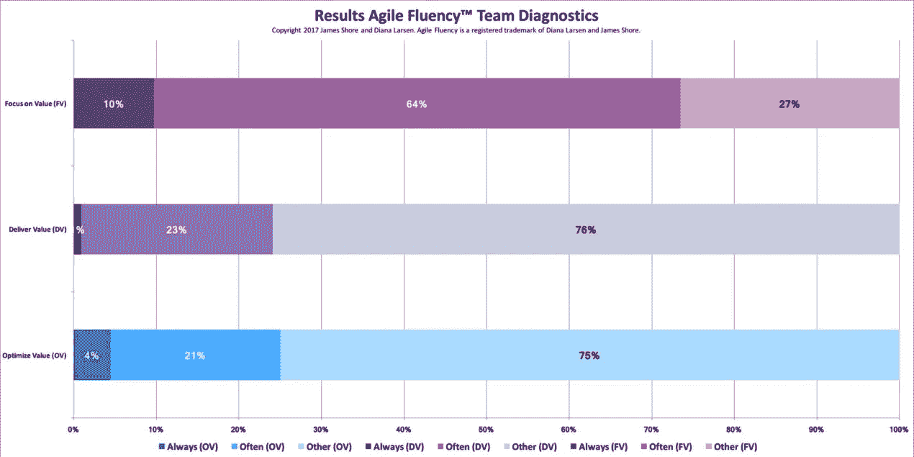

# 敏捷审计:你的敏捷转变进展如何？

> 原文：<https://medium.com/hackernoon/agile-audit-7a8419dc8ebb>

## TL；DR:敏捷审计

据说，变得敏捷是一个旅程，而不是目的地。如果你的咨询公司的生存依赖于销售人员和物资，这是一个很方便的叙述。敏捷过渡的目标越模糊，敏捷审计解决客户投资回报问题的可能性就越小。

此外，一个模糊的目标，如“我们想成为一个敏捷的组织”，可能是对每个组织不加区别地应用相同方法的原因——一个适合所有敏捷过渡的方法。

然而，如果不是每一个开始向敏捷实践过渡的组织都意味着成为一个 teal 组织或 holacracy，那该怎么办？如果迟到是一种故意的选择，而不是傲慢、无知或领导失败的表现，会怎么样？

了解为什么敏捷审计形式的反馈循环对组织和团队都有好处。

# 变得敏捷，迟到的多数，和落后者

InfoQ 将“[跨越鸿沟](https://en.wikipedia.org/wiki/Crossing_the_Chasm)”比喻应用于工程实践，从而涵盖了创建学习型组织的敏捷运动的一部分。其最近的“[工程文化和方法 InfoQ 趋势报告——2018 年 1 月](https://www.infoq.com/articles/trends-culture-methods-jan2018)”发现，例如，Scrum 的新皈依者将最有可能从后期多数派和落后者中招募自己。(早期的大多数组织已经在采用精益、看板和 Scrum 衍生工具。)

**版权声明** : InfoQ，2018。保留所有权利。

关于后来的大多数和落后者，我的两个工作假设是:

1.  并不是每一个开始向敏捷实践过渡的组织——后发多数或落后的组织——都会从自动跟随先前组织的老路中受益。如果客户没有价值可获得，为什么要努力成为一个 holacracy？(想想受到高度监管的市场。)
2.  许多创新者、早期采用者和早期多数组织也会从敏捷审计形式的外部反馈循环中受益。无论如何，这些组织中的大部分都是在敏捷等式的产品交付方面运作的。他们从未将业务敏捷性作为一个组织概念。此外，他们可能在敏捷过渡上超支，因为他们在旅程开始时没有定义目标。请注意，支持客户敏捷过渡的咨询公司在过程中使自己变得多余是不符合其利益的。

# 敏捷过渡——来自战壕的手册

Download “Agile Transition — A Manual from the Trenches” for free

在这里免费下载你的最新版本，191 页的《敏捷过渡——来自战壕的实践手册》。

# DIY 敏捷审计——自我评估工具

[本·林德列出了 50 多种自我评估工具](https://www.benlinders.com/tools/agile-self-assessments/)，这些工具提供了对一个团队甚至一个组织的一些状态检查。

许多这样的自我评估工具适合于提供一个初始数据集来开始与团队或组织的讨论。(例如，参见我的调查问卷 [Cargo Cult Agile:贵组织的‘敏捷状态’清单](https://age-of-product.com/cargo-cult-agile-state-agile-checklist-organization/)。)如果以有规律的节奏应用，结果值随时间的变化可以支持对团队问题以及组织问题和其他促成因素的更好理解。

最著名的自我评估工具之一可能是 Hendrik Knibergs " [非官方的 Scrum 清单](https://www.crisp.se/file-uploads/scrum-checklist.pdf):"

在上面的例子中，我们使用了一种评估扑克，用绿色、橙色和红色这三个值中的一个来回答每个问题。颜色编码如下:

*   **绿色**:对团队有效。
*   **橙色**:对团队有效，但还有提升空间。
*   **红色**:要么不适用，例如，团队没有使用烧毁图表，要么实践仍然失败。

如果最终的 Scrum 实践图随着时间的推移越来越环保，那么团队就在正确的轨道上。否则，你得深入挖掘，了解没有持续改进的原因，并相应地适应。

然而，大多数自我评估工具所缺乏的是与敏捷转变如何发生的整体概念相一致。Hendrik Kniberg 的 Scrum 清单已经被证明是一个有用的工具，它提供了在团队层面上采用 Scrum 实践的进展的洞察力。然而，例如，采用 Scrum 只是成为敏捷组织的一小部分。

这种一致性尤其适用于较大的组织，在这些组织中，尝试敏捷工作方式的热情经常被层级中较高层的“什么是我的综合症”以及风险缓解的必要性所忽视。这就是敏捷流畅模型出现的地方。早在 2012 年，James Shore 和 Diana Larsen 就在 Martin Fowler 的博客上描述了这个模型:[你的敏捷流畅之路——敏捷成功的简要指南](https://martinfowler.com/articles/agileFluency.html)。

## 请点击“拍手”👏，如果你觉得这篇文章有用——它对我来说意义重大！

***如果你更喜欢邮件通知，请*** [***注册我的每周简讯***](https://age-of-product.com/subscribe/?ref=Food4ThoughtMedium) ***，加入 14997 位同行。***

# James Shore 和 Diana Larsen 的 Agile 流畅性模型

2017 年 10 月，我参加了在德国举行的 2017 年敏捷流畅聚会。我事先不确定如何理解这个模型，但是在我看来，会见专注的敏捷同行，尤其是 Diana Larsen 和 James Shore，是值得的。

这次聚会以为期两天的 Agile Fluency 模型介绍开始，特别强调这不是一个成熟的模型。

相反，那些从外面看起来像成熟水平的步骤实际上是流畅性区域。每个区域构成了一个有效的组织敏捷性级别。此外，多个区域元素的组合可以定义一个组织的敏捷流畅性。那是我恍然大悟的时刻。

大约 60%的“敏捷”组织似乎属于区域一(关注价值)，大约 30%属于区域二(交付价值)，而 5%到 10%属于区域三(优化价值)。没有关于第四区(针对系统优化)的可能候选公司的有效数据，因为已知只有几家公司在该区。(例如， [Semco](https://en.wikipedia.org/wiki/Ricardo_Semler) ，或 [Menlo Innovations](http://menloinnovations.com/joyinc/) )。)

## 敏捷流畅模型区域 1:关注价值

敏捷流畅模型的区域 1 以团队文化的转变为中心。该团队现在一直专注于最有价值的事情，尽管基于价值的优先化之路可能会崎岖不平。然而，从商业角度来看，进步已经显而易见。例如，我们在这个区域观察到的是基本 Scrum 原则的应用或者看板的转换。

这些基础知识通常需要两到六个月的时间来掌握，组织中大约 60%的敏捷团队属于敏捷流畅模型的 1 区。(注意，属于 1 区并不排除从 2 区借用一些技术。)

## 敏捷流畅模型区域 2:交付价值

Agile Fluency 模型的区域 2 强调团队技能，主要是能够随意发布、按照市场节奏交付产品、频繁获取价值以及尽早发现障碍。所有这些都需要投资于软件工艺——从极限编程到干净代码再到开发运维——以及创建跨职能团队。

这些步骤通常需要五到十八个月才能掌握，大约 30%的敏捷团队属于敏捷流畅模型的区域 2。

## 敏捷流畅模型区域 3:优化价值

Agile Fluency 模型的区域 3 反映了通过整合业务专长来提高团队组织价值的转变。在第三区，我们将讨论如何应用精益创业或设计思维等技术来做出创新的产品决策。团队将减少移交，改进工作流程，并解决阻碍团队未来成功的组织障碍。

根据组织的性质，掌握这些基础知识需要 12 个月到 3 年的时间，不超过 5%到 10%的敏捷团队属于敏捷流畅性模型的区域 3。

## 敏捷流畅模型区域 4:针对系统进行优化

Agile Fluency 模型的区域 4 是关于通过改变组织文化来优化系统。很可能，这意味着走向社会政治，holacracy，或 teal 组织。团队了解业务优先级，并寻求与其他团队合作以提高整体价值流，从而以自组织的方式推动创新。

除了少数(小)创业公司，只有极少数大公司被认为处于敏捷流畅模型的第 4 区。

# 敏捷流畅团队诊断——一种敏捷审计工具

基于敏捷流畅模型，James Shore 和 Diana Larsen 开发了一个团队诊断工具。

Agile Fluency 团队诊断工具支持敏捷团队识别其敏捷之旅的状态以及有益的后续步骤。如果以有规律的步调应用，模式将出现，提供更好的理解团队是否在正确的轨道上，改进其向客户交付有价值的产品的能力。

该工具以一份问卷为中心，问卷包括前三个区域(从关注价值到交付价值再到优化价值)的七个问题，由每个团队成员回答。答案很简单，从“1/从不”到“5/总是”然后，主持人汇总结果:

基于个人答案的分布，Agile Fluency 团队诊断工具提供了团队当前状态的可视化:

在以下情况下，团队在一个区域中是“流畅的”:

1.  团队中的每个人都将该区域的核心指标评定为“5/始终”
2.  至少 75%的团队成员的回答(包括所有七个问题)是“5/总是”
3.  七项中的六项的综合(团队)评分为“5/始终”

根据敏捷流畅性模型，基于这种状态，团队参与讨论，以确定值得解决的问题，从而提高团队的流畅性。(这与整体团队回顾没有什么不同。)然后，Agile Fluency 团队诊断练习会定期重复，可能每 8 到 12 周重复一次，从而形成一种模式。

一旦您定期对所有团队进行这种实践，并汇总团队结果，您将随着时间的推移创建一个反映您组织的敏捷转变进度的数据集——因此，Agile Fluency 团队诊断可以成为您的敏捷审计。

注意:如果你想了解更多关于这个敏捷审计工具的信息，请告诉我；我是[获得许可的敏捷流畅团队诊断主持人](http://www.agilefluency.org/diagnostic.php)。

# 结论—敏捷审计

对于任何需要交付价值和降低风险的企业来说，反馈循环都是无价的。这一基本的敏捷原则不仅适用于创造产品和服务。当然，它也指成为一个敏捷组织本身的过程。

因此，定期敏捷审计形式的反馈循环应该是任何敏捷过渡工具箱的一部分。不是为了收集数据，而是为了给团队和组织提供洞察力和指导。

你对运行敏捷审计有什么看法？请在评论中与我们分享。

# ✋不要错过:加入 2650 多人的“动手敏捷”Slack 团队

我邀请你加入[“手把手的敏捷”Slack 团队](https://goo.gl/forms/LObbRtSF9vvxN3CL2)，享受来自世界各地的敏捷实践者的快速增长、充满活力的社区的好处。

如果你现在想加入，你现在所要做的就是[通过这个谷歌表格](https://goo.gl/forms/LObbRtSF9vvxN3CL2)提供你的证书，我会帮你注册。对了，**是免费的。**

# 你还想这样多读书吗？

好吧，那么:

*   📰*加入 14997 位同行和* [*报名我的每周简讯*](https://age-of-product.com/subscribe/?ref=Food4ThoughtMedium)
*   🐦*关注我的* [*推特*](https://twitter.com/stefanw) *订阅我的博客* [*产品时代*](https://age-of-product.com)
*   💬*或者，免费加入* [*Slack 团队【动手敏捷】的 2650 多名同行*](https://goo.gl/forms/XIsABn0fLn9O0hqg2) *。*

[敏捷审计:您的敏捷转型进展如何？](https://age-of-product.com/agile-audit/)首次发布于产品时代。