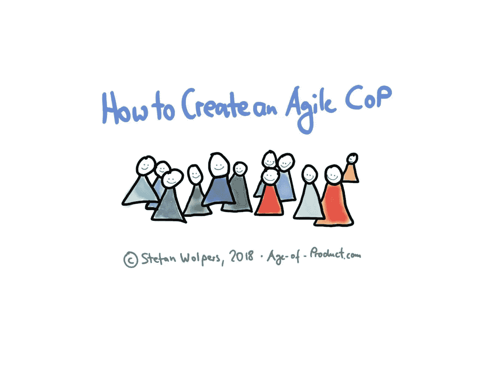

# 如何创建敏捷实践社区

> 原文：<https://medium.com/hackernoon/agile-community-practice-16f87f17cb4d>

# TL；DR:创建敏捷实践社区

创建一个敏捷实践社区有助于赢得组织内部的人心，因为它为敏捷过渡提供了真实性——表明这种努力不仅仅是另一种管理时尚。阅读更多内容，了解如何在没有专门预算的情况下让您的敏捷社区运转起来。

# 如何成为一个敏捷的组织——当计划符合现实

通常，成为一个敏捷组织的秘诀是这样的:你需要来自高层的承诺来改变组织的文化，从而改变它的轨迹。你还需要来自战壕中的人们的强有力的支持，他们想要变得自主，提高他们的掌握，并为一个目的服务。然后——在共同努力下——层级的顶端和底端可以激励中层管理人员转变为服务型领导。(或者，很可能，[摆脱他们海尔式的](http://knowledge.wharton.upenn.edu/article/haiers-zhang-ruimin-success-means-creating-the-future/)。)

因此，行动计划通常始于聘请咨询公司来帮助制定更具可操作性的推广计划，主要包括培训和研讨会、初始团队建设活动，以及可能涉及财务报告要求、技术或治理问题的一些审计。

这种精心策划的计划往往忽略了任何成功变革的基层部分:为组织的成员提供空间和资源，以一种自我导向的方式参与变革过程本身。

成功的敏捷过渡需要一个敏捷实践社区。

# 敏捷实践社区的目的

敏捷实践社区的目的有两个方面:

1.  在内部，它为敏捷实践者和变革推动者提供教育。没有必要在团队层面重新发明轮子；定期分享在转型过程中成功或失败的经验将大大减轻学习负担。
2.  从外部来看，敏捷实践社区通过向成员提供信息和教育，向组织的其他成员推销“敏捷”。敏捷社区的成员也是第一个领导者，因此也是实践中成为敏捷意味着什么的榜样。他们给努力带来了真实性。

通过日复一日的支持和以身作则来赢得人心，是一项费力且不那么光彩的任务。这需要坚持——并准备好不接受“不”的回答，而是再试一次。到达敏捷转变的临界点可能是一个缓慢的过程，在开始阶段几乎没有进展的迹象。(此外，管理层往往会低估固有的延迟。)

## 如果你喜欢这篇文章，帮我一个忙👏👏 👏多达 50 次—您的支持对我来说意味着一切！

***如果你更喜欢邮件通知，请*** [***注册我的每周简讯***](https://age-of-product.com/subscribe/?ref=Food4ThoughtMedium) ***，加入 17129 位同行。***

# 敏捷实践社区的服务和产品组合

## 内部产品，服务于社区

提高敏捷实践社区成员的掌握水平不是火箭科学。我的首选如下:

*   **分享是关怀**:囤积信息是敏捷实践者最糟糕的反模式之一。因此分享一切，例如，回顾练习链接，信息资源(时事通讯，博客帖子等)。)到工作材料和供应品。维基可能是开始的正确地方。
*   **培训和教育**:在敏捷实践者中定期组织研讨会，互相培训。如果不是所有人都在同一地点，[记录培训以备后用](https://age-of-product.com/webinars/)。(事实证明，网络研讨会软件对此很有帮助。)如果你有预算，邀请马蒂·卡甘一家来组织培训培训师。
*   **组织活动**:每月定期为敏捷实践者和组织中的其他人组织活动，并主持与外部演讲者的会议。确保所有从业者每个季度至少会面一次，参加一整天的小型会议。
*   **年度会议**:考虑每年举办一次全组织范围的“敏捷状态”会议，分享经验教训、成功案例和失败案例。
*   **沟通**:利用一个松散的团队来促进社区成员之间无摩擦的沟通。
*   **采购**:找到一个变通办法，允许未列出的供应商提供特殊的笔或贴纸等用品。(很可能，从业者中有一个自由职业者或者承包人可以帮上忙。)

# 敏捷过渡——来自战壕的手册

最新的，225 页的版本“敏捷过渡——一个带有清单的实践手册”就在这里，而且是免费的！

Download the ‘Agile Transition — A Hands-on Guide from the Trenches’ Ebook for Free

## 为组织服务的外部产品

一般来说，适用于敏捷实践社区的方法也适用于组织的成员，尽管可能有不同的关注点。例如，尝试以下方法:

*   **提供培训**:与变革推动者密切合作，提供实践培训课程。考虑一种要求较低的形式，典型的一整天的培训课程——下午晚些时候的一小时集中课程可能证明是适合你的组织的形式。(提示:避免参与者必须申请某个地方才能获准上课。这将大大提高出勤率。)此外，考虑提供一种由几个轻量级课程组成的课程。
*   **沟通**:考虑在敏捷实践社区的 wiki 之外运行一个网站或博客，以促进组织成为敏捷组织。到目前为止，我遇到的促进变革推动者和早期采用者参与的最好方法是在组织内每周或每两周发布一次时事通讯。
*   **让“敏捷”成为新同事的必修课**:对所有新员工进行敏捷原则和实践的教育，以支持公司的重新定位。
*   **获得可见性**:向组织推销敏捷以赢得人心&最好的方法是让“敏捷”对个人来说是低风险的。例如，定期组织精益咖啡会议或[知识咖啡馆](http://knowledge.cafe/)，从而提供一个安全的环境来检验这种“敏捷”的东西。直接邀请人们参加仪式，例如，冲刺评审——如果你练习 scrum——他们可能会感兴趣。(欢迎游击广告。)最后，为什么不提供一种非正式的联系敏捷教练和变革代理的方式呢？有些人羞于在公开场合问一些被认为是愚蠢的问题，否则可能很难联系到他们。
*   **提供透明性**:在一栋建筑或校园中经常出现的地方占据一块空间，展示什么是“敏捷”,并提供实践、课程、常规活动等的概述。
*   **主持活动**:尝试为组织组织定期的活动，例如，提供从引领敏捷转变的团队那里学到的经验。提前制定一个时间表，并坚持下去。坚持不懈是对抗敏捷仅仅是一种管理时尚，很快就会消失的观念的关键。

# 克服敏捷实践社区的阻力

到目前为止，我还没有看到一个组织公开反对创建敏捷实践社区。更有可能的是，你会遇到管理层的自满或无知。有时，预算过程会被利用——不管是否愿意——来阻碍社区的创建。

但是，即使你在经济上受到限制，仍然有足够的空间推动敏捷实践社区向前发展。有几种服务是免费的，它们提供视频会议和主持、博客、活动组织或时事通讯服务。根据我的经验，这不是一个可用资金的问题，但你需要克服你的焦虑，开始行动，不要等待任何人的书面批准。作为一名敏捷实践者，通过创建一个社区来承担责任，并由此向前推进转变，这在我看来是敏捷的。

# 创建敏捷实践社区—结论

创建敏捷实践社区是成为敏捷组织过程中的一个重要部分。它提供了许多必要的基础工作，使组织成员相信变得敏捷既不是危险的，也不是一时的风尚，而是一种趋势，因此对每个参与其中的人来说都是一个极好的机会。

你有敏捷实践社区吗？如果是，您的组织中有哪些成功的实践？请在评论中与我们分享。

# 📅即将举行的网络研讨会

**立即下载您的邀请—座位不超过 100 个**:

*   2018 年 5 月 22 日:[网络研讨会#4:敏捷失败模式 2.0](https://age-of-product.com/webinar-agile-failure-patterns/)
*   2018 年 6 月 5 日:[网络研讨会#5:冲刺规划反模式](https://age-of-product.com/webinar-sprint-planning/)

**注意:**所有网络研讨会的播出时间为 CEST 时间下午 06:00 至 07:00。(即美国东部时间下午 12:00 到 1:00，或太平洋时间上午 9:00 到 10:00。)

# 📺订阅我们全新的 Youtube 频道

**现已在 Youtube 产品时代频道**上发布:

*   关于[产品发现反模式](https://www.youtube.com/watch?v=rW2kVanMxMM)的动手敏捷网络研讨会#1。

# ✋不要错过:加入 3200 多人的强大的“实践敏捷”Slack 团队

我邀请你加入[“手把手的敏捷”Slack 团队](https://goo.gl/forms/LObbRtSF9vvxN3CL2)，享受来自世界各地的敏捷实践者的快速增长、充满活力的社区带来的好处。

如果你现在想加入，你现在所要做的就是[通过这个谷歌表格](https://goo.gl/forms/LObbRtSF9vvxN3CL2)提供你的凭证，我会帮你注册。对了，**是免费的。**

# 🎓你还想这样多读书吗？

好吧，那么:

*   📰*加入 17129 同行和* [*报名我的每周简讯*](https://age-of-product.com/subscribe/?ref=Food4ThoughtMedium)
*   🐦*关注我的* [*推特*](https://twitter.com/stefanw) *并订阅我的博客* [*产品时代*](https://age-of-product.com)
*   💬*或者，免费加入* [*Slack 团队【动手敏捷】的 3200 多位同行。*](https://goo.gl/forms/XIsABn0fLn9O0hqg2)

[如何创建敏捷实践社区](https://age-of-product.com/agile-community/)最初发表在《产品时代》上。