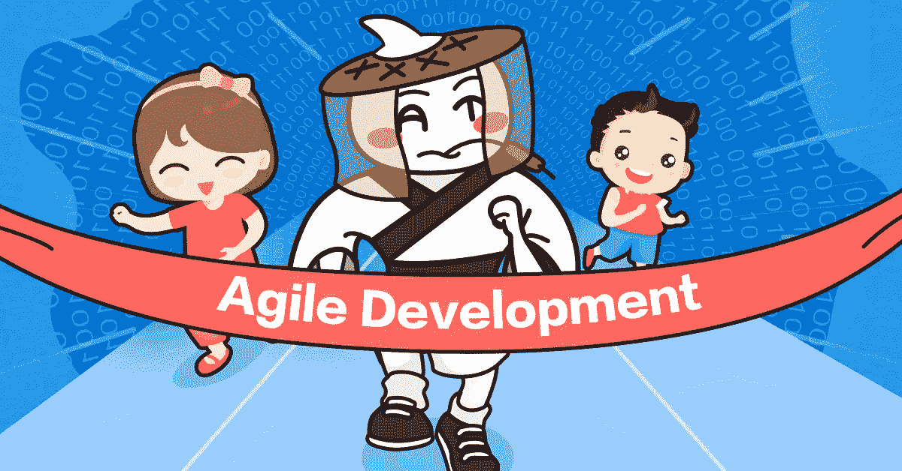

# 敏捷开发:过去、现在、未来

> 原文：<https://medium.com/hackernoon/agile-development-past-present-future-7851d0d77ebc>

*一位在该领域拥有十多年经验的阿里巴巴工程师的观察*

Tao Zhen(陶震), Senior Engineer of Alibaba’s IoT Business Unit:

*大约十年前，我的产品开发团队开始实施敏捷开发模型。我们可能成为了中国第一个敏捷团队。因此，我在这个行业的经历可能会被证明是有启发性的，尤其是考虑到当今敏捷开发的状态。*

# 失控

在当前关于敏捷开发的讨论中，你可能会遇到两种极端的观点:“太棒了”或者“太糟糕了”。这代表了软件公司推广 ISO 9000 和后来的能力成熟度模型(CMM)的发展。

对大多数公司来说，引入 ISO 9000 意味着积累各种文件，并把它们存放在文件柜里。结果，工程师们从来没有真正理解它们的内容。此外，ISO 9000 是在机器生产的时代创建的，不再适合有效地衡量今天新兴和不断发展的软件公司。

CMM，一种度量软件能力成熟度的模型，曾经被广泛应用，但是程序员仍然不感兴趣。在他们看来，什么都没有改变。锁在文件柜里的那堆文件已经变成了一堆与软件行业有关的文件。

ISO 9000 和 CMM 无效的核心在于控制。

希望获得对未来产品的安全感，管理者经常在软件开发过程中寻求控制行为和限制信息，使用各种规则和过程来实现这一点。

但是软件世界已经变了，Linux 就是一个很好的例子。

人们一直认为操作系统是最复杂的软件系统。毫无疑问，制造这样一个复杂的系统需要像 IBM 或微软这样的全球领先公司的大量程序员使用严格的过程管理系统。但是 Linux 做的事情不同，它让成千上万分散在世界各地的程序员参与进来。没有繁琐的流程，严格的规章制度，或者强硬的项目经理。在几乎没有任何传统管理手段的情况下，一个软件行业划时代的产品诞生了。这是前所未有的壮举。

今天，网络技术可以更快地将个人创造的信息联系起来，然后作为一种新产品呈现出来。组织模式越符合这种趋势，组织就越能有效地结合内部和外部信息的价值，形成自己的信息和产品价值。

这就引出了一个问题，产品开发团队应该使用哪种模型来更有效地完成这个信息链接。

对于传统的和敏捷的开发模型，最终目标是一样的:开发好的产品和服务。然而，方法是不同的，传统模型尽可能多地控制，而敏捷模型尽可能少地控制。这种对比也可以在其他领域看到，包括教育。应该允许孩子选择走哪条路，还是我们作为父母或教育者应该为他们做出选择？灵活且更敏捷的方法还是传统模型更合适？自然，这两个问题的答案见仁见智。

# 变平

早在 20 世纪 60 年代，美军就已经建立了世界领先的 C4I 系统(代表指挥、控制、通信、计算机和情报)，用计算机和网络通信技术帮助指挥和控制武器和士兵。该系统及其组织模式引入了高效灵活的信息流，使总统能够在 1-3 分钟内指挥作战部队，并使士兵能够轻松获得军事情报。因此，尽管现役部队减少，美国仍然能够快速有效地应对世界范围内的广泛威胁和挑战。

部分由于 C4I，政府能够使用信息技术，使军事等级更扁平，最大限度地发挥各级团队成员的潜力。下一步自然是推迟技术创新和产品开发。

2007 年初，我遇到了 Jeff Sutherland，Scrum 软件开发过程的发明者。

Jeff 最初是一名士兵，曾在越南服役，在 11 年的军旅生涯后，他开始参与 IT 系统开发。但是战争需要足智多谋、组织和勇气，你可以在他的 Scrum 方法论中看到他服兵役的影响。通过鼓励产品开发的扁平化组织来最大化工程师的潜力是 Scrum 的精髓。

敏捷、扁平化组织模式的另一个例子是苹果。虽然史蒂夫·乔布斯以喜欢控制事情而闻名，但他允许员工在工作中有很大的独立性，并且在公司结构中没有微观管理。乔布斯施加的控制更多的是拒绝平庸，而不是控制开发者。

虽然互联网软件产品开发中的风险很多，但它们都源于同一个东西:不确定性。然而，更多的控制并不一定会将不确定性转化为确定性。事实上，可以说不确定性会带来更大的创造力。这就是为什么 Donald Knuth 和 Eric S. Raymond 将编程描述为一种艺术形式。

# 价值差异

当然，扁平化组织不是敏捷开发的专利，你仍然会遇到障碍。中西文化的价值观差异仍然存在。

我记得有一次，我领导的一个团队中的一名中国工程师私下找到我，要求一个更正式的职称。他没有像许多西方人那样要求加薪——他只是想要一个新的头衔。他担心，在工作了这么多年后，没有一个“正式”的头衔会让他的父母尴尬。在那一刻，中国和西方的对比再明显不过了。

差异也有历史根源。例如，欧洲和北美有着根深蒂固的工程和工艺文化。从英国的工业革命及其对英国经济的影响，到美国国父、世界著名发明家本杰明·富兰克林，再到今天——每个城镇至少有一家家装店或五金店，每个家庭都有一个工具箱——这种文化根深蒂固。

中国不是这样的，中国的工程师也不熟悉这个概念。西方工程师，从小就被教导要重建和改进，也许比他们的中国同行更适应敏捷开发。

# 信息流

我曾经参与过一个敏捷开发项目，在这个项目中，200 多名参与的软件工程师都被告知产品设计的任何更新，让他们能够理解并跟踪它的开发。有一次，一个架构设计发布了，一个初级工程师发现了一个缺陷。没有一个技术专家预见到这一点，他们无法提出一个快速有效的解决方案。最终，还是同一个初级工程师通过自己的研究提供了解决方案。

由此，我们可以看出，扁平化的组织创造了一个更负责任、信息更灵通的员工队伍，上层倾听并理解下层所说的话，反之亦然。有才华的工程师有更大的机会增加产品的价值，并且更有可能通过直接参与而受到启发。这种跨层级的交流对于敏捷开发来说是必不可少的。信息流动必须畅通无阻。

拥抱变化就是拥抱不确定性。许多雇主可能不会雇用一个不会编程的年轻大学辍学生，但他们也会放过史蒂夫·乔布斯，他是他那个时代最伟大的发明家之一。马云一直公开自己求职的艰难历程——众所周知，他曾被肯德基拒之门外——后来创办了世界上最大的电子商务公司。简而言之，一个实施敏捷开发的扁平化组织可以给那些在传统层级中被视为不可能成功的候选人提供茁壮成长的机会。信息壁垒只会限制你自己的能力和竞争力。

# 未来会怎样

在计算中有一种简单而有效的算法叫做冒泡排序，它通过一个无序的列表来比较条目，如果它们的顺序不对，就把它们交换出去。之所以这样命名，是因为不合适的项目基本上会浮出水面，就像在扁平的组织结构中，每个团队成员的创新和价值很容易浮出水面一样。

在当今不确定的 IT 世界中，无论您是否采用敏捷模型，顺畅的信息流都是工程师团队成功的关键。而管理，作为价值的联结者和传递者，服务于这种信息和创造力的流动。

敏捷开发是带着对某种工作场所的愿景而形成的。它是否奏效取决于员工是否认同这一愿景，是否接受它旨在支持的文化。在阿里巴巴，提倡开放、平等的公司文化，尽量减少等级和优越感。每个人都用他们的英文名或昵称来称呼对方，而不是用正式的语气。然而，敏捷开发的成功——或者任何其他方法——最终归结于员工是否参与并接受他们所在组织的精神特质。

(Original article by Tao Zhen 陶震)

# 阿里巴巴科技

关于阿里巴巴最新技术的第一手、详细、深入的信息→脸书: [**【阿里巴巴科技】**](http://www.facebook.com/AlibabaTechnology) 。推特: [**【阿里巴巴技术】**](https://twitter.com/AliTech2017) 。