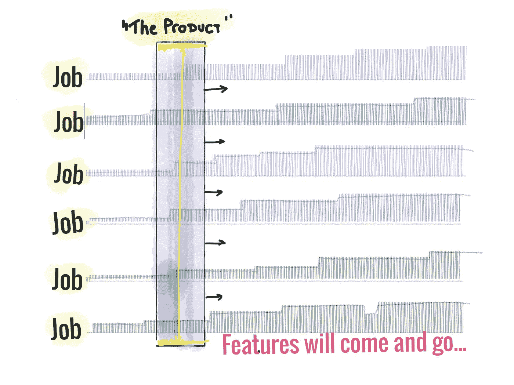
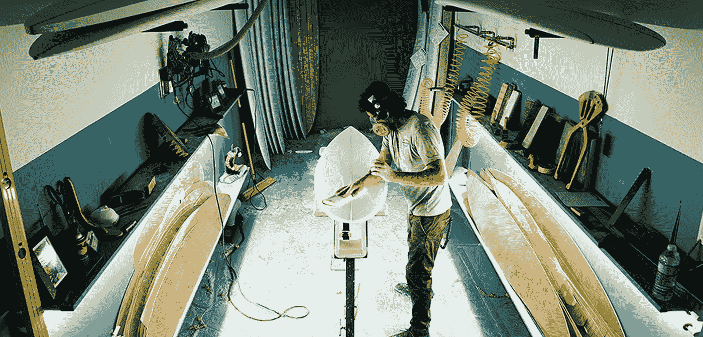
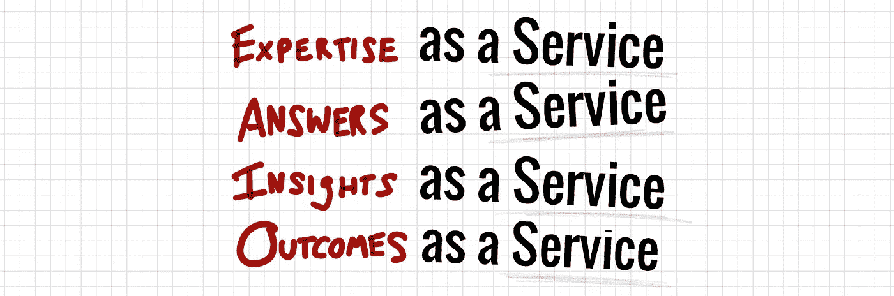

# 敏捷(做得正确)是持续的设计

> 原文：<https://medium.com/hackernoon/agile-done-right-is-continuous-design-f85e24733654>

在软件即服务(SaaS)中，不提供任何东西。设计是连续的:

*   越来越有价值的工作原型
*   持续迭代，调整
*   与用户一起持续测试/学习
*   去除不工作的东西

…但是许多组织仍然停留在设计->建造->运输的思维模式中，即使他们可以选择以其他方式运作。返工是令人憎恶的。设计师被迫猜测，没有真正的迭代发生…好老 MVP 诱饵和开关。

真遗憾。为什么？

观察伟大的设计师工作，你会观察到一种高度迭代的、创造性的、基于证据的方法。软件(尤其是 SaaS)消除了一个关键的约束。

这就是为什么在某种程度上，“每个人都是设计师”( [Jared M. Spool](https://medium.com/u/b90ef6212176?source=post_page-----f85e24733654--------------------------------) )。

软件开发的敏捷/精益方法(尤其是在 SaaS)基本上是连续设计。…在给定生产/分销/复制手段且没有严格的“送至工厂”期限的情况下，设计人员如何工作。这是设计师在设计和构建小批量产品时的工作方式，他们可以接触到用户/客户。也许我们正在回到工业化前的根源…

http://www.ton-upmag.com/tag/surfboard-shaper/

设计总是关于迭代、减法和测试。设计的一个诅咒(也是惊人的美丽)是需要说“完成了”，然后把你的作品送到印刷厂或工厂复制。固定性(不变性)当然有它的优势——完美的固定设计将永远存在——但是可变性激发适应性……在不断变化的社会技术环境中，这是一个很好的特征。

这可能就是为什么服务设计会不断出现在集体的产品设计/开发/管理对话中。不需要“包装和运输”的设计成为持续的、无处不在的设计。客户、开发者、UX、视觉设计、支持、销售、成功……都成为合作设计师。DevOps 是“设计”的一部分。“前端”是这样设计的。接听电话的销售人员……参与“设计”。

价值不是“运输的”…而是一个不断增强和扩展的价值网络。“产品”是短暂的交付机制……十年前是人，今天是移动应用，明天是 Alexa，十年后是 AI。

设计从未停止，我们都参与其中。

