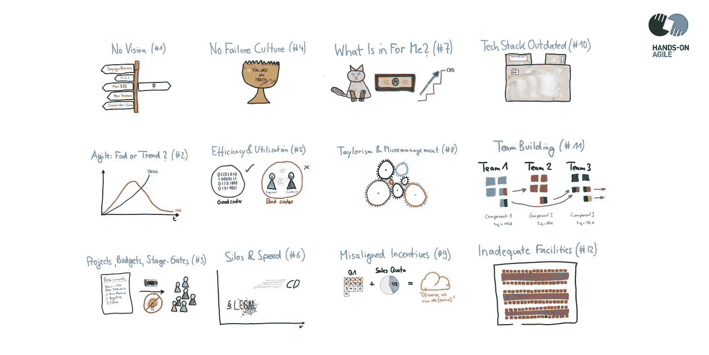

# 📺敏捷失败模式 2.0

> 原文：<https://medium.com/hackernoon/agile-failure-video-97991eeb18b9>

# TL；DR:敏捷故障模式 2.0(网络研讨会重播)

第四场实践敏捷网络研讨会阐述了为什么“敏捷”不是功能失调的组织的快速解决方案的 12 个原因——从“什么适合我”综合症到过时的技术堆栈，再到缺乏失败文化。

Agile Failure Patterns 2.0 (Webinar Replay)

# 网络研讨会敏捷失败模式 2.0:插曲

*   第一集讲述了缺乏远见的问题。(为什么组织追求变得敏捷？组织对愿景和战略不透明，因此团队无法实现自组织。或者让我们换一种说法，爱丽丝梦游仙境式的:“如果你不知道你要去哪里，任何一条路都会把你带到那里。”)
*   **第二集涵盖了“敏捷”是否是一种时尚或趋势的问题**。(中层管理人员和团队成员并不接受敏捷思维，也不会悄悄地放弃它，他们认为这是一种迟早会消失的管理时尚。)
*   **第三集涵盖项目、预算、关卡**。(我的预算，我的特色:组织试图在不从基于项目的开发方法切换到基于产品的开发方法的情况下变得敏捷。该流程继续由(年度)预算控制，委员会的风险缓解仍然是规范。)
*   第四集讲述了失败文化的缺失。(因此，团队不会离开他们的舒适区，而是安全行事。或许，把“失败文化”换成“跌倒后学会爬起来的文化”是更好的搭配。)
*   **第五集讲述效率和利用率重点**。(管理层仍然相信自己的传统角色:告诉人们做什么，如何做事，并确保每个人一直都很忙。所以工程师被认为太有价值了，不会浪费时间和用户面谈。)
*   **第六集涵盖了筒仓的护送**，导致组织以最慢的速度移动来更换筒仓。(组织没有针对快速构建-测试-学习文化进行优化，因此各部门以不同的速度水平前进。由此产生的摩擦很可能会抵消之前的敏捷收益。)
*   **第七集讲述了“我有什么好处”综合症**。(并不是每个人都热情地拥抱‘敏捷’——尤其是那些当自组织成为常态，对个人议程的追求变成遥远的记忆时会失去机会的人。)
*   第八集讲述了流行的泰勒主义和由此产生的微观管理。(管理层面上的失控导致微观管理。或者，组织正在实践“敏捷之光”:管理层在关键问题出现的那一刻就放弃了自我组织，而是形成了“任务组”。)
*   **第九集涵盖错位激励**。(一方面是团队的激励，另一方面是利益相关者或单个团队成员的激励是相互矛盾的——这很容易导致道德风险。例如，销售部门试图通过“要求”他们希望带来新收入的新功能或销售不存在的产品来节省季度奖金。)
*   **第十集涵盖过时的技术栈**。(工程团队不能自由选择“他们的”技术组合，而是必须使用其他人提供给他们的技术。被迫使用劣质技术会大大降低团队接受工作责任的意愿。)
*   **第十一集涉及团队建设问题**。(例如，在短时间内调动团队成员。或者团队人员不足，例如，scrum master 职位没有人，产品负责人必须同时担任两个角色。或者团队太小，因此没有跨职能。或者不让团队参与招聘过程。)
*   **第十二集涵盖设施不足**。(一个团队不是同处一地，不是在同一个房间里工作，而是分散在不同的楼层，或者更糟，分散在不同的位置。工作环境缺少正式交流的场所，更重要的是缺少非正式交流的场所:自助餐厅、茶水间、沙发等。或者需要白板。)

## 如果你喜欢这篇文章，帮我一个忙👏👏 👏多次—您的支持对我来说意味着一切！

***如果你更喜欢邮件通知，请*** [***注册我的每周简讯***](https://age-of-product.com/subscribe/?ref=Food4ThoughtMedium) ***，加入 18292 位同行。***

# 📺加入 Youtube 上 550 多名敏捷同行

现已在 Youtube 产品时代频道发布:

*   🆕关于[产品负责人反模式](https://www.youtube.com/playlist?list=PLEUCSYe8YDkIrgyJMYW7ue_fJEwKlITph)的实践敏捷网络研讨会#6。
*   关于[冲刺规划反模式的实践敏捷网络研讨会#5。](https://www.youtube.com/watch?v=oJliMvqU2TU&list=PLEUCSYe8YDkItuTivvgi3SBB2X_5iGC13)
*   关于[产品积压反模式的实践敏捷网络研讨会#3。](https://www.youtube.com/watch?v=PKYokXnWEII)

# 🎓你还想这样多读书吗？

好吧，那么:

*   📰*加入 18292 同行* [*报名我的每周简讯*](https://age-of-product.com/subscribe/?ref=Food4ThoughtMedium)
*   🐦*关注我的*[*Twitter*](https://twitter.com/stefanw)*并订阅我的博客* [*产品时代*](https://age-of-product.com)
*   💬*或者，免费加入* [*Slack 团队【动手敏捷】的 3600 多名同行*](https://goo.gl/forms/XIsABn0fLn9O0hqg2) *。*

[网络研讨会#4:敏捷失败模式 2.0](https://age-of-product.com/webinar-agile-failure-patterns/) 首次在 Age-of-Product.com 发布。